# Introducción

## Icebreaker: Singularidad

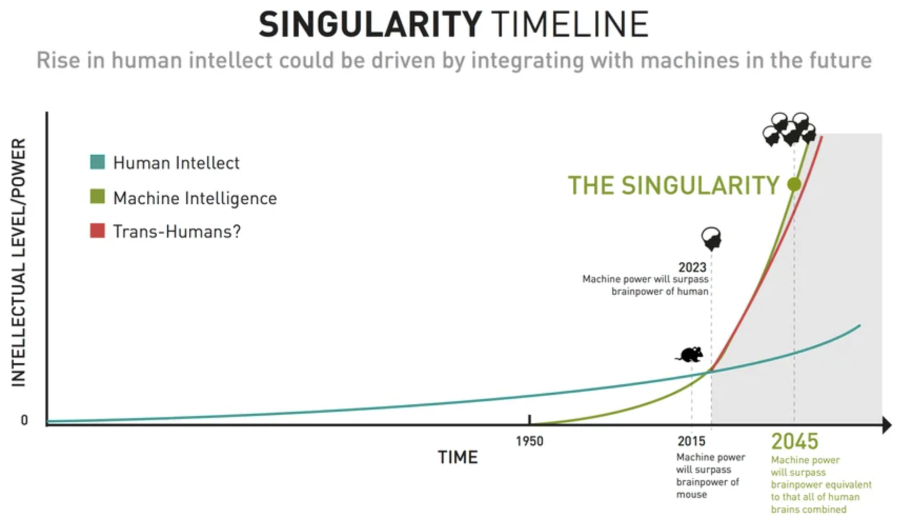{width="70%"}

- ¿Qué pasará cuando las máquinas sean más inteligentes que los humanos?

## Capítulos sobre Deep Learning

:::: {.columns}

::: {.column width="50%"}

{width="60%"} 
Capítulo 10

:::

::: {.column width="50%"}

{width="60%"} 
Capítulo 11
:::
::::

## Comparación de Algoritmos

Comparación de distintos algoritmos a la fecha
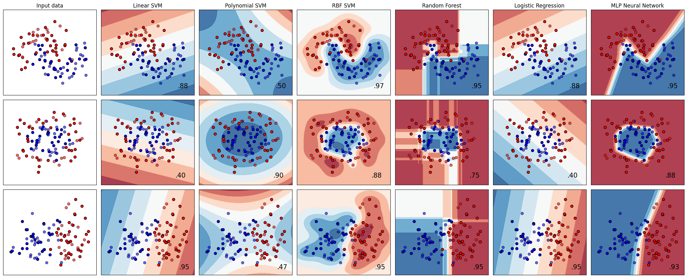{width="100%"}

## Regiones de decisión para Perceptrones Multicapa

{width="50%"}

Dependiendo de la arquitectura del perceptron, se pueden resolver problemas convexos

# Arquitecturas en Redes Neuronales

## Zoológico de Redes neuronales

{width="70%"}

[The Neural Network Zoo](https://www.asimovinstitute.org/neural-network-zoo/)

## Feed Forward Neural Networks (FFNN) y Perceptrones

**Feed Forward Neural Networks** 
Aplicación Ideal: Clasificación y regresión en problemas estructurados.
- Reconocimiento de patrones en datos tabulares.
- Modelado de funciones complejas.
- Aplicaciones en finanzas y predicción de series temporales simples.
**Radial Basis Function (RBF) Networks ** 
Aplicación Ideal: Problemas de interpolación y aproximación de funciones.
- Control adaptativo.
- Reconocimiento de caracteres y voz.

## Recurrent Neural Networks (RNN)

**Recurrent Neural Networks (RNN)** 
Aplicación Ideal: Procesamiento de datos secuenciales.
- Modelado de lenguaje natural.
- Reconocimiento de voz.
- Predicción de series temporales.
**Long Short-Term Memory (LSTM) Networks** 
Aplicación Ideal: Procesamiento de secuencias largas con dependencias temporales.
- Traducción automática.
- Generación de texto.
- Análisis de sentimientos.

## Recurrent Neural Networks (RNN)

**Recurrent Neural Networks (RNN)** 
Aplicación Ideal: Procesamiento de datos secuenciales.
- Modelado de lenguaje natural.
- Reconocimiento de voz.
- Predicción de series temporales.
**Long Short-Term Memory (LSTM) Networks** 
Aplicación Ideal: Procesamiento de secuencias largas con dependencias temporales.
- Traducción automática.
- Generación de texto.
- Análisis de sentimientos.

## Autoencoders (AE)

**Aplicación Ideal:** Reducción de dimensionalidad y detección de anomalías.
- Compresión de datos.
- Eliminación de ruido en imágenes y señales.
- Detección de fraudes.

## Zoológico de Redes neuronales

{width="90%"}

[The Neural Network Zoo](https://www.asimovinstitute.org/neural-network-zoo/)

## Convolutional Neural Networks (CNN)

**Convolutional Neural Networks (CNN)** 
Aplicación Ideal: Procesamiento de imágenes y visión por computadora.
- Reconocimiento de objetos y rostros.
- Detección de anomalías en imágenes médicas.
- Aplicaciones en vehículos autónomos.

**Generative Adversarial Networks (GAN)** 
Aplicación Ideal: Generación de contenido realista.
- Creación de imágenes sintéticas.
- Restauración y mejora de imágenes.
- Generación de música y texto artificial.

## Zoológico de Redes neuronales

{width="90%"}

[The Neural Network Zoo](https://www.asimovinstitute.org/neural-network-zoo/)

## Attention Networks (AN)

**Aplicación Ideal:** Modelado de dependencias a largo plazo en datos secuenciales.
- Traducción automática con Transformers.
- Generación de resúmenes automáticos.
- Análisis de documentos extensos.
- Base de los Large Language Models (LLM)

## Parámetros de los LLM

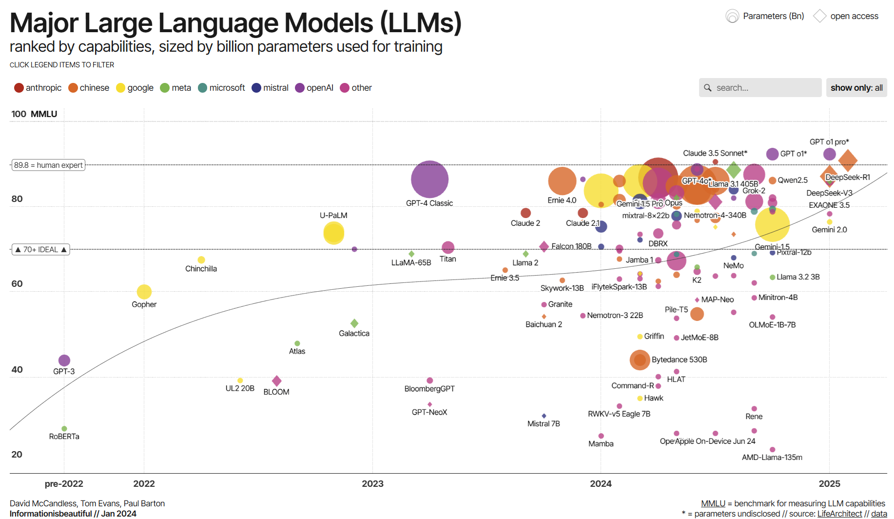{width="80%"}

[informationisbeautiful.net](https://informationisbeautiful.net/visualizations/the-rise-of-generative-ai-large-language-models-llms-like-chatgpt/)

## Para recordar..

**Las redes neuronales tienen una gran variedad de aplicaciones.**
- La elección de la red depende del tipo de datos y la tarea específica.
- Las arquitecturas avanzadas permiten mejorar el rendimiento en tareas complejas.
- La investigación sigue evolucionando, creando nuevas posibilidades.

# Desafios de entrenar redes neuronales profundas

## Saturación de las funciones de activación

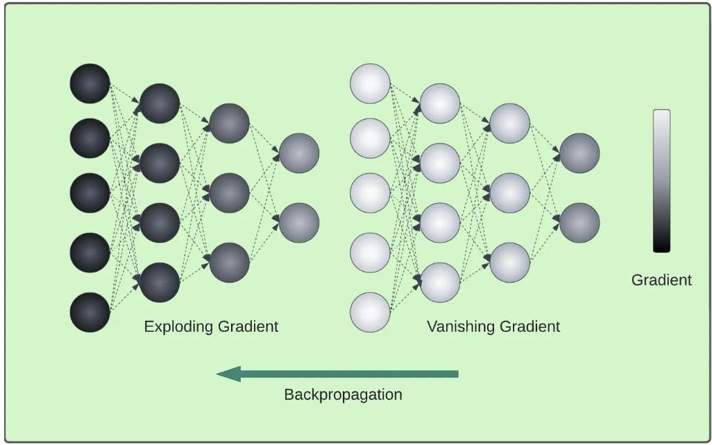{width="60%"}

**Problema:** En redes profundas, los gradientes pueden volverse extremadamente pequeños o grandes durante la retropropagación. 
## El Problema del Gradiente que Desaparece/Explota

**Problema:** En redes profundas, los gradientes pueden volverse extremadamente pequeños o grandes durante la retropropagación. 
**Descripción:**
- Los gradientes tienden a disminuir a medida que avanzan hacia las capas inferiores, haciendo que el entrenamiento sea ineficaz (gradientes que desaparecen).
- En algunos casos, los gradientes crecen excesivamente, provocando actualizaciones inestables en los pesos y causando que el modelo diverja (gradientes que explotan).

## Saturación de las funciones de activación

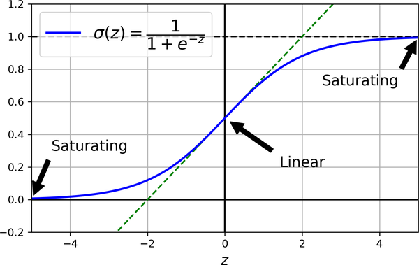{width="60%"}

**Causas:** Uso de la función de activación sigmoide, que satura los valores en 0 o 1, reduciendo la magnitud de los gradientes. 
## Saturación de las funciones de activación

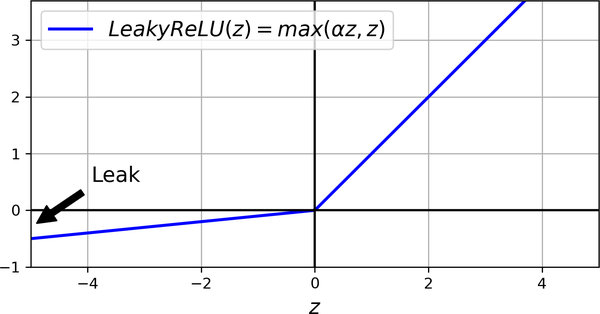{width="60%"}

**Solución:** Uso de la función de activación no saturadas, como ReLU o LeakyReLU. 
## Inicialización de Pesos: Glorot y He

**Problema:** Una mala inicialización de pesos puede ralentizar el entrenamiento o causar problemas de gradiente. 
**Solución:**
- Glorot (Xavier) Initialization: Mantiene la varianza de las salidas igual a la varianza de las entradas.
- He Initialization: Ajustada para ReLU y variantes, permitiendo que los gradientes fluyan mejor en redes profundas.
- Fórmula para He Initialization:
  \[ W \sim \mathcal{N}(0, \frac{2}{\text{fan-in}}) \]
- Estas técnicas ayudan a mitigar los problemas de gradientes inestables.

## Ejemplo de Código: Función de Activación

\begin{lstlisting}[language=Python, style=mystyle]
leaky_relu = tf.keras.layers.LeakyReLU(alpha=0.2)
dense = tf.keras.layers.Dense(50, activation=leaky_relu,
kernel_initializer="he_normal")
\end{lstlisting}

O se puede tener declaración por aparte

\begin{lstlisting}[language=Python, style=mystyle]
model = tf.keras.models.Sequential([
[...]  # more layers
tf.keras.layers.Dense(50, kernel_initializer="he_normal"),
# activation as a separate layer
tf.keras.layers.LeakyReLU(alpha=0.2),
[...]  # more layers
])
\end{lstlisting}

**Solución:** Implementación de LeakyReLU y He Normal en Keras. 
## Problemas de Mínimos Locales

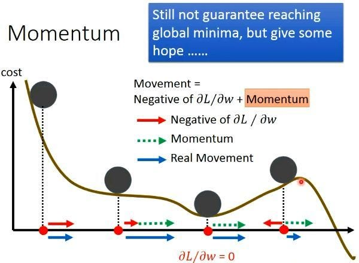{width="50%"}

**Consideración:** Se usa el hiperparámetro de momentum para ayudar a converger rápidamente 
## Comparación de Métodos de Optimización

- Stochastic Gradient Descent (SGD):
  \begin{equation}
  \theta_{t+1} = \theta_t - \eta \nabla J(\theta_t)
  \end{equation}
- Momentum:
  \begin{align}
  v_t &= \beta v_{t-1} + (1-\beta) \nabla J(\theta_t) 
  \theta_{t+1} &= \theta_t - \eta v_t
  \end{align}
- Adam (Adaptive Moment Estimation):
  \begin{align}
  m_t &= \beta_1 m_{t-1} + (1 - \beta_1) \nabla J(\theta_t) 
  v_t &= \beta_2 v_{t-1} + (1 - \beta_2) (\nabla J(\theta_t))^2 
  \hat{m_t} &= (m_t)/(1 - \beta_1^t), \quad \hat{v_t} = v_t/(1 - \beta_2^t) 
  \theta_{t+1} &= \theta_t - \eta (\hat{m_t})/(\sqrt{\hat{v_t}} + \epsilon)
  \end{align}
**Diferentes opciones de hiperparámetro momentum y Adam**

## Explicación de los términos en Adam

\begin{align}
m_t &= \beta_1 m_{t-1} + (1 - \beta_1) \nabla J(\theta_t) 
v_t &= \beta_2 v_{t-1} + (1 - \beta_2) (\nabla J(\theta_t))^2 
\hat{m_t} &= (m_t)/(1 - \beta_1^t), \quad \hat{v_t} = v_t/(1 - \beta_2^t) 
\theta_{t+1} &= \theta_t - \eta (\hat{m_t})/(\sqrt{\hat{v_t}} + \epsilon)
\end{align}

**Definiciones:**
- \( m_t \): Promedio móvil de los gradientes (primer momento).
- \( v_t \): Promedio móvil de los gradientes al cuadrado (segundo momento).
- \( \beta_1, \beta_2 \): Parámetros de decaimiento para los momentos primero y segundo.
- \( \hat{m_t}, \hat{v_t} \): Estimaciones corregidas de sesgo de los momentos primero y segundo.
- \( \eta \): Tasa de aprendizaje.
- \( \epsilon \): Pequeño valor para evitar divisiones por cero.

## Comparación entre Optimizadores

**Comparación**:
- SGD es simple pero puede ser lento en convergencia.
- Momentum ayuda a acelerar SGD con un término de memoria.
- Adam combina momentum y escalado adaptativo del paso de aprendizaje.

## Ejemplo de Código: Momentum

\begin{lstlisting}[language=Python, style=mystyle]
# Definir el modelo secuencial
model = keras.Sequential([
layers.Flatten(input_shape=(28, 28)),
layers.Dense(128, activation='relu'),
layers.Dense(10, activation='softmax')
])
# Definir el optimizador Adam con parámetros personalizados
optimizer = tf.keras.optimizers.Adam(learning_rate=0.001, beta_1=0.9, beta_2=0.999)
# Compilar el modelo usando el optimizador definido
model.compile(optimizer=optimizer,
loss='sparse_categorical_crossentropy',
metrics=['accuracy'])
\end{lstlisting}
Implementación de Optimizador Adam en Keras

## Problema de Tasa de Aprendizaje

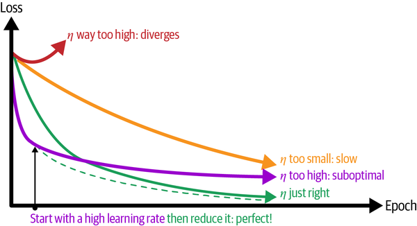{width="70%"}

**Consideración:** Se usa el hiperparámetro de tasa adaptativa para ayudar a converger rápidamente 
## Ejemplo de Código: Tasa de aprendizaje

\begin{lstlisting}[language=Python, style=mystyle]
# Definir el optimizador
lr_schedule = tf.keras.optimizers.schedules.InverseTimeDecay(
initial_learning_rate=0.01,
decay_steps=10_000,
decay_rate=1.0,
staircase=False
)
# Parametrizar la tasa de aprendizaje adaptativa
optimizer = tf.keras.optimizers.SGD(learning_rate=lr_schedule)
\end{lstlisting}
Implementación de Tasa de Aprendizaje Adaptativa

## Problema de Sobreajuste

:::: {.columns}

::: {.column width="50%"}
**Problema:** El sobreajuste puede llevar a una mala generalización. 
**Solución:** Ejecución de **Dropout** de neuronas y Regularización de Pesos.
:::

::: {.column width="50%"}
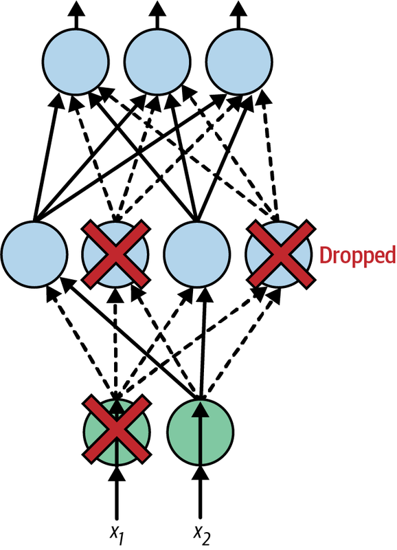{width="70%"}
:::
::::

## Ejemplo de Código: Dropout

\begin{lstlisting}[language=Python, style=mystyle]
model = tf.keras.Sequential([
tf.keras.layers.Flatten(input_shape=[28, 28]),
tf.keras.layers.Dropout(rate=0.2),
tf.keras.layers.Dense(100, activation="relu",
kernel_initializer="he_normal"),
tf.keras.layers.Dropout(rate=0.2),
tf.keras.layers.Dense(100, activation="relu",
kernel_initializer="he_normal"),
tf.keras.layers.Dropout(rate=0.2),
tf.keras.layers.Dense(10, activation="softmax")
])
[...]  # compile and train the model

\end{lstlisting}
Implementación de capas de Dropout

## Ejemplo de Código: Regularización

\begin{lstlisting}[language=Python, style=mystyle]
from functools import partial

RegularizedDense = partial(tf.keras.layers.Dense,
activation="relu",
kernel_initializer="he_normal",
kernel_regularizer=tf.keras.regularizers.l2(0.01))

model = tf.keras.Sequential([
tf.keras.layers.Flatten(input_shape=[28, 28]),
RegularizedDense(100),
RegularizedDense(100),
RegularizedDense(10, activation="softmax")
])

\end{lstlisting}
Implementación de Regularización en Neuronas

# Reuso de Redes Neuronales Pre-Entrenadas

## Aprendizaje por transferencia

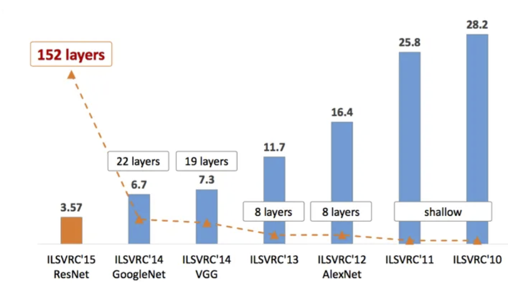{width="70%"}

**Consideración:** Algunos modelos de aprendizaje profundo fueron exitosos para predecir en cierto conjunto de datos, pero fueron costosos de desarrollar

## Aprendizaje por transferencia

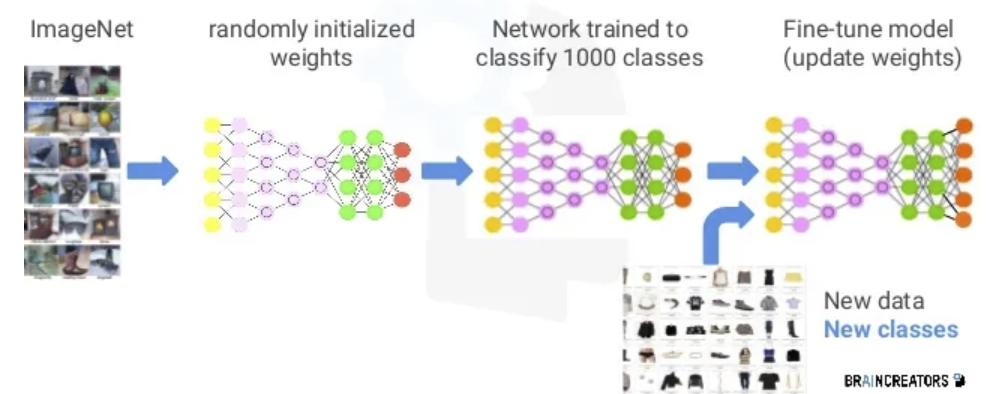{width="100%"}

**Consideración:** Se pueden reutilizar los pesos de otras redes neuronales para hacer el ajuste fino en otro conjunto de datos. 
## Aprendizaje por transferencia

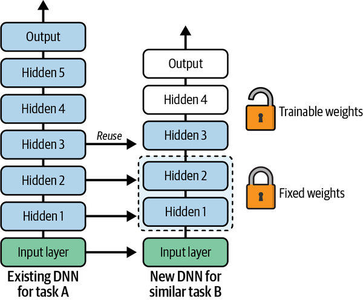{width="50%"}
Uso de una red neuronal existente como base para entrenar una nueva 
## Ejemplo de Código: Transfer Learning

\begin{lstlisting}[language=Python, style=mystyle]
[...]  # Assuming model A was already trained and saved to "my_model_A"
model_A = tf.keras.models.load_model("my_model_A")
model_B_on_A = tf.keras.Sequential(model_A.layers[:-1])
model_B_on_A.add(tf.keras.layers.Dense(1, activation="sigmoid"))
\end{lstlisting}

Se bloquean las capas del modelo A copiadas, para solo entrenar las nuevas.

\begin{lstlisting}[language=Python, style=mystyle]
for layer in model_B_on_A.layers[:-1]:
layer.trainable = False

optimizer = tf.keras.optimizers.SGD(learning_rate=0.001)
model_B_on_A.compile(loss="binary_crossentropy", optimizer=optimizer,
metrics=["accuracy"])
\end{lstlisting}

**Solución:** Implementación de Transfer Learning en Keras. 
## Pre-entrenamiento no supervisado

Se entrena un modelo con todos los datos, incluidos los datos no etiquetados, mediante una técnica de aprendizaje no supervisado, y luego se lo perfecciona para la tarea final solo con los datos etiquetados mediante una técnica de aprendizaje supervisado.

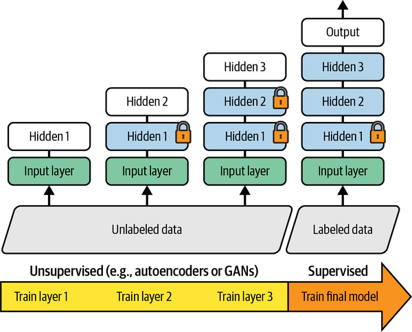{width="50%"}

\nocite{*}

## References

\AtNextBibliography{}
\printbibliography

