# Intuición Matemática

## Capítulos sobre Árboles

:::: {.columns}

::: {.column width="50%"}

{width="60%"} 
Capítulo 6

:::
::::

## Capítulos sobre Árboles

:::: {.columns}

::: {.column width="50%"}

{width="60%"} 
Capítulo 8

:::

::: {.column width="50%"}

{width="60%"} 
Capítulo 3
:::
::::

## Problema XOR

¿Cómo construyo un modelo lineal para separar perfectamente los puntos de la siguiente gráfica?

 % Espacio opcional entre el texto y la imagen

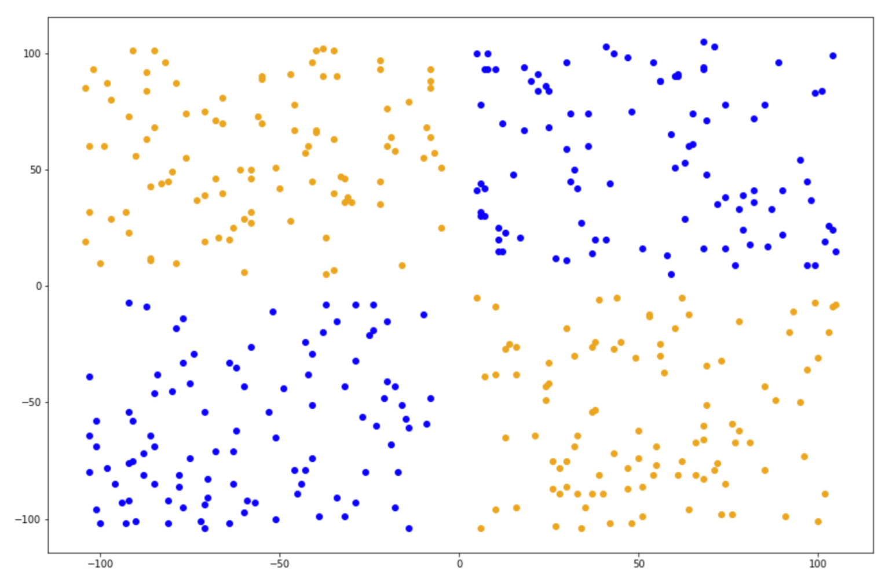{width="60%"}

## Enfoque Árboles de Decisión

- Conjunto de **condiciones** organizadas en una estructura **jerárquica**, de tal manera que la decisión final a tomar se pueda determinar siguiendo las condiciones que se cumplen desde la raíz del árbol hasta alguna de sus hojas.
- Cada *nodo interior* contiene una pregunta sobre un atributo concreto (con un hijo por cada posible respuesta) y cada *nodo hoja* se refiere a una decisión (clasificación).

## Estructura de Árbol

¿Va a llover hoy?

 % Espacio opcional entre el texto y la imagen

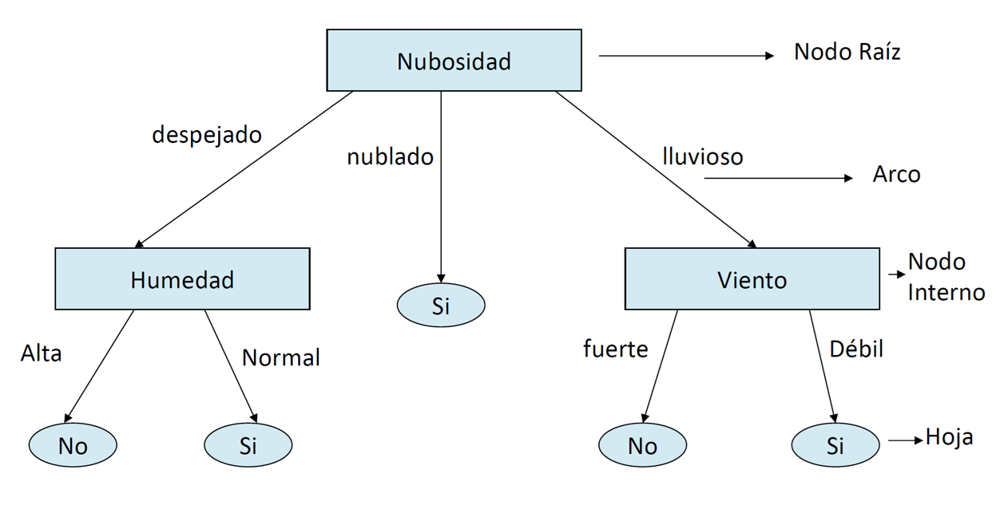{width="80%"}

## Ejemplo de Clasificación

- ¿Podemos predecir si un usuario cae en mora o no?
- Modelo: $\text{Mora} \approx f(\text{Balance}, \text{Edad} , \text{Tiene Empleo})$
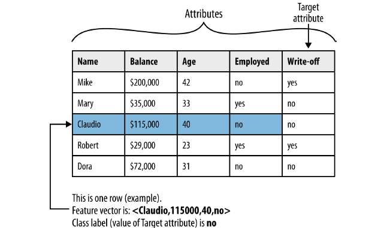{width="70%"}  \end{center}

## Ejemplo de Clasificación

- ¿Podemos predecir si un usuario cae en mora o no?
- Modelo: $\text{Mora} \approx f(\text{Balance}, \text{Edad} )$
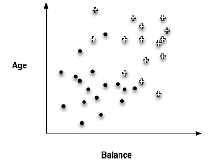{width="50%"}  \end{center}

## Ejemplo de Clasificación

- Solución: Regresor Lineal
- Región de Decisión: $ P(\text{Impago} = 1) = \frac{1}{1 + e^{-(-\text{Edad} + 1.5 \times \text{Balance} + 60)}}$
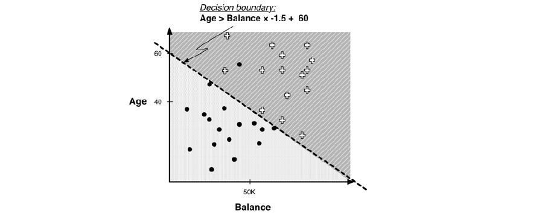{width="90%"}  \end{center}

## Ejemplo de Clasificación

:::: {.columns}

::: {.column width="50%"}

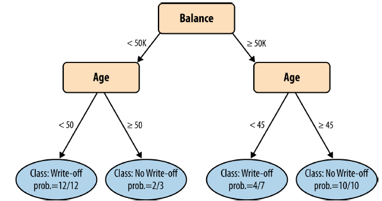{width="90%"} 
Árbol de Decisión

:::

::: {.column width="50%"}

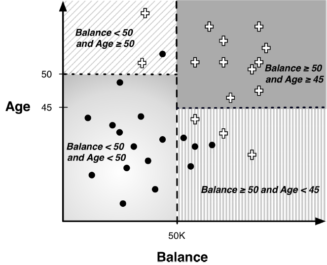{width="90%"} 
Región de Decisión
:::
::::

## Ejemplo de Regresión

:::: {.columns}

::: {.column width="33%"}

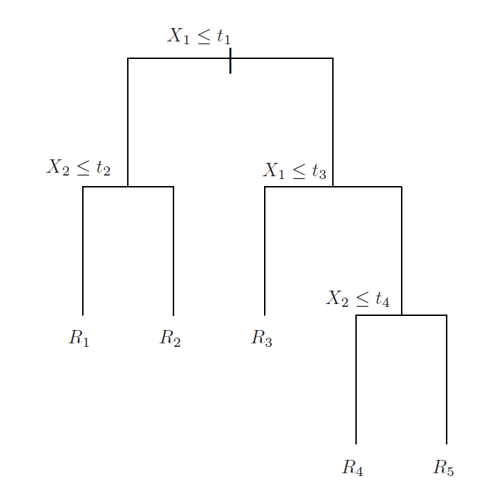{width="90%"} 
Árbol de Regresión

:::

::: {.column width="33%"}

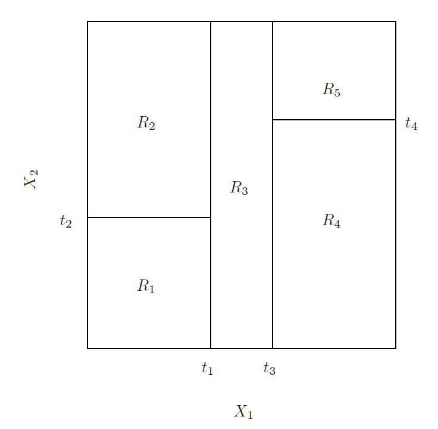{width="90%"} 
Regiones de Regresión

:::

::: {.column width="33%"}

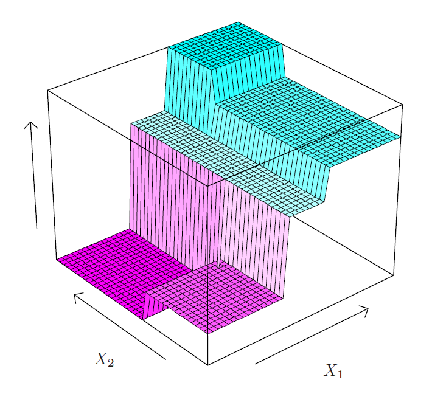{width="90%"} 
Superficie de Regresión
:::
::::

# Algoritmos

## Construcción del Árbol de Decisión

- **Entrenamiento:**
  - *Construye el árbol con datos de entrenamiento.*
  - **Objetivo:** Maximizar separación de clases (clasificación) o reducir varianza (regresión) al dividir nodos.
  - **Criterios de División:**
    - *Clasificación:* Entropía, Gini, Ganancia de Información.
    - *Regresión:* RSS (Reducción Suma de Cuadrados Residuales).

  

- **Prueba (Predicción):**
  - *Aplica el árbol a nuevos datos para predecir.*
  - **Funcionamiento:** Recorre el árbol desde la raíz, evaluando características en cada nodo hasta llegar a una hoja (predicción).

## Ganancia de Información

- Entropía en un Nodo
- $entropy = - p_1 log (p_1) - p_2 log (p_2) - \dots$
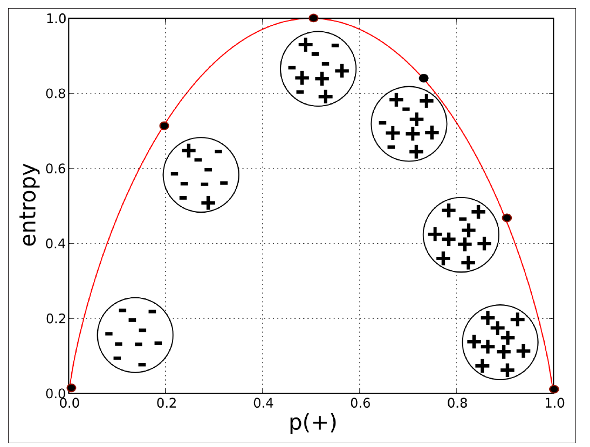{width="50%"}  \end{center}

## Escenario del Ejemplo

**Escenario:** Nodo $S$ con 10 individuos.

\bigskip
Imagina que estamos analizando un nodo en un árbol de decisión, al que llamamos "Nodo S". Este nodo representa un conjunto de datos con 10 individuos.

\bigskip
**Clasificación:** Dentro de estos 10 individuos, tenemos dos categorías importantes:

- **3 individuos en mora** (nuestra clase positiva, por ejemplo)
- **7 individuos sin mora** (nuestra clase negativa)

## Cálculo de Probabilidades

::: {.callout-note}
## Cálculo de Probabilidades
Para calcular la entropía, primero necesitamos las probabilidades de cada clase en el Nodo S.

\bigskip
- Probabilidad de "no mora":
  \[
  p(\text{no-mora}) = \frac{\text{Número de individuos sin mora}}{\text{Total de individuos}} = \frac{7}{10} = 0.7
  \]
- Probabilidad de "mora":
  \[
  p(\text{mora}) = \frac{\text{Número de individuos en mora}}{\text{Total de individuos}} = \frac{3}{10} = 0.3
  \]
:::

## Fórmula de Entropía

::: {.callout-note}
## Fórmula de Entropía (para dos clases)
La fórmula general para calcular la entropía en un sistema con dos clases (como "mora" y "no mora") es:

\bigskip
\[
\text{entropy}(S) = - p(\text{mora}) \log_2(p(\text{mora})) - p(\text{no-mora}) \log_2(p(\text{no-mora}))
\]

\bigskip
Donde:
- $S$ representa el conjunto de datos (nuestro Nodo S)
- $p(\text{mora})$ es la probabilidad de la clase "mora"
- $p(\text{no-mora})$ es la probabilidad de la clase "no mora"
- $\log_2$ es el logaritmo en base 2
:::

## Cálculo de Entropía (Nodo S)

::: {.callout-note}
## Sustituyendo valores en la fórmula
Ahora, sustituimos las probabilidades que calculamos en la fórmula de la entropía:

\bigskip
\[
\text{entropy}(S) = - \frac{3}{10} \log_2 \left(\frac{3}{10}\right) - \frac{7}{10} \log_2 \left(\frac{7}{10}\right)
\]
:::

\bigskip

::: {.callout-note}
## Resultado Aproximado
Calculando esta expresión, obtenemos:

\bigskip
\[
\text{entropy}(S) \approx 0.88 \text{ bits}
\]
:::

## Interpretación del Resultado

**Interpretación:** Este valor de entropía (aproximadamente 0.88 bits) representa una medida del desorden o la impureza en el nodo $S$ con respecto a la clasificación de "mora" y "no mora".

\bigskip
En términos más simples, nos dice qué tan mezcladas están las clases en este nodo. Una entropía más alta indicaría más desorden (más mezcla de clases), mientras que una entropía más baja indicaría menos desorden (las clases están más separadas).

\bigskip
Este valor de entropía será crucial para calcular la Ganancia de Información al dividir este nodo en un árbol de decisión.

## Ganancia de Información: Midiendo la Mejora

\frametitle{¿Cómo Cuantificamos la "Ganancia" al Dividir un Nodo?}

**Introducción a la Ganancia de Información (IG)**

\bigskip
Hemos calculado la entropía, que mide la impureza de un nodo. Ahora, necesitamos una métrica para evaluar **cuánto "ganamos"** al dividir un nodo padre en nodos hijos. Esta métrica es la **Ganancia de Información**.

\bigskip
- **Objetivo de la Ganancia de Información:**
  - Medir la **reducción en entropía** después de dividir un nodo.
  - Cuantificar la **efectividad de una división** para clasificar los datos.
  - **Mayor IG $\implies$ Mejor División:** Divisiones con mayor Ganancia de Información son preferibles en la construcción de árboles de decisión.

## Ganancia de Información: Midiendo la Mejora

La fórmula para calcular la Ganancia de Información de un nodo padre al dividirlo en nodos hijos es:
\[
IG(\text{padre}, \text{hijos}) = \text{entropy}(\text{padre}) - \sum_{i=1}^{n} p(hijo_i) \times \text{entropy}(hijo_i)
\]
Donde:
- $IG(\text{padre}, \text{hijos})$: Ganancia de Información al dividir el nodo "padre" en nodos "hijos".
- $\text{entropy}(\text{padre})$: Entropía del nodo padre **antes** de la división.
- $n$: Número de nodos hijos creados por la división.
- $p(hijo_i)$: Proporción de individuos que se dirigen al nodo hijo $i$. (Probabilidad de llegar al hijo $i$).
- $\text{entropy}(hijo_i)$: Entropía del nodo hijo $i$ **después** de la división.
- $\sum_{i=1}^{n} p(hijo_i) \times \text{entropy}(hijo_i)$:  Suma ponderada de las entropías de los nodos hijos.

## Ganancia de Información

:::: {.columns}

::: {.column width="50%"}

$IG = entropy(parent) - p(Balance < 50K) × entropy(Balance < 50K)+ p(Balance \geq 50K) × entropy(Balance \geq 50K)$ 
\bigskip
$IG \approx 0.99 - 0.43 \times 0.39 + 0.57 \times 0.79$ 
\bigskip
$IG\approx 0.37$

:::

::: {.column width="50%"}

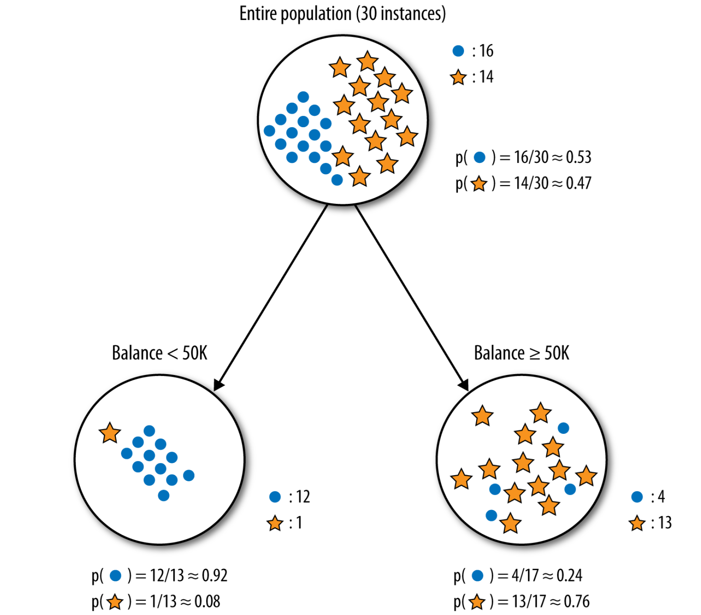{width="100%"} 
Partición usando el Balance
:::
::::

## Ganancia de Información

:::: {.columns}

::: {.column width="50%"}

$entropy(parent) \approx 0.99$
$entropy(Residence=OWN) \approx 0.54$
$entropy(Residence=RENT) \approx 0.97$
$entropy(Residence=OTHER) \approx 0.98$
$IG \approx 0.13$

:::

::: {.column width="50%"}

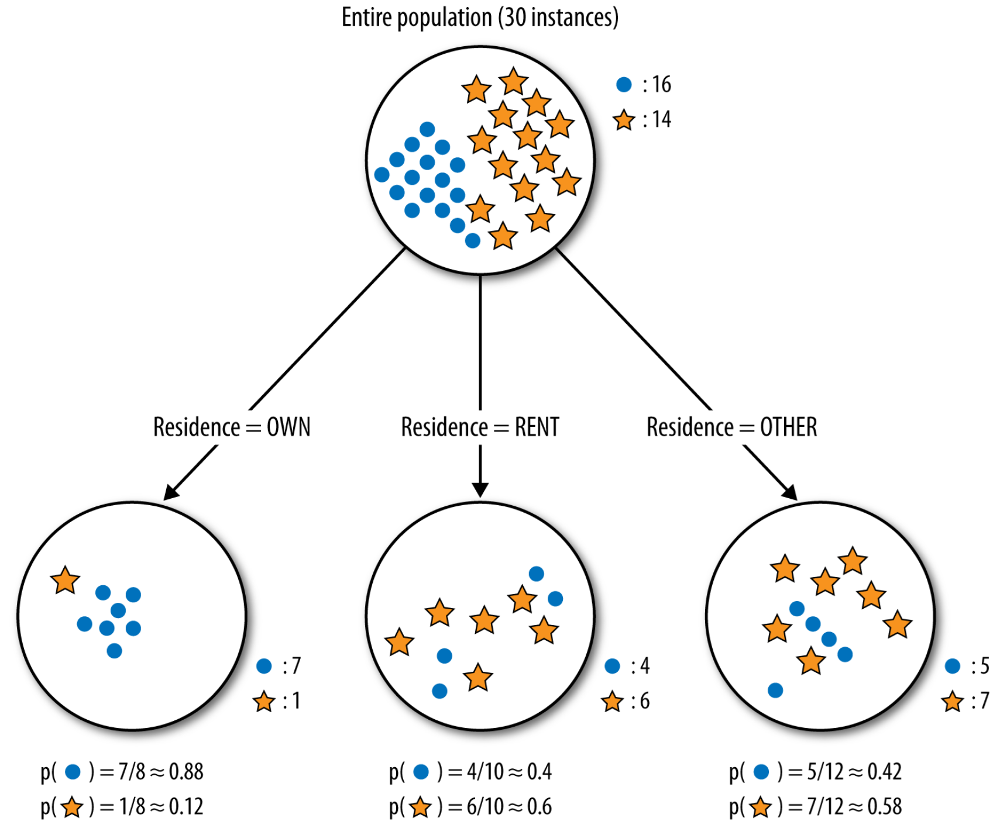{width="100%"} 
Partición usando la Residencia
:::
::::

## Proceso de Poda

- Eliminar hojas, ramas o subarboles para mejorar el desempeño del árbol
- El árbol sin podar clasificará correctamente los registros del set de entrenamiento pero clasificará incorrectamente algunos registros del set de pruebas
- Compromiso entre la complejidad del arbol y el error de clasificación

## Comparativa: Árboles vs. Regresión

\frametitle{¿Cuándo elegir cada modelo?}
**Decisión clave:** ¿Árboles de Decisión o Regresión Lineal/Logística?

\bigskip
Depende de:
- La naturaleza de los datos.
- El tipo de problema.
- La necesidad de interpretabilidad.
- La eficiencia requerida.

\bigskip
Exploremos las ventajas y desventajas de cada uno en varios slides.

## Ventajas de los Árboles: No Linealidad e Interpretación

\frametitle{Árboles de Decisión: Puntos Fuertes (1/2)}

::: {.callout-note}
## Ventajas Clave
- **Relaciones No Lineales:** Capturan patrones complejos sin transformaciones manuales.
- **Interpretación Visual:** Estructura clara y fácil de visualizar para explicar decisiones.
:::

\bigskip
**Ideal cuando:**
- Sospechas relaciones no lineales en los datos.
- La interpretabilidad del modelo es prioritaria.

## Ventajas de los Árboles: Datos Mixtos y Outliers

\frametitle{Árboles de Decisión: Puntos Fuertes (2/2)}

::: {.callout-note}
## Otras Ventajas
- **Datos Categóricos y Numéricos:** Manejan ambos tipos de datos directamente.
- **Robustos a Outliers:** Menos afectados por valores atípicos.
- **Selección de Variables Implícita:** Identifican variables relevantes automáticamente.
:::

## Desventajas de los Árboles: Overfitting e Inestabilidad

\frametitle{Árboles de Decisión: Limitaciones}

::: {.callout-note}
## Desventajas
- **Overfitting:**  Propensos a sobreajustar si no se controlan (poda, profundidad, etc.).
- **Inestabilidad:**  Pequeños cambios en datos pueden cambiar el árbol drásticamente.
:::

\bigskip
**Soluciones:**
- Regularización (poda, profundidad máxima).
- Métodos Ensemble (Random Forest, Boosting) para reducir la inestabilidad.

## Ventajas de Regresión: Simplicidad y Linealidad

\frametitle{Regresión Lineal/Logística: Puntos Fuertes (1/2)}

::: {.callout-note}
## Ventajas Clave
- **Simplicidad y Eficiencia:**  Modelos rápidos y eficientes, incluso con grandes datasets.
- **Relaciones Lineales:**  Óptimos si la relación es lineal o aproximadamente lineal.

- **Bien Establecidos y Entendidos:**  Base estadística sólida y bien estudiada.
- **Coeficientes Interpretables:**  Información directa sobre variables predictoras (lineal y logística).
:::

\bigskip
**Ideal cuando:**
- Se esperan relaciones lineales.
- Se busca un modelo simple y eficiente.

## Desventajas de Regresión: Linealidad y Preprocesamiento

\frametitle{Regresión Lineal/Logística: Limitaciones}

::: {.callout-note}
## Desventajas
- **Supuesto de Linealidad:**  Rendimiento pobre si la relación es no lineal.
- **Sensibles a Outliers:**  Valores atípicos pueden distorsionar el modelo.
- **Preprocesamiento Datos Categóricos:**  Necesitan codificación manual.
:::

## Conclusión:  Probar y Comparar

\frametitle{Estrategia Recomendada}
**No hay "mejor" modelo universal.**

\bigskip
**Recomendación:**
- **Probar ambos tipos de modelos:** Árboles y Regresión.
- **Comparar el rendimiento** en datos de validación.
- Elegir el modelo que mejor se adapte al **problema específico y los datos**.

# Librerías

## Seleccionando Algoritmos

¿Cómo elijo el algoritmo más adecuado para mis datos?
{width="80%"}

## Comparación de Algoritmos

Comparación de distintos algoritmos a la fecha

{width="100%"}

## Decision Tree Classifier en scikit-learn: API

- **Clase principal:** `sklearn.tree.DecisionTreeClassifier`
- **Parámetros clave:**
  - `criterion`: La función para medir la calidad de una división ('gini' o 'entropy').
  - `max\_depth`: La profundidad máxima del árbol para controlar el sobreajuste.
  - `min\_samples\_split`: El número mínimo de muestras requeridas para dividir un nodo.
  - `min\_samples\_leaf`: El número mínimo de muestras que debe tener un nodo hoja.
- **Métodos importantes:**
  - `fit(X, y)`: Entrena el modelo con datos y etiquetas.
  - `predict(X)`: Predice etiquetas para nuevos datos.
  - `score(X, y)`: Evalúa el rendimiento del modelo (precisión).

## Ejemplo de Código: Árbol de Clasificación (scikit-learn)

\begin{lstlisting}[language=Python, style=mystyle]
from sklearn.datasets import load_iris
from sklearn.tree import DecisionTreeClassifier, export_graphviz
from graphviz import Source

iris = load_iris(as_frame=True)
X_iris = iris.data[["petal length (cm)", "petal width (cm)"]].values
y_iris = iris.target
tree_clf = DecisionTreeClassifier(max_depth=2, random_state=42)
tree_clf.fit(X_iris, y_iris)
dot_data = export_graphviz(
tree_clf,
feature_names=["petal length (cm)", "petal width (cm)"],
class_names=iris.target_names,
rounded=True,
filled=True
)
display(Source(dot_data))
\end{lstlisting}

## Ejemplo de Código: Árbol de Clasificación (scikit-learn)

Clasificador Iris Dataset

 % Espacio opcional entre el texto y la imagen

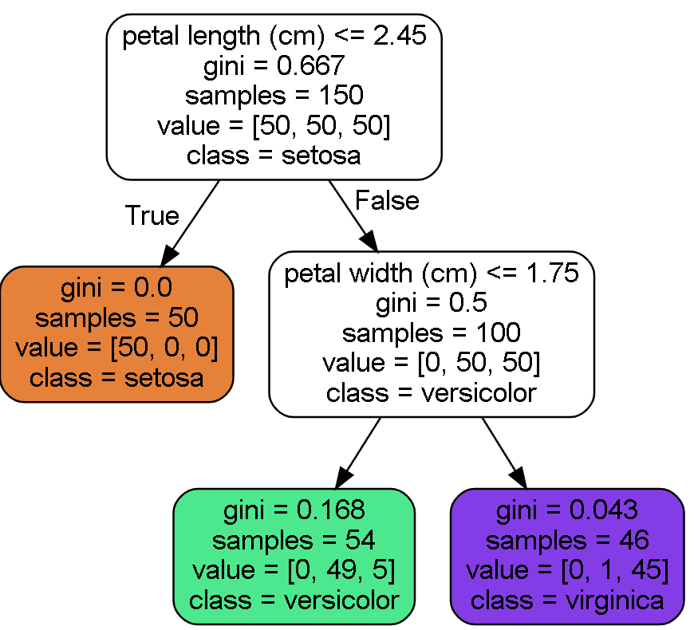{width="40%"}

## Ejemplo de Código: Árbol de Clasificación (scikit-learn)

Clasificador Iris Dataset

 % Espacio opcional entre el texto y la imagen

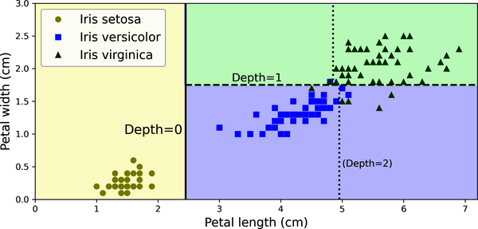{width="80%"}

## Decision Tree Regressor en scikit-learn: API

- **Clase principal:** `sklearn.tree.DecisionTreeRegressor`
- **Parámetros clave:**
  - `criterion`: La función para medir el error en una división ('squared\_error', 'absolute\_error').
  - `max\_depth`: La profundidad máxima del árbol.
  - `min\_samples\_split`: El número mínimo de muestras necesarias para dividir un nodo.
  - `min\_samples\_leaf`: El número mínimo de muestras en un nodo hoja.
- **Métodos importantes:**
  - `fit(X, y)`: Entrena el modelo con datos numéricos y valores numéricos.
  - `predict(X)`: Predice un valor continuo para nuevos datos.
  - `score(X, y)`: Evalúa el rendimiento mediante el coeficiente de determinación $R^2$.

## Ejemplo de Código: Árbol de Regresión (scikit-learn)

\begin{lstlisting}[language=Python, style=mystyle]
import numpy as np
from sklearn.tree import DecisionTreeRegressor

np.random.seed(42)
X_quad = np.random.rand(200, 1) - 0.5
y_quad = X_quad ** 2 + 0.025 * np.random.randn(200, 1)

tree_reg = DecisionTreeRegressor(max_depth=2, random_state=42)
tree_reg.fit(X_quad, y_quad)
\end{lstlisting}

## Ejemplo de Código: Árbol de Regresión (scikit-learn)

Aproximador a función cuadrática

 % Espacio opcional entre el texto y la imagen

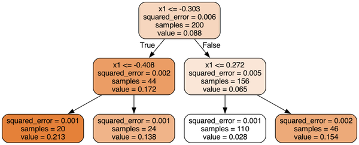{width="80%"}

## Ejemplo de Código: Árbol de Regresión (scikit-learn)

Aproximador a función cuadrática

 % Espacio opcional entre el texto y la imagen

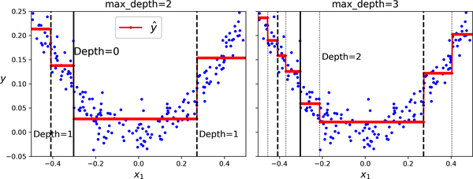{width="80%"}

\nocite{*}

## References

\AtNextBibliography{}
\printbibliography

