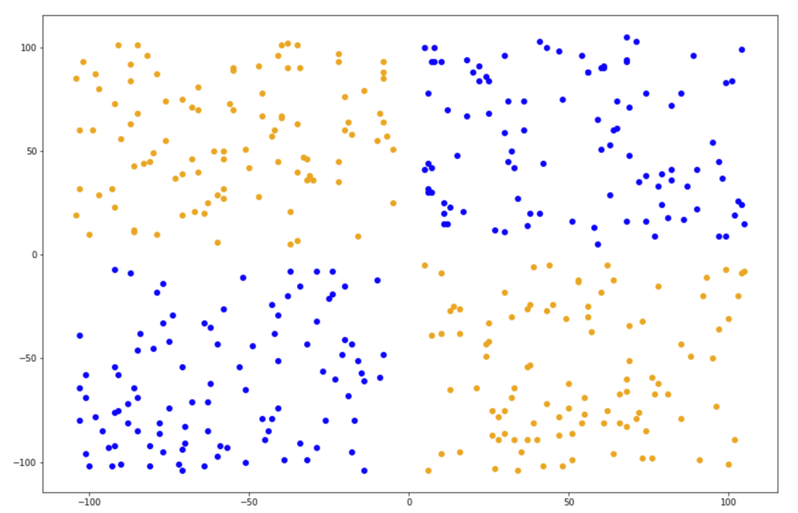
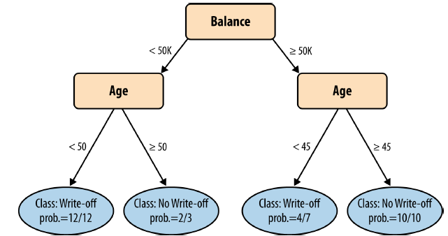
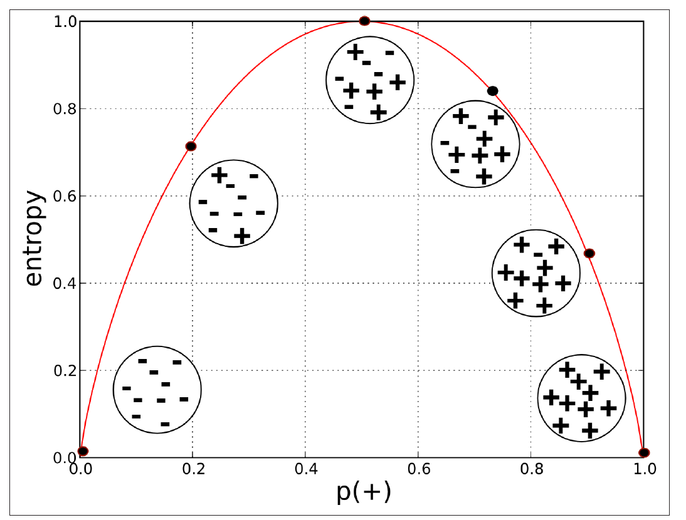
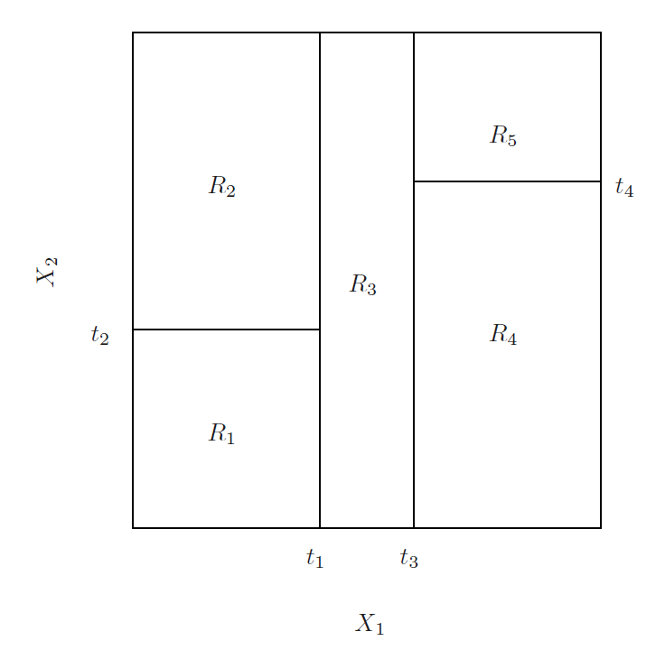

<style>
.reveal figcaption {
  text-align: center !important;
}
.smaller-text {
  font-size: 0.75em !important;
}
</style>

# Introducción

## Modelos lineales asumen fronteras planas

- **Modelos lineales:** Fronteras tipo $\beta_0 + \beta_1 X_1 + \beta_2 X_2 = 0$.
- **Regresión Logística:** Estima $P(Y=1|X)$ mediante sigmoide.
- **Ventaja:** Simplicidad, rapidez y alta interpretabilidad.

::: {.callout-note title="Reflexión"}
💭 ¿Qué sucede cuando los datos reales **no** son linealmente separables? ¿Se les ocurre un ejemplo?
:::


## Patrón XOR: imposible para una recta

- Una línea recta jamás podrá separar estas clases correctamente.
- Si probamos regresión logística aquí, el *accuracy* será del 50%.

{height="290px" fig-align="center"}

::: {style="text-align: center; font-size: 0.65em; margin-top: 10px;"}
Tomado de: [@provost2013data]
:::


## Redes y SVMs son difíciles de explicar

Podemos usar modelos complejos (Kernel SVM, Redes Neuronales) para separar datos no lineales de forma brillante.

::: {.callout-warning title="Cuestionamiento"}
Pero imaginen que el modelo rechaza un crédito bancario. ¿Cómo le explicamos al cliente el rechazo basado en la matemática de un Kernel RBF?
:::


## La no linealidad sacrifica claridad

En problemas de alto impacto (finanzas, salud), la predicción pura no basta; se exige **auditabilidad**.

- **No Linealidad:** Kernels curvan fronteras eficientemente.
- **Opacidad:** Difícil justificar el paso a paso de la decisión.
- **Caja Negra:** Reduce la confianza de los expertos del negocio.


## Sistemas BRMS usan reglas explícitas

Recordemos los sistemas **BRMS** (*Business Rules Management Systems*) como Drools o Camunda:

- Usan reglas explícitas y árboles de decisión (BPMN).
- Son 100% interpretables, deterministas y auditables.

::: {.callout-note title="El Reto"}
¿Cómo logramos la explicabilidad de las reglas de negocio, pero logrando que la máquina **las descubra sola** desde los datos?
:::


# Árboles y CART

## Árboles: no linealidad e interpretabilidad

El Árbol de Decisión ofrece lo mejor de ambos mundos:

- **No lineal:** Capaz de separar patrones complejos (XOR).
- **Interpretable:** Crea reglas jerárquicas simples (If-Then).
- **Sin preprocesamiento:** No exige escalar variables.

{height="260px" fig-align="center"}


## Algoritmo CART construye reglas

- **Algoritmo CART (Classification and Regression Trees):** 
  - Divide el espacio recursivamente de arriba hacia abajo.
  - En cada paso, selecciona la variable y el umbral que separe mejor los datos.

::: {.callout-note title="Reflexión"}
¿Cómo mide matemáticamente la máquina que un "corte" o división es mejor que otro?
:::


## Entropía y Gini miden el desorden

El algoritmo evalúa la **Ganancia de Información**. A mayor reducción del desorden, mejor es el corte.

{height="260px" fig-align="center"}

- **Entropía=0:** Nodo puro (solo una clase presente).
- **Entropía=1:** Máxima mezcla (incertidumbre total).


## Inferencia es rápida, entrenar es lento

- **Predicción (Rápida):** Evalúa condiciones hasta llegar a una hoja $O(\log_2 m)$.
- **Entrenamiento (Lento):** Prueba exhaustivamente cada variable y umbral posible.

::: {.callout-warning title="Pregunta sobre Convergencia"}
Si el árbol sigue dividiendo los datos para mejorar la pureza... ¿Cuándo se detiene? ¿Qué pasa si llega hasta el final?
:::


# Regularización

## Árboles profundos memorizan ruido

Si no lo detenemos, el árbol crece hasta que cada hoja tenga **1 sola muestra**.

```python
from sklearn.tree import DecisionTreeClassifier

tree_clf = DecisionTreeClassifier(random_state=42) # Sin límite
tree_clf.fit(X_train, y_train)

print(f"Train: {tree_clf.score(X_train, y_train)}") # 100%
print(f"Test: {tree_clf.score(X_test, y_test)}")   # 65% (Overfitting)
```

- Aprende de memoria la data de entrenamiento, fallando en nuevos datos.


## Regularización previene el sobreajuste

::: {.callout-note title="Estrategia"}
¿Cómo le indicamos al algoritmo que se detenga antes de aprenderse de memoria los datos (*overfitting*)?
:::

- Ajustando **hiperparámetros de poda**:
  - `max_depth`: Limita la profundidad máxima del árbol.
  - `min_samples_leaf`: Mínimas muestras requeridas en una hoja.


## Pre-poda limita crecimiento en Python

```python
from sklearn.tree import DecisionTreeClassifier

tree_reg = DecisionTreeClassifier(
    max_depth=4, min_samples_leaf=5, random_state=42
)
tree_reg.fit(X_train, y_train)

print(f"Test Accuracy: {tree_reg.score(X_test, y_test)}") # 88%
```

- Al obligar hojas de mínimo 5 muestras, el modelo generaliza mejor.


# Limitaciones

## Árboles generan particiones ortogonales

Observen cómo se forman las áreas de decisión de un árbol:

{height="250px" fig-align="center"}

::: {.callout-warning title="El Problema Diagonal"}
Las reglas siempre son "mayor que" o "menor que" (paralelas a los ejes). ¿Qué sucede si la frontera óptima es una línea diagonal?
:::


## Cortes ortogonales sufren en diagonales

El árbol intenta imitar la diagonal con cientos de escalones microscópicos.

{height="280px" fig-align="center"}

- **Consecuencia:** Requiere mucha profundidad, es complejo y propenso al sobreajuste.


## PCA rota datos antes del árbol

Si rotamos el dataset usando **PCA** antes de aplicar el árbol, alineamos los datos con los ejes y simplificamos los cortes.

```python
from sklearn.pipeline import make_pipeline
from sklearn.decomposition import PCA
from sklearn.preprocessing import StandardScaler

pipeline = make_pipeline(
  StandardScaler(),
  PCA(), # Descorrelaciona y alinea variables
  DecisionTreeClassifier(max_depth=3)
)
```

## PCA alinea los datos a ejes del árbol

{height="320px" fig-align="center"}

::: {style="text-align: center; font-size: 0.65em; margin-top: 5px;"}
Tomado de: [@geron2022hands]
:::


## Árboles sufren de alta inestabilidad

Tenemos un modelo interpretable, capaz de modelar no linealidad y correctamente regularizado. 

::: {.callout-warning title="Pregunta de Cierre"}
¿Qué creen que pasaría con la forma matemática de este árbol si le quitamos apenas el 5% de los datos y volvemos a entrenar?
:::


## Cambios leves generan árboles distintos

- CART es un algoritmo voraz y estocástico.
- Un cambio leve en los datos iniciales puede alterar la primera división (raíz), cambiando **todo el resto del árbol**.

{height="240px" fig-align="center"}

- **Solución:** Entrenar múltiples árboles y promediarlos (*Random Forest*).


## Tarea y Lecturas Sugeridas

**Actividades a desarrollar:**

1. **(Obligatorio)** Leer el **Capítulo 6** de Géron.
2. **(Opcional)** Explorar el [Cuaderno de Google NotebookLM](https://notebook.google.com/notebook/f1e87c40-b872-466d-94ec-8544024b5986).

::: {#refs}
:::
