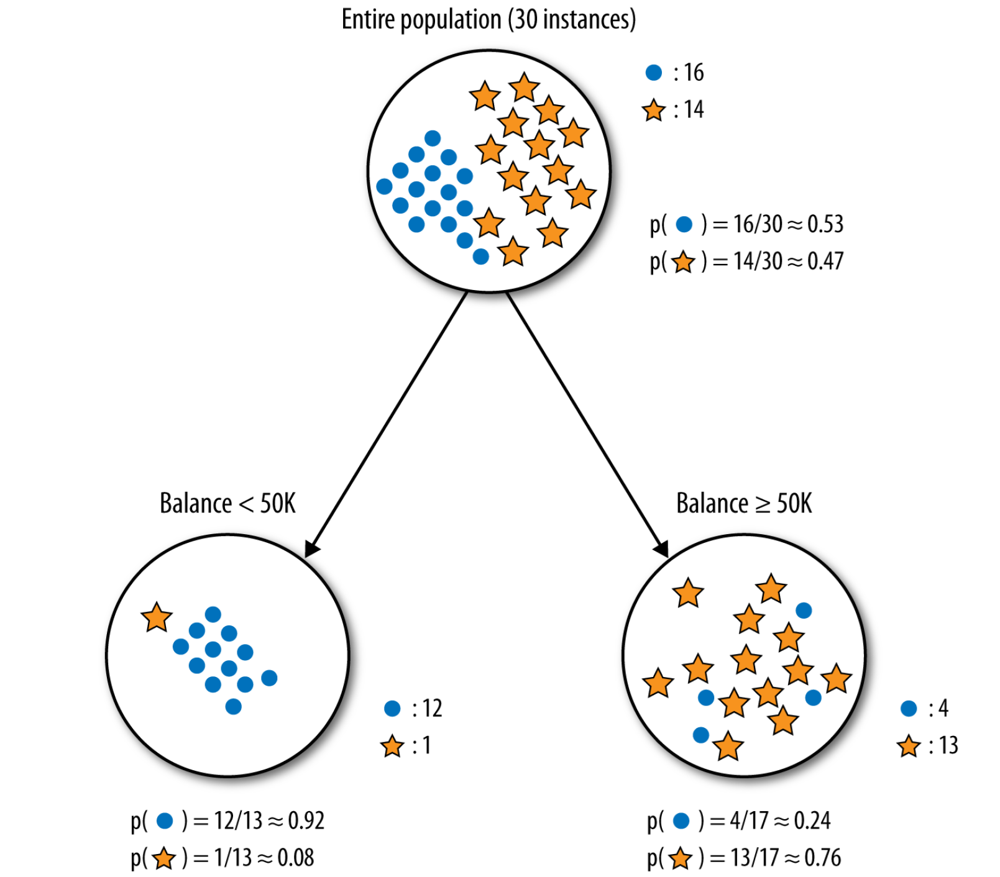
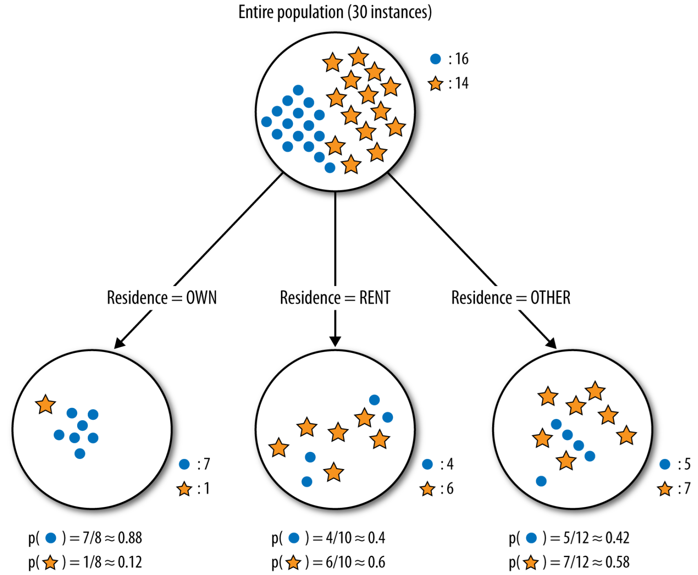
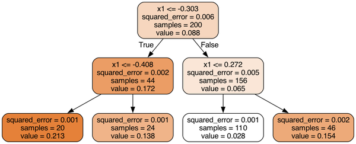
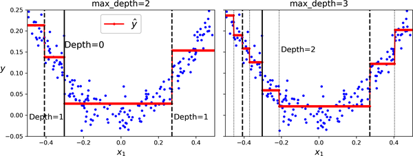

<style>
.reveal figcaption {
  text-align: center !important;
}
.smaller-text {
  font-size: 0.75em !important;
}
</style>

# Introducción

## Modelos lineales asumen fronteras planas

- **Modelos lineales:** Fronteras tipo $\beta_0 + \beta_1 X_1 + \beta_2 X_2 = 0$.
- **Regresión Logística:** Estima $P(Y=1|X)$ mediante sigmoide.
- **Ventaja:** Simplicidad, rapidez y alta interpretabilidad.

::: {.callout-note title="Reflexión"}
💭 ¿Qué sucede cuando los datos reales **no** son linealmente separables? ¿Se les ocurre un ejemplo?
:::


## Patrón XOR: imposible para una recta

::: {.columns}
::: {.column width="50%"}
- Una línea recta jamás podrá separar estas clases correctamente.
- Con regresión logística, el *accuracy* será del 50%.
:::
::: {.column width="50%"}
{height="290px" fig-align="center"}

::: {style="text-align: center; font-size: 0.65em; margin-top: 10px;"}
Tomado de: [@provost2013data]
:::
:::
:::


## Redes y SVMs son difíciles de explicar

Podemos usar modelos complejos (Kernel SVM, Redes Neuronales) para separar datos no lineales de forma brillante.

::: {.callout-warning title="Cuestionamiento"}
Pero imaginen que el modelo rechaza un crédito bancario. ¿Cómo le explicamos al cliente el rechazo basado en la matemática de un Kernel RBF?
:::


## La no linealidad sacrifica claridad

En problemas de alto impacto (finanzas, salud), la predicción pura no basta; se exige **auditabilidad**.

- **No Linealidad:** Kernels curvan fronteras eficientemente.
- **Opacidad:** Difícil justificar el paso a paso de la decisión.
- **Caja Negra:** Reduce la confianza de los expertos del negocio.


## Sistemas BRMS usan reglas explícitas

Recordemos los sistemas **BRMS** (*Business Rules Management Systems*) como Drools o Camunda:

- Usan reglas explícitas y árboles de decisión (BPMN).
- Son 100% interpretables, deterministas y auditables.

::: {.callout-note title="El Reto"}
¿Cómo logramos la explicabilidad de las reglas de negocio, pero logrando que la máquina **las descubra sola** desde los datos?
:::

## Vectores de soporte guían decisión

{height="480px" fig-align="center"}

::: {style="text-align: center; font-size: 0.65em; margin-top: 10px;"}
[@mathworks_svm]
:::


# Árboles y CART

## Árboles: no linealidad e interpretabilidad

::: {.columns}
::: {.column width="50%"}
**Lo mejor de ambos mundos:**

- **No lineal:** Separa patrones complejos (XOR).
- **Interpretable:** Reglas jerárquicas simples (If-Then).
- **Sin preprocesamiento:** No exige escalar variables.
:::
::: {.column width="50%"}
{height="320px" fig-align="center"}

::: {style="text-align: center; font-size: 0.65em; margin-top: 5px;"}
Tomado de: [@provost2013data]
:::
:::
:::


## Algoritmo CART construye reglas

- **Algoritmo CART (Classification and Regression Trees):** 
  - Divide el espacio recursivamente de arriba hacia abajo.
  - En cada paso, selecciona la variable y el umbral que separe mejor los datos.

::: {.callout-note title="Reflexión"}
¿Cómo mide matemáticamente la máquina que un "corte" o división es mejor que otro?
:::


## Entropía y Gini miden el desorden

::: {.columns}
::: {.column width="50%"}
Se evalúa la **Ganancia de Información**. A mayor reducción del desorden, mejor es el corte.

- **Entropía=0:** Nodo puro (una sola clase).
- **Entropía=1:** Máxima mezcla (incertidumbre).
:::
::: {.column width="50%"}
{height="260px" fig-align="center"}

::: {style="text-align: center; font-size: 0.65em; margin-top: 5px;"}
Tomado de: [@provost2013data]
:::
:::
:::


## Escenario del Ejemplo

**Escenario:** Nodo $S$ con 10 individuos.

Imagina que estamos analizando un nodo en un árbol de decisión, al que llamamos "Nodo S". Este nodo representa un conjunto de datos con 10 individuos.

**Clasificación:** Dentro de estos 10 individuos, tenemos dos categorías importantes:

- **3 individuos en mora** (nuestra clase positiva, por ejemplo)
- **7 individuos sin mora** (nuestra clase negativa)


## Cálculo de Probabilidades

::: {.callout-note title="Cálculo de Probabilidades"}
Para calcular la entropía, necesitamos las probabilidades de cada clase en el Nodo S.

- Probabilidad de "no mora":
  $$p(\text{no-mora}) = \frac{7}{10} = 0.7$$

- Probabilidad de "mora":
  $$p(\text{mora}) = \frac{3}{10} = 0.3$$
:::


## Fórmula de Entropía

::: {.callout-note title="Fórmula de Entropía (para dos clases)"}
La fórmula general para calcular la entropía en un sistema con dos clases es:

$$\text{entropy}(S) = - p(\text{mora}) \log_2(p(\text{mora})) - p(\text{no-mora}) \log_2(p(\text{no-mora}))$$

Donde:

- $S$ representa el conjunto de datos (nuestro Nodo S)
- $p(\text{mora})$ es la probabilidad de la clase "mora"
- $p(\text{no-mora})$ es la probabilidad de la clase "no mora"
:::


## Cálculo de Entropía (Nodo S)

::: {.callout-note title="Sustituyendo valores en la fórmula"}
Sustituimos las probabilidades calculadas en la fórmula de la entropía:

$$\text{entropy}(S) = - \frac{3}{10} \log_2 \left(\frac{3}{10}\right) - \frac{7}{10} \log_2 \left(\frac{7}{10}\right)$$
:::

::: {.callout-note title="Resultado Aproximado"}
Calculando esta expresión, obtenemos:

$$\text{entropy}(S) \approx 0.88 \text{ bits}$$
:::


## Ganancia de Información reduce la Entropía

La entropía ($\approx 0.88$) mide qué tan **mezcladas** están las clases (impureza). Para mejorar, usamos la **Ganancia de Información (IG)**.

::: {.columns}
::: {.column width="55%"}
- **Objetivo:** Medir la **reducción del desorden** al dividir un nodo.
- **Regla:** Mayor IG $\implies$ Mejor corte.
- El algoritmo siempre prefiere cortes que generen hijos más puros.
:::
::: {.column width="45%"}
```{mermaid}
%%| fig-width: 4
flowchart TD
    A[Padre: Mezclado] -->|Corte| B(Hijo 1: Más puro)
    A -->|Corte| C(Hijo 2: Más puro)
    B -.-> D{Ganancia de<br>Información}
    C -.-> D
```
:::
:::


## Ganancia de Información (Fórmula)

::: {style="font-size: 0.8em;"}
La fórmula para calcular la Ganancia de Información es:

$$IG(\text{padre}, \text{hijos}) = \text{entropy}(\text{padre}) - \sum_{i=1}^{n} p(hijo_i) \times \text{entropy}(hijo_i)$$

Donde:

- $IG$: Ganancia al dividir el nodo "padre".
- $\text{entropy}(\text{padre})$: Entropía **antes** de la división.
- $n$: Número de nodos hijos creados.
- $p(hijo_i)$: Proporción de individuos que se dirigen al nodo hijo $i$.
- $\text{entropy}(hijo_i)$: Entropía **después** de la división.
:::


## Ganancia de Información (Balance)

::: {.columns}
::: {.column width="55%"}
::: {style="font-size: 0.65em;"}
$IG = entropy(padre)$  
$- p(\text{Bal.} < 50K) \times entropy(\text{Bal.} < 50K)$  
$- p(\text{Bal.} \geq 50K) \times entropy(\text{Bal.} \geq 50K)$  

<br>
$IG \approx 0.99 - 0.43(0.39) - 0.57(0.79)$  
$IG \approx 0.37$
:::
:::
::: {.column width="45%"}
{height="280px" fig-align="center"}

::: {style="text-align: center; font-size: 0.65em;"}
Partición usando el Balance. [@provost2013data]
:::
:::
:::


## Ganancia de Información (Residencia)

::: {.columns}
::: {.column width="50%"}
::: {style="font-size: 0.65em;"}
$entropy(parent) \approx 0.99$  
<br>
$entropy(Res.=OWN) \approx 0.54$  
<br>
$entropy(Res.=RENT) \approx 0.97$  
<br>
$entropy(Res.=OTHER) \approx 0.98$  
<br>
**$IG \approx 0.13$**
:::
:::
::: {.column width="50%"}
{height="280px" fig-align="center"}

::: {style="text-align: center; font-size: 0.65em;"}
Partición usando la Residencia. [@provost2013data]
:::
:::
:::


## Variables continuas requieren cortes óptimos

Vimos divisiones claras con clases (Residencia = OWN).

::: {.callout-note title="Reflexión"}
Si tenemos una variable continua como el Salario o la Edad, hay infinitos puntos. ¿Cómo decide la máquina en qué valor exacto hacer el corte (ej: Edad > 35)?
:::


## Búsqueda exhaustiva del umbral

El algoritmo CART ordena los valores de la variable y evalúa la ganancia en todos los puntos medios posibles entre datos consecutivos.

- Se elige el umbral $t_k$ que **maximiza la pureza** (o minimiza el desorden).
- Por esto, buscar el mejor corte es computacionalmente intensivo.


## Nodos hoja estiman probabilidades

Al llegar a una hoja, el árbol predice la clase mayoritaria.

::: {.callout-note title="Reflexión"}
En detección de fraude, predecir "Fraude" o "No Fraude" puede ser insuficiente. ¿Cómo sabemos el grado de certeza o riesgo de esa decisión?
:::


## Proporciones definen la probabilidad

El modelo estima probabilidades basado en la proporción de la clase en esa hoja.

- Si en el nodo final hay 49 "No-Mora" y 5 "Mora", predecir "Mora" tiene baja certeza.
- La probabilidad estimada de *Mora* será simplemente $\frac{5}{54} \approx 9.3\%$.


## Inferencia es rápida, entrenar es lento

- **Predicción (Rápida):** Evalúa condiciones hasta llegar a una hoja $\mathcal{O}(\log_2 m)$.
- **Entrenamiento (Lento):** Busca exhaustivamente cortes continuos y categóricos.

::: {.callout-warning title="Pregunta sobre Convergencia"}
Si el árbol sigue dividiendo para purificar... ¿Cuándo se detiene?
:::


# Regularización

## Árboles profundos memorizan ruido

Si no lo detenemos, el árbol crece hasta que cada hoja tenga **1 sola muestra**.

```python
from sklearn.tree import DecisionTreeClassifier

tree_clf = DecisionTreeClassifier(random_state=42) # Sin límite
tree_clf.fit(X_train, y_train)

print(f"Train: {tree_clf.score(X_train, y_train)}") # 100%
print(f"Test: {tree_clf.score(X_test, y_test)}")   # 65% (Overfitting)
```

- Aprende de memoria la data de entrenamiento, fallando en nuevos datos.


## Regularización previene el sobreajuste

::: {.callout-note title="Estrategia"}
¿Cómo le indicamos al algoritmo que se detenga antes de aprenderse de memoria los datos (*overfitting*)?
:::

- Ajustando **hiperparámetros de poda**:
  - `max_depth`: Limita la profundidad máxima del árbol.
  - `min_samples_leaf`: Mínimas muestras requeridas en una hoja.


## Pre-poda limita crecimiento en Python

```python
from sklearn.tree import DecisionTreeClassifier

tree_reg = DecisionTreeClassifier(
    max_depth=4, min_samples_leaf=5, random_state=42
)
tree_reg.fit(X_train, y_train)

print(f"Test Accuracy: {tree_reg.score(X_test, y_test)}") # 88%
```

- Al obligar hojas de mínimo 5 muestras, el modelo generaliza mejor.


# Árboles de Regresión

## Regresión: Predecir valores numéricos

Hasta ahora clasificamos categorías (Mora vs No-Mora).

::: {.callout-note title="Reflexión"}
¿Cómo adaptamos los cortes si queremos predecir el valor continuo de una casa en dólares? ¿Qué usaríamos en vez de medir Entropía o Gini?
:::


## Árboles minimizan la Varianza

::: {.columns}
::: {.column width="50%"}
En vez de buscar "pureza de clases", el árbol busca que los valores en la hoja sean parecidos.

- **Métrica:** Mayor reducción de Varianza (minimizar el MSE).
- **Predicción:** Es el **promedio** de los valores en el nodo hoja.
:::
::: {.column width="50%"}
{height="320px" fig-align="center"}

::: {style="text-align: center; font-size: 0.65em; margin-top: 5px;"}
Árbol de Regresión. Tomado de: [@geron2022hands]
:::
:::
:::


## La predicción es escalonada

::: {.columns}
::: {.column width="50%"}
Como el modelo promedia los datos en cada región separada por cortes, la línea de predicción luce como escalones planos horizontales.
:::
::: {.column width="50%"}
{height="280px" fig-align="center"}

::: {style="text-align: center; font-size: 0.65em; margin-top: 5px;"}
Predicciones constantes por región. Tomado de: [@geron2022hands]
:::
:::
:::


# Limitaciones

## Árboles generan particiones ortogonales

::: {.columns}
::: {.column width="45%"}
Observen cómo se forman las áreas de decisión de un árbol:

::: {.callout-warning title="El Problema Diagonal"}
Las reglas siempre son paralelas a los ejes. ¿Qué sucede si la frontera óptima es una línea diagonal?
:::
:::
::: {.column width="55%"}
{height="250px" fig-align="center"}

::: {style="text-align: center; font-size: 0.65em; margin-top: 5px;"}
Tomado de: [@geron2022hands]
:::
:::
:::


## Cortes ortogonales sufren en diagonales

::: {.columns}
::: {.column width="45%"}
El árbol intenta imitar la diagonal con cientos de escalones microscópicos.

- **Consecuencia:** Requiere mucha profundidad.
- El modelo se vuelve complejo y propenso al **sobreajuste**.
:::
::: {.column width="55%"}
{height="250px" fig-align="center"}

::: {style="text-align: center; font-size: 0.65em; margin-top: 5px;"}
Tomado de: [@geron2022hands]
:::
:::
:::


## PCA rota datos antes del árbol

Si rotamos el dataset usando **PCA** antes de aplicar el árbol, alineamos los datos con los ejes y simplificamos los cortes.

```python
from sklearn.pipeline import make_pipeline
from sklearn.decomposition import PCA
from sklearn.preprocessing import StandardScaler

pipeline = make_pipeline(
  StandardScaler(),
  PCA(), # Descorrelaciona y alinea variables
  DecisionTreeClassifier(max_depth=3)
)
```

## PCA alinea los datos a ejes del árbol

{height="320px" fig-align="center"}

::: {style="text-align: center; font-size: 0.65em; margin-top: 5px;"}
Tomado de: [@geron2022hands]
:::


## Árboles sufren de alta inestabilidad

Tenemos un modelo interpretable, capaz de modelar no linealidad y correctamente regularizado. 

::: {.callout-warning title="Pregunta de Cierre"}
¿Qué creen que pasaría con la forma matemática de este árbol si le quitamos apenas el 5% de los datos y volvemos a entrenar?
:::


## Cambios leves generan árboles distintos

- CART es un algoritmo voraz y estocástico.
- Un cambio leve en los datos iniciales puede alterar la primera división (raíz), cambiando **todo el resto del árbol**.

{height="240px" fig-align="center"}

::: {style="text-align: center; font-size: 0.65em; margin-top: 5px;"}
Alta varianza de los árboles. Tomado de: [@geron2022hands]
:::

- **Solución:** Entrenar múltiples árboles y promediarlos (*Random Forest*).


## Tarea y Lecturas Sugeridas

**Actividades a desarrollar:**

1. **(Obligatorio)** Leer el **Capítulo 6** de Géron.
2. **(Opcional)** Explorar el [Cuaderno de Google NotebookLM](https://notebook.google.com/notebook/f1e87c40-b872-466d-94ec-8544024b5986).

::: {#refs}
:::
