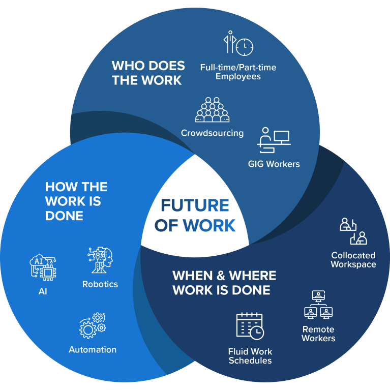
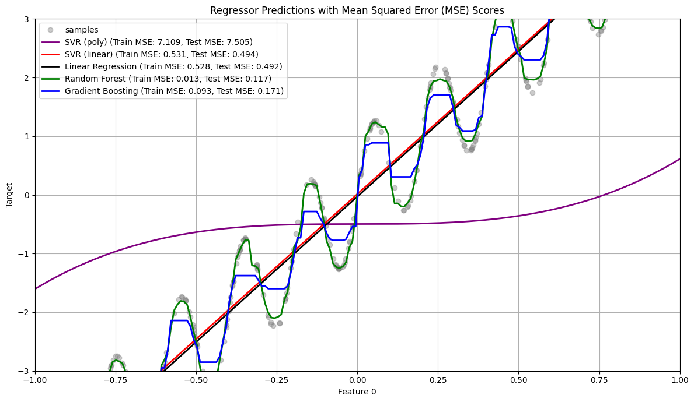

## Agenda

\tableofcontents

# Repaso

## Icebreaker: Trabajo Futuro

{width="50%"}

- ¿Cómo se realizará el trabajo en el futuro y quién lo llevará a cabo?

## Capítulos sobre Similaridad

:::: {.columns}

::: {.column width="50%"}
{width="60%"} \\ Capítulo 12
:::

::: {.column width="50%"}
{width="60%"} \\ Capítulo 6
:::
::::

## Comparación de Algoritmos

Comparación de distintos algoritmos para clasificación

{width="100%"}

## Comparación de Algoritmos

Comparación de distintos algoritmos para regresión

{width="80%"}

# Aprendizaje No Supervisado

## ¿Qué es el Aprendizaje No Supervisado?

- A diferencia del supervisado, no utiliza etiquetas o variables objetivo.
- Se tienen N observaciones $(X_{1},X_{2},...,X_{p})$.
- Objetivo: Análisis exploratorio de datos.
  - Entender la estructura subyacente.
  - Visualizarla y usarla para análisis posteriores.
- Retos: ¿Cómo validar los resultados? ¿Qué características usar?

## Importancia del Aprendizaje No Supervisado

- La mayoría de problemas reales no tienen datos etiquetados.
- Obtener etiquetas es costoso (tiempo y dinero).
- Permite descubrir patrones y estructuras ocultas.

# Clustering

## Introducción al Clustering

- Tarea fundamental del aprendizaje no supervisado.
- Objetivo: encontrar grupos (clusters) de instancias.
- Alta similaridad intra-cluster, baja inter-cluster.
- Usos: segmentación, resumen, preprocesamiento.

## Tipos de Clustering

- **Particional:** cada instancia en un clúster. Ej: K-Means.
- **Jerárquico:** estructura en forma de árbol (dendrograma).
- **Overlapping:** instancias en múltiples clústeres.
- **Fuzzy:** pertenencia parcial a clústeres.

## Algoritmo K-Means

- Método particional popular.
- Requiere $K$ de antemano.
- Cada clúster representado por un centroide.
- Minimiza SSE: suma de distancias cuadradas al centroide.
- Usa heurísticas (es NP-completo).

## K-Means: Proceso Iterativo

1. **Inicialización:** elegir $K$ centroides (aleatorio o K-means++).
1. **Asignación:** cada punto al centroide más cercano.
1. **Actualización:** recalcular centroides.
1. Repetir hasta convergencia.

## K-Means: Seleccionando K (Método del Codo)

- Ejecutar K-means para varios valores de $K$.
- Calcular SSE o similar.
- Graficar métrica vs. $K$.
- Buscar el “codo” de la curva.

## K-Means: Limitaciones

- Sensible a inicialización.
- Puede converger a óptimos locales.
- Problemas con:
  - Clústeres de distintos tamaños, densidades, formas.
  - Presencia de outliers.
- $K$ debe definirse previamente.

## Clustering Jerárquico

- Construye una jerarquía de clústeres (dendrograma).
- No requiere $K$ de antemano.
- **Tipos:**
  - Aglomerativo: bottom-up.
  - Divisivo: top-down.

## Visualización: Dendrograma

{width="80%"}

*Ejemplo de dendrograma en clustering jerárquico*

## DBSCAN (Density-Based Spatial Clustering)

- Algoritmo basado en densidad.
- Agrupa puntos densos, separa por baja densidad.
- Detecta outliers naturalmente.
- **Parámetros:** $\varepsilon$ y MinPts.

## Comparación de Algoritmos de Clustering

- **K-Means:** rápido, sensible a outliers.
- **Jerárquico:** interpretable, más costoso.
- **DBSCAN:** robusto, no necesita $K$, falla con densidades variables.

*La elección depende del problema y los datos.*

## Seleccionando Algoritmos

¿Cómo elijo el algoritmo más adecuado para mis datos?
{width="80%"}

# Ejemplo de Código

## Ejemplo de Código: RAG usando PDF

\begin{lstlisting}[language=Python]
# Extraer y preprocesar el texto del PDF
ruta_pdf = "reglamento.pdf"
print("Extrayendo texto del PDF...")
texto = extraer_texto_pdf(ruta_pdf)
oraciones, oraciones_emb = preprocesar_texto(texto)

# Lanzar interfaz
iface = gr.ChatInterface(chatgpt_clone).launch(debug=True)
\end{lstlisting}

# Cierre

## Resumen y Cierre

- Aprendizaje no supervisado = descubrimiento sin etiquetas.
- Clustering: herramienta fundamental para agrupar.
- Elegir bien el algoritmo = clave del éxito.

**¡Gracias por su atención!**

# Referencias

## References

\nocite{*}
\AtNextBibliography{}
\printbibliography

