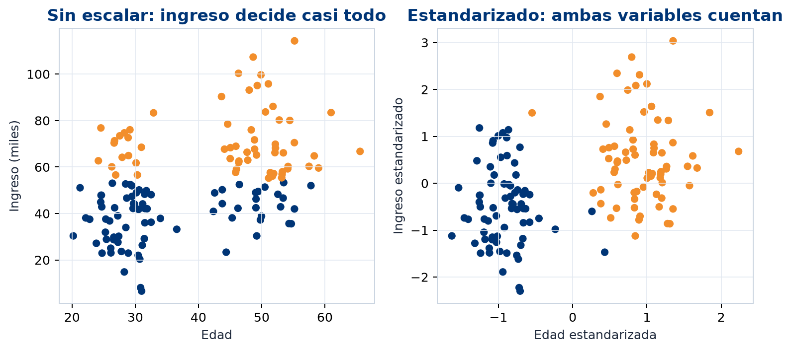
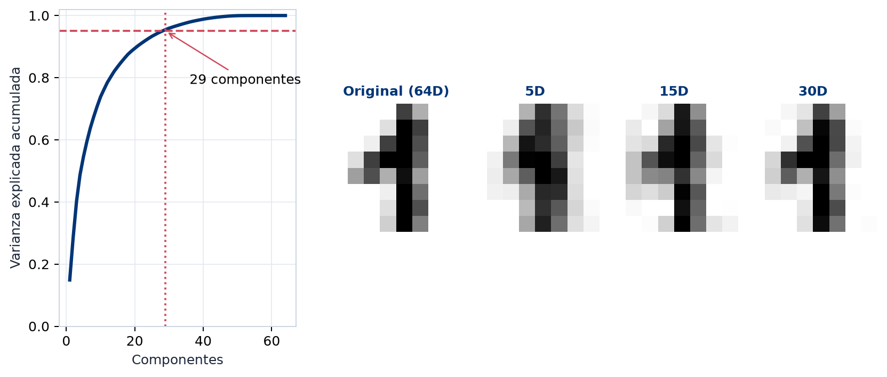
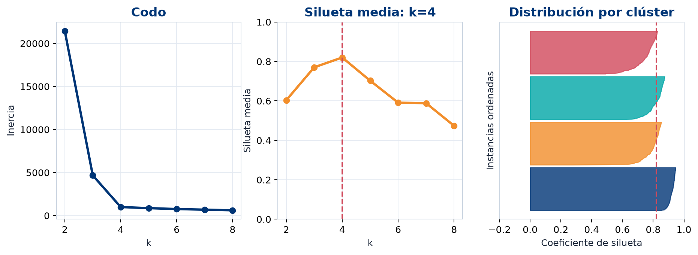
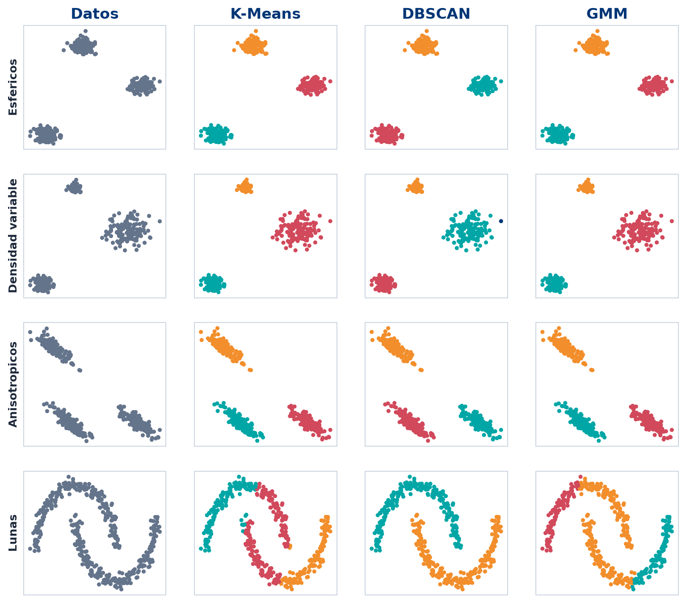
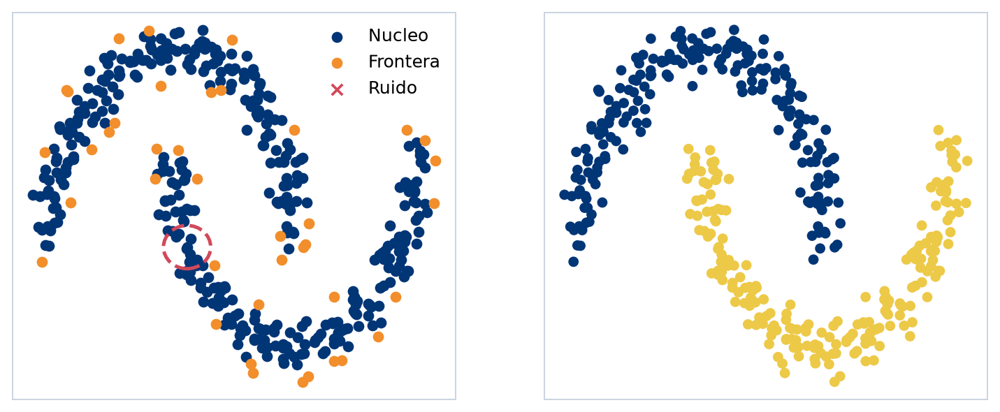
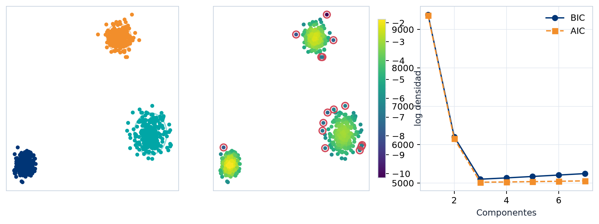
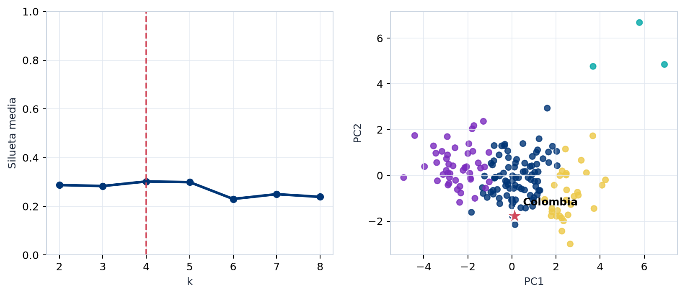
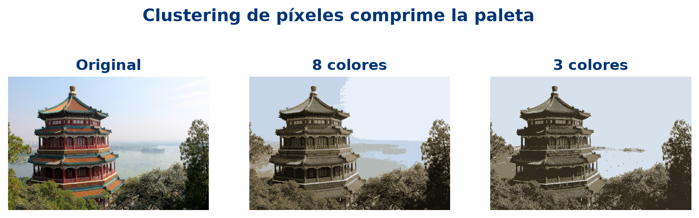

<style>
.reveal figcaption { text-align: center !important; }
.reveal .source-note { font-size: 0.48em; color: #64748b; text-align: center; }
.reveal .compact { font-size: 0.82em; }
.reveal .tiny-code pre code { font-size: 0.68em !important; line-height: 1.25; }
.reveal .columns pre code { font-size: 0.62em !important; line-height: 1.22; }
</style>

# Apertura

## Sin etiquetas cambia la pregunta

:::: {.columns}
::: {.column width="48%"}
**Aprendizaje supervisado**

- Tenemos características $X$ y objetivo $y$.
- Aprendemos a predecir una respuesta conocida.
- Evaluamos contra etiquetas reales.
:::
::: {.column width="48%"}
**Aprendizaje no supervisado**

- Solo observamos las características $X$.
- Buscamos estructura, densidad o anomalías.
- La validación depende del propósito.
:::
::::

## Una sesión, cinco decisiones

| Tiempo | Pregunta central | Herramienta |
|---:|---|---|
| 0–20 min | ¿La distancia aún informa? | Escalamiento y PCA |
| 20–60 min | ¿Dónde están los centros? | K-Means |
| 60–80 min | ¿El agrupamiento es creíble? | Codo y silueta |
| 80–105 min | ¿Y si la geometría cambia? | DBSCAN y GMM |
| 105–120 min | ¿Cómo explicamos los grupos? | Caso de países |

## El capítulo amplía el mapa de ML

Según [@geron2022hands], el aprendizaje no supervisado incluye:

- **Clustering:** agrupar instancias similares.
- **Detección de anomalías:** identificar casos inusuales.
- **Estimación de densidad:** modelar dónde se concentran los datos.
- **Reducción dimensional:** representar con menos variables.

::: {.callout-note icon=false title="Idea guía"}
Un clúster no es una clase descubierta: es una estructura propuesta por datos, variables y algoritmo.
:::

## El problema empieza antes del algoritmo

Una entidad quiere segmentar países para priorizar programas de cooperación.

- ¿Qué significa que dos países sean “similares”?
- ¿Pesan igual mortalidad, ingreso e inflación?
- ¿Cuántos grupos deberían existir?
- ¿Una visualización 2D representa las nueve variables?
- ¿Cómo evitamos convertir un clúster en una etiqueta social?

# PCA: hacer visible la estructura

## Muchas dimensiones erosionan la distancia

- El volumen del espacio crece muy rápido.
- Los datos ocupan una fracción cada vez menor.
- Vecinos cercanos y lejanos se vuelven menos distinguibles.
- Métodos basados en distancia pierden señal.

$$
\text{contraste}=\frac{d_{95}-d_{5}}{\bar d}
$$

## En alta dimensión todo parece igual de lejos

{height="420px" fig-align="center"}

::: {.source-note}
Simulación uniforme reproducible. Generada con `generate_figures.py`.
:::

## Escalar define qué significa “cerca”

:::: {.columns}
::: {.column width="39%"}
```python
from sklearn.preprocessing import StandardScaler

X_scaled = StandardScaler().fit_transform(X)
```

- Sin escalar, domina la variable de mayor magnitud.
- Estandarizar no corrige outliers ni decisiones conceptuales.
:::
::: {.column width="61%"}
{height="330px" fig-align="center"}
:::
::::

## PCA rota los ejes hacia máxima varianza

PCA busca direcciones ortogonales que retengan variación:

$$
\mathbf{z}_1=\mathbf{X}\mathbf{v}_1,
\qquad
\mathbf{v}_1=\arg\max_{\|\mathbf v\|=1}\operatorname{Var}(\mathbf X\mathbf v)
$$

- Cada componente combina variables originales.
- Los componentes se ordenan por varianza explicada.
- Conservar varianza no equivale a conservar clústeres.

## El número de componentes es una decisión

:::: {.columns}
::: {.column width="35%"}
```python
from sklearn.decomposition import PCA

pca = PCA(n_components=0.95)
Z = pca.fit_transform(X_scaled)
X_hat = pca.inverse_transform(Z)
```

`n_components=0.95` conserva al menos 95% de la varianza.
:::
::: {.column width="65%"}
{height="350px" fig-align="center"}
:::
::::

## PCA sirve como lente, no como veredicto

- **Visualización:** proyectar a 2D o 3D para explorar.
- **Compresión:** reducir memoria y costo computacional.
- **Ruido:** descartar direcciones de muy baja varianza.
- **Preprocesamiento:** ayudar a modelos sensibles a dimensión.

::: {.callout-warning icon=false title="Cuidado"}
Una gráfica PCA 2D puede ocultar separaciones —o inventar solapamientos— presentes en más dimensiones.
:::

## Reto 1: ¿escalar o reducir?

Un dataset tiene edad, ingreso, número de compras y 300 embeddings.

1. ¿Qué ocurriría si aplicamos K-Means directamente?
2. ¿Qué variables necesitan escalamiento?
3. ¿Usaría PCA para entrenar, visualizar o ambas?
4. ¿Qué información podría perderse?

::: {.notes}
Tiempo sugerido: 3 minutos en parejas y 2 minutos de discusión.
:::

# K-Means: centros y particiones

## Un clúster depende de la representación

Clustering busca alta similitud interna y separación externa.

- No existe una definición universal de “grupo”.
- Las variables elegidas expresan una hipótesis.
- La métrica convierte esa hipótesis en geometría.
- El algoritmo favorece ciertas formas de clúster.

**Mismos objetos + otras variables = otros clústeres.**

## K-Means minimiza distancia a centroides

Para $K$ grupos $C_1,\dots,C_K$ y centroides $\boldsymbol\mu_k$:

$$
J=\sum_{k=1}^{K}\sum_{\mathbf x_i\in C_k}
\|\mathbf x_i-\boldsymbol\mu_k\|_2^2
$$

- `inertia_` reporta este SSE dentro de los clústeres.
- La media minimiza la suma de distancias cuadradas.
- La geometría favorece grupos convexos y esféricos.

## Lloyd alterna dos pasos simples

:::: {.columns}
::: {.column width="35%"}
```python
while not converged:
    labels = nearest(X, centroids)
    centroids = means(X, labels)
```

1. Asignar al centroide más cercano.
2. Mover cada centroide a la media del grupo.
:::
::: {.column width="65%"}
{height="300px" fig-align="center"}
:::
::::

## Converger no implica el óptimo global

- Cada paso nunca aumenta la inercia.
- Hay un número finito de asignaciones posibles.
- Por eso Lloyd termina, normalmente en pocas iteraciones.
- Pero cada inicio puede producir otra solución.

::: {.callout-note icon=false title="Consecuencia"}
La calidad final debe considerar inicialización, estabilidad y múltiples reinicios.
:::

## K-Means++ dispersa los centros iniciales

```python
from sklearn.cluster import KMeans

kmeans = KMeans(
    n_clusters=4,
    init="k-means++",
    n_init=20,
    random_state=42,
)
labels = kmeans.fit_predict(X_scaled)
```

`k-means++` favorece nuevos centros alejados de los ya escogidos.

## Las etiquetas no tienen orden

- Los identificadores `0, 1, 2...` son nombres arbitrarios.
- Dos ejecuciones pueden permutar los números de clúster.
- El clúster 2 no es “mayor” que el clúster 1.
- La interpretación se construye desde los perfiles.

::: {.callout-warning icon=false title="Comparación correcta"}
Para estudiar estabilidad, use métricas invariantes a permutaciones o alinee las particiones.
:::

## Hard clustering asigna; afinidad aproxima

:::: {.columns}
::: {.column width="48%"}
**Asignación dura**

```python
labels = kmeans.predict(X_new)
```

Cada instancia recibe un único clúster.
:::
::: {.column width="48%"}
**Distancias a centroides**

```python
distances = kmeans.transform(X_new)
```

Cada instancia obtiene $K$ distancias.
:::
::::

## K-Means también crea características

Si existen $K$ centroides, `transform()` produce $K$ distancias:

$$
\mathbf x_i \longrightarrow (d_{i1},d_{i2},\ldots,d_{iK})
$$

- Puede resumir miles de variables en $K$ afinidades.
- Puede añadir señales no lineales a un modelo supervisado.
- Debe ajustarse solo con datos de entrenamiento.

## Más clústeres siempre reducen la inercia

- Con $K=1$, todos los puntos comparten centroide.
- Al aumentar $K$, ningún punto queda obligado a alejarse.
- Con $K=n$, la inercia puede llegar a cero.
- Por tanto, minimizar inercia no selecciona por sí solo a $K$.

**Buscamos rendimiento decreciente y separación.**

## Codo y silueta responden cosas distintas

:::: {.columns}
::: {.column width="34%"}
```python
for k in range(2, 9):
    model = KMeans(
        k, n_init=20,
        random_state=42)
    labels = model.fit_predict(X)
    inertia.append(model.inertia_)
    silhouette.append(
        silhouette_score(X, labels))
```
:::
::: {.column width="66%"}
{height="340px" fig-align="center"}
:::
::::

## La silueta contrasta cohesión y separación

Para la instancia $i$:

$$
s(i)=\frac{b(i)-a(i)}{\max\{a(i),b(i)\}}
$$

- $a(i)$: distancia media al propio clúster.
- $b(i)$: menor distancia media a otro clúster.
- Cerca de $1$: asignación clara; cerca de $0$: frontera.
- Valor negativo: otro clúster parece más cercano.

## Una métrica interna no descubre la verdad

- Codo y silueta premian estructuras específicas.
- Estabilidad ante remuestreo aporta otra evidencia.
- El dominio determina si un grupo es útil.
- Si existen etiquetas externas, sirven para evaluación.
- El mejor $K$ estadístico puede no ser accionable.

## K-Means falla si el centro no representa

{height="430px" fig-align="center"}

::: {.source-note}
Blobs, densidad variable, datos anisotrópicos y lunas. Generada con `generate_figures.py`.
:::

## Reto 2: defender un valor de K

| Modelo | Inercia | Silueta | Interpretación |
|---|---:|---:|---|
| $K=3$ | 810 | 0.62 | Tres segmentos accionables |
| $K=4$ | 690 | 0.64 | Divide un segmento en grupos pequeños |

¿Cuál escogería y qué evidencia adicional pediría antes de actuar?

# DBSCAN: densidad y ruido

## DBSCAN conecta regiones densas

- **Núcleo:** al menos `min_samples` dentro de `eps`.
- **Frontera:** vecino de un núcleo, sin densidad propia.
- **Ruido:** no es núcleo ni frontera.
- Los núcleos alcanzables forman un clúster.

**No exige $K$ y permite formas no convexas.**

## Epsilon convierte vecindad en clúster

:::: {.columns}
::: {.column width="34%"}
```python
from sklearn.cluster import DBSCAN

dbscan = DBSCAN(
    eps=0.22,
    min_samples=8,
)
labels = dbscan.fit_predict(X_scaled)
```

La etiqueta `-1` identifica ruido.
:::
::: {.column width="66%"}
{height="340px" fig-align="center"}
:::
::::

## DBSCAN cambia sensibilidad por flexibilidad

- `eps` pequeño fragmenta grupos y produce ruido.
- `eps` grande puede conectar grupos diferentes.
- Densidades variables dificultan un único `eps`.
- En alta dimensión, las distancias se concentran.
- Scikit-Learn no ofrece `predict()` para nuevos puntos.

::: {.callout-note icon=false title="Alternativa"}
HDBSCAN extiende la idea a densidades variables y selecciona grupos persistentes.
:::

# GMM: pertenencia probabilística

## GMM modela clústeres elipsoidales

$$
p(\mathbf x)=\sum_{k=1}^{K}\pi_k\,
\mathcal N(\mathbf x\mid\boldsymbol\mu_k,\boldsymbol\Sigma_k)
$$

- $\pi_k$: peso del componente.
- $\boldsymbol\mu_k$: centro.
- $\boldsymbol\Sigma_k$: tamaño, forma y orientación.

## La covarianza controla la geometría

| `covariance_type` | Forma permitida |
|---|---|
| `spherical` | Esferas con radios diferentes |
| `diag` | Elipses alineadas con los ejes |
| `tied` | Una covarianza compartida |
| `full` | Forma y orientación por componente |

Más flexibilidad implica más parámetros y riesgo de sobreajuste.

## EM alterna responsabilidades y parámetros

1. **E-step:** estima $P(z_i=k\mid \mathbf x_i)$.
2. **M-step:** actualiza pesos, medias y covarianzas.
3. Repite hasta estabilizar la log-verosimilitud.

::: {.callout-note icon=false title="Relación con K-Means"}
Ambos alternan asignar y actualizar; GMM conserva incertidumbre y aprende la forma de cada componente.
:::

## GMM une clustering, densidad y anomalías

:::: {.columns}
::: {.column width="32%"}
```python
from sklearn.mixture import GaussianMixture

gmm = GaussianMixture(
    n_components=3,
    n_init=10,
    random_state=42,
).fit(X)

proba = gmm.predict_proba(X)
log_density = gmm.score_samples(X)
```
:::
::: {.column width="68%"}
{height="335px" fig-align="center"}
:::
::::

## Anomalía y novedad no son sinónimos

- **Anomalías:** el entrenamiento puede contener outliers.
- **Novedad:** el entrenamiento representa casos normales.
- Un umbral de baja densidad convierte puntajes en alertas.
- El umbral depende del costo de falsos positivos y negativos.

**Una observación rara no es automáticamente error ni fraude.**

## El algoritmo debe coincidir con la estructura

| Pregunta | K-Means | DBSCAN | GMM |
|---|:---:|:---:|:---:|
| ¿Requiere $K$? | Sí | No | Sí |
| ¿Tolera formas no convexas? | No | Sí | Parcial |
| ¿Marca ruido? | No | Sí | Por densidad |
| ¿Da probabilidades? | No | No | Sí |
| ¿Escala a muchos datos? | Muy bien | Depende | Moderado |

## Reto 3: diagnosticar geometrías

Seleccione algoritmo y justifique:

1. Antenas agrupadas en regiones compactas y masivas.
2. Trayectorias GPS formando corredores curvos con ruido.
3. Pacientes con perfiles elipsoidales solapados.
4. Transacciones donde interesa una puntuación de rareza.

# Caso integrador: países

## La pregunta guía el pipeline

**Propósito:** explorar perfiles socioeconómicos, no clasificar países.

- Leer el diccionario antes de usar las columnas.
- Auditar faltantes, escalas, asimetrías y outliers.
- Imputar sin una variable objetivo.
- Estandarizar las nueve variables numéricas.
- Comparar $K=2,\ldots,8$ y documentar la decisión.

## El pipeline explicita el preprocesamiento

```python
from sklearn.pipeline import make_pipeline
from sklearn.impute import SimpleImputer
from sklearn.preprocessing import StandardScaler
from sklearn.cluster import KMeans

model = make_pipeline(
    SimpleImputer(strategy="median"),
    StandardScaler(),
    KMeans(n_clusters=k, n_init=30, random_state=42),
)
labels = model.fit_predict(X)
```

## PCA muestra la partición sin crearla

{height="410px" fig-align="center"}

::: {.source-note}
K-Means usa todas las variables; PCA solo proyecta. Datos: repositorio `javeriana-analitica`.
:::

## Los centroides se convierten en perfiles

{height="400px" fig-align="center"}

::: {.source-note}
Valores sobre cero superan el promedio global estandarizado. Generada con `generate_figures.py`.
:::

## Interpretar exige unidades originales

```python
scaler = model.named_steps["standardscaler"]
kmeans = model.named_steps["kmeans"]
centroids_original = scaler.inverse_transform(
    kmeans.cluster_centers_
)
```

- Nombrar perfiles después de observar todas las variables.
- Reportar países centrales y casos fronterizos.
- Evitar nombres valorativos como “buenos” o “malos”.

## Colombia es observación, no conclusión

1. ¿Qué variables acercan Colombia a su centroide?
2. ¿Qué tan lejos está del segundo centroide?
3. ¿La asignación cambia con otra semilla o $K$ vecino?
4. ¿La posición 2D coincide con el espacio completo?
5. ¿Qué decisiones no deben basarse solo en el clúster?

## Un árbol explica fronteras aproximadas

```python
from sklearn.tree import DecisionTreeClassifier

surrogate = DecisionTreeClassifier(
    max_depth=3,
    min_samples_leaf=8,
    random_state=42,
).fit(X_scaled, labels)

fidelity = surrogate.score(X_scaled, labels)
```

El árbol aproxima K-Means; no descubre una etiqueta verdadera.

## Segmentar países exige cautela

- Los grupos dependen de variables, año y algoritmo.
- Un nombre puede convertir descripción en estigma.
- Promedios nacionales esconden desigualdad interna.
- Clústeres pequeños pueden revelar casos sensibles.
- Toda decisión necesita revisión humana y contexto.

::: {.callout-warning icon=false title="Principio"}
Use clustering para formular mejores preguntas, no para fabricar certezas.
:::

## Cierre: cuatro ideas para llevar

1. **La representación manda:** escala y dimensión definen cercanía.
2. **K-Means inicia:** es rápido, claro y geométricamente limitado.
3. **Evaluar triangula:** métricas, estabilidad y utilidad de dominio.
4. **DBSCAN y GMM cambian el supuesto:** densidad e incertidumbre.

**Próximo paso:** Tarea 6 — defender una segmentación reproducible.

# Anexos

## MiniBatch cambia precisión por velocidad

{height="390px" fig-align="center"}

```python
MiniBatchKMeans(n_clusters=k, batch_size=1024,
                n_init=5, random_state=42)
```

::: {.source-note}
Los tiempos dependen del equipo. Generada con `generate_figures.py`.
:::

## Segmentar imágenes agrupa colores

{height="390px" fig-align="center"}

- Cada píxel es un vector RGB.
- K-Means aprende una paleta de $K$ centroides.
- Cada color se reemplaza por su centroide.

::: {.source-note}
Imagen incluida en Scikit-Learn. Generada con `generate_figures.py`.
:::

## Propagar etiquetas multiplica supervisión

1. Agrupar todos los datos sin etiquetas.
2. Elegir representantes cercanos a cada centroide.
3. Pedir a una persona experta que los etiquete.
4. Propagar la etiqueta a regiones confiables.
5. Entrenar y validar un modelo supervisado.

**Riesgo:** un clúster impuro propaga errores sistemáticos.

## Aprendizaje activo pregunta donde duda

1. Entrenar con las pocas etiquetas disponibles.
2. Puntuar incertidumbre en datos sin etiquetar.
3. Solicitar etiquetas para los casos más dudosos.
4. Reentrenar y repetir hasta agotar presupuesto.

Combinar representatividad e incertidumbre evita casos redundantes.

## Otros algoritmos cubren otras estructuras

| Algoritmo | Fortaleza principal |
|---|---|
| Aglomerativo | Jerarquía y dendrograma |
| BIRCH | Flujos o datasets grandes |
| Mean Shift | Modos de densidad sin fijar $K$ |
| Affinity Propagation | Selección de ejemplares |
| Spectral Clustering | Formas conectadas no convexas |

## AIC y BIC seleccionan componentes

$$
\operatorname{AIC}=2p-2\log\hat L,
\qquad
\operatorname{BIC}=p\log n-2\log\hat L
$$

- Premian ajuste y penalizan parámetros.
- BIC suele favorecer modelos más simples.
- Compare también estabilidad e interpretación.

## Bayesian GMM apaga componentes

```python
from sklearn.mixture import BayesianGaussianMixture

bgm = BayesianGaussianMixture(
    n_components=10,
    weight_concentration_prior=0.01,
    n_init=10,
    random_state=42,
).fit(X)
```

Componentes con peso casi cero quedan inactivos.

## Hay múltiples detectores de anomalías

| Método | Intuición |
|---|---|
| Isolation Forest | Lo raro se aísla en pocos cortes |
| Local Outlier Factor | Menor densidad que sus vecinos |
| One-Class SVM | Frontera alrededor de lo normal |
| PCA | Mayor error de reconstrucción |
| GMM | Región de baja densidad |

## Olivetti integra el capítulo completo

Ejercicios de [@geron2022hands]:

1. Agrupar y visualizar rostros por clúster.
2. Usar afinidades K-Means como reducción.
3. Generar rostros con GMM después de PCA.
4. Detectar transformaciones como anomalías.
5. Comparar densidad GMM y reconstrucción PCA.

## PCA también se obtiene mediante SVD

Para datos centrados $\mathbf X$:

$$
\mathbf X=\mathbf U\boldsymbol\Sigma\mathbf V^\top
$$

- $\mathbf V$ contiene direcciones principales.
- $\boldsymbol\Sigma^2/(n-1)$ contiene varianzas.
- Las primeras $d$ columnas dan una aproximación de rango $d$.

## Trazabilidad de los materiales

| Fuente anterior | Integración nueva |
|---|---|
| Introducción no supervisada | Distancia, K-Means, codo y silueta |
| Algoritmos de clustering | MiniBatch, DBSCAN, GMM y comparación |
| Reducción dimensional | Maldición dimensional, PCA y reconstrucción |
| Capítulo 9 | Aplicaciones, densidad y anomalías |

Las capturas antiguas se sustituyeron por figuras reproducibles.

## Reproducir las figuras

Desde `quarto/clustering`:

```bash
python generate_figures.py --all
```

Una figura específica:

```bash
python generate_figures.py --figure k_selection
```

Requiere NumPy, pandas, Matplotlib, SciPy y Scikit-Learn.

## Referencias

::: {style="font-size: 0.68em;"}
::: {#refs}
:::
:::
