<style>
.reveal figcaption { text-align: center !important; }
.reveal .source-note { font-size: 0.48em; color: #64748b; text-align: center; }
.reveal .compact { font-size: 0.82em; }
.reveal .small { font-size: 0.72em; }
.reveal .tiny-code pre code { font-size: 0.68em !important; line-height: 1.25; }
.reveal .columns pre code { font-size: 0.62em !important; line-height: 1.22; }
.reveal .activity-instructions { font-size: 0.68em; }
.reveal .answer { color: #003576; font-size: 1.18em; font-weight: 700; text-align: center; }
</style>

# Una pregunta difícil

## ¿Qué país se parece más a Colombia?

::: {.compact}
**Predicción inicial — 90 segundos**

1. Escriba un país sin consultar los datos.
2. Anote las características que sustentan su elección.
3. Vote: ¿Ecuador, Perú, México, otro país?

Guardaremos la respuesta. Todavía no sabemos qué significa **parecido**.
:::

## La pregunta está incompleta

:::: {.columns}
::: {.column width="48%"}
**¿Parecido respecto a qué?**

- Economía
- Salud
- Demografía
- Comercio
:::
::: {.column width="48%"}
**¿Parecido para qué?**

- Diseñar una política
- Comparar un mercado
- Buscar un referente
- Detectar una anomalía
:::
::::

## Toda respuesta necesita un propósito

::: {.answer}
Colombia se parece a ______

respecto a ______

para decidir ______.
:::

::: {.fragment}
Las variables expresan una hipótesis; la distancia la convierte en geometría.
:::

## Solo podemos comparar lo observado

::: {style="font-size: 0.72em;"}
| Dimensión | Variables disponibles |
|---|---|
| Salud | Mortalidad infantil, gasto en salud, esperanza de vida |
| Demografía | Fertilidad total |
| Ingreso | Ingreso por persona, PIB per cápita |
| Comercio | Exportaciones e importaciones |
| Estabilidad | Inflación |
:::

No observamos cultura, idioma, instituciones, desigualdad interna ni geografía.

# Primera respuesta: dos variables

## Dos variables permiten empezar

Usaremos una representación deliberadamente simple:

$$
\mathbf{x}_{país}=(\text{PIB per cápita},\ \text{mortalidad infantil})
$$

**Pregunta:** ¿qué significa que dos países estén cerca en este plano?

::: {.fragment}
Que difieren poco en esas dos mediciones, según la escala y métrica elegidas.
:::

## ¿Sumar importa igual que multiplicar?

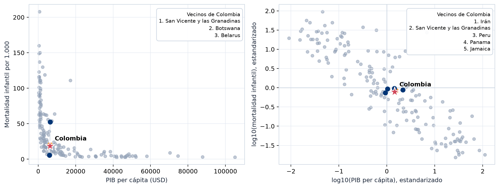{height="410px" fig-align="center"}

::: {.source-note}
167 países. Cálculo reproducible en `country_narrative.py`.
:::

## La escala cambia el vecino

:::: {.columns}
::: {.column width="48%"}
**Unidades originales**

PIB per cápita domina la distancia.

Colombia → **San Vicente y las Granadinas**
:::
::: {.column width="48%"}
**Logaritmo + estandarización**

Primero compara cambios relativos; luego iguala dispersión.

Colombia → **Irán**
:::
::::

## Log + estándar define la geometría

$$
u_{ij}=\log_{10}(x_{ij}),
\qquad z_{ij}=\frac{u_{ij}-\bar u_j}{s_{u_j}}
$$

- El logaritmo comprime colas derechas.
- Diferencias logarítmicas representan razones.
- Estandarizar vuelve comparables las dispersiones.
- No demuestra que la distancia euclidiana sea adecuada.

## Irán es una respuesta correcta…

::: {.answer}
Respecto a PIB per cápita y mortalidad infantil con log + estándar,

el vecino de Colombia es Irán.
:::

::: {.fragment}
**Objeción:** ¿qué ocurrió con las otras siete variables?
:::

# PCA: mirar nueve variables

## Nueve dimensiones no caben en la pantalla

- Con dos variables podemos dibujar un plano.
- Con nueve variables podemos calcular distancias.
- Pero no podemos observar directamente el vecindario.
- Escoger dos columnas descartaría información por decisión humana.

**¿Podemos construir dos ejes usando las nueve variables?**

## PCA construye nuevas direcciones

PCA busca ejes ortogonales de máxima varianza:

$$
\mathbf z_1=\mathbf X\mathbf v_1,
\qquad
\mathbf v_1=\arg\max_{\|\mathbf v\|=1}\operatorname{Var}(\mathbf X\mathbf v)
$$

Cada componente es una combinación de las variables originales.

## PCA no selecciona dos columnas

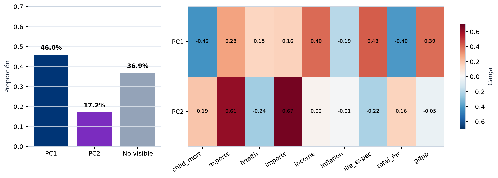{height="400px" fig-align="center"}

::: {.source-note}
PCA ajustado sobre las nueve variables estandarizadas.
:::

## El mapa conserva 63,1% de la variación

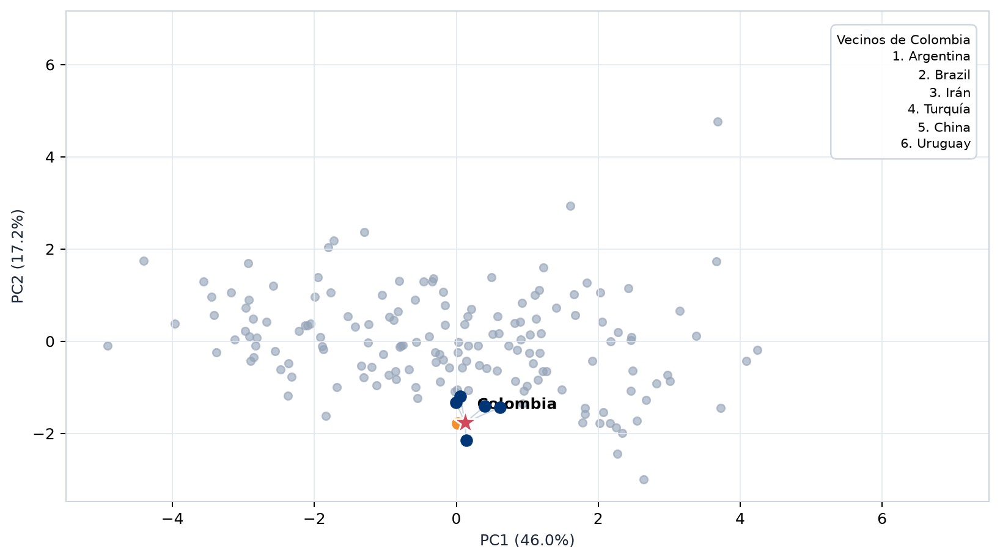{height="415px" fig-align="center"}

::: {.source-note}
PC1 = 46,0%; PC2 = 17,2%. Colombia → Argentina en la proyección.
:::

## ¿PCA encontró el vecino verdadero?

::: {style="font-size: 0.78em;"}
| Espacio usado para medir | Vecino de Colombia |
|---|---|
| PIB y mortalidad con log + estándar | Irán |
| Dos componentes principales | Argentina |
| Nueve variables estandarizadas | Turquía |
:::

::: {.fragment}
PCA 2D ocultó 36,9% de la varianza; el mapa cambió el vecindario.
:::

## PCA permite ver; no decide la verdad

:::: {.columns}
::: {.column width="48%"}
**Para visualizar**

- Proyectar países y modelos a 2D.
- Explorar estructura y casos extremos.
- Comunicar patrones.
:::
::: {.column width="48%"}
**Para modelar**

- Conservar más componentes si se requiere.
- Validar qué información se pierde.
- No confundir varianza con utilidad.
:::
::::

## Actividad: construya una proyección

:::: {.columns}
::: {.column width="63%"}
[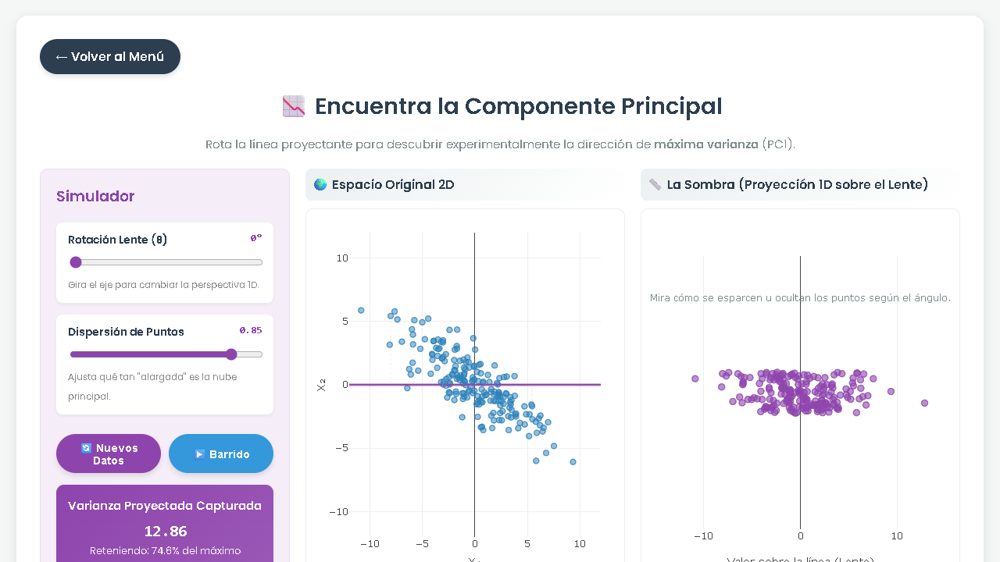{height="335px" fig-align="center"}](https://oscar-bustos.github.io/javeriana-tallerml/reduccion_dimension/pca.html){target="_blank"}
:::
::: {.column .activity-instructions width="37%"}
**Reto guiado — 7 min**

1. Cambie la dirección proyectada.
2. Compare la vista 2D y 1D.
3. Identifique qué se conserva.
4. Explique qué se pierde.

🔗 [Abrir PCA](https://oscar-bustos.github.io/javeriana-tallerml/reduccion_dimension/pca.html){target="_blank"}
:::
::::

# K-Means: de vecinos a perfiles

## Un vecino responde una pregunta local

:::: {.columns}
::: {.column width="48%"}
**Vecino más cercano**

- Recupera un caso individual.
- Depende de variables y distancia.
- Colombia → Turquía en 9D.
:::
::: {.column width="48%"}
**Clustering**

- Resume toda la colección.
- Busca perfiles globales.
- Requiere supuestos adicionales.
:::
::::

**¿Cómo resumiríamos 167 países con pocos prototipos?**

## K-Means representa cada grupo por su media

Para grupos $C_1,\dots,C_K$ y centroides $\boldsymbol\mu_k$:

$$
J=\sum_{k=1}^{K}\sum_{\mathbf x_i\in C_k}
\|\mathbf x_i-\boldsymbol\mu_k\|_2^2
$$

La media minimiza la suma de distancias cuadradas dentro del grupo.

## Lloyd alterna dos preguntas

:::: {.columns}
::: {.column width="35%"}
```python
while not converged:
    labels = nearest(
        X, centroids)
    centroids = means(
        X, labels)
```

1. ¿Cuál centro está más cerca?
2. ¿Dónde queda la nueva media?
:::
::: {.column width="65%"}
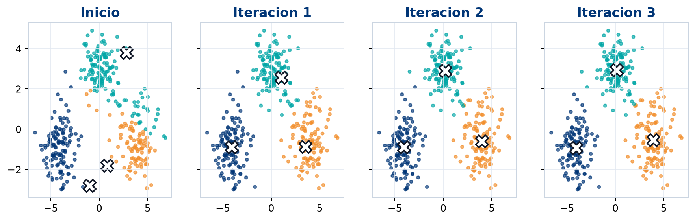{height="285px" fig-align="center"}
:::
::::

## Actividad: controle los centroides

:::: {.columns}
::: {.column width="63%"}
[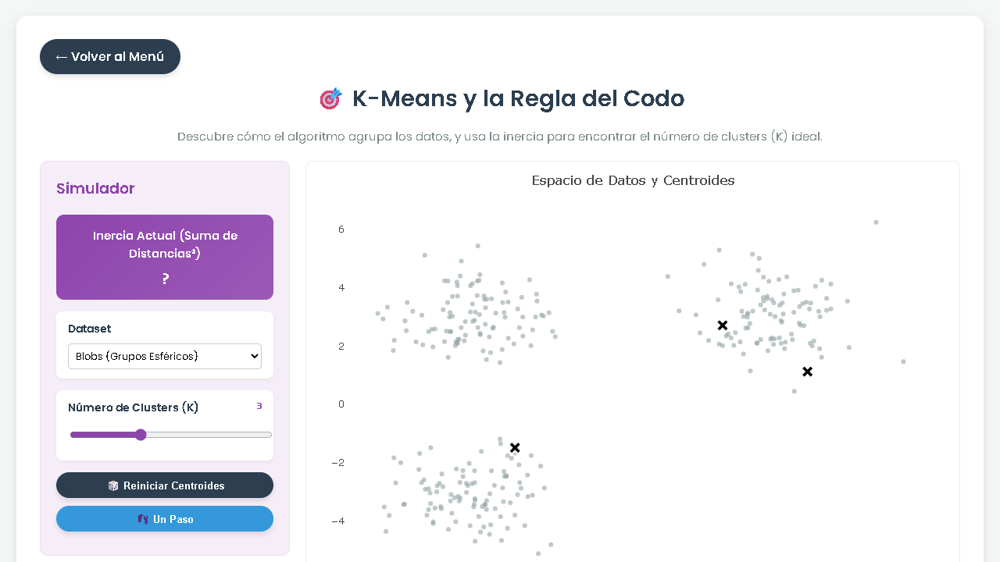{height="335px" fig-align="center"}](https://oscar-bustos.github.io/javeriana-tallerml/clustering/kmeans.html){target="_blank"}
:::
::: {.column .activity-instructions width="37%"}
**Reto guiado — 7 min**

1. Cambie el número de grupos.
2. Reinicie los centroides.
3. Observe las asignaciones.
4. Compare inercia e iteraciones.

🔗 [Abrir K-Means](https://oscar-bustos.github.io/javeriana-tallerml/clustering/kmeans.html){target="_blank"}
:::
::::

## ¿Cuántos perfiles debemos pedir?

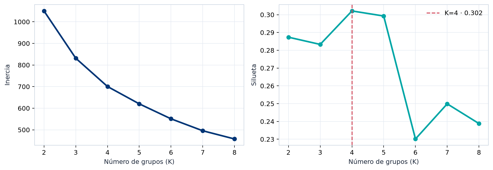{height="390px" fig-align="center"}

::: {.source-note}
Modelos K-Means sobre las nueve variables estandarizadas; 30 reinicios por K.
:::

## Las métricas no reemplazan el propósito

- La inercia siempre disminuye al aumentar $K$.
- La silueta compara cohesión y separación.
- En estos datos, la silueta máxima ocurre en $K=4$.
- Su valor es solo **0,302**: la separación no es fuerte.
- También necesitamos estabilidad e interpretación.

## K-Means agrupa en 9D

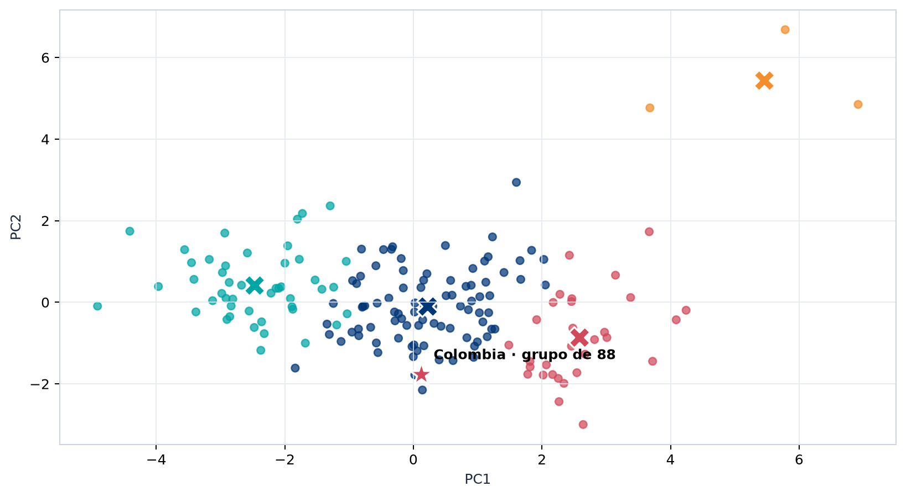{height="410px" fig-align="center"}

::: {.source-note}
El modelo usa las nueve variables; PCA solo proyecta etiquetas y centroides.
:::

## Colombia comparte perfil con 87 países

Para $K=4$:

- Colombia pertenece a un grupo de **88 países**.
- Turquía es su vecino más cercano dentro del espacio completo.
- Uruguay, Brasil, Ecuador y R. Dominicana también están cerca.
- El identificador del grupo es arbitrario.

**¿Un grupo tan grande constituye una respuesta útil?**

## Los centroides convierten grupos en perfiles

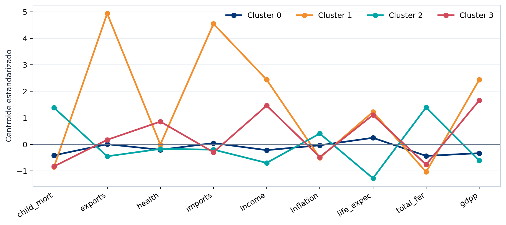{height="380px" fig-align="center"}

::: {.source-note}
Valores positivos superan el promedio global estandarizado.
:::

## K-Means siempre obliga a escoger

:::: {.columns}
::: {.column width="48%"}
**País central**

Está claramente cerca de un centroide.

La etiqueta parece razonable.
:::
::: {.column width="48%"}
**País fronterizo**

Está casi a igual distancia de dos centroides.

K-Means igualmente asigna una sola etiqueta.
:::
::::

**¿Podemos conservar la incertidumbre?**

# GMM: pertenencia probabilística

## Una frontera puede ser gradual

En lugar de una etiqueta única, buscamos:

$$
P(z_i=k\mid\mathbf x_i)
$$

**Pregunta:** ¿qué significaría que un país tenga 54% de afinidad con un perfil y 46% con otro?

## GMM modela una mezcla de poblaciones

$$
p(\mathbf x)=\sum_{k=1}^{K}\pi_k\,
\mathcal N(\mathbf x\mid\boldsymbol\mu_k,\boldsymbol\Sigma_k)
$$

- $\pi_k$: prevalencia del componente.
- $\boldsymbol\mu_k$: centro.
- $\boldsymbol\Sigma_k$: tamaño, forma y orientación.

## GMM permite expresar duda

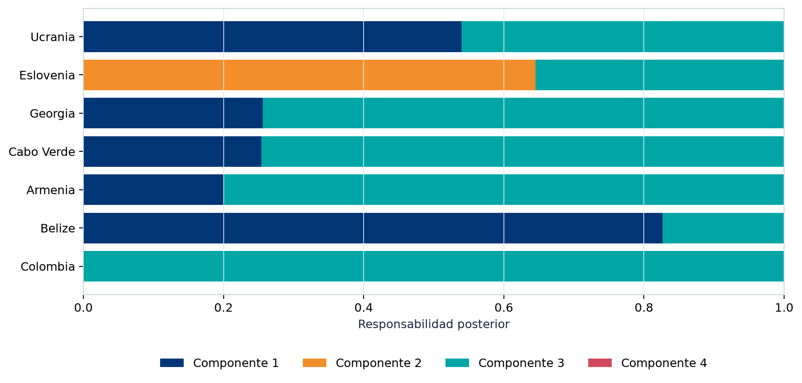{height="390px" fig-align="center"}

::: {.source-note}
GMM de cuatro componentes y covarianza completa, ajustado en 9D.
:::

## La incertidumbre también es un resultado

- Ucrania queda aproximadamente 54% frente a 46%.
- Eslovenia queda aproximadamente 65% frente a 35%.
- Colombia tiene responsabilidad máxima de **99,98%**.
- GMM permite pertenencia suave; no obliga a que exista duda.

**¿Qué capacidad adicional aporta la covarianza?**

## Las elipses resuelven la anisotropía

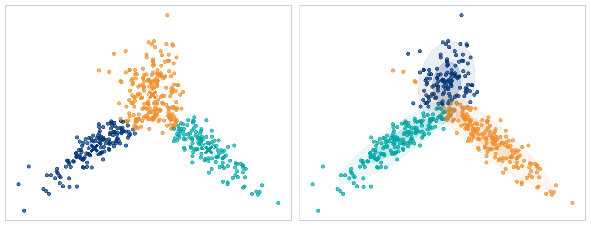{height="390px" fig-align="center"}

::: {.source-note}
Simulación reproducible con grupos elipsoidales y orientaciones diferentes.
:::

## GMM cambia dos supuestos de K-Means

::: {style="font-size: 0.78em;"}
| Supuesto | K-Means | GMM con covarianza completa |
|---|---|---|
| Pertenencia | Una etiqueta | Probabilidades |
| Geometría | Cercanía euclidiana al centro | Elipses orientadas |
| Tamaño del grupo | Implícitamente similar | Puede variar |
| Número de grupos | Requiere $K$ | Requiere componentes |
:::

## ¿Una galaxia es una elipse?

Una sola gaussiana no representa bien:

- Brazos espirales.
- Anillos.
- Medias lunas.
- Corredores curvos.

**¿Podemos definir un grupo mediante conectividad densa y no mediante un centro?**

# DBSCAN: densidad y ruido

## Un clúster no siempre tiene centro

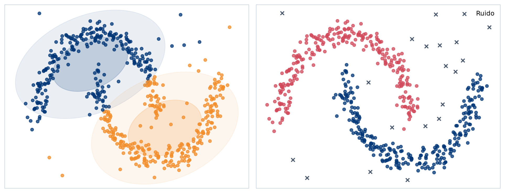{height="410px" fig-align="center"}

::: {.source-note}
Lunas con ruido: simulación determinista en `country_narrative.py`.
:::

## DBSCAN convierte vecindad en estructura

- **Núcleo:** al menos `min_samples` puntos dentro de `eps`.
- **Frontera:** vecino de un núcleo, sin densidad propia.
- **Ruido:** no es núcleo ni frontera.
- Los núcleos densamente alcanzables forman un clúster.

**No exige $K$ y admite formas no convexas.**

## Dos parámetros expresan una escala

:::: {.columns}
::: {.column width="42%"}
```python
from sklearn.cluster import DBSCAN

model = DBSCAN(
    eps=0.16,
    min_samples=8,
)
labels = model.fit_predict(X)
```
:::
::: {.column width="55%"}
**Preguntas**

- ¿Qué significa ser vecino?
- ¿Cuánta evidencia crea un núcleo?
- ¿Cuándo un punto debe ser ruido?
:::
::::

## DBSCAN tampoco es una respuesta universal

- `eps` pequeño fragmenta grupos.
- `eps` grande conecta estructuras distintas.
- Un único `eps` falla con densidades variables.
- En alta dimensión reaparece la concentración de distancias.
- Scikit-Learn no ofrece `predict()` para nuevos puntos.

HDBSCAN puede extender la idea a densidades variables.

# Resolver significa explicitar supuestos

## Cada método repara una limitación

::: {style="font-size: 0.72em;"}
| Pregunta que queda abierta | Herramienta siguiente |
|---|---|
| ¿Cómo comparar unidades distintas? | Estandarización |
| ¿Cómo mirar nueve variables? | PCA |
| ¿Cómo pasar de vecinos a perfiles? | K-Means |
| ¿Cómo representar duda y anisotropía? | GMM |
| ¿Cómo encontrar formas sin centro y ruido? | DBSCAN |
:::

Ninguna herramienta elimina la necesidad de formular el propósito.

## La respuesta cambia con “respecto a”

::: {style="font-size: 0.70em;"}
| Respecto a… | País más cercano a Colombia |
|---|---|
| PIB y mortalidad infantil, log + estándar | Irán |
| Salud y demografía | Barbados |
| Macroeconomía y comercio | China |
| PCA 2D de las nueve variables | Argentina |
| Nueve variables estandarizadas | Turquía |
:::

Todos los resultados provienen del mismo dataset.

## ¿Cuál respuesta es correcta?

::: {.answer}
Todas pueden ser correctas bajo una definición particular.

Ninguna es universal.
:::

::: {.fragment}
El algoritmo no descubre qué significa “parecido”; nosotros lo declaramos.
:::

## Cierre: complete la afirmación

::: {.answer}
Para decidir __________,

compararé a Colombia respecto a __________.

Bajo esa representación, el país más parecido es __________.
:::

## Cuatro ideas para llevar

1. **La representación manda:** variables y escala definen cercanía.
2. **PCA es un mapa:** conserva varianza, pero pierde información.
3. **Cada modelo supone una geometría:** centros, elipses o densidad.
4. **Un clúster es una hipótesis:** debe ser útil, estable e interpretable.

## Segmentar países exige cautela

- Los grupos dependen de variables, año y algoritmo.
- Promedios nacionales esconden desigualdad interna.
- Los nombres valorativos convierten descripción en estigma.
- Una similitud estadística no implica equivalencia histórica.
- Toda decisión necesita revisión humana y contexto.

**Use clustering para formular mejores preguntas, no para fabricar certezas.**

## Tarea: defender una segmentación

1. Auditar las nueve variables y justificar el preprocesamiento.
2. Comparar $K=2,\ldots,8$ con inercia, silueta y estabilidad.
3. Visualizar con PCA sin confundir proyección y entrenamiento.
4. Interpretar perfiles en unidades originales.
5. Completar “parecido respecto a ___ para decidir ___”.

Consulte las instrucciones completas en `homework/Tarea6_KMeans.md`.

## Tarea: lecturas y NotebookLM

- **Obligatorio:** capítulo 9 de *Hands-On Machine Learning* [@geron2022hands].
- **Recomendado:** capítulo 8 sobre reducción dimensional.
- **Opcional:** capítulo 12 de *Introduction to Statistical Learning*.
- [Cuaderno de NotebookLM](https://notebook.google.com/notebook/e3bb0fa0-71fc-49af-ad7a-7b3a57cb6f82){target="_blank"}: infografía, quices y podcast.

# Anexos

## Muchas dimensiones erosionan la distancia

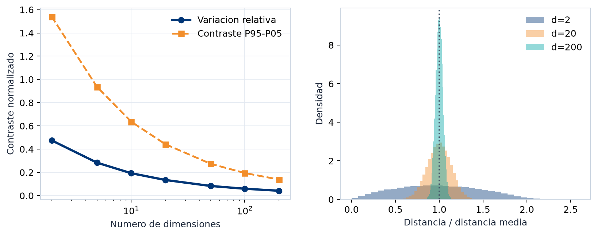{height="390px" fig-align="center"}

::: {.source-note}
Simulación uniforme reproducible. Generada con `generate_figures.py`.
:::

## Converger no implica el óptimo global

- Cada paso de Lloyd nunca aumenta la inercia.
- Hay un número finito de asignaciones posibles.
- El algoritmo termina en un óptimo local.
- Distintos inicios pueden producir otras soluciones.

```python
KMeans(n_clusters=4, init="k-means++",
       n_init=30, random_state=42)
```

## La silueta contrasta dos distancias

Para la instancia $i$:

$$
s(i)=\frac{b(i)-a(i)}{\max\{a(i),b(i)\}}
$$

- $a(i)$: distancia media al propio clúster.
- $b(i)$: menor distancia media a otro clúster.
- Cerca de 1 indica una asignación clara.

## Las etiquetas no tienen orden

- Los identificadores `0, 1, 2...` son nombres arbitrarios.
- Dos ejecuciones pueden permutar los números.
- El grupo 2 no es “mayor” que el grupo 1.
- Compare particiones con métricas invariantes a permutaciones.
- Interprete los grupos desde sus perfiles, no desde su número.

## K-Means también crea características

Si existen $K$ centroides, `transform()` produce $K$ distancias:

$$
\mathbf x_i \longrightarrow (d_{i1},d_{i2},\ldots,d_{iK})
$$

- Resume variables mediante afinidades.
- Puede alimentar un modelo supervisado.
- Debe ajustarse solo con datos de entrenamiento.

## MiniBatch cambia precisión por velocidad

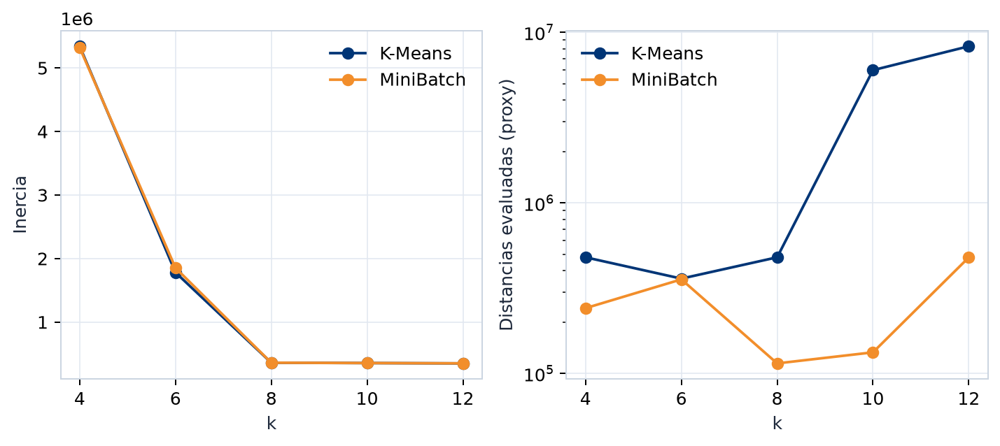{height="350px" fig-align="center"}

```python
MiniBatchKMeans(n_clusters=k, batch_size=1024,
                n_init=5, random_state=42)
```

## EM alterna responsabilidades y parámetros

1. **E-step:** estima $P(z_i=k\mid\mathbf x_i)$.
2. **M-step:** actualiza pesos, medias y covarianzas.
3. Repite hasta estabilizar la log-verosimilitud.

K-Means y GMM alternan asignar y actualizar; GMM conserva incertidumbre.

## La covarianza controla la geometría

| `covariance_type` | Forma permitida |
|---|---|
| `spherical` | Esferas con radios diferentes |
| `diag` | Elipses alineadas con los ejes |
| `tied` | Una covarianza compartida |
| `full` | Forma y orientación por componente |

Más flexibilidad implica más parámetros y riesgo de sobreajuste.

## AIC y BIC seleccionan componentes

$$
\operatorname{AIC}=2p-2\log\hat L,
\qquad
\operatorname{BIC}=p\log n-2\log\hat L
$$

- Premian ajuste y penalizan complejidad.
- BIC suele favorecer modelos más simples.
- Compare también estabilidad e interpretación.

## Anomalía y novedad no son sinónimos

- **Anomalías:** el entrenamiento puede contener casos raros.
- **Novedad:** el entrenamiento representa casos normales.
- GMM entrega una densidad, no una decisión automática.
- El umbral depende del costo de cada error.

Una observación rara no es automáticamente error ni fraude.

## PCA también se obtiene mediante SVD

Para datos centrados $\mathbf X$:

$$
\mathbf X=\mathbf U\boldsymbol\Sigma\mathbf V^\top
$$

- $\mathbf V$ contiene las direcciones principales.
- $\boldsymbol\Sigma^2/(n-1)$ contiene sus varianzas.
- Las primeras columnas dan una aproximación de rango bajo.

## Reproducir el caso de Colombia

Desde la raíz del repositorio:

```bash
python quarto/clustering/country_narrative.py --all
```

El script valida vecinos, modelos y varianza explicada, y genera un CSV auditable.

## Reproducir las figuras complementarias

Desde `quarto/clustering`:

```bash
python generate_figures.py --all
```

Dependencias declaradas en `quarto/clustering/requirements.txt`.

## Referencias

::: {style="font-size: 0.68em;"}
::: {#refs}
:::
:::
