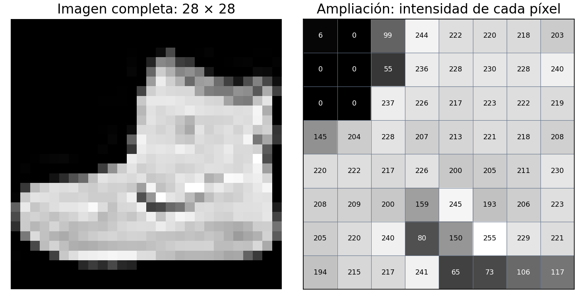
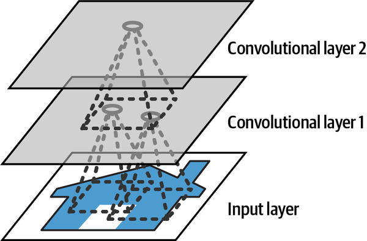
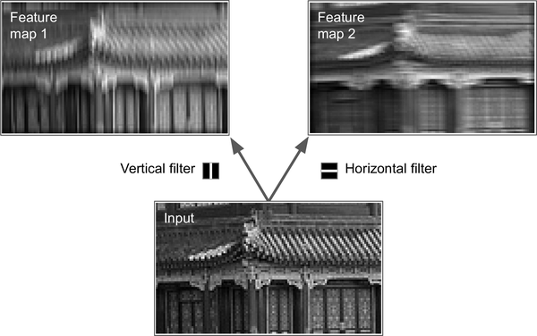
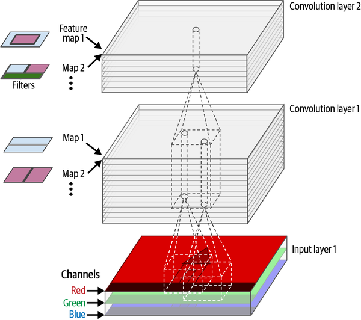
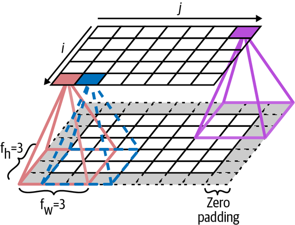
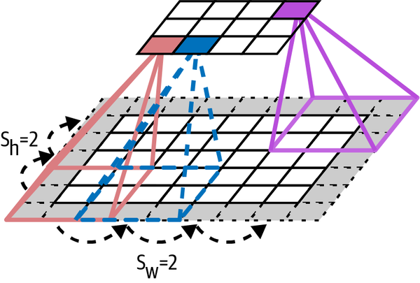
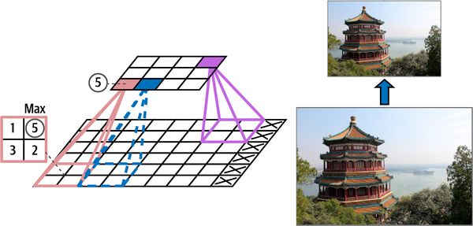
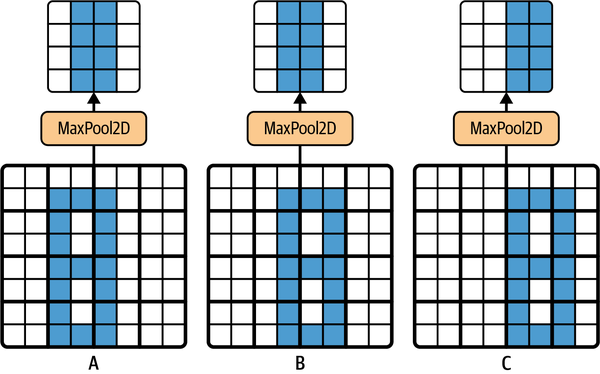
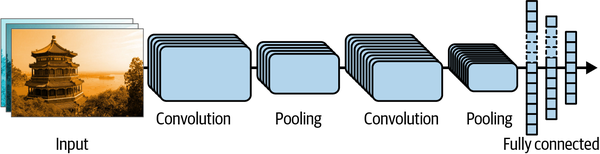

# Introducción

## Tarea: lecturas y exploración

1. **Obligatoria:** capítulo 14 de *Hands-On Machine Learning*, tercera edición [@geron2022hands].
2. **Preparación:** bloque de Fashion MNIST del capítulo 10.
3. **Complementaria:** [notebook oficial del capítulo 14](https://github.com/ageron/handson-ml3/blob/main/14_deep_computer_vision_with_cnns.ipynb){target="_blank"} [@geronNotebookCNN].

**En clase:** ejemplos breves y un simulador; no hace falta instalar TensorFlow.

::: {.notes}
Recuperamos el bloque de imágenes pendiente de la clase introductoria. La lectura comprende el capítulo completo; profundizamos en fundamentos y dejamos los temas avanzados como panorama. El código se explica, no se entrena en clase. Para dos horas, abreviar el panorama; para tres, ampliar predicciones y discusión MLP–CNN.
:::

## Tarea: NotebookLM

Abrir el [cuaderno de CNN](https://notebook.google.com/notebook/6888ff42-3d12-4f85-ac8b-298673d93cdc){target="_blank"} [@notebookLMCNN].

- Pedir una explicación de filtros, padding o pooling.
- Contrastar la respuesta con el capítulo 14.
- Traer una duda o una discrepancia concreta.

::: {.notes}
Ejemplo: «¿padding same conserva siempre el tamaño? ¿Qué cambia con stride 2? Señala la fuente». Respuesta esperada: conserva el tamaño con stride 1. Error frecuente: confiar en una respuesta sin verificar la lectura. El acceso al cuaderno depende de sus permisos.
:::

## Reconocer exige una representación

Una persona distingue una camiseta de un botín. **¿Qué recibe realmente una red?**

::: {.fragment}
Recibe números. Debe aprender patrones que permitan relacionarlos con una etiqueta.
:::

**Pregunta de la sesión:** ¿qué estructura de la imagen conviene aprovechar? [@geron2022hands]

::: {.notes}
Dar un minuto antes de revelar. Respuestas esperadas: intensidades, contornos y relaciones entre píxeles. Separar entrada de representación aprendida. Error frecuente: creer que la imagen contiene el nombre del objeto como entrada del clasificador.
:::

# Acto 1: ¿Cómo entra una imagen?

## Una imagen es una matriz de datos

{height="350px" fig-align="center" alt="Botín de Fashion MNIST y detalle de sus intensidades de píxel"}

::: {style="text-align: center; font-size: 0.65em;"}
Fashion MNIST: primera imagen de entrenamiento, etiqueta 9. Zalando Research, licencia MIT [@fashionMNIST].
:::

**Antes de seguir:** ¿qué representa cada número de la matriz?

::: {.notes}
Respuesta esperada: intensidad en escala de grises, de 0 a 255. No es una coordenada ni una probabilidad. La figura reutiliza la muestra reproducible y versionada de redes neuronales. Señalar la correspondencia entre posición en la matriz y en la imagen.
:::

## La etiqueta vive en otro arreglo

Fashion MNIST contiene imágenes de **28 × 28**, en escala de grises, y **10 clases** [@fashionMNIST].

**Pregunta:** ¿la palabra «botín» aparece entre los 784 píxeles?

::: {.fragment}
`X[i]` contiene la imagen; `y[i]` contiene la etiqueta entera. La clase **9** corresponde a «botín».
:::

::: {.notes}
Respuesta: no; X e y están alineados por índice, pero separados. Los valores 0–9 de y son categorías, no intensidades ni un orden entre prendas. Error frecuente: incluir la etiqueta entre los píxeles o normalizarla junto con X.
:::

## Normalizar cambia la escala

**Pregunta:** ¿qué ocurre con un píxel de valor 255 al dividirlo por 255?

$$0/255=0,\qquad 128/255\approx0.502,\qquad 255/255=1$$

::: {.fragment}
Las intensidades quedan entre **0 y 1**. Las posiciones y las etiquetas se conservan [@tensorflowFashionTutorial].
:::

::: {.notes}
Pedir extremos y valor intermedio. Error frecuente: confundir normalización con un umbral de blanco y negro. Esta escala sirve para Fashion MNIST; un modelo preentrenado puede requerir otro preprocesamiento.
:::

## Validación decide; prueba evalúa

| Partición del ejemplo | Imágenes | Uso |
|:--|--:|:--|
| Entrenamiento | 55 000 | Ajustar los pesos |
| Validación | 5 000 | Elegir configuración y época |
| Prueba | 10 000 | Evaluar el modelo elegido |

**Pregunta:** ¿en cuál compararías dos arquitecturas? [@geron2022hands; @fashionMNIST]

::: {.notes}
Respuesta: validación. El conjunto distribuye 60 000 imágenes para entrenamiento y 10 000 para prueba; reservamos las primeras 5000 de entrenamiento. No son tres particiones oficiales. Error frecuente: escoger modelos según test, convirtiéndolo en datos de selección.
:::

## Cargar prepara las tres particiones

```python
import tensorflow as tf
datos = tf.keras.datasets.fashion_mnist.load_data()
(X_full, y_full), (X_test, y_test) = datos
X_full = X_full.astype("float32") / 255.0
X_test = X_test.astype("float32") / 255.0
X_valid, X_train = X_full[:5000], X_full[5000:]
y_valid, y_train = y_full[:5000], y_full[5000:]
```

**Pregunta:** ¿qué forma tiene `X_train`? [@geron2022hands; @tensorflowFashionTutorial]

::: {.notes}
Respuesta: (55000, 28, 28); y_train tiene forma (55000,). Todavía no aplanamos ni añadimos canales. La carga descarga datos si no están en caché; el bloque es explicativo. Error frecuente: interpretar el número de imágenes como dimensión espacial.
:::

## El MLP recibe 784 valores por imagen

```python
mlp = tf.keras.Sequential([
    tf.keras.layers.Input(shape=(28, 28)),
    tf.keras.layers.Flatten(),
    tf.keras.layers.Dense(64, activation="relu"),
    tf.keras.layers.Dense(10, activation="softmax"),
])
```

**Pregunta:** ¿por qué la última capa tiene diez unidades? [@geron2022hands]

::: {.notes}
Respuesta: una por clase; softmax produce diez probabilidades que suman 1. Flatten no tiene parámetros. Es la adaptación breve del capítulo 10 usada en la clase introductoria. Error frecuente: usar 784 salidas porque hay 784 píxeles, aunque clasificamos la imagen completa.
:::

## La pérdida conecta salida y etiqueta

```python
mlp.compile(optimizer="adam",
            loss="sparse_categorical_crossentropy",
            metrics=["accuracy"])
history_mlp = mlp.fit(X_train, y_train, epochs=20,
                      validation_data=(X_valid, y_valid))
```

**Pregunta:** ¿qué aporta validación si no ajusta los pesos? [@kerasTraining]

::: {.notes}
Respuesta: observar generalización y seleccionar configuración o época. sparse acepta etiquetas enteras, sin one-hot. Adam usa los gradientes de backpropagation. Veinte épocas son un presupuesto ilustrativo. Si entrenamiento mejora y validación empeora, discutir sobreajuste; no asumir que toda bajada de accuracy es suficiente para diagnosticarlo.
:::

## Predecir devuelve diez probabilidades

```python
loss_mlp, acc_mlp = mlp.evaluate(X_test, y_test)
probabilidades = mlp.predict(X_test[:1])
clase = probabilidades.argmax(axis=1)[0]
```

**Antes de revelar:** ¿`predict` devuelve directamente «botín»?

::: {.fragment}
Devuelve un arreglo de forma **(1, 10)**; `argmax` elige el índice de mayor probabilidad [@kerasTraining].
:::

::: {.notes}
Respuesta: hay que convertir el índice a nombre de clase. No suponer que esta imagen se clasificará bien: no se entrenó aquí. evaluate cierra el ciclo después de elegir la configuración; al comparar MLP y CNN, aplazar ambas evaluaciones de test hasta terminar la selección con validación. Una probabilidad alta no garantiza acierto.
:::

# Acto 2: ¿Qué aporta la estructura?

## Aplanar conserva los valores

$$\begin{bmatrix}a&b\\c&d\end{bmatrix}\quad\longmapsto\quad[a,b,c,d]$$

**Pregunta:** ¿se perdió algún número? ¿La capa densa conoce qué píxeles eran vecinos?

::: {.fragment}
`Flatten` conserva los valores y su orden. La capa densa debe aprender relaciones espaciales sin conexiones locales impuestas [@geron2022hands].
:::

::: {.notes}
Respuesta: no se pierde información numérica; con la forma original se reconstruye la matriz. a y c son vecinos verticales aunque no sean consecutivos en el vector. La limitación es el sesgo arquitectónico. Error frecuente: decir que Flatten destruye la información o que un MLP no puede clasificar imágenes.
:::

## Conectar todo hace crecer los pesos

**Pregunta:** ¿cuántos parámetros tiene la primera capa `Dense(64)`?

::: {.fragment}
Para Fashion MNIST: $(784+1)\times64=\mathbf{50\,240}$.

Para RGB de 100 × 100: $(30\,000+1)\times64=\mathbf{1\,920\,064}$.
:::

El **+1** cuenta un sesgo por unidad; falta el resto del modelo [@geron2022hands].

::: {.notes}
Calcular entradas antes de revelar: RGB contiene 100 × 100 × 3 valores. Ambos ejemplos tienen 64 unidades; no se afirma igual capacidad o desempeño. Error frecuente: olvidar canales o sesgos. Se cuentan parámetros de una capa, no memoria total de entrenamiento.
:::

## Un borde puede cambiar de posición

Imaginemos el mismo botín desplazado dos píxeles.

**Pregunta:** ¿deberíamos aprender de nuevo su contorno para cada posición?

::: {.fragment}
Podemos aplicar **el mismo detector local** en distintas posiciones. Compartir pesos aprovecha esa regularidad [@geron2022hands].
:::

::: {.notes}
Respuesta: reutilizar un detector. El MLP puede aprender regularidades, pero sus pesos para distintas posiciones no se comparten explícitamente. Error frecuente: concluir que toda la CNN es invariante a cualquier desplazamiento; las activaciones pueden desplazarse con la imagen.
:::

## Las capas amplían el campo receptivo

{height="330px" fig-align="center" alt="Dos capas convolucionales conectan regiones locales y amplían el campo receptivo"}

::: {style="text-align: center; font-size: 0.65em;"}
Géron, figura 14-2 [@geron2022hands].
:::

**Pregunta:** ¿cómo combina la segunda capa información de una región mayor?

::: {.notes}
Respuesta: reúne activaciones que ya reúnen píxeles vecinos. Dos convoluciones 3 × 3, stride 1 y sin dilatación, alcanzan un campo receptivo teórico 5 × 5. La corteza visual inspiró conexiones locales y jerarquías; una CNN no reproduce el cerebro. Error frecuente: pensar que cada unidad ve la imagen entera desde la primera capa.
:::

# Acto 3: ¿Qué calcula un filtro?

## Un filtro multiplica y suma

$$X_{\text{parche}}=\begin{bmatrix}0&0&1\\0&0&1\\0&0&1\end{bmatrix},\qquad
K=\begin{bmatrix}-1&0&1\\-1&0&1\\-1&0&1\end{bmatrix}$$

**Pregunta:** con sesgo cero, ¿cuánto vale $z=\sum_{u,v}X_{u,v}K_{u,v}$?

::: {.fragment}
Solo contribuye la columna derecha: $z=1+1+1=\mathbf{3}$.
:::

::: {.notes}
Ejemplo propio, inspirado en el capítulo 14. Multiplicación elemento a elemento, no producto matricial. Un parche constante daría cero; invertir la transición produce un valor negativo. Conv2D y el simulador usan correlación cruzada, sin invertir el kernel; se suele llamar convolución en aprendizaje profundo. Omitimos sesgo y activación para aislar el cálculo.
:::

## Deslizar produce un mapa

Aplicamos **el mismo kernel y sesgo** a cada parche de la imagen.

**Pregunta:** con entrada de 5 × 5 y kernel de 3 × 3, ¿cuántas posiciones caben sin padding, con stride 1?

::: {.fragment}
Caben **3 × 3** posiciones. Cada suma ocupa una posición del **mapa de características** [@geron2022hands; @kerasConv2D].
:::

::: {.notes}
Respuesta: tres posiciones por eje; 5 − 3 + 1 = 3. Cada parche produce un escalar, no una nueva imagen 3 × 3. Error frecuente: calcular 5/3 o aprender un kernel distinto en cada posición. El mapa antes de la activación puede tener valores negativos.
:::

## Cada filtro resalta un patrón

{height="380px" fig-align="center" alt="Filtros vertical y horizontal producen mapas diferentes de una misma fotografía"}

::: {style="text-align: center; font-size: 0.65em;"}
Géron, figura 14-5: filtros manuales ilustrativos [@geron2022hands].
:::

**Antes de explicar:** ¿por qué los mapas de la misma imagen son diferentes?

::: {.notes}
Respuesta: pesos diferentes destacan distintas orientaciones. La figura usa filtros de líneas, no Sobel: estos suman intensidades orientadas; Sobel calcula diferencias. Error frecuente: llamar detector de bordes a cualquier filtro o interpretar el mapa como probabilidad final de clase.
:::

## Un filtro abarca todos los canales

{height="420px" fig-align="center" alt="Una imagen RGB entra a capas con varios filtros y un mapa de salida por filtro"}

::: {style="text-align: center; font-size: 0.65em;"}
Géron, figura 14-6 [@geron2022hands].
:::

**Pregunta:** un filtro 3 × 3 sobre RGB, ¿tiene 9 o 27 pesos?

::: {.notes}
Respuesta: 3 × 3 × 3 = 27, más un sesgo. Un filtro suma sobre todos los canales y produce un mapa, no tres. Fashion tiene un canal. En capas siguientes, los canales son mapas aprendidos, no colores. filters determina los mapas de salida; el canal no es dimensión espacial.
:::

## Padding permite incluir los bordes

{height="305px" fig-align="center" alt="Ceros alrededor de la imagen permiten llevar un campo receptivo de 3 por 3 hasta los bordes"}

::: {style="text-align: center; font-size: 0.65em;"}
Géron, figura 14-3 [@geron2022hands].
:::

**Pregunta:** para 28 × 28, kernel 3 y stride 1, ¿qué cambia entre `valid` y `same`?

::: {.notes}
Respuesta: valid no añade padding y produce 26 × 26; same añade un píxel de ceros a cada lado y produce 28 × 28 con stride 1. Los ceros no son observaciones ni pesos. Error frecuente: confundir valid con validación o creer que same conserva siempre dimensiones.
:::

## Stride controla el paso del filtro

{height="280px" fig-align="center" alt="Stride dos separa las posiciones de los campos receptivos y reduce la salida"}

::: {style="text-align: center; font-size: 0.65em;"}
Géron, figura 14-4 [@geron2022hands].
:::

Para entrada **28 × 28** y kernel **3 × 3**:

| Padding | Stride 1 | Stride 2 |
|:--|:--|:--|
| `valid` | 26 × 26 | 13 × 13 |
| `same` | 28 × 28 | 14 × 14 |

::: {.notes}
Pedir la columna de stride 2 antes de explicar sus cifras. Por eje y sin dilatación: valid = floor((n − k)/s) + 1; same = ceil(n/s). Keras puede usar padding asimétrico. Error frecuente: asumir un borde fijo de un píxel con cualquier stride o que el submuestreo conserva todas las posiciones. Ver kerasConv2D.
:::

## Simulador: predice y contrasta

[Abrir el simulador de convolución](https://oscar-bustos.github.io/javeriana-tallerml/redes_neuronales/convolucion.html){target="_blank"} [@bustosConvolucion].

1. Usa **la misma imagen** durante toda la comparación.
2. Predice el resultado de **Identidad** y **Box Blur**; aplícalos.
3. Anticipa qué bordes resaltarán **Sobel X** y **Sobel Y**.
4. Cambia un peso del kernel y explica el efecto observado.

**Pregunta:** ¿qué filtros elegirías para reconocer una prenda?

::: {.notes}
Reservar 8–10 minutos. Identidad copia el interior; Box Blur promedia 3 × 3; Sobel X resalta cambios izquierda–derecha, Sobel Y arriba–abajo. Si la imagen remota no carga, usar el selector para una imagen local disponible; mantenerla entre filtros. El simulador convierte a grises, pinta el borde negro, toma valor absoluto para detectores de bordes y recorta a 0–255. No representa todos los valores internos de una CNN ni ofrece controles de stride/padding. La actividad usa un enlace externo, sin iframe, y requiere conexión.
:::

## La red aprende los pesos del filtro

En el simulador escogemos los pesos; en una CNN, **backpropagation calcula sus gradientes** [@geron2022hands].

**Pregunta:** ¿cuántos parámetros tiene `Conv2D(32, 3)` sobre una imagen de un canal?

::: {.fragment}
$(3\times3\times1+1)\times32=\mathbf{320}$, independientemente del alto y el ancho.
:::

Después de cada suma y sesgo, **ReLU** aporta no linealidad.

::: {.notes}
Respuesta: 288 pesos y 32 sesgos. Se acumulan gradientes desde distintas posiciones para cada peso compartido. Número y tamaño de filtros son hiperparámetros; sus pesos se aprenden. Los 320 parámetros y los 50 240 de Dense(64) producen salidas distintas: 28 × 28 × 32 con same frente a 64 valores. No prueban que toda CNN use menos memoria. ReLU = max(0,z), diferente del absoluto del simulador. Ver kerasConv2D.
:::

## Pooling resume una región

{height="300px" fig-align="center" alt="Max pooling conserva el máximo de cada región de 2 por 2 y reduce su tamaño espacial"}

::: {style="text-align: center; font-size: 0.65em;"}
Géron, figura 14-9 [@geron2022hands; @kerasMaxPool].
:::

**Pregunta:** en $\begin{bmatrix}1&5\\3&2\end{bmatrix}$, ¿qué conserva max pooling? ¿Qué pierde?

::: {.notes}
Respuesta: conserva 5; pierde los demás valores y su distribución espacial exacta. MaxPool2D(2) usa stride 2 y valid por defecto: 28 × 28 pasa a 14 × 14, por canal. No tiene pesos. Error frecuente: decir que reduce canales o elimina pesos de una convolución ya creada. Sí puede reducir entradas de capas posteriores. Ver kerasMaxPool.
:::

## Los desplazamientos aún importan

{height="300px" fig-align="center" alt="Max pooling produce la misma salida para algunos desplazamientos y una distinta para otros"}

::: {style="text-align: center; font-size: 0.65em;"}
Géron, figura 14-10 [@geron2022hands].
:::

**Pregunta:** ¿por qué A y B coinciden, pero C cambia?

::: {.fragment}
Pooling aporta **tolerancia limitada**; no garantiza invariancia a cualquier traslación.
:::

::: {.notes}
Respuesta: el máximo puede quedar en la misma ventana o pasar a otra. Con stride 1, convolución es equivariante a traslaciones en el interior: el mapa se desplaza con la entrada. Bordes y submuestreo pueden romper esa correspondencia; no implica invariancia de toda la CNN. En segmentación queremos que la localización siga a la imagen. GlobalAveragePooling2D resume cada mapa en un promedio, perdiendo detalle espacial.
:::

# Acto 4: ¿Cómo armamos la CNN?

## La entrada necesita un eje de canal

**Pregunta:** ¿cómo pasa Fashion MNIST de `(N, 28, 28)` a la entrada de `Conv2D`?

```python
X_train_cnn = X_train[..., None]
X_valid_cnn = X_valid[..., None]
X_test_cnn = X_test[..., None]
```

La forma es **(lote, alto, ancho, canales)**: `(N, 28, 28, 1)` [@kerasConv2D].

::: {.notes}
Respuesta: añadir un eje de longitud 1, sin convertir colores ni cambiar intensidades. No cambian las etiquetas. Error frecuente: añadirlo solo a entrenamiento o al principio. Conv2D describe dos dimensiones espaciales, aunque el tensor tenga cuatro ejes. Usamos channels_last, formato predeterminado de Keras.
:::

## Las capas combinan patrones locales

{width="900px" fig-align="center" alt="Una CNN alterna convoluciones y pooling antes de las capas densas de clasificación"}

::: {style="text-align: center; font-size: 0.65em;"}
Géron, figura 14-12 [@geron2022hands].
:::

**Pregunta:** ¿por qué aplanamos después de extraer patrones locales?

::: {.fragment}
Las convoluciones combinan vecindarios; las capas densas usan esas activaciones para clasificar.
:::

::: {.notes}
Respuesta: mantener la organización espacial mientras se extraen características; después obtener un vector para Dense. La figura representa una familia, no nuestro modelo exacto ni una ejecución. Más profundidad no garantiza mejora. También puede usarse global average pooling como cabezal alternativo.
:::

## Una CNN breve sirve como ejemplo

```python
cnn = tf.keras.Sequential([
    tf.keras.layers.Input(shape=(28, 28, 1)),
    tf.keras.layers.Conv2D(32, 3, padding="same", activation="relu"),
    tf.keras.layers.MaxPool2D(2),
    tf.keras.layers.Conv2D(64, 3, padding="same", activation="relu"),
    tf.keras.layers.MaxPool2D(2),
    tf.keras.layers.Flatten(),
    tf.keras.layers.Dense(64, activation="relu"),
    tf.keras.layers.Dense(10, activation="softmax"),
])
```

Adaptación didáctica del capítulo 14; no replica su modelo completo [@geron2022hands].

::: {.notes}
Preguntar qué capas aprenden: Conv2D y Dense sí, MaxPool2D y Flatten no. Convoluciones con stride 1. Omitimos bloques adicionales y dropout del libro; no trasladar su exactitud a este ejemplo. Código Python estático, sin ejecución durante Quarto.
:::

## Cada capa tiene una forma predecible

::: {.cnn-dimensions style="font-size: 0.75em;"}
| Paso | Salida por imagen | Parámetros |
|:--|:--|--:|
| Entrada | 28 × 28 × 1 | 0 |
| Conv2D, 32 filtros | 28 × 28 × 32 | 320 |
| MaxPool2D | 14 × 14 × 32 | 0 |
| Conv2D, 64 filtros | 14 × 14 × 64 | 18 496 |
| MaxPool2D | 7 × 7 × 64 | 0 |
| Flatten | 3136 | 0 |
| Dense, 64 unidades | 64 | 200 768 |
| Dense, 10 unidades | 10 | 650 |
:::

**Pregunta:** ¿cuál capa concentra más parámetros? [@kerasConv2D; @geron2022hands]

::: {.notes}
Respuesta: Dense(64). Conv2 = (3 × 3 × 32 + 1) × 64 = 18 496; Flatten = 7 × 7 × 64 = 3136; Dense64 = (3136 + 1) × 64 = 200 768; Dense10 = 650. Total CNN: 220 234. Se omite solo el eje de lote. Error frecuente: interpretar canales como ejemplos o reducirlos al aplicar pooling.
:::

## Entrenar conserva el mismo ciclo

```python
cnn.compile(optimizer="adam",
            loss="sparse_categorical_crossentropy",
            metrics=["accuracy"])
history_cnn = cnn.fit(X_train_cnn, y_train, epochs=20,
                      validation_data=(X_valid_cnn, y_valid))
```

**Pregunta:** ¿qué cambia frente al MLP y qué se mantiene? [@kerasTraining]

::: {.notes}
Respuesta: cambian capas, entrada y pesos; se mantienen etiquetas, tarea, pérdida, optimizador y particiones. Mismo presupuesto inicial: veinte épocas y batch size predeterminado 32. Observar las curvas de validación. Un estudio riguroso fijaría semillas y repetiría ensayos. Si se añade early stopping, aplicar la misma regla de validación a ambos.
:::

## La comparación exige datos no vistos

| Modelo del ejemplo | Parámetros totales | Selección |
|:--|--:|:--|
| MLP | 50 890 | Pérdida y exactitud en validación |
| CNN | 220 234 | Pérdida y exactitud en validación |

**Pregunta:** ¿tener convoluciones asegura menos parámetros o mejor exactitud?

::: {.fragment}
No basta contar pesos. Comparamos desempeño, sobreajuste y costo; **prueba se reserva para el final** [@geron2022hands].
:::

::: {.notes}
Respuesta: no. MLP = 50 240 + 650; CNN incluye una capa densa grande. Parámetros no equivalen a memoria de activaciones ni operaciones. Seleccionar con mismas particiones, preprocesamiento, optimizador y presupuesto. Después evaluar con cnn.evaluate(X_test_cnn, y_test) y mlp.evaluate(X_test, y_test), sin seguir ajustando por test. No hay exactitudes medidas en este deck.
:::

# Acto 5: ¿Qué más permite una CNN?

## Las arquitecturas cambian el diseño

| Arquitectura | Año | Idea que destacamos |
|:--|--:|:--|
| LeNet-5 | 1998 | Convolución y pooling para dígitos |
| AlexNet | 2012 | Mayor escala y entrenamiento con GPU |
| GoogLeNet | 2014 | Filtros a distintas escalas en paralelo |
| ResNet | 2015 | Conexiones residuales |

**Pregunta:** ¿qué problema resuelve cada cambio? [@geron2022hands]

::: {.notes}
Panorama, no catálogo para memorizar. LeNet combina bloques locales; AlexNet muestra la importancia de datos y cómputo; Inception combina escalas con cuellos de botella 1 × 1; ResNet facilita optimización profunda. Error frecuente: decir que AlexNet inventó data augmentation o que apilar capas garantiza mejora.
:::

## ResNet aprende una corrección

Un bloque residual suma su entrada a la transformación aprendida:

$$h(x)=x+F(x)$$

**Pregunta:** si conviene mantener la entrada, ¿qué tendría que aprender $F(x)$?

::: {.fragment}
Una corrección cercana a **cero**. El atajo facilita optimizar redes profundas [@geron2022hands].
:::

::: {.notes}
Respuesta: F(x) ≈ 0 conserva x en este esquema, antes de posibles activaciones posteriores. Sumar requiere formas compatibles; puede usarse proyección 1 × 1 al cambiar canales o tamaño. Error frecuente: afirmar que los atajos resuelven cualquier problema de gradientes o eliminan el entrenamiento.
:::

## Transferir reutiliza representaciones

**Pregunta:** con pocas imágenes nuevas, ¿conviene aprender todos los filtros desde cero?

1. Partir de una red preentrenada en una tarea relacionada.
2. Congelar la base y entrenar un nuevo clasificador.
3. Evaluar un ajuste fino con una tasa de aprendizaje baja.

La entrada debe respetar el **preprocesamiento del modelo** [@kerasTransfer; @geron2022hands].

::: {.notes}
Respuesta: transferir puede ayudar si la representación es pertinente; validarlo. Congelar evita actualizar pesos, no evita calcular activaciones. Ajuste fino opcional después del cabezal; recompilar al cambiar trainable. Global average pooling puede preceder al clasificador. Error frecuente: aplicar siempre división por 255 o alimentar una base RGB directamente con Fashion de 28 × 28 × 1. No se introduce otra implementación completa.
:::

## Detectar añade la localización

Clasificar responde **qué hay**. Detectar responde **qué hay y dónde**, para varios objetos.

**Pregunta:** ¿qué salida adicional necesitamos además de la clase?

::: {.fragment}
Cajas delimitadoras y puntuaciones para las detecciones. **IoU** mide solapamiento; **mAP** evalúa detecciones según un protocolo [@geron2022hands].
:::

::: {.notes}
Respuesta: coordenadas de cajas, clase y confianza por detección. IoU = intersección / unión de cajas, no accuracy ni mAP. YOLO es una familia de detectores en una pasada; evitar detalles de versiones actuales o velocidades universales. Este bloque es un panorama conceptual.
:::

## Segmentar asigna una clase por píxel

**Pregunta:** para delimitar una carretera, ¿alcanza con una caja?

::: {.fragment}
La segmentación semántica produce un **mapa de clases por píxel**. Debe recuperar detalle espacial que el submuestreo reduce [@geron2022hands].
:::

Las conexiones de salto pueden combinar detalle de capas tempranas con representaciones profundas.

::: {.notes}
Respuesta: una caja no describe el contorno. Semántica no distingue instancias de igual clase. Interpolación o convolución transpuesta recuperan resolución, no automáticamente toda la información perdida. Los atajos incorporan detalle de mayor resolución. Relacionar pooling y equivarianza: si se desplaza la carretera, debe desplazarse la máscara.
:::

# Cierre

## La estructura guía lo que se aprende

- Los píxeles son entradas; las etiquetas son objetivos separados.
- La convolución usa vecindarios y comparte pesos entre posiciones.
- ReLU permite combinar patrones de forma no lineal.
- Pooling reduce resolución y pierde detalle espacial.
- Validación permite elegir; prueba permite evaluar [@geron2022hands].

::: {.notes}
Pedir un ejemplo por idea. Volver a la pregunta inicial: vecindarios y patrones repetidos son regularidades de la imagen que la arquitectura aprovecha. Error frecuente: sustituir evidencia en validación por la intuición de que CNN siempre gana.
:::

## Tarea: justificar una comparación

Explorar [el notebook del capítulo 14](https://github.com/ageron/handson-ml3/blob/main/14_deep_computer_vision_with_cnns.ipynb){target="_blank"} [@geronNotebookCNN].

1. Localizar la CNN de Fashion MNIST y seguir sus dimensiones.
2. Explicar una diferencia frente al MLP visto en clase.
3. Formular una comparación con las mismas particiones y presupuesto.

Contrastar una explicación del [cuaderno de NotebookLM](https://notebook.google.com/notebook/6888ff42-3d12-4f85-ac8b-298673d93cdc){target="_blank"} con la lectura [@notebookLMCNN].

::: {.notes}
Actividad complementaria sin obligación de instalar o ejecutar. Si ejecutan, registrar arquitectura, particiones, optimizador, épocas, curvas y costo. El notebook oficial usa una CNN mayor; no trasladar métricas a nuestro ejemplo. No se prescribe entrega ni fecha. Error frecuente: comparar métricas con particiones distintas o copiar una conclusión del cuaderno sin verificar su fuente.
:::

## Preguntas para salir

1. ¿Dónde vive la etiqueta «botín» y qué números recibe la red?
2. ¿Qué produce un filtro y por qué reutiliza sus pesos?
3. ¿Qué pierde pooling y cuándo importa esa pérdida?
4. ¿Qué evidencia necesitarías para preferir CNN al MLP?

::: {.notes}
Dos minutos individuales y discusión. Respuestas: y contiene categorías, X intensidades; un filtro produce un mapa reutilizando kernel y sesgo; pooling pierde detalle relevante en segmentación; seleccionar con validación bajo un protocolo comparable y evaluar al final en prueba, considerando costo. No pedir memorizar nombres de arquitecturas.
:::

## Referencias {.smaller .scrollable}

::: {#refs}
:::
