# Intuición Matemática

## Capítulos sobre Ensambles

:::: {.columns}

::: {.column width="35%"}

{width="70%"} 
Capítulo 9

:::

::: {.column width="35%"}

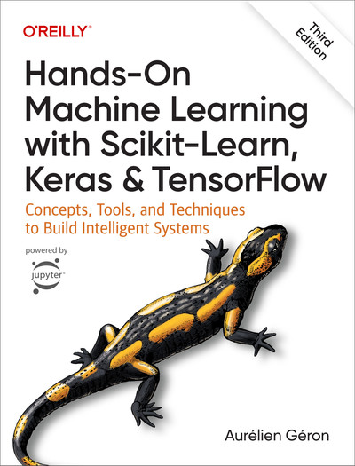{width="80%"} 
Capítulo 7

:::

::: {.column width="30%"}

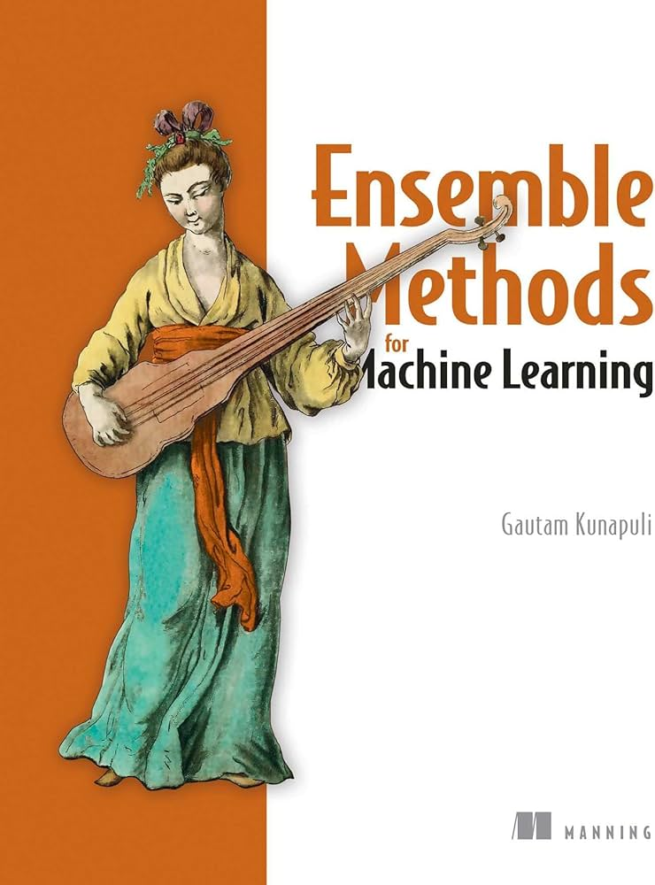{width="80%"} 
Capítulos 1,2,3,5
:::
::::

## Wisdom of Crowds

¿Cómo se puede diagnosticar si un paciente tiene cáncer o no?

 % Espacio opcional entre el texto y la imagen

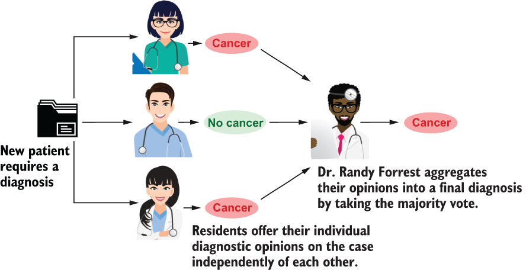{width="70%"}

## Wisdom of Crowds

¿Cómo se puede diagnosticar si un paciente tiene cáncer o no usando IA?

 % Espacio opcional entre el texto y la imagen

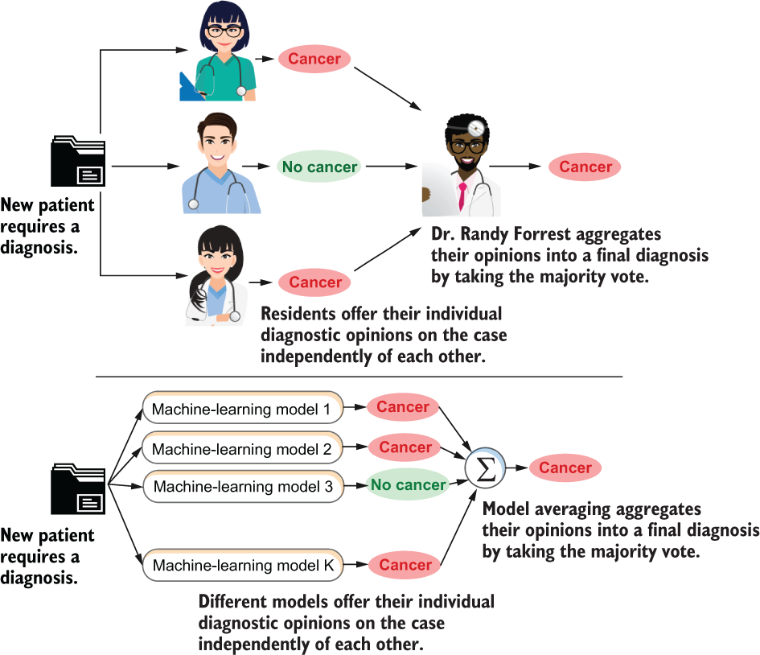{width="50%"}

## Evidencia empírica en los ensambles

¿Qué algoritmo de aprendizaje de máquina debo utilizar? [@olson2018data]

 % Espacio opcional entre el texto y la imagen

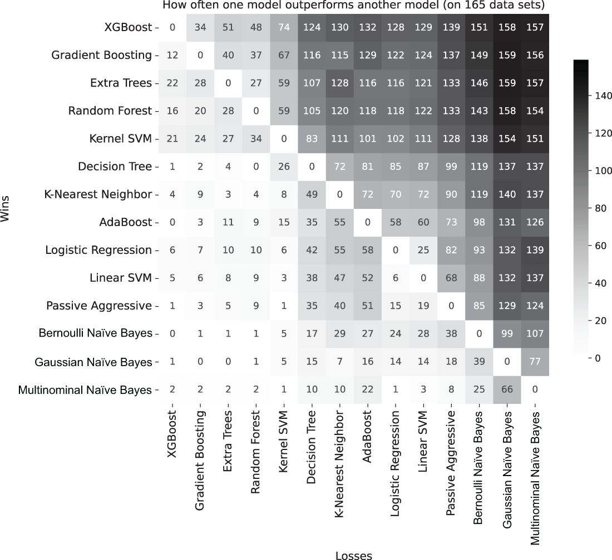{width="50%"}

## ¿Qué son los Ensambles?

- Combinación de múltiples modelos más débiles para crear un modelo más fuerte.
- Idea principal: "La sabiduría de la multitud".
- Reducen el sesgo y la varianza.
- Mejoran la precisión y la robustez del modelo.

## Resumen de Categorías de Ensambles

Existen tres principales categorías de ensambles en machine learning:
- **Parallel Homogeneous Ensembles:** Múltiples modelos del mismo tipo, entrenados con diferentes conjuntos de datos. Mejora la estabilidad y reduce la varianza.
- **Parallel Heterogeneous Ensembles:** Combinación de diferentes tipos de modelos para aprovechar sus fortalezas individuales.
- **Sequential Gradient Boosting Ensembles:** Modelos entrenados secuencialmente, en los que cada uno corrige los errores del anterior, logrando una mejor optimización de la función de pérdida.

# Parallel Homogeneous Ensembles

## Arquitectura de Ensamble Homogéneo

Cuando todos los clasificadores son del mismo tipo

 % Espacio opcional entre el texto y la imagen

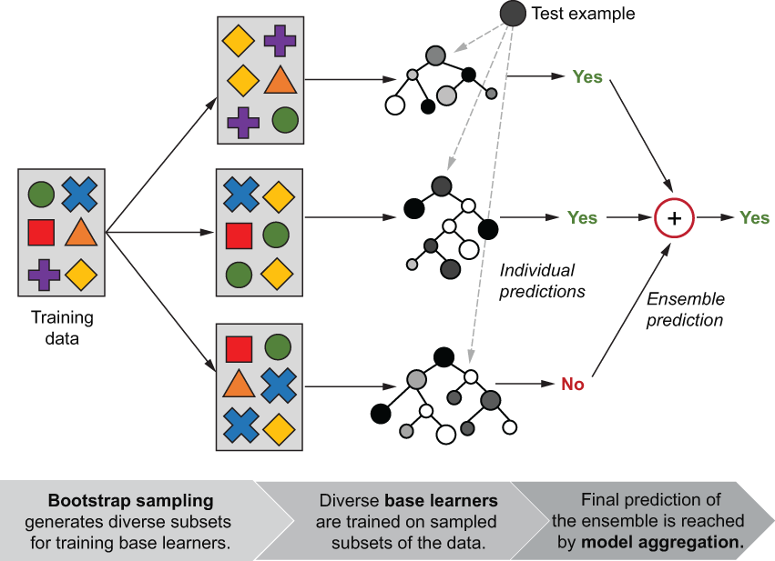{width="50%"}

## Bootstrapping

El bootstrapping es un método estadístico que permite generar **múltiples subconjuntos de datos** a partir del conjunto de entrenamiento original. Se basa en el muestreo con reemplazo, lo que significa que algunos ejemplos pueden aparecer más de una vez en un subconjunto, mientras que otros pueden no aparecer en absoluto.

 % Espacio opcional entre el texto y la imagen

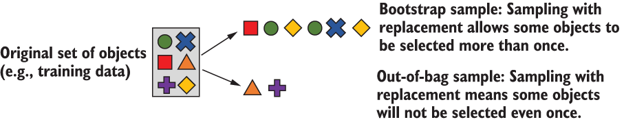{width="80%"}

## Bootstrapping

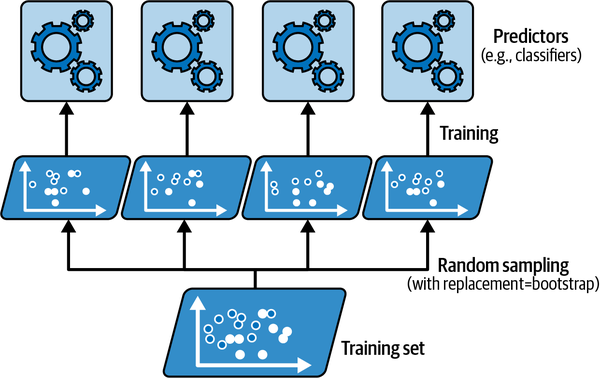{width="60%"}

 % Espacio opcional entre el texto y la imagen
Entrenamiento con Bootstraping - [@geron2022hands]

## Bagging - Entrenamiento

\begin{lstlisting}[language=Python, style=mystyle]
import numpy as np
from sklearn.tree import DecisionTreeClassifier

rng = np.random.RandomState(seed=4190)
def bagging_fit(X, y, n_estimators, max_depth=5, max_samples=200):
n_examples = len(y)
estimators = [DecisionTreeClassifier(max_depth=max_depth)
for _ in range(n_estimators)]

for tree in estimators:
bag = np.random.choice(n_examples, max_samples,
replace=True)
tree.fit(X[bag, :], y[bag])

return estimators
\end{lstlisting}

## Bagging - Inferencia

\begin{lstlisting}[language=Python, style=mystyle]
from scipy.stats import mode

def bagging_predict(X, estimators):
all_predictions = np.array([tree.predict(X)
for tree in estimators])
ypred, _ = mode(all_predictions, axis=0,
keepdims=False)
return np.squeeze(ypred)
\end{lstlisting}

## Comparación Bagging en Árboles de Decisión

Un único árbol de decisión (izquierda) **sobreajusta** el conjunto de entrenamiento y puede ser sensible a los valores atípicos. Un conjunto de bagging (derecha) **suaviza** los efectos de sobreajuste y las clasificaciones erróneas de varios de esos estimadores base.

 % Espacioopcional entre el texto y la imagen

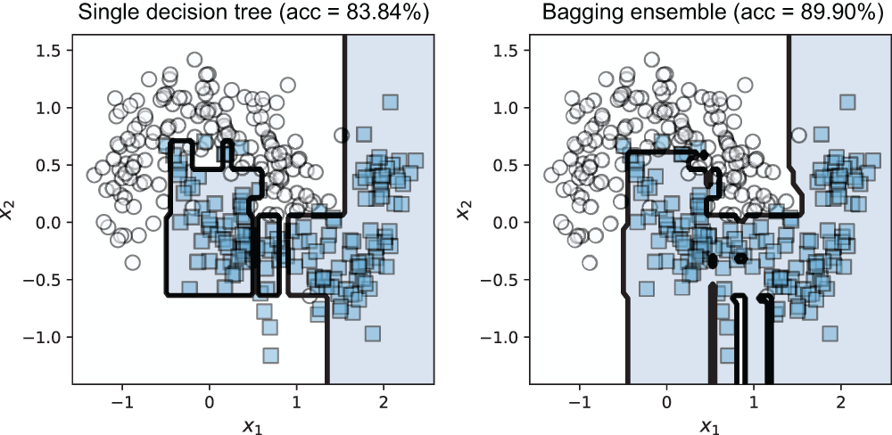{width="70%"}

## Bagging en Sklearn

\begin{lstlisting}[language=Python, style=mystyle]
from sklearn.tree import DecisionTreeClassifier
from sklearn.ensemble import BaggingClassifier

base_estimator = DecisionTreeClassifier(max_depth=10)
bag_ens = BaggingClassifier(base_estimator=base_estimator,
n_estimators=500,
max_samples=100,
oob_score=True,
random_state=rng)
bag_ens.fit(Xtrn, ytrn)
ypred = bag_ens.predict(Xtst)
\end{lstlisting}

## Optimización en Bagging

\begin{lstlisting}[language=Python, style=mystyle]

BaggingClassifier(base_estimator=DecisionTreeClassifier(),
n_estimators=100, max_samples=100,
oob_score=True, n_jobs=-1)
\end{lstlisting}

 % Espacioopcional entre el texto y la imagen

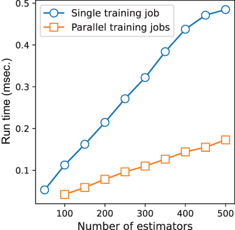{width="35%"}

## Características Aleatorias

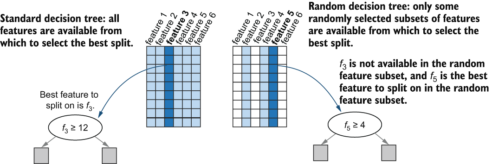{width="80%"}

## Random Forest: Ventajas

- Alta precisión y robustez.
- Maneja bien datos de alta dimensionalidad.
- Reduce el sobreajuste.
- Proporciona la importancia de las características.

## Random Forest: Hiperparámetros Clave

- `n\_estimators`: Número de árboles en el bosque.
- `max\_features`: Número de características a considerar en cada división.
- `max\_depth`: Profundidad máxima de los árboles.
- `min\_samples\_split`: Número mínimo de muestras requerido para dividir un nodo interno.

## Random Forest en Sklearn

\begin{lstlisting}[language=Python, style=mystyle]
from sklearn.ensemble import RandomForestClassifier

rf_ens = RandomForestClassifier(n_estimators=500,
max_depth=10,
oob_score=True,
n_jobs=-1,
random_state=rng)
rf_ens.fit(Xtrn, ytrn)
ypred = rf_ens.predict(Xtst)
\end{lstlisting}

## Random Forest en Sklearn

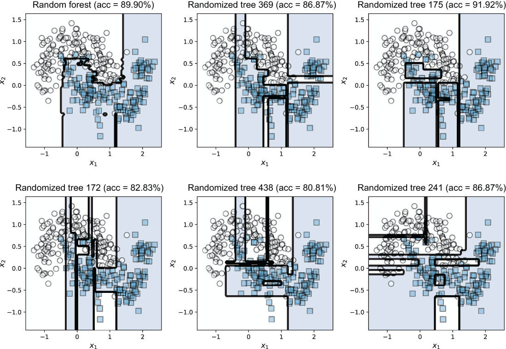{width="70%"}

## Random Forest en Sklearn

\begin{lstlisting}[language=Python, style=mystyle]
X_trn, X_tst, y_trn, y_tst = train_test_split(X, y, test_size=0.15)
n_features = X_trn.shape[1]

rf = RandomForestClassifier(max_leaf_nodes=24,
n_estimators=50, n_jobs=-1)
rf.fit(X_trn, y_trn)
err = 1 - accuracy_score(y_tst, rf.predict(X_tst))

importance_threshold = 0.02
for i, (feature, importance) in enumerate(zip(dataset['feature_names'],
rf.feature_importances_)):
if importance > importance_threshold:
print('[{0}] {1} (score={2:4.3f})'.
format(i, feature, importance))
\end{lstlisting}

## Random Forest en Sklearn

Importancia de Características
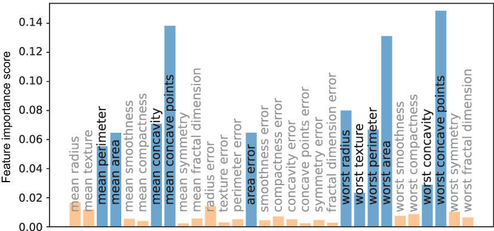{width="70%"}

# Parallel Heterogeneous Ensembles

## Arquitectura de Ensamble Heterogéneo

Cuando todos los clasificadores son de tipos distintos

 % Espacio opcional entre el texto y la imagen

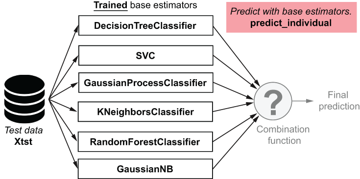{width="80%"}

## Voting

:::: {.columns}

::: {.column width="50%"}

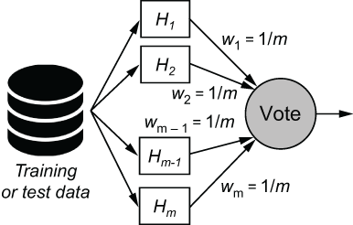{width="90%"} 
Votación
:::

::: {.column width="50%"}

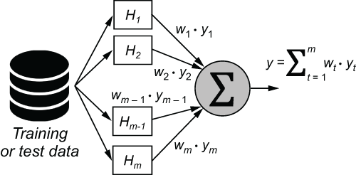{width="90%"} 
Votación Ponderada
:::
::::

## Stacking

Entrenando un modelo que usa como entrada las salidas de otro modelo

 % Espacio opcional entre el texto y la imagen

{width="80%"}

# Sequential Gradient Boosting Ensembles

## Arquitectura de Gradient Boosting

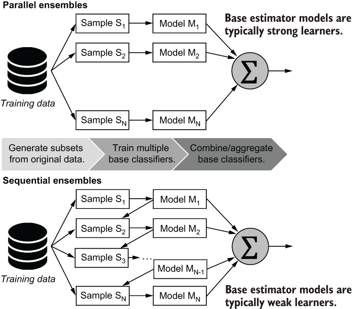{width="50%"}

## Arquitectura de Gradient Boosting

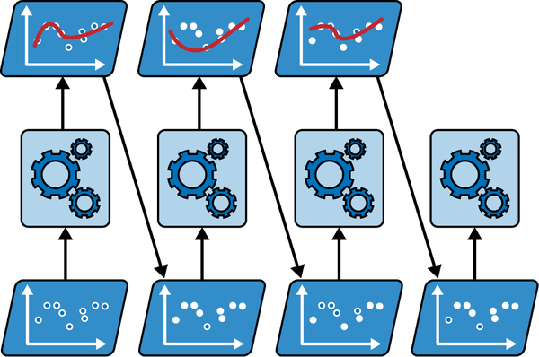{width="50%"}

Entrenamiento secuencial de AdaBoost  - [@james2023introduction]

## Gradient Boosted Trees (GBT): Intuición

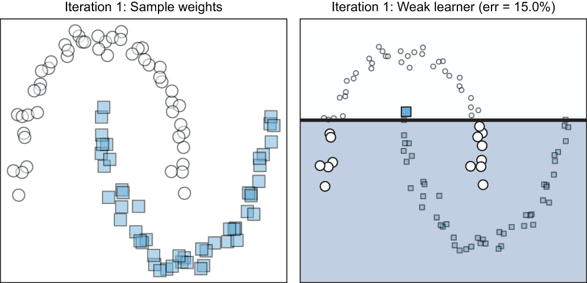{width="50%"}

- Construye modelos de forma secuencial, donde cada nuevo modelo se enfoca en corregir los errores del modelo anterior.
- Utiliza el gradiente descendente para minimizar la función de pérdida.

## Gradient Boosted Trees (GBT): Intuición

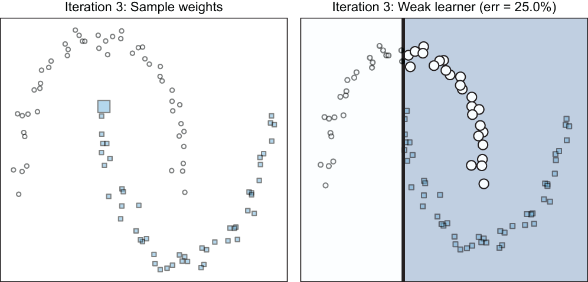{width="50%"}

- Construye modelos de forma secuencial, en los que cada nuevo modelo se enfoca en corregir los errores del anterior.
- Utiliza el gradiente descendente para minimizar la función de pérdida.

## Gradient Boosted Trees (GBT): Intuición

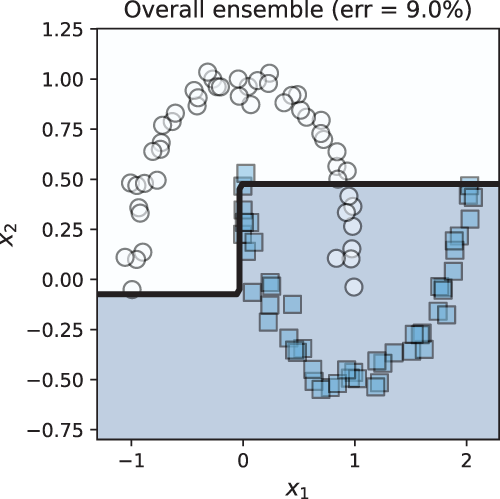{width="50%"}

- Construye modelos de forma secuencial, donde cada nuevo modelo se enfoca en corregir los errores del modelo anterior.
- Utiliza el gradiente descendente para minimizar la función de pérdida.

## Gradient Boosted Trees (GBT): Hiperparámetros Clave

- `n\_estimators`: Número de árboles en el modelo.
- `learning\_rate`: Tasa de aprendizaje, controla el impacto de cada árbol.
- `max\_depth`: Profundidad máxima de los árboles.
- `subsample`: Fracción de las muestras utilizadas para entrenar cada árbol.
- `colsample\_bytree`: Fracción de las características utilizadas para entrenar cada árbol.

# Comparación

## Random Forest vs Gradient Boosted Trees

| **Característica** | **Random Forest** | **Gradient Boosted Trees** |
| --- | --- | --- |
| Enfoque | Bagging | Boosting |
| Paralelización | Sí | No (secuencial) |
| Precisión | Alta | Muy alta |
| Sobreajuste | Menor riesgo | Mayor riesgo (requiere ajuste cuidadoso) |
| Velocidad | Rápido | Más lento (depende de la implementación) |
| Importancia de características | Sí | Sí |

# Librerías

## Seleccionando Algoritmos

¿Cómo elijo el algoritmo más adecuado para mis datos?
{width="80%"}

## Ensambles en Python

\begin{table}[htbp]

\renewcommand{\arraystretch}{1.5} % Espaciado para mayor legibilidad
\resizebox{\textwidth}{!}{%

| **Modelo** | **Librería / Creador** | **Enfoque** | **Variables Categóricas** | **Valores Nulos** | **Velocidad / Rendimiento** |
| --- | --- | --- | --- | --- | --- |
| **Random Forest** | `sklearn.ensemble` (Scikit-Learn) | Bagging (Paralelo) | Requiere codificación previa (One-Hot, Ordinal, etc.). | No soportado nativamente en sklearn. | Rápido al paralelizar árboles, pero consume mucha memoria. |
| **Gradient Boosting** | `sklearn.ensemble` (Scikit-Learn) | Boosting (Secuencial) | Requiere codificación previa. | No soportado nativamente (a menos que se use `HistGradientBoosting`). | Lento en entrenamiento (secuencial puro). Consumo de memoria moderado. |
| **XGBoost** | `xgboost` (DMLC) | Boosting (Level-wise) | Soportado experimentalmente / en versiones recientes. | Soporte nativo (aprende la dirección de los nulos). | Muy rápido (paraleliza la creación de nodos). Muy popular en competiciones. |
| **LightGBM** | `lightgbm` (Microsoft) | Boosting (Leaf-wise) | Soporte nativo y muy eficiente. | Soporte nativo. | Extremadamente rápido en entrenamiento y muy eficiente en memoria. |
| **CatBoost** | `catboost` (Yandex) | Boosting (Oblivious Trees) | Soporte nativo (diseñado específicamente para ser el mejor en esto). | Soporte nativo. | Rápido entrenamiento en GPU. Velocidad de inferencia (predicción) inigualable. |

}
\caption{Comparativa de modelos de ensamble basados en árboles.}
\label{tab:comparativa_modelos}
\end{table}

## Ejemplo de Código: Random Forest (scikit-learn)

\begin{lstlisting}[language=Python, style=mystyle]
from sklearn.ensemble import RandomForestClassifier
from sklearn.model_selection import train_test_split
from sklearn.metrics import accuracy_score

X_train, X_test, y_train, y_test = train_test_split(X, y, test_size=0.2)

rf = RandomForestClassifier(n_estimators=100, max_depth=5)
rf.fit(X_train, y_train)

y_pred = rf.predict(X_test)
accuracy = accuracy_score(y_test, y_pred)
print("Accuracy:", accuracy)
\end{lstlisting}

## Ejemplo de Código: Gradient Boosting (XGBoost)

\begin{lstlisting}[language=Python, style=mystyle]
import xgboost as xgb
from sklearn.model_selection import train_test_split
from sklearn.metrics import accuracy_score

X_train, X_test, y_train, y_test = train_test_split(X, y, test_size=0.2)

xgb_model = xgb.XGBClassifier(n_estimators=100, max_depth=5, learning_rate=0.1)
xgb_model.fit(X_train, y_train)

y_pred = xgb_model.predict(X_test)
accuracy = accuracy_score(y_test, y_pred)
print("Accuracy:", accuracy)
\end{lstlisting}

\nocite{*}

## References

\AtNextBibliography{}
\printbibliography

