<style>
.reveal figcaption {
  text-align: center !important;
}
.smaller-text {
  font-size: 0.75em !important;
}
</style>

# Intuición Matemática

## Bibliografía Principal sobre Ensambles

:::: {.columns}

::: {.column width="34%"}
{height="360px" fig-align="center"}

::: {style="text-align: center; font-size: 0.75em; margin-top: 5px;"}
Capítulo 9 [@james2023introduction]
:::
:::

::: {.column width="33%"}
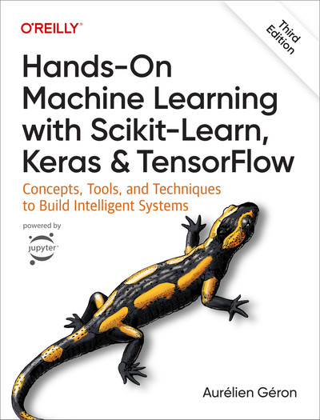{height="360px" fig-align="center"}

::: {style="text-align: center; font-size: 0.75em; margin-top: 5px;"}
Capítulo 7 [@geron2022hands]
:::
:::

::: {.column width="33%"}
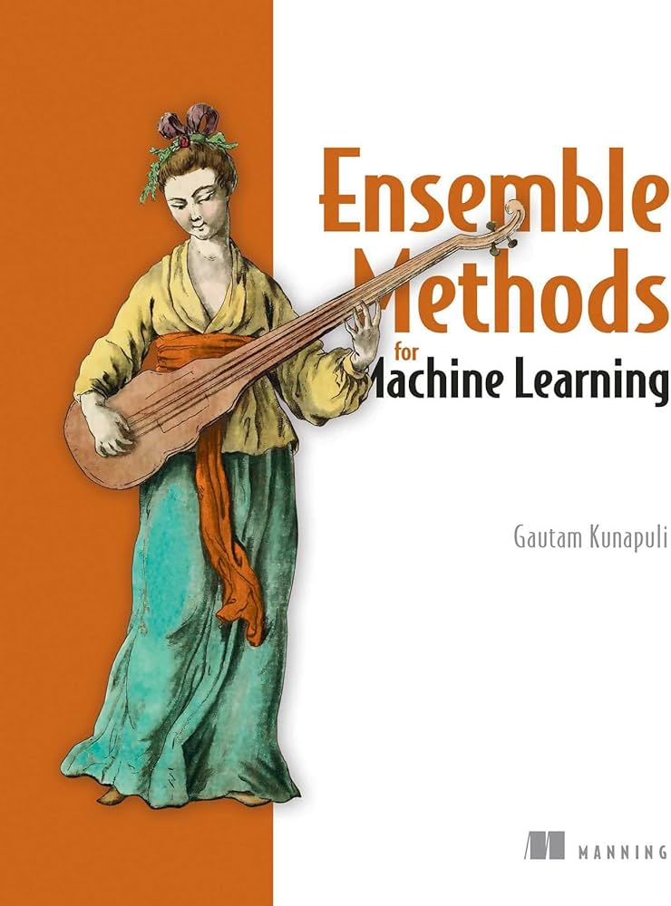{height="360px" fig-align="center"}

::: {style="text-align: center; font-size: 0.75em; margin-top: 5px;"}
Caps. 1, 2, 3, 5 [@kunapuli2023ensemble]
:::
:::

::::


## Sabiduría Colectiva en Diagnóstico Médico

¿Cómo se diagnostica si un paciente tiene cáncer combinando opiniones médicas?

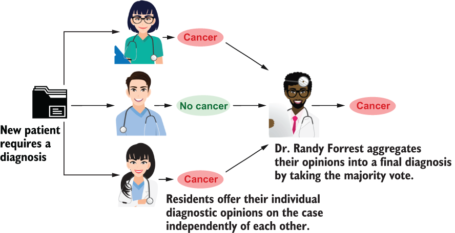{height="390px" fig-align="center"}

::: {style="text-align: center; font-size: 0.65em; margin-top: 5px;"}
Tomado de: [@kunapuli2023ensemble]
:::


## Sabiduría de la Multitud con IA

¿Cómo se formula el mismo diagnóstico combinando múltiples modelos de IA?

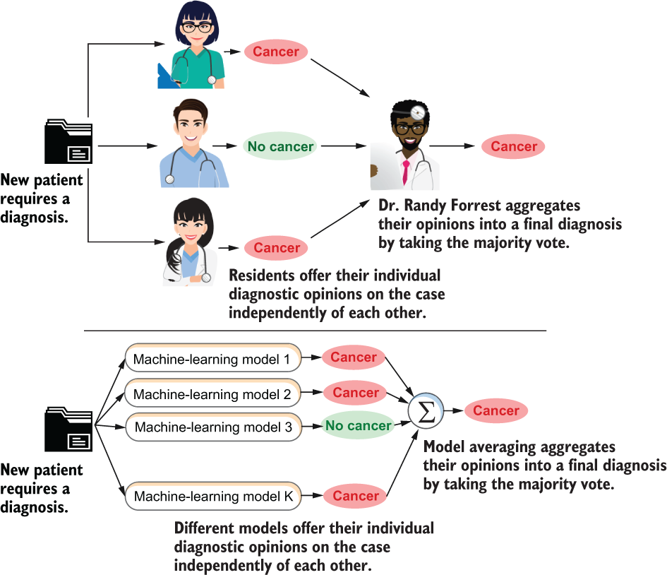{height="390px" fig-align="center"}

::: {style="text-align: center; font-size: 0.65em; margin-top: 5px;"}
Tomado de: [@kunapuli2023ensemble]
:::


## Evidencia Empírica Favorable a Ensambles

¿Qué familia de algoritmos lidera el rendimiento en problemas reales? [@olson2018data]

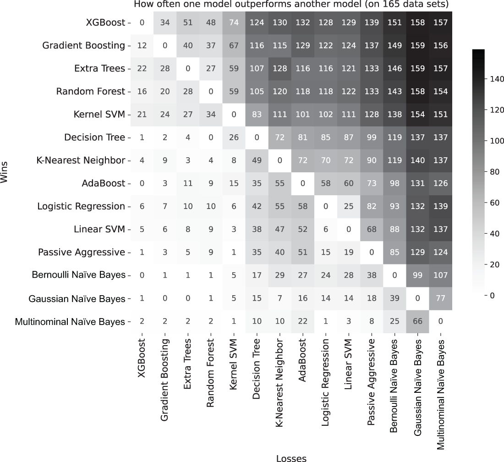{height="390px" fig-align="center"}

::: {style="text-align: center; font-size: 0.65em; margin-top: 5px;"}
Tomado de: [@kunapuli2023ensemble]
:::


## Los Ensambles Combinan Modelos Débiles

- **Principio central:** Basado en *"la sabiduría de la multitud"*.
- **Construcción:** Combina múltiples modelos débiles para crear uno robusto.
- **Reducción de error:** Reduce simultáneamente el sesgo y la varianza.
- **Beneficio clave:** Incrementa la precisión y la estabilidad general.


## Tres Categorías Principales de Ensambles

- **Homogéneos Paralelos (*Bagging*):** Modelos iguales sobre muestras bootstrap. Reduce varianza.
- **Heterogéneos Paralelos (*Voting / Stacking*):** Modelos de distinta familia algorítmica combinados.
- **Secuenciales (*Gradient Boosting*):** Modelos en cascada donde cada uno corrige residuos previos.


# Parallel Homogeneous Ensembles

## Arquitectura de Ensamble Homogéneo

Todos los estimadores base pertenecen a la misma familia algorítmica:

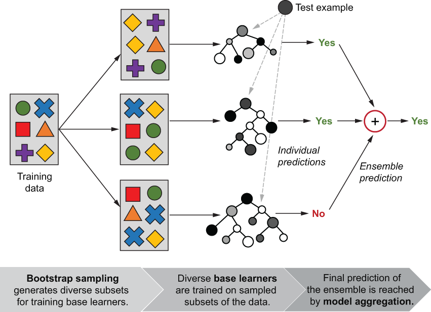{height="390px" fig-align="center"}

::: {style="text-align: center; font-size: 0.65em; margin-top: 5px;"}
Tomado de: [@kunapuli2023ensemble]
:::


## Bootstrapping Genera Muestras Diversas

:::: {.columns}

::: {.column width="48%"}
- **Muestreo con reemplazo:** Permite repetir instancias en cada muestra.
- **Subconjuntos diversos:** Estimadores entrenan con datos variados.
- **Out-of-Bag (OOB):** Datos no seleccionados evalúan el modelo sin test set.
:::

::: {.column width="52%"}
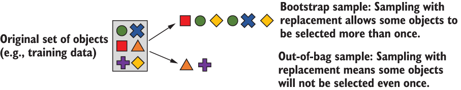{height="340px" fig-align="center"}

::: {style="text-align: center; font-size: 0.65em; margin-top: 5px;"}
Tomado de: [@kunapuli2023ensemble]
:::
:::

::::


## Muestreo con Reemplazo en Bagging

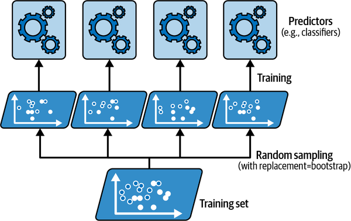{height="400px" fig-align="center"}

::: {style="text-align: center; font-size: 0.65em; margin-top: 5px;"}
Tomado de: [@geron2022hands]
:::


## Implementación de Bagging: Entrenamiento

```python
import numpy as np
from sklearn.tree import DecisionTreeClassifier

rng = np.random.RandomState(seed=4190)

def bagging_fit(X, y, n_estimators, max_depth=5, max_samples=200):
    n_examples = len(y)
    estimators = [DecisionTreeClassifier(max_depth=max_depth) for _ in range(n_estimators)]
    
    for tree in estimators:
        bag = rng.choice(n_examples, max_samples, replace=True)
        tree.fit(X[bag, :], y[bag])
        
    return estimators
```


## Implementación de Bagging: Inferencia

```python
import numpy as np
from scipy.stats import mode

def bagging_predict(X, estimators):
    all_predictions = np.array([tree.predict(X) for tree in estimators])
    ypred, _ = mode(all_predictions, axis=0, keepdims=False)
    return np.squeeze(ypred)
```


## Bagging Suaviza Límites de Decisión

:::: {.columns}

::: {.column width="45%"}
- **Árbol simple (izq.):** Sobreajusta y es muy sensible al ruido.
- **Ensamble (der.):** Suaviza la frontera de decisión al promediar.
:::

::: {.column width="55%"}
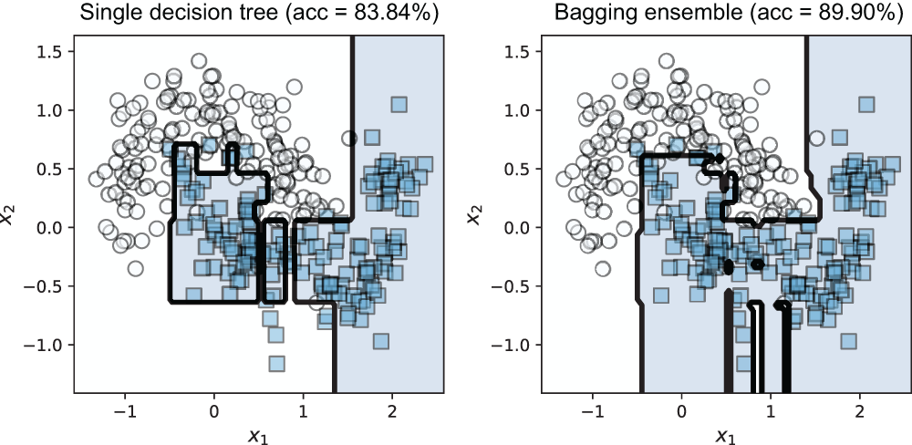{height="340px" fig-align="center"}

::: {style="text-align: center; font-size: 0.65em; margin-top: 5px;"}
Tomado de: [@kunapuli2023ensemble]
:::
:::

::::


## BaggingClassifier en Scikit-Learn

```python
from sklearn.tree import DecisionTreeClassifier
from sklearn.ensemble import BaggingClassifier

base_tree = DecisionTreeClassifier(max_depth=10)
bag_ens = BaggingClassifier(
    estimator=base_tree,
    n_estimators=500,
    max_samples=100,
    oob_score=True,
    random_state=42
)
bag_ens.fit(Xtrn, ytrn)
ypred = bag_ens.predict(Xtst)
```


## Paralelización Eficiente con n_jobs

:::: {.columns}

::: {.column width="58%"}
```python
bag_ens = BaggingClassifier(
    estimator=DecisionTreeClassifier(),
    n_estimators=100,
    max_samples=100,
    oob_score=True,
    n_jobs=-1  # Paralelo en todas las CPUs disponibles
)
```
:::

::: {.column width="42%"}
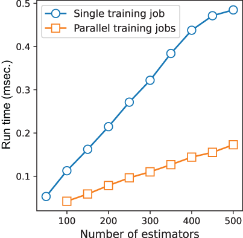{height="300px" fig-align="center"}

::: {style="text-align: center; font-size: 0.65em; margin-top: 5px;"}
Tomado de: [@kunapuli2023ensemble]
:::
:::

::::


## Selección Aleatoria de Características

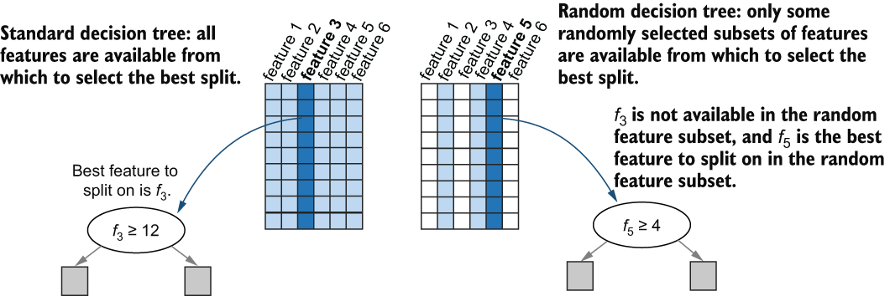{height="400px" fig-align="center"}

::: {style="text-align: center; font-size: 0.65em; margin-top: 5px;"}
Tomado de: [@kunapuli2023ensemble]
:::


## Ventajas Clave de Random Forest

- **Precisión:** Alta robustez frente a ruido y patrones no lineales.
- **Alta dimensionalidad:** Opera eficientemente con muchas variables.
- **Generalización:** Doble aleatorización (filas y columnas) mitiga sobreajuste.
- **Interpretabilidad:** Permite estimar la importancia relativa de variables.


## Hiperparámetros Clave en Random Forest

- `n_estimators`: Número total de árboles en el bosque.
- `max_features`: Tamaño del subconjunto de características por división.
- `max_depth`: Profundidad máxima permitida en cada árbol.
- `min_samples_split`: Muestras mínimas para dividir un nodo interno.


## RandomForestClassifier en Scikit-Learn

```python
from sklearn.ensemble import RandomForestClassifier

rf_ens = RandomForestClassifier(
    n_estimators=500,
    max_depth=10,
    oob_score=True,
    n_jobs=-1,
    random_state=42
)
rf_ens.fit(Xtrn, ytrn)
ypred = rf_ens.predict(Xtst)
```


## Fronteras de Decisión en Random Forest

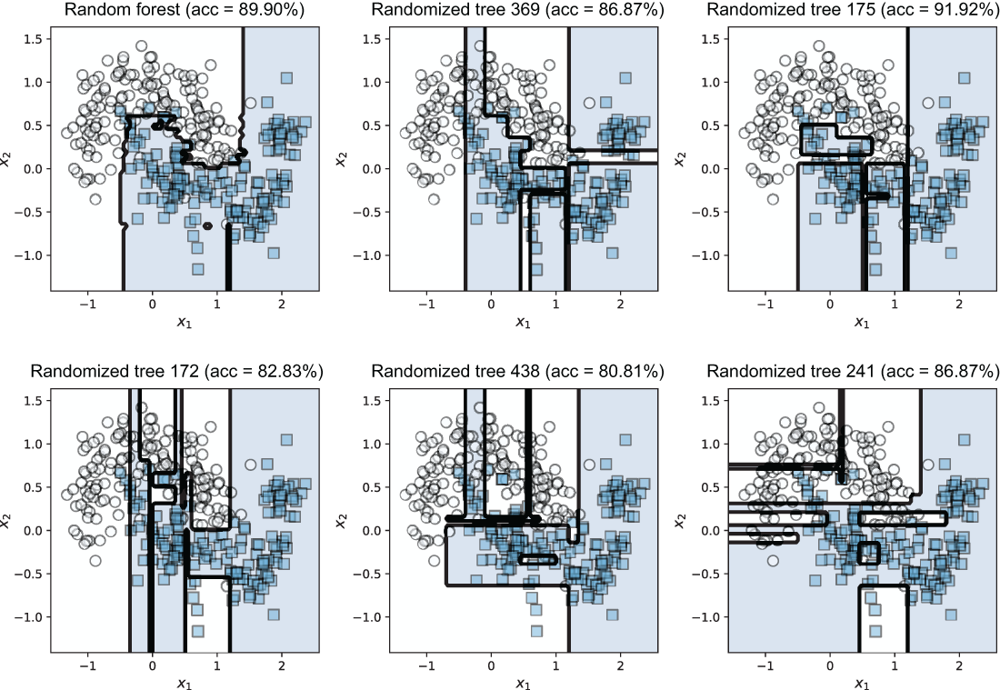{height="400px" fig-align="center"}

::: {style="text-align: center; font-size: 0.65em; margin-top: 5px;"}
Tomado de: [@kunapuli2023ensemble]
:::


## Cálculo de Importancia de Variables

```python
from sklearn.ensemble import RandomForestClassifier
from sklearn.model_selection import train_test_split

X_trn, X_tst, y_trn, y_tst = train_test_split(X, y, test_size=0.15, random_state=42)
rf = RandomForestClassifier(max_leaf_nodes=24, n_estimators=50, n_jobs=-1)
rf.fit(X_trn, y_trn)

importance_threshold = 0.02
for i, (feat, imp) in enumerate(zip(dataset['feature_names'], rf.feature_importances_)):
    if imp > importance_threshold:
        print(f"[{i}] {feat} (score={imp:4.3f})")
```


## Ranking de Importancia de Variables

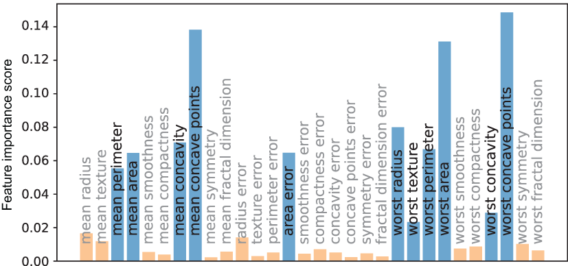{height="400px" fig-align="center"}

::: {style="text-align: center; font-size: 0.65em; margin-top: 5px;"}
Tomado de: [@kunapuli2023ensemble]
:::


# Parallel Heterogeneous Ensembles

## Arquitectura de Ensamble Heterogéneo

Integración de clasificadores de distinta naturaleza algorítmica:

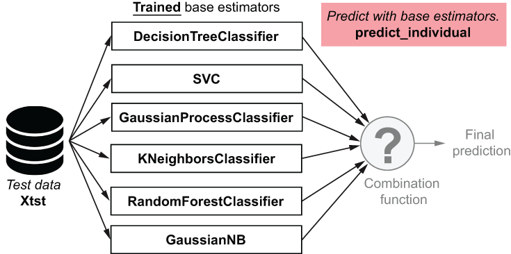{height="390px" fig-align="center"}

::: {style="text-align: center; font-size: 0.65em; margin-top: 5px;"}
Tomado de: [@kunapuli2023ensemble]
:::


## Métodos de Votación: Simple vs Ponderada

:::: {.columns}

::: {.column width="50%"}
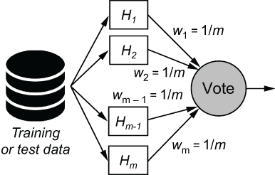{height="320px" fig-align="center"}

::: {style="text-align: center; font-size: 0.7em; margin-top: 5px;"}
Votación Mayoritaria [@kunapuli2023ensemble]
:::
:::

::: {.column width="50%"}
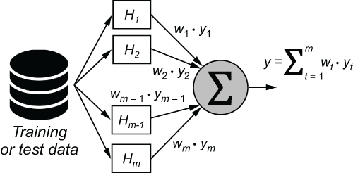{height="320px" fig-align="center"}

::: {style="text-align: center; font-size: 0.7em; margin-top: 5px;"}
Votación Ponderada [@kunapuli2023ensemble]
:::
:::

::::


## Stacking: Meta-Modelo sobre Predicciones

Entrenamiento de un clasificador secundario sobre las salidas de los modelos base:

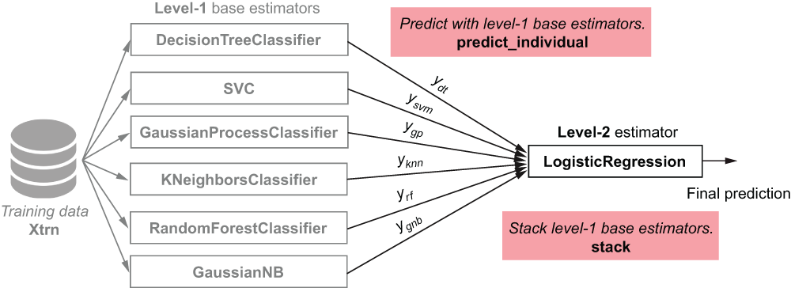{height="390px" fig-align="center"}

::: {style="text-align: center; font-size: 0.65em; margin-top: 5px;"}
Tomado de: [@kunapuli2023ensemble]
:::


# Sequential Gradient Boosting Ensembles

## Arquitectura de Gradient Boosting

Entrenamiento secuencial donde cada modelo se enfoca en los errores del anterior:

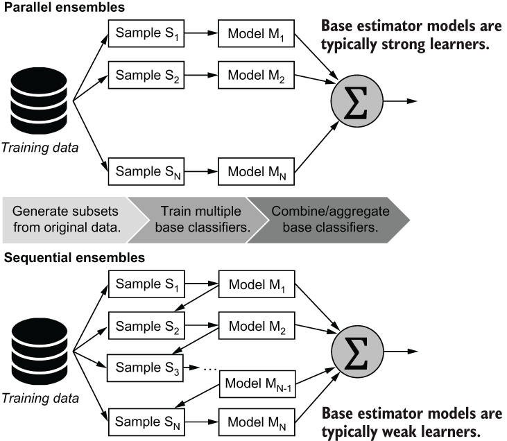{height="390px" fig-align="center"}

::: {style="text-align: center; font-size: 0.65em; margin-top: 5px;"}
Tomado de: [@kunapuli2023ensemble]
:::


## Entrenamiento Secuencial en AdaBoost

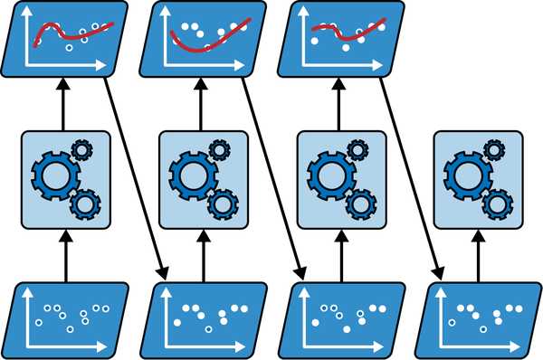{height="400px" fig-align="center"}

::: {style="text-align: center; font-size: 0.65em; margin-top: 5px;"}
Tomado de: [@geron2022hands]
:::


## GBT Paso 1: Ajuste del Modelo Inicial

:::: {.columns}

::: {.column width="45%"}
- Ajusta un primer estimador base a los datos originales.
- Calcula los residuos iniciales ($y - \hat{y}^{(0)}$).
:::

::: {.column width="55%"}
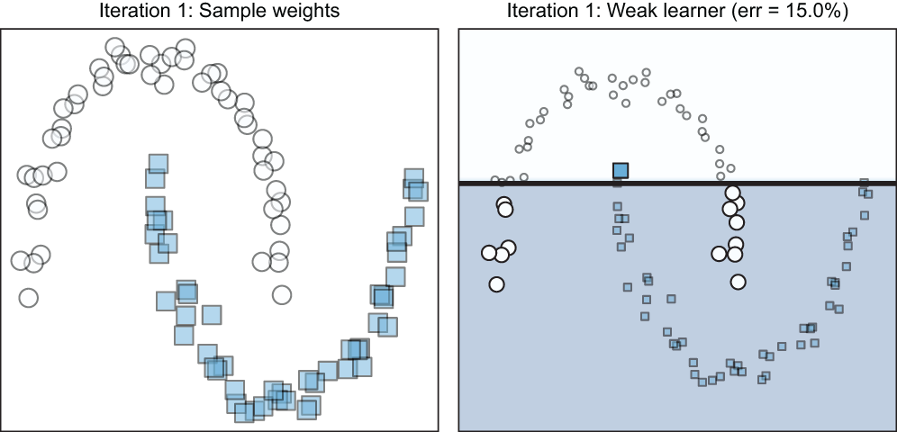{height="330px" fig-align="center"}

::: {style="text-align: center; font-size: 0.65em; margin-top: 5px;"}
Tomado de: [@kunapuli2023ensemble]
:::
:::

::::


## GBT Paso 2: Corrección de Residuos

:::: {.columns}

::: {.column width="45%"}
- El nuevo árbol modela los pseudo-residuos del anterior.
- La combinación lineal reduce progresivamente el sesgo.
:::

::: {.column width="55%"}
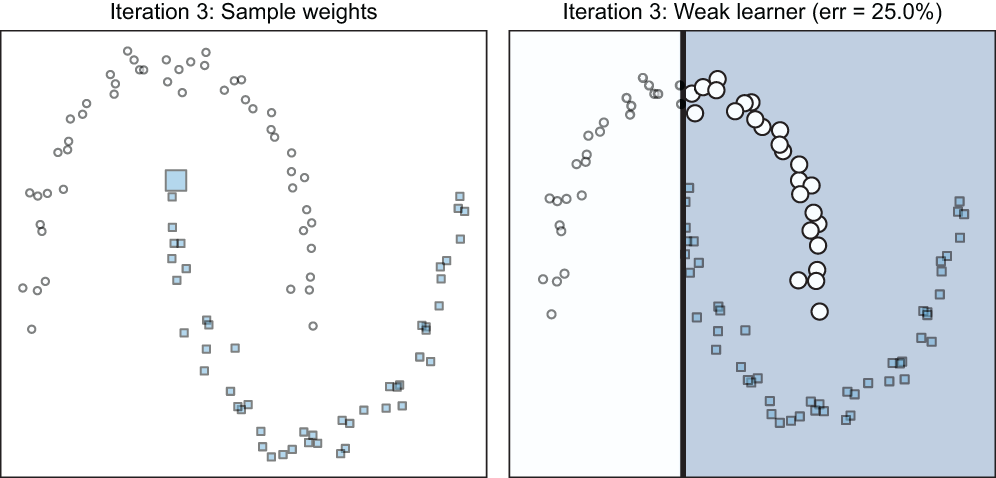{height="330px" fig-align="center"}

::: {style="text-align: center; font-size: 0.65em; margin-top: 5px;"}
Tomado de: [@kunapuli2023ensemble]
:::
:::

::::


## GBT Paso 3: Convergencia del Ensamble

:::: {.columns}

::: {.column width="45%"}
- El ensamble final captura patrones no lineales complejos.
- Requiere controlar `learning_rate` (*shrinkage*) para no sobreajustar.
:::

::: {.column width="55%"}
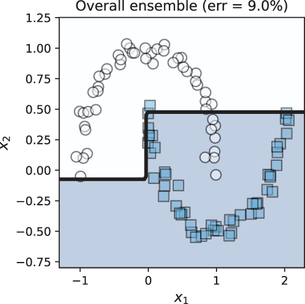{height="330px" fig-align="center"}

::: {style="text-align: center; font-size: 0.65em; margin-top: 5px;"}
Tomado de: [@kunapuli2023ensemble]
:::
:::

::::


## Hiperparámetros Clave en GBT

- `n_estimators`: Número total de árboles secuenciales en el ensamble.
- `learning_rate`: Ponderación del aporte de cada árbol (*shrinkage*).
- `max_depth`: Profundidad máxima (árboles típicamente poco profundos).
- `subsample`: Fracción de datos para cada árbol (*Stochastic Boosting*).
- `colsample_bytree`: Fracción de características por árbol.


# Comparación de Enfoques

## Random Forest vs Gradient Boosted Trees

::: {style="font-size: 0.75em;"}
| **Característica** | **Random Forest** | **Gradient Boosted Trees** |
|:---|:---|:---|
| **Enfoque** | Bagging (Paralelo) | Boosting (Secuencial) |
| **Paralelización** | Totalmente paralelizable | Secuencial (paraleliza dentro del árbol) |
| **Rendimiento** | Alta precisión y estabilidad | Máxima precisión (SOTA en datos tabulares) |
| **Sobreajuste** | Bajo riesgo (asintótico al sumar árboles) | Alto riesgo si no se regulariza adecuadamente |
| **Sensibilidad** | Robusto a hiperparámetros por defecto | Muy sensible a `learning_rate` y profundidad |
| **Importancia Vars** | Importancia Gini / Permutación | Importancia por Ganancia / Cobertura |
:::


# Ecosistema y Librerías

## Guía de Selección de Algoritmos

¿Cómo seleccionar el ensamble adecuado para nuestros datos?

{height="400px" fig-align="center"}

::: {style="text-align: center; font-size: 0.65em; margin-top: 5px;"}
Tomado de: [@geron2022hands]
:::


## Comparativa de Librerías en Python

::: {style="font-size: 0.65em;"}
| **Modelo** | **Librería** | **Enfoque** | **Categóricas** | **Valores Nulos** | **Rendimiento / Velocidad** |
|:---|:---|:---|:---|:---|:---|
| **Random Forest** | `scikit-learn` | Bagging | Requiere codificación previa | No soportado nativo | Paralelo, alto consumo de memoria |
| **Gradient Boosting** | `scikit-learn` | Boosting | Requiere codificación previa | Soportado en `HistGradient` | Secuencial puro, velocidad moderada |
| **XGBoost** | `xgboost` | Level-wise Boosting | Soporte experimental | Soporte nativo (dirección óptima) | Muy rápido, optimizado en C++ / GPU |
| **LightGBM** | `lightgbm` | Leaf-wise Boosting | Soporte nativo muy eficiente | Soporte nativo | Extremadamente rápido y ligero en RAM |
| **CatBoost** | `catboost` | Oblivious Trees | Soporte nativo especializado | Soporte nativo | Inferencia ultra rápida, excelente con GPU |
:::


## Código: Random Forest en Scikit-Learn

```python
from sklearn.ensemble import RandomForestClassifier
from sklearn.model_selection import train_test_split
from sklearn.metrics import accuracy_score

X_train, X_test, y_train, y_test = train_test_split(X, y, test_size=0.2, random_state=42)

rf = RandomForestClassifier(n_estimators=100, max_depth=5, random_state=42)
rf.fit(X_train, y_train)

y_pred = rf.predict(X_test)
print(f"Accuracy RF: {accuracy_score(y_test, y_pred):.4f}")
```


## Código: Gradient Boosting con XGBoost

```python
import xgboost as xgb
from sklearn.model_selection import train_test_split
from sklearn.metrics import accuracy_score

X_train, X_test, y_train, y_test = train_test_split(X, y, test_size=0.2, random_state=42)

xgb_model = xgb.XGBClassifier(n_estimators=100, max_depth=5, learning_rate=0.1, random_state=42)
xgb_model.fit(X_train, y_train)

y_pred = xgb_model.predict(X_test)
print(f"Accuracy XGBoost: {accuracy_score(y_test, y_pred):.4f}")
```


## Referencias

::: {#refs}
:::
