# Presentación

## ¡Presenta a tu Socio!

 ¡Hola a todos!

Comparte lo siguiente sobre tu socio:

**Nombre**, semestre, su **profesión ideal**, dónde les gustaría  **emprender** y qué les llama la **atención** sobre esta clase.

## Estadísticas de Clase

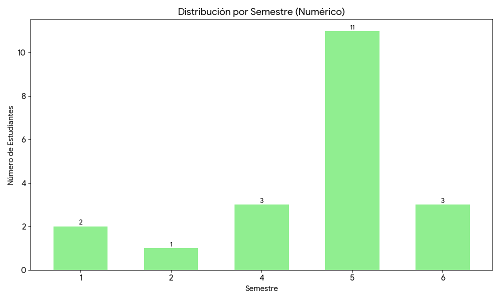{width="45%"}  
 
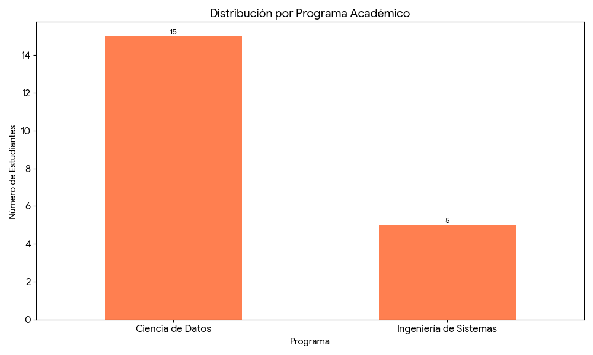{width="45%"}

## ¡Conozcámonos!

:::: {.columns}

::: {.column width="70%"}
- Soy Oscar Bustos
- Ingeniero Metratrónico, PhD. (c) en Ingeniería - PUJ
- Docente Javeriano, Tech Manager en Mercadolibre
- Me gusta todo lo relacionado con IA / Advanced Analytics

:::

::: {.column width="30%"}
{width="100%"}
:::

::::

# Evaluación y Logística

## Estructura del Curso

- **Exposición**
  - Exposición 10\%
- **Talleres**
  - Talleres 40\%
  - Un taller por clase
- **Proyecto Final**
  - Entrega 1: 25\%
  - Entrega 2: 25\%

## Reglas

- Todas las clases tienen un **taller práctico** asociado, para entregar los domingos a las **11:59pm**
- Los talleres se resuelven y se envían en **parejas**. 
- El proyecto en grupo debe ser integrado por **4 personas**, 2 parejas idealmente. 
- Todas las entregas se hacen a través del **Campus Virtual** 
## Reglas - Continuación

- Las clases empiezan a las **7:10am** y terminan a las **9:45am**, con un descanso de 15 minutos a las **8:30am**
- Esta es una clase **amigable con la IA**. Se promueve el uso de la IA para la generación de código Python, para que el estudiante se enfoque en el análisis de los datos y de los modelos.
- Para garantizar un ambiente agradable y libre de distracciones para todos, les agradecemos no fumar ni **vapear** en el salón de clase.
- Con el fin de mantener la limpieza de nuestro espacio de trabajo, les solicitamos amablemente **no consumir alimentos** en el salón.

## Lecturas y Videos

- Todas las clases hay una lectura previa y un video recomendado
- Todos los libros se encuentran en la plataforma de Springer Nature y O'Reilly
- Se puede acceder a través de los recursos virtuales de la biblioteca en el siguiente enlace: [https://javeriana.libguides.com/az.php?a=o](https://javeriana.libguides.com/az.php?a=o)

## Libros de la Clase

{width="30%"}  
{width="30%"}
 
{width="30%"}

## Cronograma

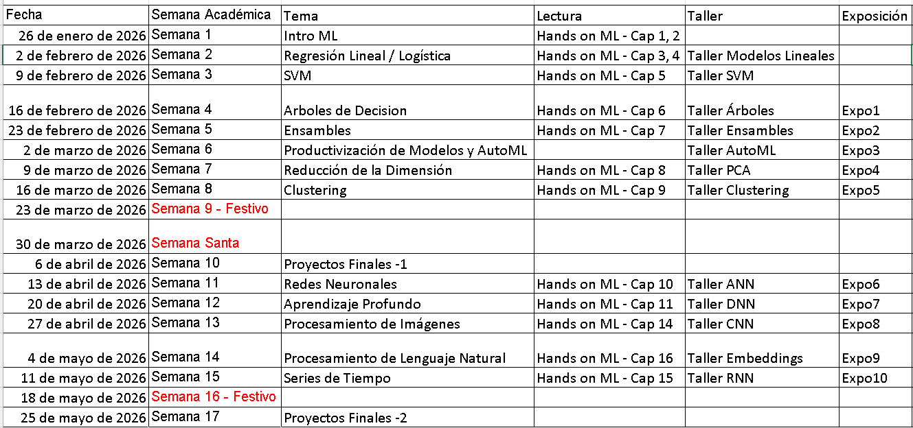{width="100%"}

# Motivación de la Clase

## Definiciones

 **Pregunta**

- ¿Qué es inteligencia artificial?
- ¿Qué es el aprendizaje de máquina?
- ¿Qué es aprendizaje profundo?

## Definición de Inteligencia Artificial

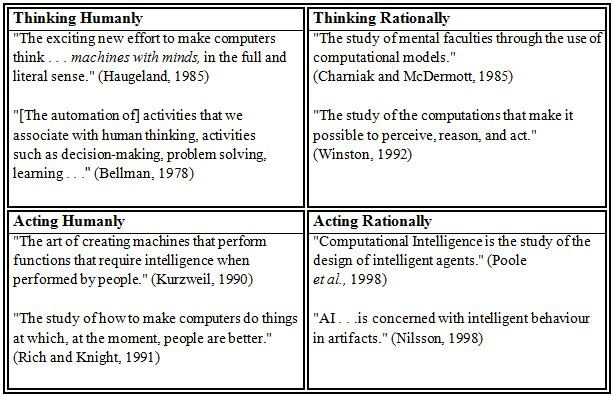{width="60%"}
	 [@russell_norvig_2020]

## Definición de Aprendizaje de Máquina

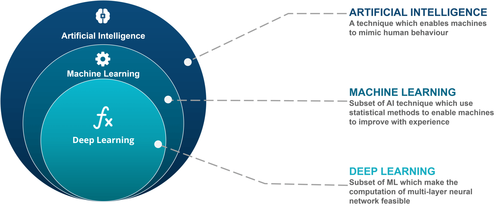{width="80%"}
	 [https://www.edureka.co/blog/ai-vs-machine-learning-vs-deep-learning/](https://www.edureka.co/blog/ai-vs-machine-learning-vs-deep-learning/)

## Aproximación Tradicional

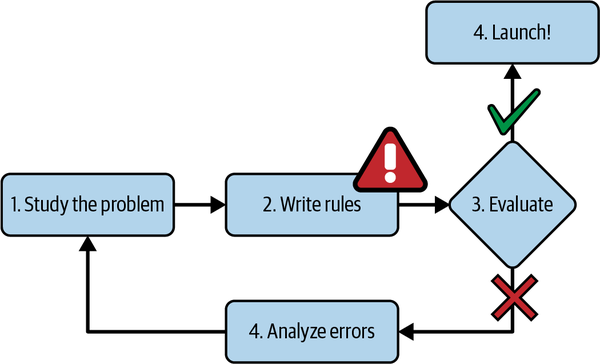{width="60%"} 
	 [@geron2022hands] Capítulo 1

## Aprendizaje de Máquina

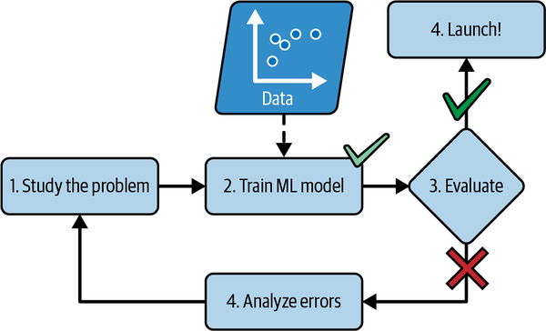{width="60%"} 
	 [@geron2022hands] Capítulo 1

## Aprendizaje de Máquina Continuo

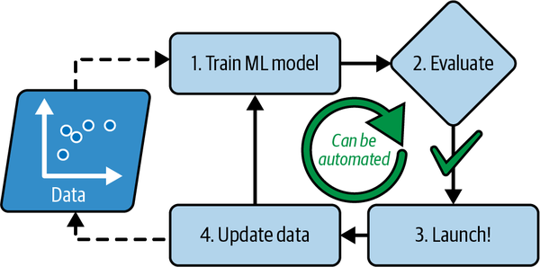{width="60%"} 
	 [@geron2022hands] Capítulo 1

## Historia de la IA

 **Pregunta**

Si la IA ya existía en los años 50, ¿por qué hasta ahora estamos viendo una clase sobre esto en la universidad como algo 'nuevo'?

[https://www.mckinsey.com/capabilities/quantumblack/our-insights/an-executives-guide-to-ai](https://www.mckinsey.com/capabilities/quantumblack/our-insights/an-executives-guide-to-ai)

## Roles Orientados a Datos - Data Analyst

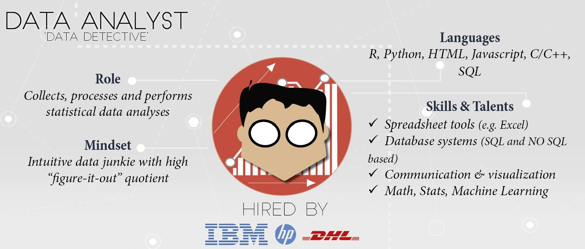{width="100%"}
	 Tomado de: [https://www.datacamp.com/tutorial/data-science-industry-infographic](https://www.datacamp.com/tutorial/data-science-industry-infographic)

## Roles Orientados a Datos  - Data Analyst

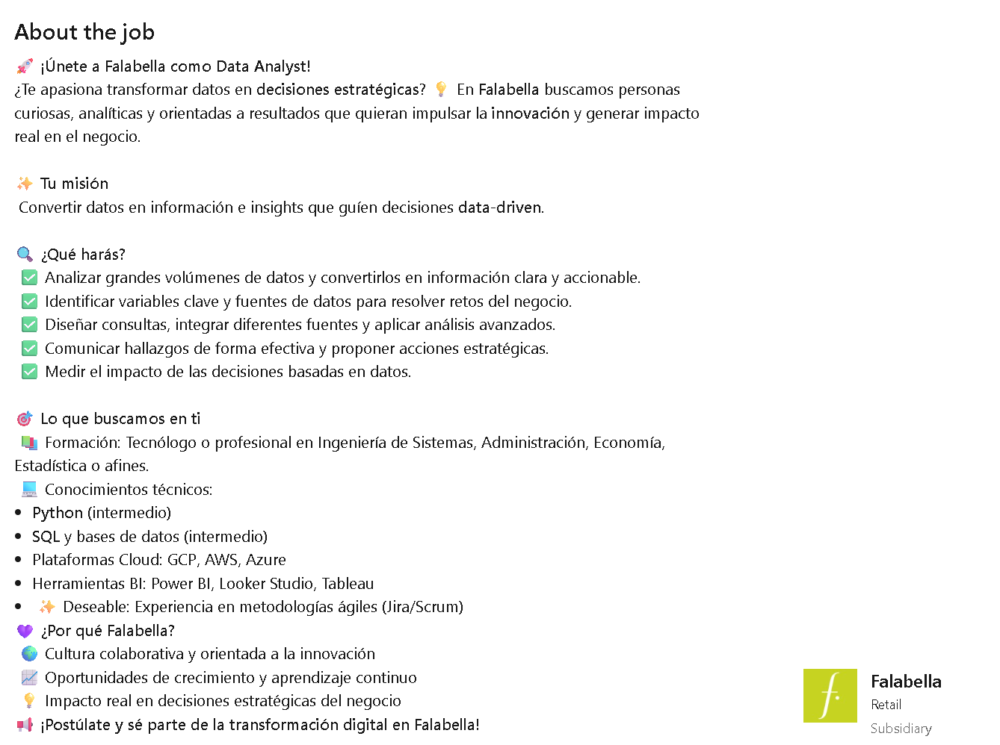{width="60%"}
	 Tomado de Linkedin

## Roles Orientados a Datos- Data Scientist

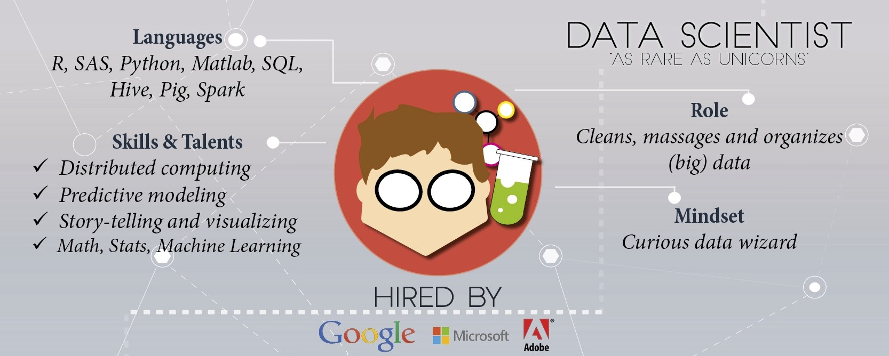{width="100%"}
	 Tomado de: [https://www.datacamp.com/tutorial/data-science-industry-infographic](https://www.datacamp.com/tutorial/data-science-industry-infographic)

## Roles Orientados a Datos- Data Scientist

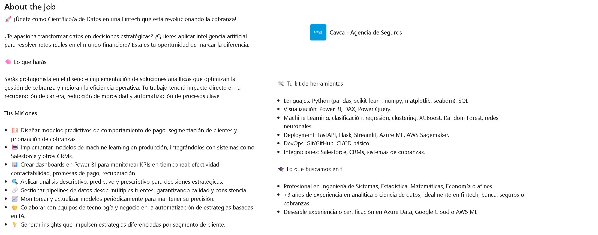{width="100%"}
	 Tomado de Linkedin

## Roles Orientados a Datos

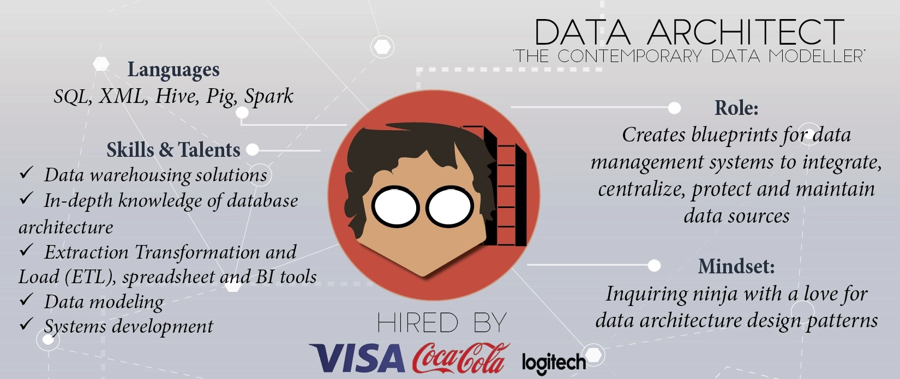{width="100%"}
	 Tomado de: [https://www.datacamp.com/tutorial/data-science-industry-infographic](https://www.datacamp.com/tutorial/data-science-industry-infographic)

## Roles Orientados a Datos

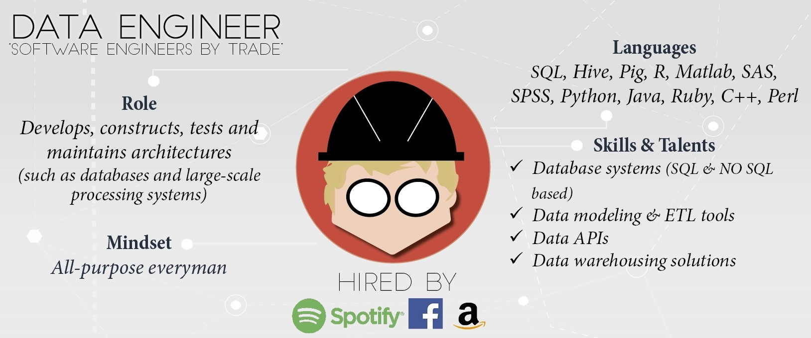{width="100%"}
	 Tomado de: [https://www.datacamp.com/tutorial/data-science-industry-infographic](https://www.datacamp.com/tutorial/data-science-industry-infographic)

## Remuneración

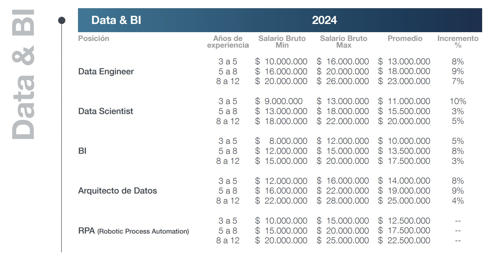{width="80%"}
	 Tomado de: [https://www.michaelpage.com.co/estudios-y-tendencias/estudio-de-remuneracion-tecnologia-2024-1-IT-088](https://www.michaelpage.com.co/estudios-y-tendencias/estudio-de-remuneracion-tecnologia-2024-1-IT-088)

## Remuneración

 **Pregunta**

¿Saben por qué el mercado paga entre 13 y 20 millones de pesos a un junior en estos roles?

	 Tomado de: [https://www.michaelpage.com.co/estudios-y-tendencias/estudio-de-remuneracion-tecnologia-2024-1-IT-088](https://www.michaelpage.com.co/estudios-y-tendencias/estudio-de-remuneracion-tecnologia-2024-1-IT-088)

## Objetivos de Formación

- **Herramientas Prácticas:** Brindar herramientas de Machine Learning para el desarrollo de soluciones a problemas reales.
- **Desarrollo de Habilidades:** Aplicar conceptos fundamentales para fortalecer la capacidad de abstracción y la resolución de problemas.
- **Conciencia Crítica:** Generar reflexión sobre el impacto social y las implicaciones éticas del Machine Learning.

## Resultados de Aprendizaje Esperados

Al finalizar el curso, el estudiante podrá:
- **Resolver Problemas:** Aplicar principios de Machine Learning para solucionar problemas en su campo profesional.
- **Validar Soluciones:** Diseñar experimentos para evaluar la efectividad de las soluciones implementadas.
- **Actuar con Ética:** Discutir y aplicar la responsabilidad ética y social en el uso de la tecnología, fomentando el autoaprendizaje.

## Libros - Ética en IA

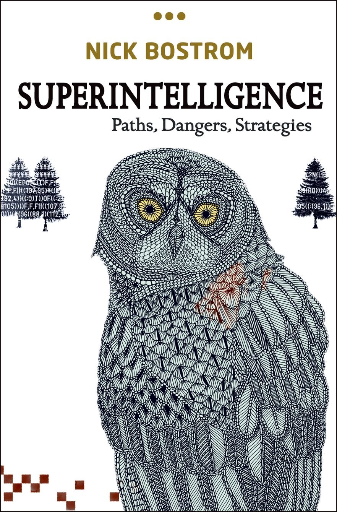{width="30%"}  
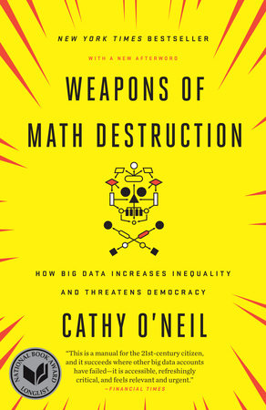{width="30%"}
 
{width="30%"}

# Aprendizaje de Máquina

# Herramientas

## Popularidad de los lenguajes de programación

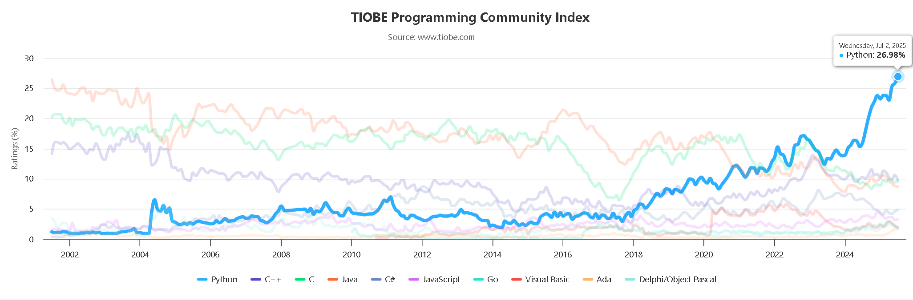{width="100%"}
	 Tomado de [https://www.tiobe.com/tiobe-index/](https://www.tiobe.com/tiobe-index/)

## Sklearn y Problemas de ML

{width="90%"}

## Herramientas Sugeridas

\begin{table}[h]

| **Nombre** | **Descripción** | **Enlace** |
| --- | --- | --- |
| Google Colab | Herramienta de ambiente de ejecución en la nube para documentar y ejecutar código Python | [https://colab.research.google.com](https://colab.research.google.com) |
| Google Gemini | Modelo LLM para aprendizaje de programación Python | [https://gemini.google.com/](https://gemini.google.com/) |
| N8N | Plataforma de desarrollo de workflows | [https://n8n.io/](https://n8n.io/) |

\caption{Herramientas de IA}
\end{table}

## Google Colab

:::: {.columns}

::: {.column width="40%"}
Ambiente de desarrollo en Python o R para el análisis de datos. Permite la ejecución en la nube de programas, con una cantidad generosa de recursos.
:::

::: {.column width="60%"}
{width="100%"}
:::

::::

## Google Colab con Gemini

:::: {.columns}

::: {.column width="40%"}
Cuenta con el chat de Gemini embebido en el ambiente de desarrollo. Asiste en la escritura de código.
:::

::: {.column width="60%"}
{width="100%"}
:::

::::

## Análisis Exploratorio de Datos

:::: {.columns}

::: {.column width="50%"}
**Prompt**: Haz un analisis exploratorio de datos del archivo de github datasciencedojo titanic.csv usando la librería ydata-profiling. Instala la ultima version disponible de la libreria.
:::

::: {.column width="50%"}
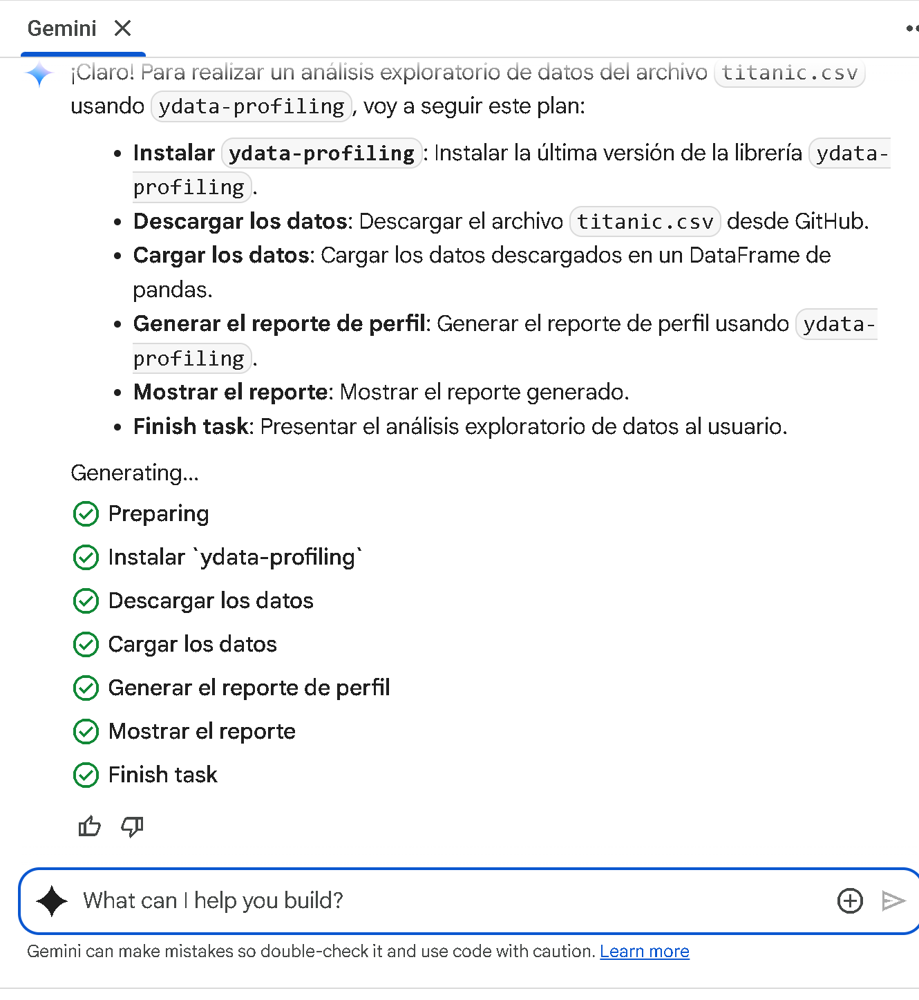{width="100%"}
:::

::::

## Análisis Exploratorio de Datos

:::: {.columns}

::: {.column width="40%"}
**Prompt**: Haz un analisis exploratorio de datos del archivo de github datasciencedojo titanic.csv usando la librería ydata-profiling. Instala la ultima version disponible de la libreria.
:::

::: {.column width="60%"}
{width="100%"}
:::

::::

\nocite{*}

## References

\AtNextBibliography{}
\printbibliography

