# Repaso

## Icebreaker: Trabajo Futuro

{width="50%"}

- ¿Cómo se realizará el trabajo en el futuro y quién lo llevará a cabo?

## Capítulos sobre Deep Learning

:::: {.columns}

::: {.column width="50%"}

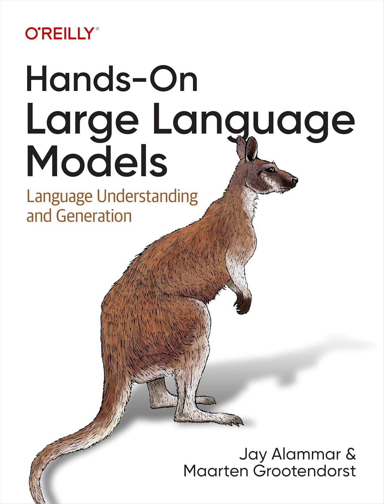{width="60%"} 
Capítulo 1 y 2

:::

::: {.column width="50%"}

{width="60%"} 
Capítulo 16
:::
::::

## Zoológico de Redes neuronales

{width="70%"}

[The Neural Network Zoo](https://www.asimovinstitute.org/neural-network-zoo/)

## Zoológico de Redes neuronales

{width="90%"}

[The Neural Network Zoo](https://www.asimovinstitute.org/neural-network-zoo/)

## Zoológico de Redes neuronales

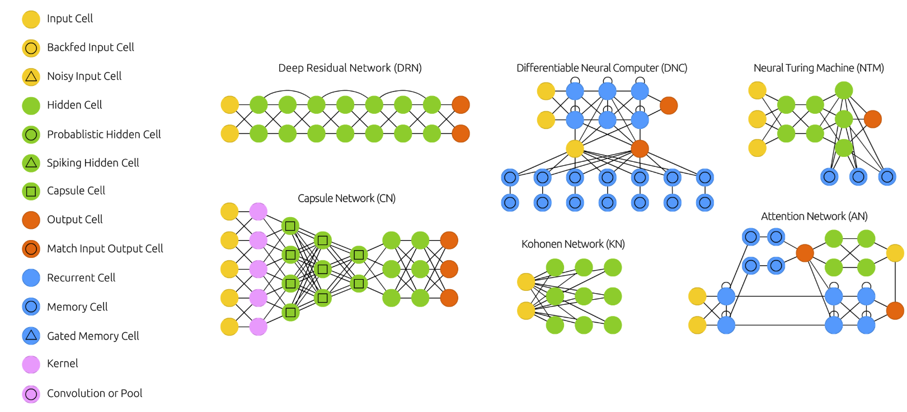{width="90%"}

[The Neural Network Zoo](https://www.asimovinstitute.org/neural-network-zoo/)

## Attention Networks (AN)

**Aplicación Ideal:** Modelado de dependencias a largo plazo en datos secuenciales.
- Traducción automática con Transformers.
- Generación de resúmenes automáticos.
- Análisis de documentos extensos.
- Base de los Large Language Models (LLM)

# Búsqueda Semántica

## Tareas principales en PLN

Qué tipo de sistema utilizarías para resolver las siguientes preguntas:
- ¿Cuáles 10 novelas son más parecidas a Cien Años de Soledad?
- ¿Dame 5 imágenes similares a esta imagen de un colibrí?
- ¿Cuál es el usuario que tiene las características de compra más parecidas a este adulto de 53 años?
- ¿Cuáles de las llamadas de Call Center corresponden a clientes furiosos o no satisfechos con el servicio?

## Búsqueda en Sentencias Judiciales

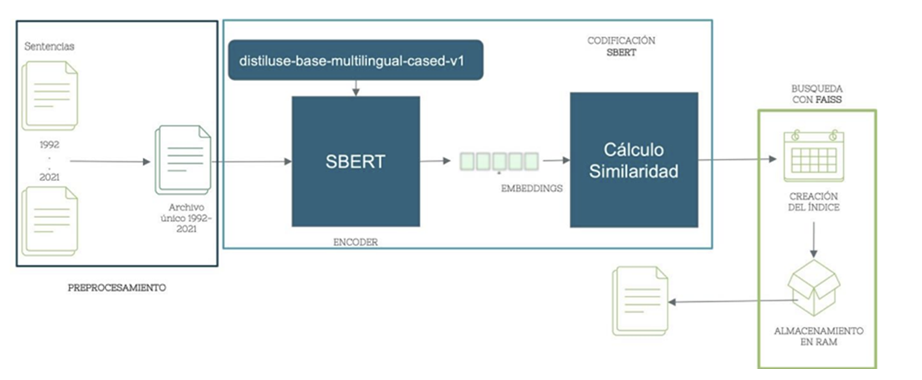{width="80%"}

- Búsqueda semántica de sentencias judiciales usando técnicas actuales del NLP y métodos de recuperación de información ([@MartinezPinilla20220615])

## Recomendación en Libros

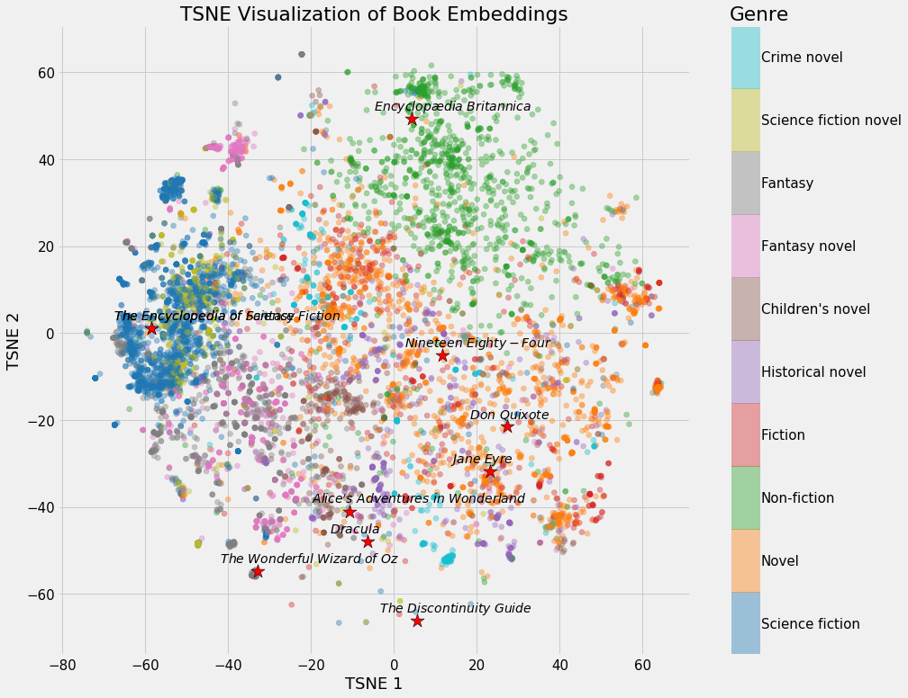{width="60%"}

Representación vectorial de una colección de Libros ([enlace](https://towardsdatascience.com/neural-network-embeddings-explained-4d028e6f0526/))

## Procesamiento de Lenguaje Natural

El Procesamiento de Lenguaje Natural (PLN) es una subdisciplina de la inteligencia artificial que se enfoca en la interacción entre las computadoras y los lenguajes humanos.

Implica el desarrollo de algoritmos y modelos para comprender, interpretar y generar lenguaje humano.

## Índice Invertido

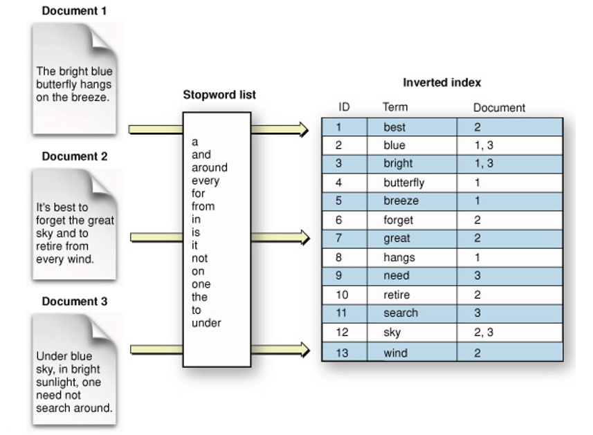{width="60%"}
Indice Invertido

## Ejemplo de Código: Índice Invertido

\begin{lstlisting}[language=Python, style=mystyle]
from sklearn.feature_extraction.text import CountVectorizer
def build_inverted_index(documents, stopwords):
vectorizer = CountVectorizer(stop_words=stopwords)
X = vectorizer.fit_transform(documents)
return {term: set(X[:, i].nonzero()[0]) for i, term in enumerate(vectorizer.get_feature_names_out())}
documents = [
"el gato corre por el tejado en una noche estrellada",
"un perro ladra mientras la luna brilla",
"las estrellas iluminan el cielo nocturno"
]
stopwords = ["el", "un", "la", "en", "por", "mientras"]
inverted_index = build_inverted_index(documents, stopwords)
for word, doc_ids in inverted_index.items():
print(f"{word}: {sorted(doc_ids)}")
\end{lstlisting}

## Tokenización

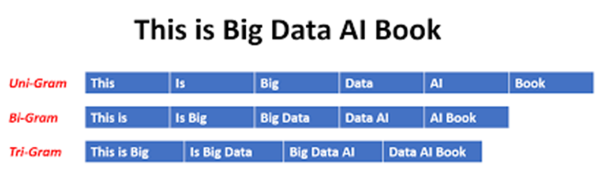{width="90%"} 
Tokenización

## Ejemplo de Código: Trigrama

\begin{lstlisting}[language=Python, style=mystyle]
from sklearn.feature_extraction.text import CountVectorizer
def build_inverted_index(documents, stopwords):
vectorizer = CountVectorizer(stop_words=stopwords,
ngram_range=(3, 3))
X = vectorizer.fit_transform(documents)
return {term: set(X[:, i].nonzero()[0]) for i, term in
enumerate(vectorizer.get_feature_names_out())}
documents = [
"el gato corre por el tejado en una noche estrellada",
"un perro ladra mientras la luna brilla",
"las estrellas iluminan el cielo nocturno"
]
stopwords = ["el", "un", "la", "en", "por", "mientras"]
inverted_index = build_inverted_index(documents, stopwords)
for word, doc_ids in inverted_index.items():
print(f"{word}: {sorted(doc_ids)}")
\end{lstlisting}

## Nube de Palabras

{width="70%"} 
Nube de Palabras

## Ejemplo de Código: Nube de Palabras desde la Web

\begin{lstlisting}[language=Python, style=mystyle]
import requests
from bs4 import BeautifulSoup
import matplotlib.pyplot as plt
from wordcloud import WordCloud
import nltk
from nltk.corpus import stopwords
nltk.download('stopwords')
stopwords_es = set(stopwords.words("spanish"))
url = "https://www.bbc.com/mundo/articles/c5y0we82ew3o"
soup = BeautifulSoup(requests.get(url).text, "html.parser")
texto = " ".join([p.get_text() for p in soup.find_all("p")])
nube = WordCloud(stopwords=stopwords_es, width=800, height=400).generate(texto)
plt.imshow(nube), plt.axis("off"), plt.show()
\end{lstlisting}

## Cómo leer un libro en PDF en Segundos

1. **Extraer el texto del PDF:**
  - Utiliza herramientas como `pdftotext` (en Linux/macOS) o aplicaciones en línea.
  - Guarda el texto extraído en un archivo `.txt`.
1. **Limpiar el texto:**
  - Elimina caracteres especiales, números y palabras comunes (stop words).
  - Puedes usar scripts en Python con librerías como `nltk`.
1. **Generar la nube de palabras:**
  - Puedes usar librerías de Python como `wordcloud`.

## Ejemplo de Código: Ejemplo de Lectura de libros en PDF

\begin{lstlisting}[language=Python, style=mystyle]
import ...
nltk.download('stopwords')
stopwords_es = set(stopwords.words("spanish"))
def extraer_texto_pdf(ruta_pdf):
texto = ""
with open(ruta_pdf, 'rb') as archivo_pdf:
lector_pdf = PdfReader(archivo_pdf)
for pagina in lector_pdf.pages:
texto += pagina.extract_text() or ""
return texto
ruta_pdf = "cienaniossoledad.pdf"
texto = extraer_texto_pdf(ruta_pdf)
nube = WordCloud(stopwords=stopwords_es, width=800, height=400)
.generate(texto)
plt.imshow(nube), plt.axis("off"), plt.show()
\end{lstlisting}

## Lexicon

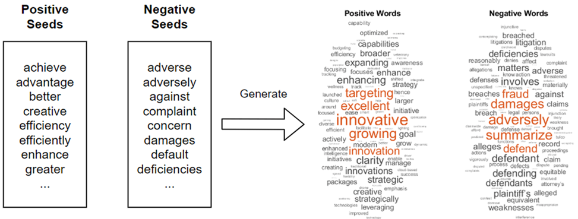{width="90%"} 
Lexicon

## Análisis de Sentimientos

{width="90%"} 
Análisis de Sentimientos

## Algoritmo Word2Vec

**Objetivo:** Aprender representaciones vectoriales densas (embeddings) de palabras, donde las palabras con significados o contextos similares tienen vectores numéricos cercanos.

- Utiliza una red neuronal superficial (de una sola capa oculta).
- **Arquitecturas principales:**
  - **CBOW (Continuous Bag-of-Words):** Predice una palabra objetivo a partir de las palabras de su contexto.
  - **Skip-Gram:** Predice las palabras del contexto circundante a partir de una palabra objetivo dada.
- **Propiedad clave:** Captura relaciones semánticas y sintácticas mediante operaciones algebraicas (ej. $V(\text{Rey}) - V(\text{Hombre}) + V(\text{Mujer}) \approx V(\text{Reina})$).

[@mikolov2013efficient]

## Embedding

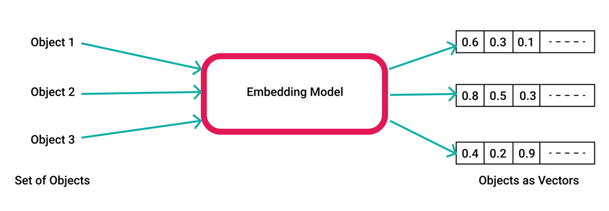{width="90%"} 
Ingeniería de características con Embeddings

## Embeddings

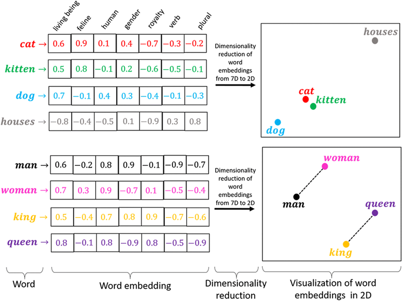{width="80%"}

## Embeddings

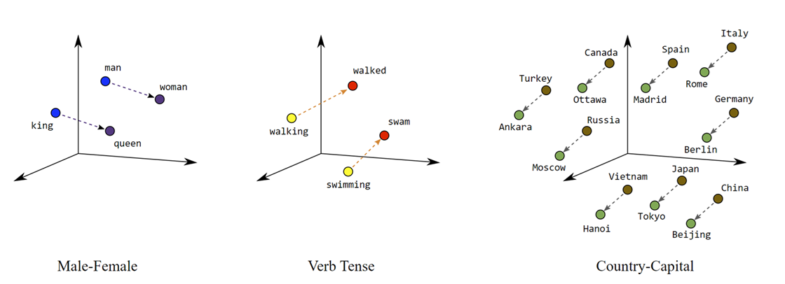{width="80%"}

## Ejemplo de Código: Ejemplo de Embeddings

\begin{lstlisting}[language=Python, style=mystyle]
from sentence_transformers import SentenceTransformer, util
import torch
model = SentenceTransformer('all-mpnet-base-v2')
words = ["cat", "kitten", "man", "woman", "queen", "king", "princess", "duchess", "empress"]
embeddings = model.encode(words, convert_to_tensor=True)
print("Similitud entre palabras:")
for i in range(len(words)):
for j in range(i + 1, len(words)):
sim = util.pytorch_cos_sim(embeddings[i], embeddings[j]).item()
print(f"{words[i]} - {words[j]}: {sim:.4f}")
\end{lstlisting}

## Embeddings

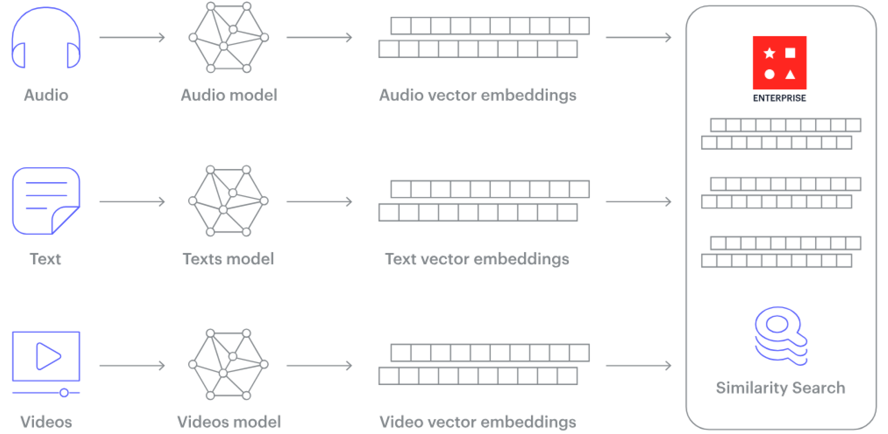{width="80%"}

## Ejemplo de Código: Ejemplo de Embeddings en Imágenes

\begin{lstlisting}[language=Python, style=mystyle]
import tensorflow_hub as hub
import tensorflow as tf
import numpy as np
from PIL import Image
model = hub.load("https://tfhub.dev/google/tf2-preview/mobilenet_v2/feature_vector/4")
def get_embedding(image_path):
image = np.array(Image.open(image_path).convert("RGB").resize((224, 224))) / 255.0
image = tf.convert_to_tensor(image, dtype=tf.float32)
image = tf.expand_dims(image, axis=0)
return np.squeeze(model(image))
embedding = get_embedding("imagen.jpg")
print("Embedding shape:", embedding.shape)
print("Embedding vector:", embedding)
\end{lstlisting}

## Modelos de transformadores

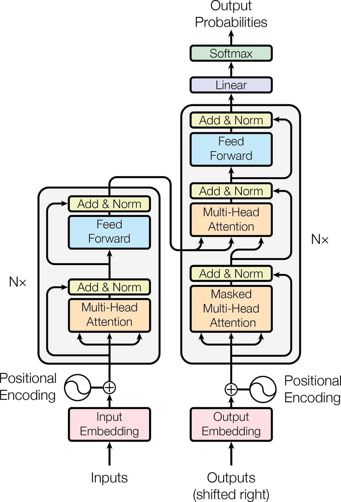{width="30%"} 
Modelos de Transformadores
https://poloclub.github.io/transformer-explainer/

# Interfaces Conversacionales con LLM

## APIs de Modelos de Lenguaje Extensos (LLMs)

- Se pueden desarrollar aplicaciones integrando APIs de modelos de lenguaje de gran tamaño (LLMs).
- Los nuevos modelos procesan multimedia (imágenes, documentos, voz y video).
- Principales proveedores y modelos recientes (2026):
  - **OpenAI**: GPT-5.5 Pro y GPT-5.5 ([OpenAI Pricing](https://openai.com/api/pricing/))
  - **Google Gemini**: Gemini 3.1 Pro y Gemini 3 Flash ([Gemini Models](https://ai.google.dev/gemini-api/docs/models))
  - **DeepSeek**: DeepSeek-V4-Pro y DeepSeek-V4-Flash ([DeepSeek Models](https://api-docs.deepseek.com/updates))
- Cada modelo tiene capacidades y costos distintos según la aplicación deseada.

## Interacción con la API de Google AI Studio y la interfaz Gradio

**Explicacion:**
- Se crea un cliente de Generative AI utilizando una API Key obtenida en Google AI Studio.
- Se envían el historial y la consulta actual al modelo (p. ej., Gemini 2.5 Flash) para obtener una respuesta.
- Se devuelve el texto generado por el modelo al usuario.
- Se utiliza Gradio para crear una interfaz de chat que permita la interacción en tiempo real con el asistente.
- Finalmente, se lanza la interfaz para que el usuario pueda utilizarla fácilmente en el navegador.

Para más detalles sobre los modelos disponibles, visite: [https://aistudio.google.com/](https://aistudio.google.com/)

## Interacción con la API de Gemini AI

\begin{lstlisting}[language=Python, style=mystyle]
import gradio as gr
from google.colab import userdata
from google import genai
client = genai.Client(api_key=userdata.get('GEMINI_API_KEY'))
def aistudio_clone(prompt, history=[]):
hist = "\n".join([f"User: {u}\nAI: {a}" for u, a in history])
response = client.models.generate_content(
model="gemini-3-flash-preview",
contents=f"{hist}\nUser: {prompt}",
config=genai.types.GenerateContentConfig(system_instruction="Eres un asistente util.")
)
return response.text
gr.ChatInterface(aistudio_clone).launch(debug=True)
\end{lstlisting}

## Introducción a Retrieval-augmented generation

- Los modelos de lenguaje grandes (LLMs) tienen limitaciones:
  - Conocimiento limitado a los datos de entrenamiento.
  - Pueden generar información falsa (alucinaciones).
  - Falta de conocimiento específico de dominio.
- Retrieval-augmented generation (RAG) mejora los LLMs al consultar bases de conocimiento externas.
- Combina técnicas de recuperación de información con capacidades generativas de LLMs.
- Beneficios:
  - Mayor precisión y reducción de alucinaciones.
  - Acceso a información actualizada y específica.
  - Rentable y escalable.

## Arquitectura Conceptual 

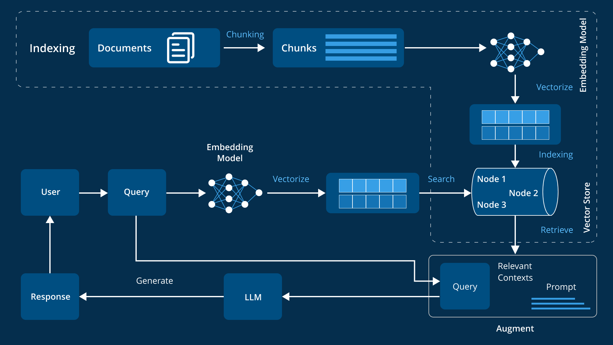{width="70%"}

[Arquitectura de Referencia](https://www.leewayhertz.com/advanced-rag/)

## Arquitectura de Referencia - AWS

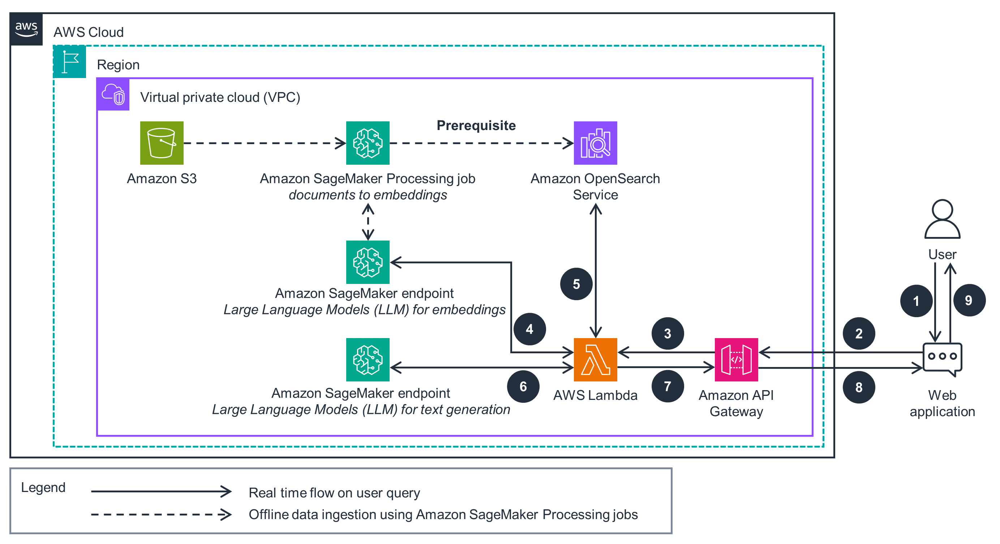{width="70%"}

[Chatbots With Vector Databases AWS](https://aws.amazon.com/solutions/guidance/chatbots-with-vector-databases-on-aws/)

## Arquitectura de Referencia - MELI

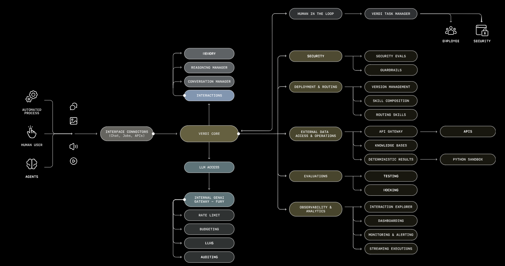{width="80%"}

[Plataforma de desarrollo con LLMs en Mercadolibre](https://openai.com/index/mercado-libre/)

## Componentes Clave de RAG

- **LLMs Pre-entrenados**: Núcleo generativo (GPT, Llama, Gemini).
- **Modelos de Embedding**: Representaciones vectoriales del texto (text-embedding-ada-002, jina-embeddings-v2).
- **Bases de Datos Vectoriales**: Almacenan y buscan embeddings (Pinecone, Weaviate, Chroma DB).
- **Mecanismos de Recuperación**: Algoritmos para obtener información relevante (búsqueda semántica, por palabras clave).
- **Bases de Conocimiento**: Fuentes de datos externas (documentos, bases de datos, APIs).
- **Consultas de Entrada**: Preguntas del usuario.

## Ejemplo de Código: RAG usando PDF - 1

\begin{lstlisting}[language=Python, style=mystyle]
# Configuracion de Modelos
client = genai.Client(api_key=userdata.get('GEMINI_API_KEY'))
MODEL_ID = "gemini-3-flash-preview"

# Usamos un modelo especializado en espanol para mejores resultados
embed_model = SentenceTransformer('hiiamsid/sentence_similarity_spanish_es')

# Variables globales para el indice
chunks = []
chunk_embeddings = []
\end{lstlisting}

## Ejemplo de Código: RAG usando PDF - 2

\begin{lstlisting}[language=Python, style=mystyle]
def procesar_pdf(ruta_pdf, chunk_size=1000):
global chunks, chunk_embeddings
reader = PdfReader(ruta_pdf)
texto_completo = "".join([page.extract_text() + "\n" for page in reader.pages])
chunks = [texto_completo[i:i + chunk_size] for i in range(0, len(texto_completo), chunk_size)]
print(f"Generando embeddings para {len(chunks)} fragmentos...")
chunk_embeddings = embed_model.encode(chunks)
return f"Procesado: {len(chunks)} fragmentos listos."

def buscar_similares(pregunta, k=3):
query_embedding = embed_model.encode([pregunta])
scores = np.dot(chunk_embeddings, query_embedding.T).flatten()
indices_top = np.argsort(scores)[-k:][::-1]
return "\n---\n".join([chunks[i] for i in indices_top])
\end{lstlisting}

## Ejemplo de Código: RAG usando PDF - 3

\begin{lstlisting}[language=Python, style=mystyle]
def responder_rag(pregunta, historial):
try:
contexto_relevante = buscar_similares(pregunta)
prompt_sistema = "Responde basandote SOLO en los fragmentos del contexto proporcionado. Si no esta en el texto, indicalo."
prompt_usuario = f"CONTEXTO RECUPERADO:\n{contexto_relevante}\n\nPREGUNTA: {pregunta}"
response = client.models.generate_content(
model=MODEL_ID,
contents=prompt_usuario,
config=genai.types.GenerateContentConfig(
system_instruction=prompt_sistema,
temperature=0.1
)
)
return response.text
except Exception as e:
return "Asegurate de haber subido 'reglamento.pdf'."
\end{lstlisting}

## Ejemplo de Código: RAG usando PDF - 4

\begin{lstlisting}[language=Python, style=mystyle]
try:
procesar_pdf("reglamento.pdf")

gr.ChatInterface(
fn=responder_rag,
title="RAG Educativo (Optimizado para Espanol)",
description="Sistema de recuperacion mejorado con embeddings especificos para espanol."
).launch(debug=True)
except Exception as e:
print(f"Error al iniciar: {e}. Sube 'reglamento.pdf' y vuelve a ejecutar.")
\end{lstlisting}

\nocite{*}

## References

\AtNextBibliography{}
\printbibliography

