# Repaso

## Sklearn y Problemas de ML

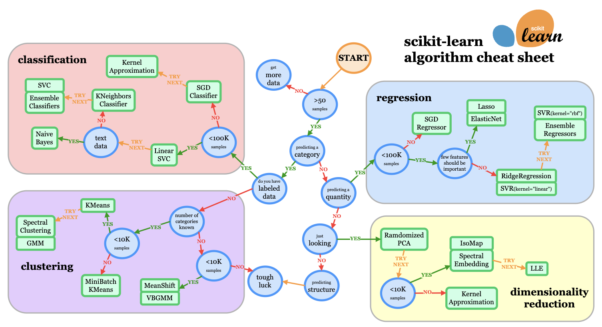{width="90%"}

## Referencias de esta sesión

{width="30%"}  
 
{width="30%"}

## Etapas Clave en un Proyecto de Machine Learning

Resumen Capítulo 2 - Hands on ML (Cuaderno Colab)
- Observar el panorama general.
- Obtener los datos.
- Explorar y visualizar los datos para obtener ideas.
- Preparar los datos para los algoritmos de machine learning.
- Seleccionar un modelo y entrenarlo.
- Ajustar y optimizar el modelo.
- Presentar la solución.
- Lanzar, monitorear y mantener el sistema.
[https://colab.research.google.com/github/ageron/handson-ml3/blob/main/02_end_to_end_machine_learning_project.ipynb](https://colab.research.google.com/github/ageron/handson-ml3/blob/main/02_end_to_end_machine_learning_project.ipynb)

# Regresión con Modelos Lineales

## ¿Qué es el Aprendizaje Estadístico?

- ¿Podemos predecir los ingresos usando años de educación?
- Modelo: $\text{Ingresos} \approx f(\text{Años de Educación})$
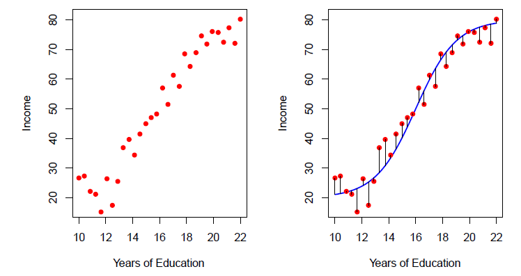{width="80%"}

## ¿Qué es el Aprendizaje Estadístico?

- ¿Podemos predecir los ingresos usando años de educación y años de experiencia?
- Modelo: $\text{Ingresos} \approx f(\text{Años de Educación}, \text{Años de Experiencia})$
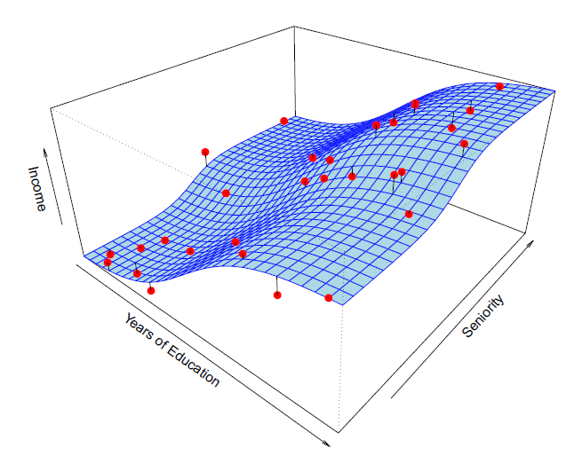{width="50%"}  \end{center}

## Notación

- **Variable objetivo**:
  - Ingresos: resultado que deseamos predecir ($Y$)

  

- **Predictores**:
  - Ingresos: característica o predictor ($X_1$)
  - Experiencia: segunda característica ($X_2$)

  

- **Vector de entradas**:
  \[
  \mathbf{X} = (X_1,\ X_2,\ X_3)
  \]

  

- **Modelo general**:
  \[
  Y = f(\mathbf{X}) + \epsilon
  \]
  - $\epsilon$: captura los errores de medición

## Modelos Paramétricos: Caso Lineal

\[ \text{Ingresos} = \beta_0 + \beta_1(\text{Años Educación}) + \beta_2(\text{Experiencia}) + \epsilon \]
- Forma funcional predefinida
- Estimación de parámetros $\beta_i$
- Ventaja: Simplicidad computacional

## Modelos Paramétricos: Caso Lineal

\[ \text{Ingresos} = \beta_0 + \beta_1(\text{Años Educación}) + \beta_2(\text{Experiencia}) + \epsilon \]
\begin{center}
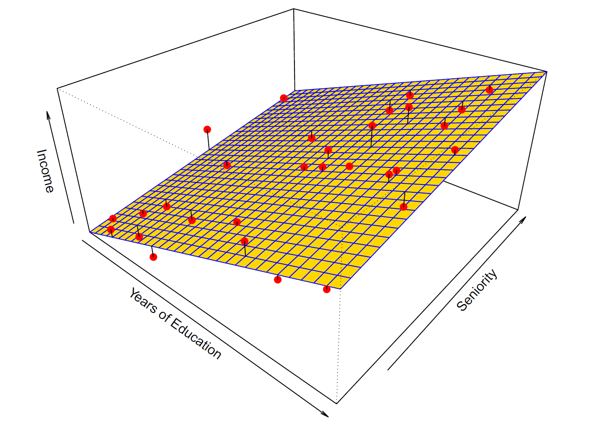{width="50%"}  \end{center}

## Modelos Paramétricos: Caso Lineal

El modelo lineal es un importante ejemplo de modelos paramétrico
\[
f_L(X) = \beta_0 + \beta_1X_1+ \beta_2X_2+\dots + \beta_pX_p
\]
- Un modelo lineal es especificado en términos de $p+1$ parámetros $\beta_0 , \beta_1, \beta_2,\dots \beta_p$
- Estimación de parámetros ajustando los parámetros a la información de entrenamiento
- Aunque casi nunca es correcto, un modelo lineal sirve como una buena aproximación interpretable a la función desconocida $f(X)$

## Mínimos Cuadrados Ordinarios (OLS)

- **Objetivo:** Encontrar la mejor línea (o hiperplano) de ajuste que minimice la suma de las diferencias al cuadrado entre los valores observados y los valores predichos.
- **Formulación Matemática:**
  - Dado un conjunto de puntos de datos $(x_i, y_i)$, queremos encontrar los coeficientes $\beta_0, \beta_1, ..., \beta_p$ que minimicen la siguiente función objetivo:
    \[
    \text{OLS} = \sum_{i=1}^{n} (y_i - (\beta_0 + \beta_1x_{i1} + ... + \beta_px_{ip}))^2
    \]
    donde:
    - $n$ es el número de observaciones
    - $y_i$ es el valor real de la variable dependiente para la $i$-ésima observación
    - $x_{ij}$ es el valor de la $j$-ésima variable independiente para la $i$-ésima observación
    - $\beta_0, \beta_1, ..., \beta_p$ son los coeficientes que queremos estimar

## Mínimos Cuadrados Ordinarios (OLS)

- **Cálculo Matricial:**
  - Expresamos el modelo de regresión lineal en forma matricial como:
    \[
    \mathbf{y} = \mathbf{X}\boldsymbol{\beta} + \boldsymbol{\epsilon}
    \]
    donde:
    - $\mathbf{y}$ es un vector columna de $n$ valores de la variable dependiente
    - $\mathbf{X}$ es una matriz de diseño de $n \times (p+1)$ que contiene los valores de las variables independientes y un vector de unos para el término de intercepción
    - $\boldsymbol{\beta}$ es un vector columna de $(p+1)$ coeficientes que queremos estimar
    - $\boldsymbol{\epsilon}$ es un vector columna de $n$ errores
  - La solución de OLS para los coeficientes $\boldsymbol{\beta}$ se obtiene mediante la siguiente fórmula:
    \[
    \boldsymbol{\hat{\beta}} = (\mathbf{X}^T\mathbf{X})^{-1}\mathbf{X}^T\mathbf{y}
    \]
    donde:
    - $\mathbf{X}^T$ es la transpuesta de la matriz $\mathbf{X}$
    - $(\mathbf{X}^T\mathbf{X})^{-1}$ es la inversa de la matriz $\mathbf{X}^T\mathbf{X}$

## Mínimos Cuadrados Ordinarios (OLS)

- **Intuición Geométrica:** OLS busca la línea que esté "más cerca" de los puntos de datos en términos de la suma de las distancias verticales al cuadrado.

- **Ventajas:**
  - Simple y computacionalmente eficiente
  - Proporciona estimaciones insesgadas de los coeficientes bajo ciertos supuestos
  - Permite realizar pruebas de hipótesis e intervalos de confianza
- **Limitaciones:**
  - Sensible a los valores atípicos
  - Asume una relación lineal entre las variables independientes y dependientes
  - Puede no funcionar bien con predictores altamente correlacionados

## ¿Por qué estimar $f$?

- **Predicción**: Pronosticar ingresos futuros
- **Inferencia**:
  - ¿Qué variables afectan los ingresos?
  - Magnitud de efectos
- **Otras aplicaciones**:
  - Comparación de teorías
  - Toma de decisiones políticas

## Métricas de Error en Regresión (1)

**Error Cuadrático Medio (MSE)**:
\[
\text{MSE} = \frac{1}{n}\sum_{i=1}^n (Y_i - \hat{Y}_i)^2
\]
Penaliza más los errores grandes debido a la cuadratura.

**Raíz del Error Cuadrático Medio (RMSE)**:
\[
\text{RMSE} = \sqrt{\frac{1}{n} \sum_{i=1}^{n} (Y_i - \hat{Y}_i)^2}
\]
Más interpretable que el MSE, ya que mantiene las unidades originales.

## Métricas de Error en Regresión (2)

**Error Absoluto Medio (MAE)**:
\[
\text{MAE} = \frac{1}{n}\sum_{i=1}^n |Y_i - \hat{Y}_i|
\]
Menos sensible a valores atípicos que el MSE.

**Porcentaje de Error Absoluto Medio (MAPE)**:
\[
\text{MAPE} = \frac{100\%}{n} \sum_{i=1}^{n} \left| \frac{Y_i - \hat{Y}_i}{Y_i} \right|
\]
Expresa el error en porcentaje para facilitar la comparación.

## Interactividad de Regresion lineal

\begin{center}    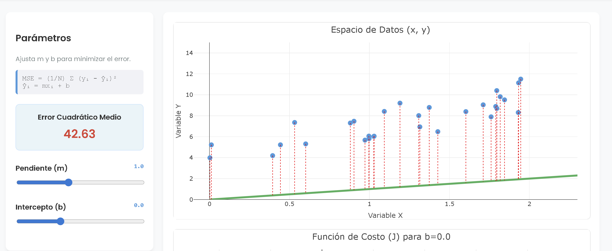{width="70%"}  \end{center}
[https://oscar-bustos.github.io/javeriana-tallerml/regresion_lineal/mean_squared_error.html](https://oscar-bustos.github.io/javeriana-tallerml/regresion_lineal/mean_squared_error.html)

## Gradiente Descendente

\begin{center}    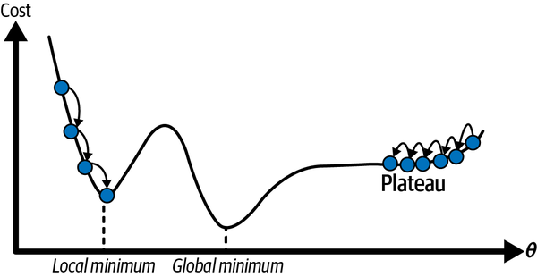{width="70%"}  \end{center}

## Algoritmo de Gradiente Descendente 

Es un método iterativo de optimización para encontrar los parámetros $\boldsymbol{\beta}$ que minimizan una función de costo $J(\boldsymbol{\beta})$, como por ejemplo MSE.

::: {.callout-note}
## Paso de actualización del Gradiente Descendente
La idea es moverse en la dirección opuesta al gradiente (que apunta hacia el mayor ascenso). La regla de actualización es:
$$ \boldsymbol{\beta}_{\text{siguiente}} = \boldsymbol{\beta} - \eta \nabla_{\boldsymbol{\beta}} J(\boldsymbol{\beta}) $$
:::

- $\boldsymbol{\beta}$: Son los parámetros del modelo que queremos optimizar.
- $\eta$ (eta): Es la **tasa de aprendizaje** (learning rate), un hiperparámetro que controla qué tan grande es cada paso que damos.
- $\nabla_{\boldsymbol{\beta}} J(\boldsymbol{\beta})$: Es el **vector gradiente** de la función de costo. Contiene todas las derivadas parciales y apunta en la dirección de mayor incremento de la función.

## Gradiente para el Error Cuadrático Medio (MSE)

::: {.callout-note}
## Cálculo del Vector Gradiente (Forma Vectorizada)
En lugar de calcular cada derivada parcial individualmente, usamos una fórmula eficiente que calcula todo el gradiente de una vez:
$$ \nabla_{\boldsymbol{\beta}} \text{MSE}(\boldsymbol{\beta}) = \frac{2}{m} \mathbf{X}^T (\mathbf{X} \boldsymbol{\beta} - \mathbf{y}) $$
:::

- $m$: Es el número total de instancias (ejemplos) en el conjunto de datos.
- $\mathbf{X}$: Es la matriz que contiene todas las características (features) de las instancias. Cada fila es una instancia.
- $\mathbf{y}$: Es el vector que contiene los valores o etiquetas reales para cada instancia.
- $\mathbf{X}^T$: Es la transpuesta de la matriz $\mathbf{X}$.

## Gradiente en Lotes (Batch)

\begin{center}
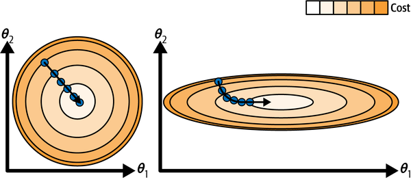{width="80%"}  \end{center}

## Gradiente Estocástico

\begin{center}
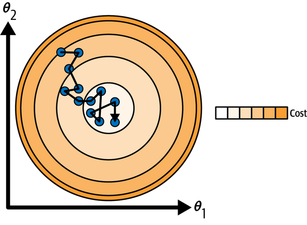{width="60%"}  \end{center}

## Regresión Lineal en Sklearn

\begin{lstlisting}[language=Python, style=mystyle]
from sklearn.linear_model import LinearRegression

# Modelo base sin penalizacion (Minimos Cuadrados)
reg_lin = LinearRegression(n_jobs=-1,        # Paralelizacion
fit_intercept=True)

reg_lin.fit(Xtrn, ytrn)
ypred = reg_lin.predict(Xtst)
\end{lstlisting}

## Tradeoffs en Modelado

- **Interpretabilidad** vs Complejidad
- **Underfitting** (muy simple) vs **Overfitting** (muy complejo)
- **Otras consideraciones**:
  - Costo computacional
  - Escalabilidad

\begin{center}
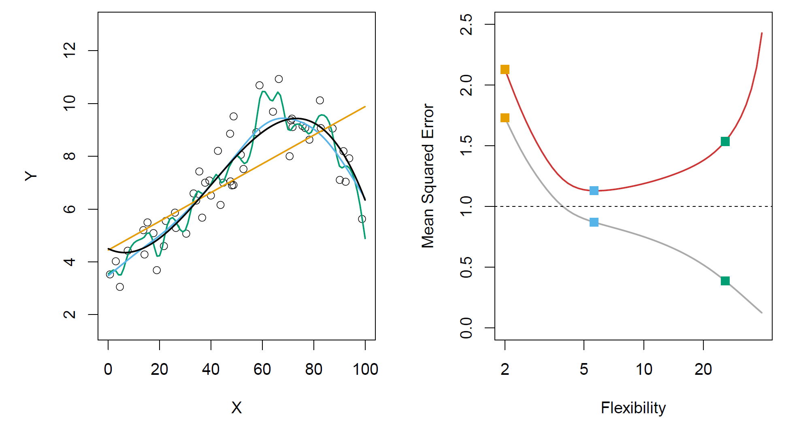{width="70%"}  \end{center}

## Regularización: Ridge y Lasso

La regularización es una técnica para evitar el sobreajuste al modificar la función de costo.

:::: {.columns}

::: {.column width="50%"}

::: {.callout-note}
## Ridge Regression (Penalización $\ell_2$)
Añade el cuadrado de la norma $\ell_2$ de los pesos a la función de costo.

$$ J(\boldsymbol{\beta}) = \text{MSE}(\boldsymbol{\beta}) + \alpha \sum_{i=1}^{n} \beta_i^2 $$

- Encoge los pesos de las características hacia cero.
- No elimina los pesos por completo (no los hace exactamente cero).
:::

:::

::: {.column width="50%"}

::: {.callout-note}
## Lasso Regression (Penalización $\ell_1$)
Añade el valor absoluto (norma $\ell_1$) de los pesos a la función de costo.

$$ J(\boldsymbol{\beta}) = \text{MSE}(\boldsymbol{\beta}) + \alpha \sum_{i=1}^{n} |\beta_i| $$

- Puede encoger los pesos **exactamente a cero**.
- Efectivamente realiza una **selección de características**.
:::

:::

::::

## Regularización

\begin{center}
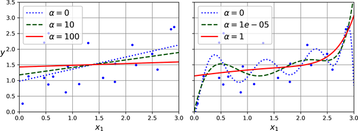{width="80%"}  \end{center}

Modelos lineales (izquierda) y polinómicos (derecha), ambos con distintos niveles de regularización (Ridge).

## Regresión Ridge (L2) en Sklearn

\begin{lstlisting}[language=Python, style=mystyle]
from sklearn.linear_model import Ridge

# Regresion con penalizacion L2 (evita coeficientes gigantes)
ridge_reg = Ridge(alpha=1.0,       # Fuerza de la regularizacion
random_state=rng)

ridge_reg.fit(Xtrn, ytrn)
ypred = ridge_reg.predict(Xtst)
\end{lstlisting}

## Regresión Lasso (L1) en Sklearn

\begin{lstlisting}[language=Python, style=mystyle]
from sklearn.linear_model import Lasso

# Regresion con penalizacion L1 (propicia sparsity)
lasso_reg = Lasso(alpha=0.1,       # Fuerza de la regularizacion
random_state=rng)

lasso_reg.fit(Xtrn, ytrn)
ypred = lasso_reg.predict(Xtst)
\end{lstlisting}

# Clasificación con Modelos Lineales

## Clasificación y Variables Cualitativas

- Las variables cualitativas toman valores en un conjunto no ordenado $C$, como:
  - Color de ojos $\in \{\text{marrón, azul, verde}\}$
  - Correo electrónico $\in \{\text{spam, ham}\}$
- Dado un vector de características $X$ y una variable respuesta cualitativa $Y$ que toma valores en el conjunto $C$, la tarea de clasificación consiste en construir una función $C(X)$ que toma como entrada $X$ y predice su valor para $Y$; es decir, $C(X) \in C$.
- A menudo, estamos más interesados en estimar las probabilidades de que $X$ pertenezca a cada categoría en $C$.

## Ejemplo: Tarjeta de Crédito

\begin{center}
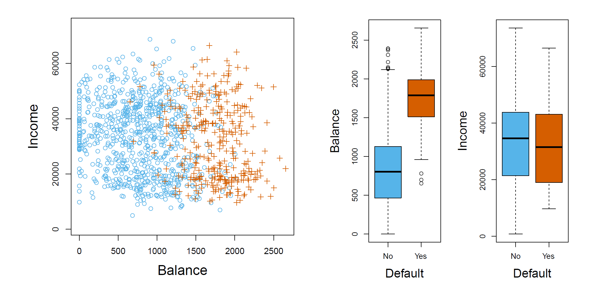{width="80%"}  \end{center}

## Modelos Lineales para Clasificación

:::: {.columns}

::: {.column width="40%"}
- Regresión Logística:
  \[ P(Y=1|X) = \frac{1}{1 + e^{-(\beta_0 + \beta X)}} \]

:::

::: {.column width="60%"}
\begin{center}
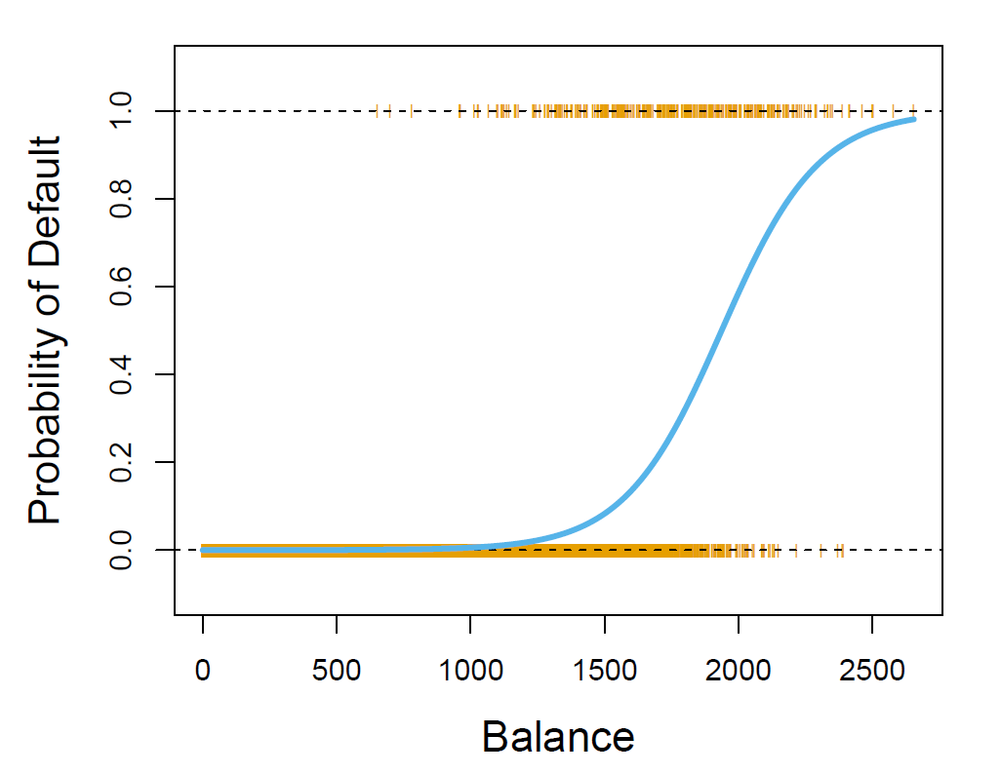{width="90%"}
\end{center}
:::
::::

## Matriz de Confusión

\begin{center}
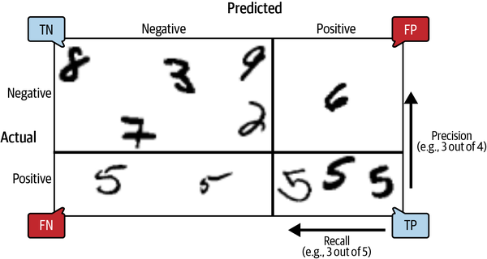{width="80%"}  \end{center}

## Matriz de Confusión

**Matriz de Confusión**:
\[
\begin{bmatrix}
TP & FN 
FP & TN
\end{bmatrix}
\]

Permite visualizar el desempeño del modelo mostrando las predicciones correctas e incorrectas en cada categoría.

**Definiciones**:
- **TP (True Positives)**: Casos positivos correctamente identificados.
- **TN (True Negatives)**: Casos negativos correctamente identificados.
- **FP (False Positives)**: Casos negativos incorrectamente clasificados como positivos.
- **FN (False Negatives)**: Casos positivos incorrectamente clasificados como negativos.

## Métricas de Clasificación (1)

**Exactitud (Accuracy)**:
\[
\text{Accuracy} = \frac{TP + TN}{TP + TN + FP + FN}
\]
Mide la proporción de instancias correctamente clasificadas.

**Precisión (Precision)**:
\[
\text{Precision} = \frac{TP}{TP + FP}
\]
Indica la proporción de positivos predichos que son realmente positivos.

## Métricas de Clasificación (2)

**Exhaustividad (Recall)**:
\[
\text{Recall} = \frac{TP}{TP + FN}
\]
Mide la capacidad del modelo para encontrar todos los positivos reales.

**Puntuación F1 (F1-Score)**:
\[
\text{F1-Score} = 2 \times \frac{\text{Precision} \times \text{Recall}}{\text{Precision} + \text{Recall}}
\]
Media armónica entre precisión y exhaustividad, útil en conjuntos de datos desbalanceados.

## Tradeoff: Precision /Recall

\begin{center}
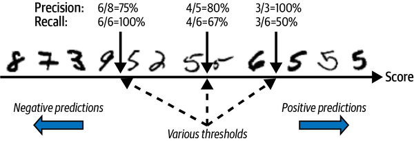{width="80%"}  \end{center}

## Curva Precision /Recall

\begin{center}
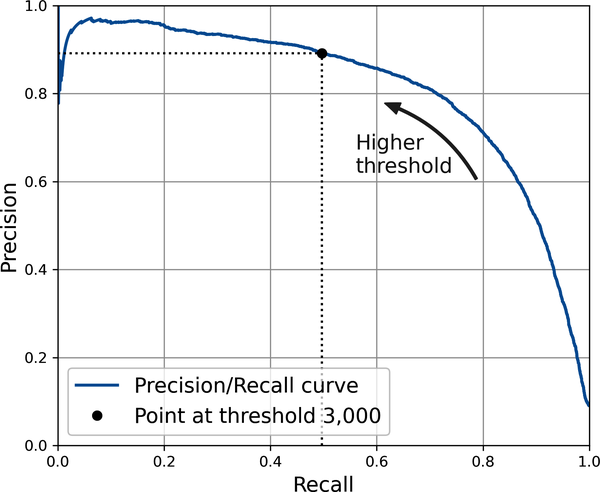{width="60%"}  \end{center}

## Curva Receiver Operating Characteristic (ROC) 

\begin{center}
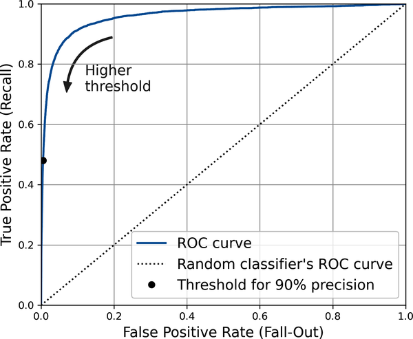{width="60%"}  \end{center}

## Regresión Logística en Sklearn

\begin{lstlisting}[language=Python, style=mystyle]
from sklearn.linear_model import LogisticRegression

# Clasificacion (a pesar del nombre 'Regresion')
log_clf = LogisticRegression(C=1.0,           # Inverso de la regularizacion
penalty='l2',    # Tipo de penalizacion
solver='lbfgs',  # Optimizador estandar
random_state=rng)
log_clf.fit(Xtrn, ytrn)
ypred = log_clf.predict(Xtst)
\end{lstlisting}

\nocite{*}

## References

\AtNextBibliography{}
\printbibliography

