<style>
.reveal figcaption {
  text-align: center !important;
}
.smaller-text {
  font-size: 0.75em !important;
}
</style>

# Repaso

## Sklearn Guía la Selección de Algoritmos

{height="420px" fig-align="center"}

## Bibliografía Principal del Curso

:::: {.columns}

::: {.column width="50%"}
{height="400px" fig-align="center"}

::: {style="text-align: center; font-size: 0.65em; margin-top: 10px;"}
[@james2023introduction]
:::
:::

::: {.column width="50%"}
{height="400px" fig-align="center"}

::: {style="text-align: center; font-size: 0.65em; margin-top: 10px;"}
[@geron2022hands]
:::
:::

::::

## Un Proyecto de ML Consta de 8 Etapas

Resumen Capítulo 2: *Machine Learning* (ML) [@geron2022hands]

:::: {.columns}

::: {.column width="33%"}
::: {.callout-note icon=false title="🔍 Exploración"}
1. **Panorama General**
2. **Obtener Datos**
3. **Explorar & Visualizar**
:::
:::

::: {.column width="33%"}
::: {.callout-note icon=false title="⚙️ Modelado"}
4. **Preparar Datos**
5. **Entrenar Modelo**
6. **Optimizar Modelo**
:::
:::

::: {.column width="33%"}
::: {.callout-note icon=false title="🚀 Despliegue"}
7. **Presentar Solución**
8. **Lanzar & Monitorear**
:::
:::

::::

::: {style="text-align: center; font-size: 0.65em; margin-top: 20px;"}
🔗 [Cuaderno Colab - Capítulo 2 (Hands-on ML)](https://colab.research.google.com/github/ageron/handson-ml3/blob/main/02_end_to_end_machine_learning_project.ipynb)
:::

# Regresión con Modelos Lineales

## Educación Predictora de Ingresos

- ¿Podemos predecir los ingresos usando educación?
- Modelo: $\text{Ingresos} \approx f(\text{Años de Educación})$

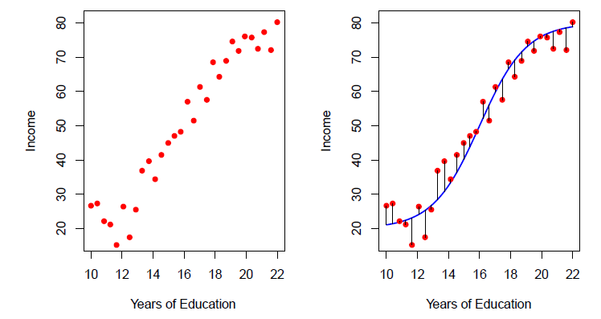{height="280px" fig-align="center"}

::: {style="text-align: center; font-size: 0.5em; margin-top: -10px;"}
Fuente: [@james2023introduction], Capítulo 2
:::

## Regresión Múltiple Integra Experiencia

- ¿Podemos predecir ingresos con educación y experiencia?
- Modelo: $\text{Ingresos} \approx f(\text{Educación}, \text{Experiencia})$

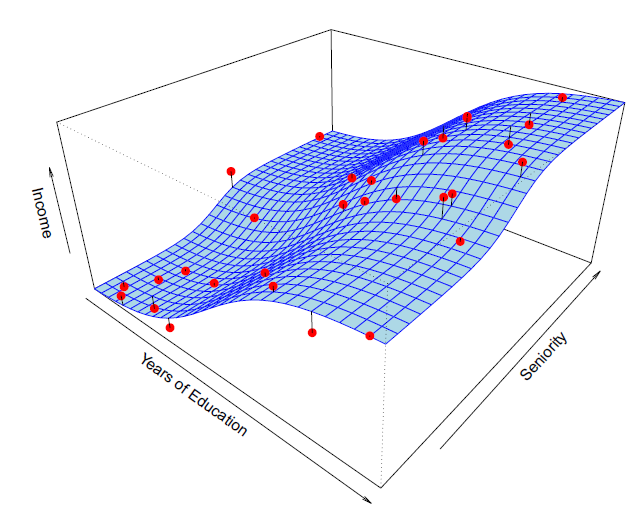{height="280px" fig-align="center"}

::: {style="text-align: center; font-size: 0.5em; margin-top: -10px;"}
Fuente: [@james2023introduction], Capítulo 2
:::

## Diferencia entre Target y Predictores

- **Variable objetivo (Target)**:
  - Ingresos: resultado a predecir ($Y$)

- **Predictores (Features)**:
  - Años de Educación: predictor 1 ($X_1$)
  - Experiencia: predictor 2 ($X_2$)

## Modelo General y Error Irreductible

- **Vector de entradas**:
  $$ \mathbf{X} = (X_1, X_2, \dots, X_p) $$

- **Modelo general**:
  $$ Y = f(\mathbf{X}) + \epsilon $$

  - $\epsilon$: error irreductible (factores no medidos)

## Los Parámetros Beta Definen el Modelo

$$ \text{Ingresos} = \beta_0 + \beta_1(\text{Educación}) + \beta_2(\text{Experiencia}) + \epsilon $$

- Forma funcional predefinida
- Estimación de parámetros $\beta_i$
- Ventaja: Simplicidad computacional

## Intercepto y Pendiente Definen la Recta

$$ Y = \beta_0 + \beta_1 X $$

- **$\beta_0$ (Intercepto)**: Valor esperado cuando $X=0$.
- **$\beta_1$ (Pendiente)**: Cambio en $Y$ por unidad de $X$.
- **Múltiples Dimensiones**: $\beta_0$ e hiperplano de ajuste.

## Superficie de Ajuste en 3D

$$ \text{Ingresos} = \beta_0 + \beta_1(\text{Educación}) + \beta_2(\text{Experiencia}) + \epsilon $$

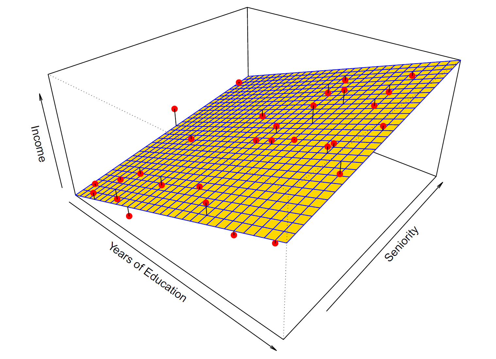{height="300px" fig-align="center"}

::: {style="text-align: center; font-size: 0.5em; margin-top: -10px;"}
Fuente: [@james2023introduction], Capítulo 2
:::

## Modelos Paramétricos Simplifican $f(X)$

$$ f(X) \approx \beta_0 + \beta_1 X_1 + \beta_2 X_2 + \dots + \beta_p X_p $$

- **Forma funcional**: Asume relación lineal con $p+1$ parámetros ($\beta$).
- **Entrenamiento**: Estima parámetros a partir de los datos.
- **Ventaja**: Es una aproximación simple e interpretable a $f(X)$.

## OLS Minimiza Errores al Cuadrado

- **OLS**: Mínimos Cuadrados Ordinarios (*Ordinary Least Squares*).
- Busca la mejor línea (o hiperplano) de ajuste.
- Minimiza la suma de diferencias cuadráticas entre observados y predichos.

## Función de Pérdida OLS

$$ \text{OLS} = \sum_{i=1}^{n} (y_i - (\beta_0 + \beta_1x_{i1} + \dots + \beta_px_{ip}))^2 $$

- $n$: número de observaciones
- $y_i$: valor real observado
- $x_{ij}$: valor del predictor $j$
- $\beta$: coeficientes a estimar

## Expresión Matricial del Modelo Lineal

$$ \mathbf{y} = \mathbf{X}\boldsymbol{\beta} + \boldsymbol{\epsilon} $$

- $\mathbf{y}$: vector columna de $n$ respuestas
- $\mathbf{X}$: matriz de diseño de $n \times (p+1)$
- $\boldsymbol{\beta}$: vector de $(p+1)$ coeficientes
- $\boldsymbol{\epsilon}$: vector de $n$ errores

## Solución Analítica mediante Ecuación Normal

$$ \boldsymbol{\hat{\beta}} = (\mathbf{X}^T\mathbf{X})^{-1}\mathbf{X}^T\mathbf{y} $$

- Estima directamente los parámetros óptimos $\boldsymbol{\beta}$.
- Requiere transponer e invertir la matriz de diseño.

## Sklearn Usa Pseudoinversa por Estabilidad

Sklearn calcula $\boldsymbol{\hat{\beta}} = \mathbf{X}^+ \mathbf{y}$ vía SVD ($\mathbf{X}^+$ es la pseudoinversa de Moore-Penrose).

**Casos de matrices mal portadas en Ecuación Normal:**

- **Multicolinealidad / Singularidad**: Si existen columnas redundantes, $(\mathbf{X}^T\mathbf{X})$ no es invertible.
- **Inestabilidad Numérica**: Invertir $(\mathbf{X}^T\mathbf{X})$ eleva al cuadrado el número de condición ($\text{cond}(\mathbf{X})^2$).
- **Solución SVD**: Modifica valores singulares casi cero para garantizar estimaciones estables.

## OLS es Eficiente pero Sensible a Atípicos

:::: {.columns}
::: {.column width="50%"}
**Ventajas:**

- Simple y eficiente.
- Estimaciones insesgadas.
- Permite inferencia estadística.
:::

::: {.column width="50%"}
**Limitaciones:**

- Sensible a valores atípicos.
- Asume estricta linealidad.
- Sufre con multicolinealidad.
:::
::::

## Magnitud de Beta Depende de la Escala

- **$\beta = 0$**: La variable no impacta la predicción.
- **$|\beta|$ grande**: Sugiere mayor importancia relativa.
- **Cuidado con la Escala**: Un coeficiente alto puede depender de la unidad.
- **Solución**: Estandarizar permite comparar importancia.

## Roles de Predicción e Inferencia

- **Predicción**: Pronosticar ingresos futuros
- **Inferencia**:
  - ¿Qué variables afectan los ingresos?
  - Magnitud de efectos
- **Otras aplicaciones**:
  - Comparación de teorías
  - Toma de decisiones políticas

## MSE y RMSE Miden Errores Cuadráticos

**Error Cuadrático Medio (MSE)**:
$$ \text{MSE} = \frac{1}{n}\sum_{i=1}^n (Y_i - \hat{Y}_i)^2 $$
Penaliza más los errores grandes debido a la cuadratura.

**Raíz del Error Cuadrático Medio (RMSE)**:
$$ \text{RMSE} = \sqrt{\frac{1}{n} \sum_{i=1}^{n} (Y_i - \hat{Y}_i)^2} $$
Conserva las unidades originales de la variable objetivo.

## MAE y MAPE Expresan Errores Absolutos

**Error Absoluto Medio (MAE)**:
$$ \text{MAE} = \frac{1}{n}\sum_{i=1}^n |Y_i - \hat{Y}_i| $$
Menos sensible a valores atípicos que el MSE.

**Porcentaje de Error Absoluto Medio (MAPE)**:
$$ \text{MAPE} = \frac{100\%}{n} \sum_{i=1}^{n} \left| \frac{Y_i - \hat{Y}_i}{Y_i} \right| $$
Expresa el error en porcentaje para fácil interpretación.

## Simulación Visual de Métricas Lineales

Explora cómo cambian las métricas interactivamente:

- [Error Cuadrático Medio (MSE)](https://oscar-bustos.github.io/javeriana-tallerml/regresion_lineal/mean_squared_error.html)
- [Importancia de Características](https://oscar-bustos.github.io/javeriana-tallerml/regresion_lineal/feature_importance.html)

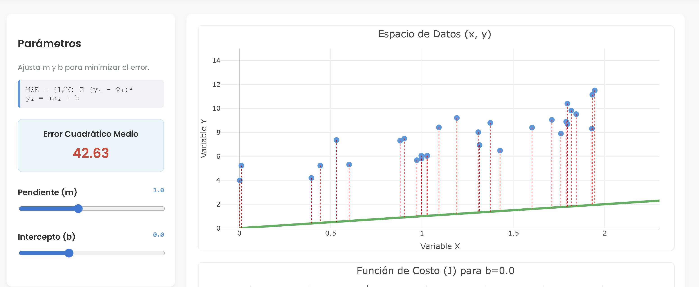{height="250px" fig-align="center"}

## Gradiente Descendente Optimiza la Función

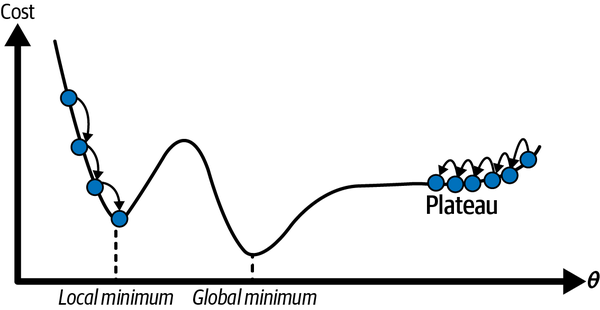{height="400px" fig-align="center"}

## Actualización Iterativa de Parámetros

Método iterativo para minimizar una función de costo $J(\boldsymbol{\beta})$.

::: {.callout-note title="Regla de Actualización"}
$$ \boldsymbol{\beta}_{\text{next}} = \boldsymbol{\beta} - \eta \nabla_{\boldsymbol{\beta}} J(\boldsymbol{\beta}) $$
:::

- $\eta$: **Tasa de aprendizaje** (tamaño del paso).
- $\nabla_{\boldsymbol{\beta}} J(\boldsymbol{\beta})$: **Vector gradiente** (dirección de ascenso).

## El Gradiente de MSE se Computa Vectorial

Fórmula eficiente para calcular derivadas parciales simultáneas:

::: {.callout-note title="Gradiente de MSE"}
$$ \nabla_{\boldsymbol{\beta}} \text{MSE}(\boldsymbol{\beta}) = \frac{2}{m} \mathbf{X}^T (\mathbf{X} \boldsymbol{\beta} - \mathbf{y}) $$
:::

- $m$: Número total de instancias.
- $\mathbf{X}$: Matriz de características.
- $\mathbf{y}$: Vector de etiquetas reales.

## Batch GD Usa Todo el Dataset por Paso

- **Batch GD**: Descenso de Gradiente por Lotes (*Batch Gradient Descent*).

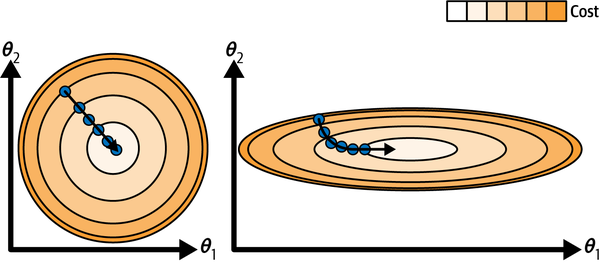{height="300px" fig-align="center"}

## Stochastic GD Actualiza por Instancia

- **SGD**: Descenso de Gradiente Estocástico (*Stochastic Gradient Descent*).

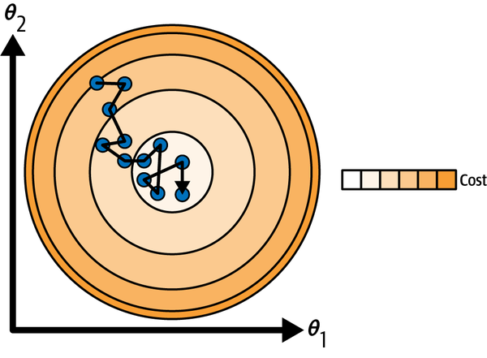{height="290px" fig-align="center"}

## Mini-batch GD Equilibra Rapidez y Estabilidad

- Usa pequeños lotes aleatorios de datos.
- Aprovecha aceleración en GPU (*Graphics Processing Unit*).
- Menos errático que SGD, requiere afinar hiperparámetros.

## Comparativa de Optimización en Escala

| Algoritmo | Gran $m$ | Gran $n$ | Escalar | Implementación |
|---|---|---|---|---|
| Ecuación Normal | Rápido | Lento | No | `NumPy` (`np.linalg.inv`) |
| SVD | Rápido | Lento | No | `LinearRegression` |
| Batch GD | Lento | Rápido | Sí | Manual (`NumPy` / `scipy`) |
| Stochastic GD | Rápido | Rápido | Sí | `SGDRegressor` |
| Mini-batch GD | Rápido | Rápido | Sí | `SGDRegressor` (`partial_fit`) |

::: {style="font-size: 0.65em; margin-top: 10px;"}
*Batch GD se implementa habitualmente con bucles manuales en NumPy o `scipy.optimize`. SVD: Descomposición en Valores Singulares.*
:::

## Importancia del Escalamiento en GD

::: {style="text-align: center; margin-top: 15%; font-size: 1.2em;"}
¿Qué sucede con el Descenso de Gradiente si **no escalamos** (normalizamos) los datos de entrada previamente?
:::

## LinearRegression Estima Coeficientes OLS

```python
import numpy as np
from sklearn.linear_model import LinearRegression

# Datos sintéticos: y = 4 + 3x + ruido
X = 2 * np.random.rand(100, 1)
y = 4 + 3 * X.ravel() + np.random.randn(100)

reg = LinearRegression().fit(X, y)
print(f"Intercepto: {reg.intercept_:.2f} (Objetivo: 4.0)")
print(f"Pendiente: {reg.coef_[0]:.2f} (Objetivo: 3.0)")
```

## SGDRegressor Optimiza por Iteraciones

```python
import numpy as np
from sklearn.linear_model import SGDRegressor

X = 2 * np.random.rand(100, 1)
y = 4 + 3 * X.ravel() + np.random.randn(100)

# Modifica eta0 (tasa aprendizaje) o max_iter
sgd = SGDRegressor(max_iter=1000, eta0=0.01, penalty=None, random_state=42)
sgd.fit(X, y)
print(f"SGD -> b0: {sgd.intercept_[0]:.2f} | b1: {sgd.coef_[0]:.2f}")
```

## 💻 Demo: Ecuación Normal en NumPy

::: {.callout-tip title="Demostración en Vivo"}
1. Generar datos lineales sintéticos.
2. Resolver $\hat{\beta} = (X^TX)^{-1}X^Ty$ con NumPy.
3. Comparar estimaciones con OLS y SGDRegressor.
:::

## Ecuación Normal y SGD Coinciden

```python
import numpy as np
from sklearn.linear_model import LinearRegression, SGDRegressor

X = 2 * np.random.rand(100, 1); y = 4 + 3 * X.ravel() + np.random.randn(100)
X_b = np.c_[np.ones((100, 1)), X]
b_norm = np.linalg.inv(X_b.T @ X_b) @ X_b.T @ y
lin = LinearRegression().fit(X, y)
sgd = SGDRegressor(max_iter=1000, eta0=0.05, random_state=42).fit(X, y)

print(f"Normal: b0={b_norm[0]:.2f}, b1={b_norm[1]:.2f}")
print(f"OLS:    b0={lin.intercept_:.2f}, b1={lin.coef_[0]:.2f}")
print(f"SGD:    b0={sgd.intercept_[0]:.2f}, b1={sgd.coef_[0]:.2f}")
```

## Equilibrio entre Complejidad y Ajuste

:::: {.columns}

::: {.column width="50%"}
- **Interpretabilidad** vs Complejidad.
- **Underfitting**: Modelo demasiado simple.
- **Overfitting**: Modelo demasiado complejo.
- **Costo computacional**: Escalabilidad.
:::

::: {.column width="50%"}
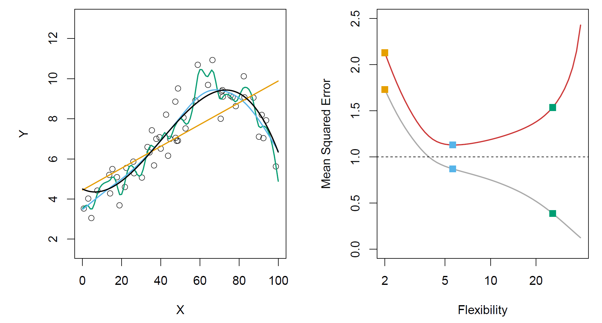{height="300px" fig-align="center"}
:::

::::

## Polinomios Capturan No-Linealidades

- `PolynomialFeatures` añade potencias como columnas.
- Grado bajo (por ejemplo 2) da curvatura; grado alto sobreajusta.
- **Complejidad:** $n$ features y grado $d$ generan $(n+d)! / (d! \cdot n!)$ columnas.

## Las Curvas Diagnostican Sesgo y Varianza

- `learning_curve()` entrena con subconjuntos crecientes.
- **Underfitting:** Ambas curvas convergen a error alto.
- **Overfitting:** Gran brecha entre entrenamiento y validación.

## Compromiso Fundamental: Sesgo vs Varianza

- **Sesgo:** Error por suposiciones simplistas (Underfitting).
- **Varianza:** Sensibilidad excesiva al ruido del entrenamiento (Overfitting).
- Mayor complejidad reduce sesgo e incrementa varianza.

## 💻 Práctica: Polinomios y Curvas

::: {.callout-tip title="Ejercicio Práctico"}
1. Generar datos no lineales.
2. Ajustar modelos polinomiales de diferentes grados.
3. Visualizar las curvas de aprendizaje con `learning_curve()`.
:::

## Pipelines Combinan Polinomios y Penalización

```python
import numpy as np
from sklearn.preprocessing import PolynomialFeatures
from sklearn.linear_model import Ridge, Lasso
from sklearn.pipeline import make_pipeline

X = 6 * np.random.rand(100, 1) - 3
y = (0.5 * X**2 + X + 2 + np.random.randn(100, 1)).ravel()

# Probar cambiar degree=2 o alpha=1.0 / alpha=0.1
p_ridge = make_pipeline(PolynomialFeatures(degree=2), Ridge(alpha=1.0)).fit(X, y)
p_lasso = make_pipeline(PolynomialFeatures(degree=2), Lasso(alpha=0.1)).fit(X, y)

print(f"R2 Ridge: {p_ridge.score(X, y):.3f} | R2 Lasso: {p_lasso.score(X, y):.3f}")
```

## Selección entre Ridge y Lasso

::: {style="text-align: center; margin-top: 15%; font-size: 1.2em;"}
Si tenemos cientos de características y sospechamos que solo unas pocas son realmente útiles, ¿usaríamos Ridge o Lasso? ¿Por qué?
:::

## Diferencias entre Penalización L2 y L1

La regularización previene el sobreajuste modificando el costo.

:::: {.columns}

::: {.column width="50%"}

::: {.callout-note title="Ridge (Penalización $\ell_2$)"}
Suma el cuadrado de pesos a la función de costo:

$$ J(\boldsymbol{\beta}) = \text{MSE}(\boldsymbol{\beta}) + \alpha \sum_{i=1}^{n} \beta_i^2 $$

- Encoge los pesos hacia cero.
- Mantiene todas las variables.
:::

:::

::: {.column width="50%"}

::: {.callout-note title="Lasso (Penalización $\ell_1$)"}
Suma el valor absoluto de pesos al costo:

$$ J(\boldsymbol{\beta}) = \text{MSE}(\boldsymbol{\beta}) + \alpha \sum_{i=1}^{n} |\beta_i| $$

- Hace pesos **exactamente cero**.
- Selecciona características.
:::

:::

::::

## Ridge Controla la Complejidad del Modelo

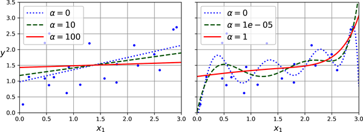{height="290px" fig-align="center"}

Modelos lineales (izquierda) y polinómicos (derecha) bajo Ridge.

## Ridge Encoge Coeficientes con L2

```python
import numpy as np
from sklearn.linear_model import Ridge

X = np.random.randn(100, 5)
y = 3 * X[:, 0] - 2 * X[:, 1] + np.random.randn(100)

# Modifica alpha (alpha mayor encoge coeficientes hacia cero)
ridge = Ridge(alpha=10.0, random_state=42).fit(X, y)
print("Coeficientes Ridge (alpha=10.0):")
print(np.round(ridge.coef_, 2))
```

## Lasso Elimina Variables Irrelevantes

```python
import numpy as np
from sklearn.linear_model import Lasso

X = np.random.randn(100, 5)
y = 3 * X[:, 0] - 2 * X[:, 1] + np.random.randn(100)

# Modifica alpha (L1 anula coeficientes irrelevantes a cero)
lasso = Lasso(alpha=0.2, random_state=42).fit(X, y)
print("Coeficientes Lasso (alpha=0.2):")
print(np.round(lasso.coef_, 2))
```

## Elastic Net Balancea L1 y L2

```python
import numpy as np
from sklearn.linear_model import ElasticNet

X = np.random.randn(100, 5)
y = 3 * X[:, 0] - 2 * X[:, 1] + np.random.randn(100)

# Modifica l1_ratio: 0.0 es Ridge (L2), 1.0 es Lasso (L1)
enet = ElasticNet(alpha=0.1, l1_ratio=0.5, random_state=42).fit(X, y)
print("Coeficientes ElasticNet (l1_ratio=0.5):")
print(np.round(enet.coef_, 2))
```

## Criterios para Elegir el Regularizador

- **Ridge (L2):** Buen valor por defecto. Encoge pesos, no elimina.
- **Lasso (L1):** Pocas features útiles. Selección automática.
- **Elastic Net:** Features correlacionadas + sparsity. Lo mejor de ambos.
- **Sin regularización:** Casi nunca recomendable.

## Early Stopping Evita el Sobreajuste

```python
import numpy as np
from sklearn.linear_model import SGDRegressor
from sklearn.metrics import mean_squared_error

X = np.random.randn(200, 5); y = 3 * X[:, 0] + np.random.randn(200)
X_tr, X_val = X[:150], X[150:]; y_tr, y_val = y[:150], y[150:]
sgd = SGDRegressor(penalty=None, eta0=0.005, random_state=42)

best_err, best_epoch = float('inf'), 0
for epoch in range(100):
    sgd.partial_fit(X_tr, y_tr)
    err = mean_squared_error(y_val, sgd.predict(X_val))
    if err < best_err: best_err, best_epoch = err, epoch

print(f"Mejor epoca Early Stopping: {best_epoch} (MSE Val: {best_err:.3f})")
```

## Descanso

::: {style="text-align: center; margin-top: 20%; font-size: 2em;"}
☕ Descanso de 15 minutos
:::

# Clasificación con Modelos Lineales

## Clasificación Predice Categorías

- Variables cualitativas en conjunto no ordenado $C$.
- Predictor $X \rightarrow$ Respuesta cualitativa $Y \in C$.
- Clasificador $C(X)$: Asigna una categoría a la entrada $X$.
- Busca estimar $P(Y=c|X)$ para cada categoría.

## MNIST es el Benchmark de Clasificación

- **MNIST**: *Modified National Institute of Standards and Technology*.
- Conjunto de 70,000 imágenes de dígitos (28x28 píxeles).
- 784 características por imagen (intensidad de píxeles).
- Problema de referencia estándar para evaluación en Machine Learning.

## Accuracy Engaña en Clases Desbalanceadas

- En clases desbalanceadas (90/10), predecir la clase mayoritaria da 90% exactitud sin aprender nada.

```python
import numpy as np
from sklearn.dummy import DummyClassifier

y = np.array([0]*900 + [1]*100)  # 90% ceros, 10% unos
X = np.random.randn(1000, 2)

dummy = DummyClassifier(strategy="most_frequent").fit(X, y)
print(f"Accuracy Dummy (siempre clase 0): {dummy.score(X, y):.2%}")
```

## 💻 Práctica: Clasificador Binario

::: {.callout-tip title="Ejercicio en Vivo"}
1. Cargar conjunto de datos de dígitos (`load_digits`).
2. Entrenar `SGDClassifier` vs `DummyClassifier` para detectar el 5.
3. Comparar Accuracy vs F1-Score para evidenciar desbalance.
:::

## F1-Score Desenmascara el Accuracy Falso

```python
from sklearn.datasets import load_digits
from sklearn.linear_model import SGDClassifier
from sklearn.dummy import DummyClassifier
from sklearn.metrics import f1_score

X, y = load_digits(return_X_y=True)
y_5 = (y == 5)  # Detectar digito 5 (~10% datos)

sgd = SGDClassifier(random_state=42).fit(X, y_5)
dummy = DummyClassifier(strategy="most_frequent").fit(X, y_5)

print(f"Accuracy: SGD={sgd.score(X, y_5):.2%}, Dummy={dummy.score(X, y_5):.2%}")
print(f"F1-Score: SGD={f1_score(y_5, sgd.predict(X)):.2f}, Dummy={f1_score(y_5, dummy.predict(X)):.2f}")
```

## Default en Tarjetas de Crédito

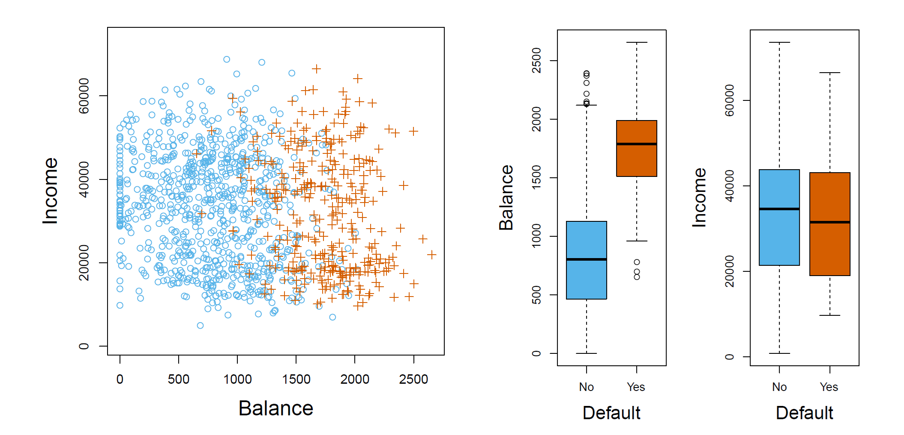{height="400px" fig-align="center"}

## La Sigmoide Acota Probabilidades

:::: {.columns}

::: {.column width="40%"}
- Regresión Logística:
  $$ P(Y=1|X) = \frac{1}{1 + e^{-(\beta_0 + \beta X)}} $$
:::

::: {.column width="60%"}
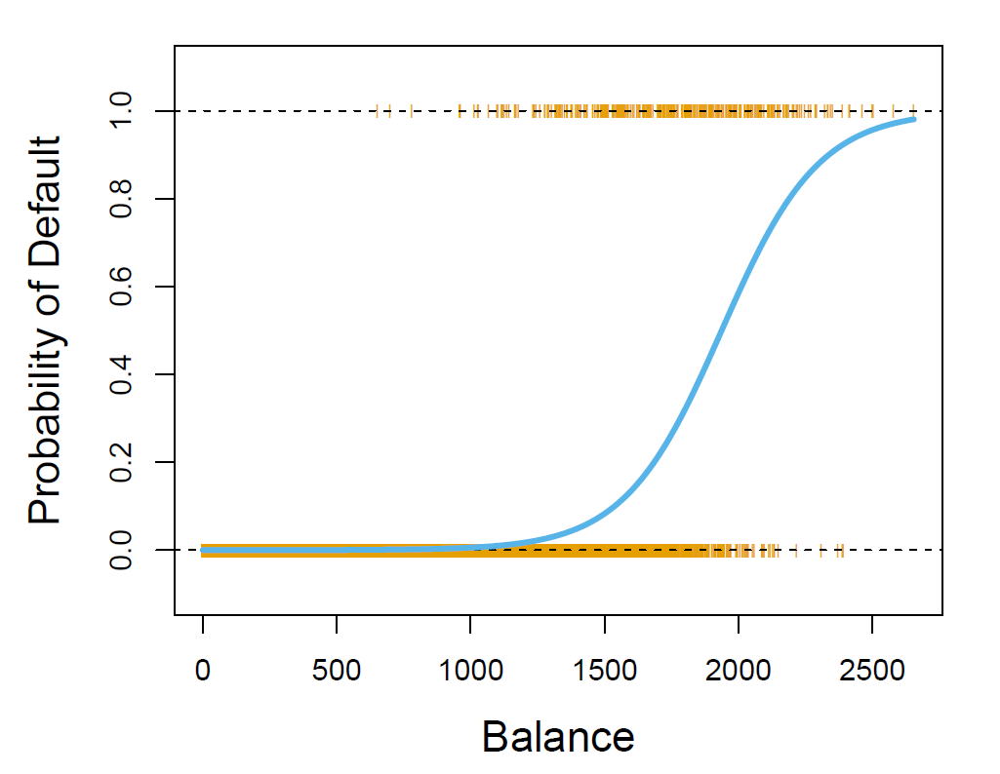{height="320px" fig-align="center"}
:::

::::

## Validación Cruzada en Datos Desbalanceados

- `cross_val_score`: Evalúa modelos en $k$ pliegues.
- `cross_val_predict`: Genera predicciones out-of-sample.
- Esencial ante la imprecisión del accuracy en desbalance.

## Estructura de la Matriz de Confusión

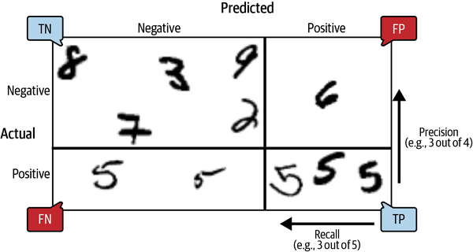{height="400px" fig-align="center"}

## Desglose de TP, TN, FP y FN

$$ \text{Matriz} = \begin{bmatrix} TP & FN \\ FP & TN \end{bmatrix} $$

- **TP (Verdaderos Positivos / *True Positives*)**: Positivos correctos.
- **TN (Verdaderos Negativos / *True Negatives*)**: Negativos correctos.
- **FP (Falsos Positivos / *False Positives*)**: Error tipo I.
- **FN (Falsos Negativos / *False Negatives*)**: Error tipo II.

## Accuracy y Precision Miden Calidad

**Exactitud (Accuracy)**:
$$ \text{Accuracy} = \frac{TP + TN}{TP + TN + FP + FN} $$
Mide la proporción total de aciertos del modelo.

**Precisión (Precision)**:
$$ \text{Precision} = \frac{TP}{TP + FP} $$
Mide la proporción de verdaderos positivos entre las predicciones positivas.

## Recall y F1-Score Evalúan Cobertura

**Exhaustividad (Recall)**:
$$ \text{Recall} = \frac{TP}{TP + FN} $$
Mide la capacidad de identificar todos los casos positivos reales.

**Puntuación F1 (F1-Score)**:
$$ \text{F1-Score} = 2 \times \frac{\text{Precision} \times \text{Recall}}{\text{Precision} + \text{Recall}} $$
Media armónica entre precisión y exhaustividad.

## Compromiso entre Precisión y Recall

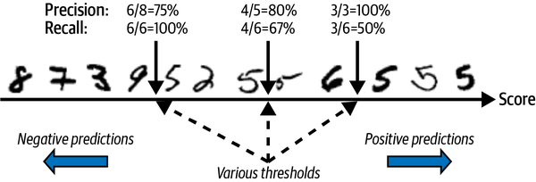{height="400px" fig-align="center"}

## Variar el Umbral Modifica la Sensibilidad

```python
from sklearn.datasets import load_digits
from sklearn.linear_model import SGDClassifier
from sklearn.model_selection import cross_val_predict
from sklearn.metrics import precision_recall_curve

X, y = load_digits(return_X_y=True)
y_5 = (y == 5)
sgd = SGDClassifier(random_state=42)
scores = cross_val_predict(sgd, X, y_5, cv=3, method="decision_function")
p, r, th = precision_recall_curve(y_5, scores)

print(f"Punto medio -> Precision: {p[len(p)//2]:.2f}, Recall: {r[len(r)//2]:.2f}")
```

## Curva Precision-Recall en MNIST

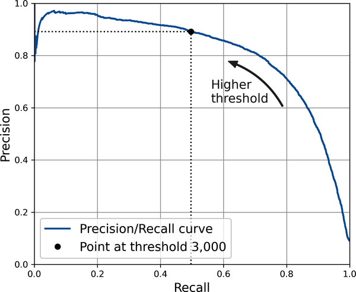{height="400px" fig-align="center"}

## ROC Evalúa Sensibilidad vs Especificidad

- **ROC**: Característica de Operación del Receptor (*Receiver Operating Characteristic*).

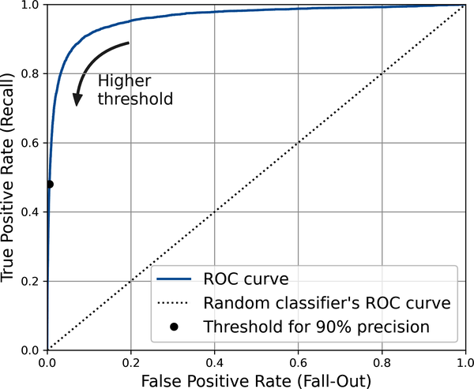{height="290px" fig-align="center"}

## Visualización de Errores de Clasificación

- `ConfusionMatrixDisplay.from_predictions()` genera diagramas de color.
- Normalizar por filas (`normalize="true"`) muestra porcentajes por clase real.
- Normalizar por columnas (`normalize="pred"`) muestra errores por clase predicha.

## Fronteras de Decisión Logísticas

:::: {.columns}

::: {.column width="40%"}
- `predict_proba()` estima probabilidades.
- La frontera se ubica en $P=50\%$.
- Con 2 features forma un plano de corte lineal.
:::

::: {.column width="60%"}
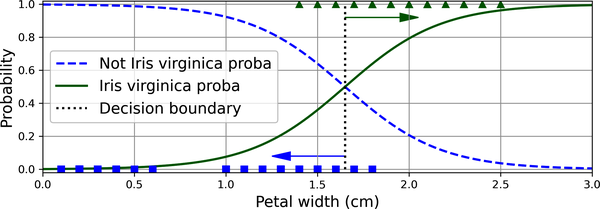{height="350px" fig-align="center"}
:::

::::

## 💻 Práctica: Métricas y Logística

::: {.callout-tip title="Ejercicio Práctico"}
1. Cargar el dataset Iris para clasificar clase Virginica.
2. Ajustar `LogisticRegression` evaluando la probabilidad estimada.
3. Calcular la puntuación de área bajo la curva (ROC-AUC).
:::

## Regresión Logística Estima Probabilidades

```python
from sklearn.datasets import load_iris
from sklearn.linear_model import LogisticRegression
from sklearn.metrics import roc_auc_score

iris = load_iris()
X, y = iris.data[:, [3]], (iris.target == 2)  # Iris Virginica por ancho petalo

# Modifica C (C menor = mas regularizacion)
log_reg = LogisticRegression(C=1.0).fit(X, y)
prob = log_reg.predict_proba([[1.7]])[0, 1]
auc = roc_auc_score(y, log_reg.predict_proba(X)[:, 1])

print(f"Prob (ancho=1.7cm): {prob:.2%} | ROC-AUC Modelo: {auc:.3f}")
```

## Límites del Accuracy en Spam

::: {style="text-align: center; margin-top: 15%; font-size: 1.2em;"}
¿Por qué la exactitud (*Accuracy*) puede ser engañosa si el 90% de los correos electrónicos no son spam?
:::

## Prioridad en Diagnóstico Médico

::: {style="text-align: center; margin-top: 15%; font-size: 1.2em;"}
Si estamos detectando cáncer maligno, ¿qué nos importa más maximizar: Precisión o Exhaustividad (Recall)?
:::

## Estrategias OvR y OvO en Multiclase

Estrategias para clasificar más de dos categorías:

- **OvR (One-versus-Rest / Uno contra el resto):** Clasificador por clase.
- **OvO (One-versus-One / Uno contra uno):** Clasificador por par de clases.

## Softmax Generaliza Logística a Multiclase

- Extiende la regresión logística a múltiples clases.
- Asigna un puntaje por clase y aplica Softmax para probabilidades.
- Clasifica asignando la categoría con mayor probabilidad.

## El Parámetro C Controla Regularización

```python
from sklearn.datasets import load_iris
from sklearn.linear_model import LogisticRegression

X, y = load_iris(return_X_y=True)

# Modifica C (C pequeño = regularizacion fuerte, C grande = sin regularizacion)
clf = LogisticRegression(C=1.0, penalty='l2', solver='lbfgs', max_iter=200, random_state=42)
clf.fit(X, y)
print(f"Accuracy Multiclase Iris (C=1.0): {clf.score(X, y):.2%}")
```

\nocite{*}

## Referencias Bibliográficas

\AtNextBibliography{}
\printbibliography
