# Introducción

## Icebreaker: Ciencia Ficción

{width="40%"}

- ¿Cuéntanos cual es tu peli / serie favorita de ciencia ficción?

## Cronograma

{width="100%"}

## Capítulos sobre Deep Learning

:::: {.columns}

::: {.column width="50%"}

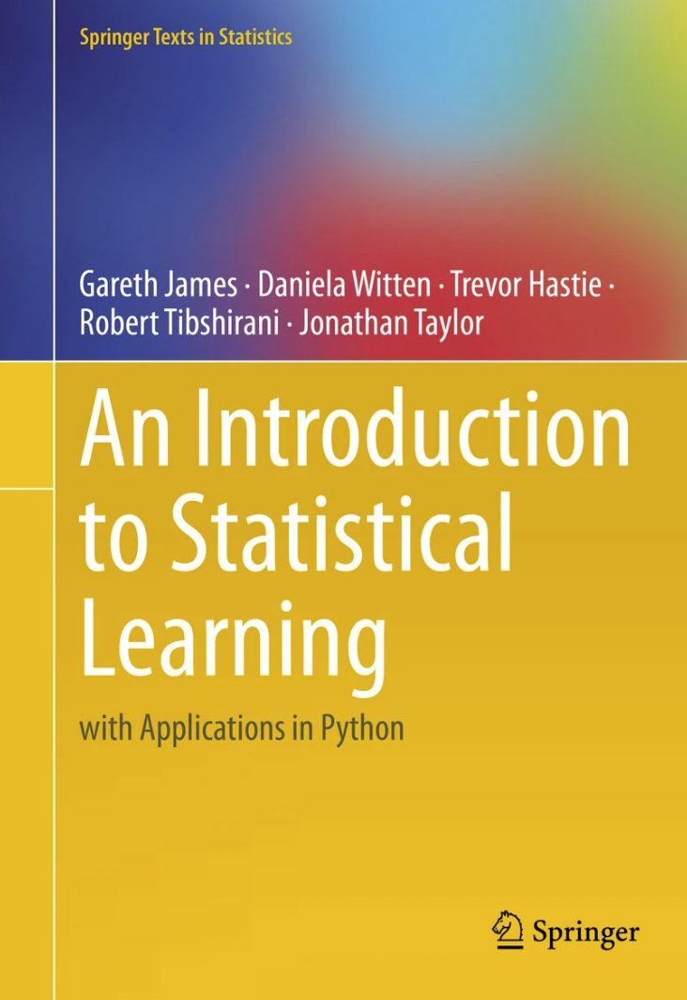{width="60%"} 
Capítulo 10

:::

::: {.column width="50%"}

{width="60%"} 
Capítulo 10
:::
::::

## Stacking

Entrenando un modelo que usa como entrada las salidas de otro modelo

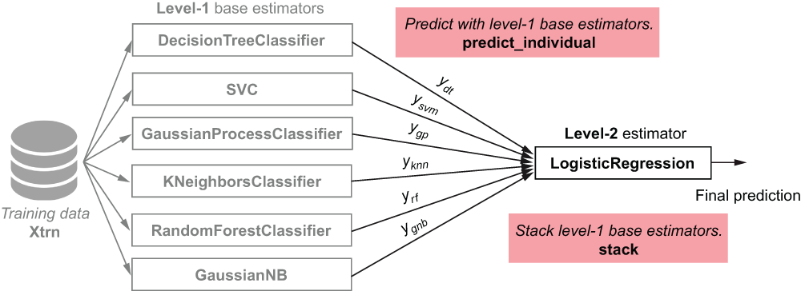{width="80%"}

## Inspiración Biológica

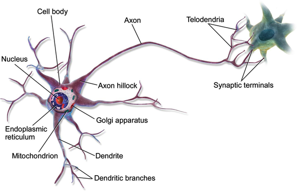{width="70%"}

Neurona Biológica

## Inspiración Biológica

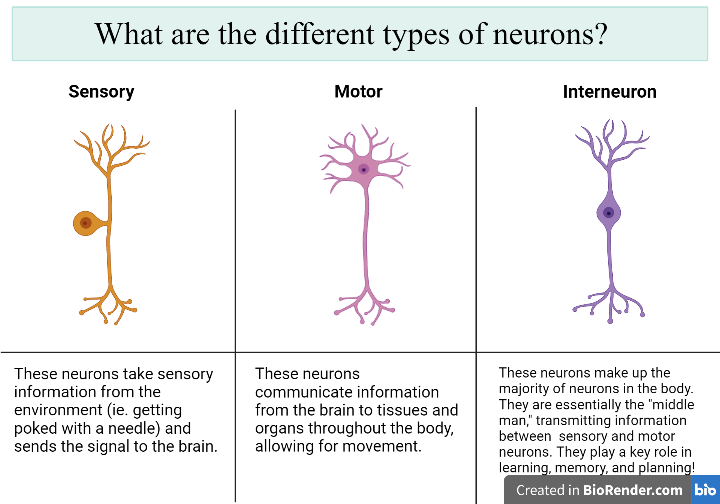{width="70%"}

## Inspiración Biológica

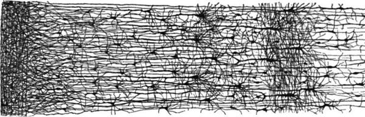{width="80%"}

Red Neuronal

## Pioneros en Redes Neuronales Artificiales 

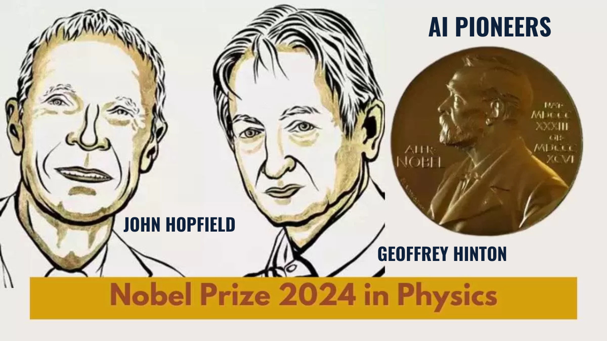{width="70%"}

Articulo de Interés: [@rumelhart1986learning]

## Juguemos con las Redes Neuronales

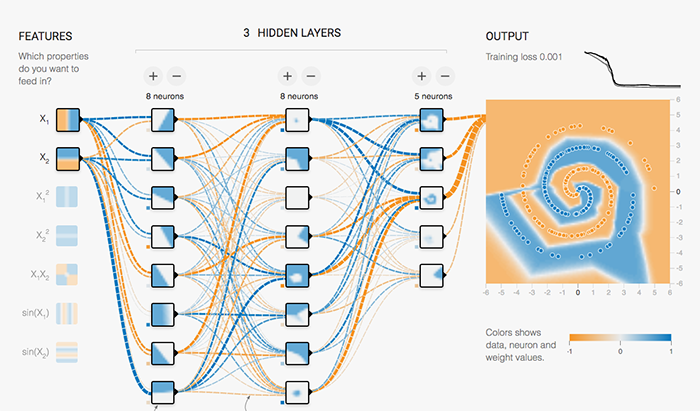{width="70%"}

[Understanding neural-networks with tensorflow-playground](https://cloud.google.com/blog/products/ai-machine-learning/understanding-neural-networks-with-tensorflow-playground)

## Zoológico de Redes neuronales

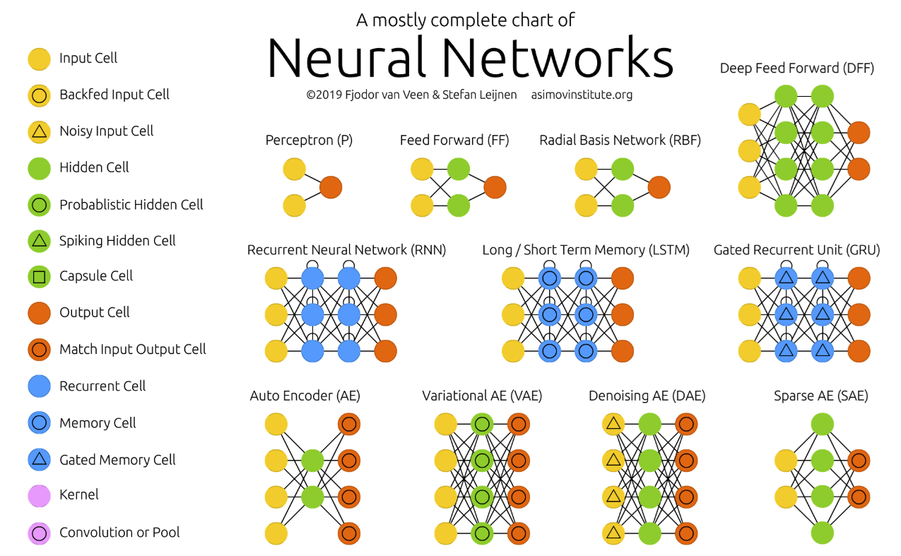{width="70%"}

[The Neural Network Zoo](https://www.asimovinstitute.org/neural-network-zoo/)

## Feed Forward Neural Networks (FFNN) y Perceptrones

**Feed Forward Neural Networks** 
Aplicación Ideal: Clasificación y regresión en problemas estructurados.
- Reconocimiento de patrones en datos tabulares.
- Modelado de funciones complejas.
- Aplicaciones en finanzas y predicción de series temporales simples.
**Radial Basis Function (RBF) Networks ** 
Aplicación Ideal: Problemas de interpolación y aproximación de funciones.
- Control adaptativo.
- Reconocimiento de caracteres y voz.

## Recurrent Neural Networks (RNN)

**Recurrent Neural Networks (RNN)** 
Aplicación Ideal: Procesamiento de datos secuenciales.
- Modelado de lenguaje natural.
- Reconocimiento de voz.
- Predicción de series temporales.
**Long Short-Term Memory (LSTM) Networks** 
Aplicación Ideal: Procesamiento de secuencias largas con dependencias temporales.
- Traducción automática.
- Generación de texto.
- Análisis de sentimientos.

## Recurrent Neural Networks (RNN)

**Recurrent Neural Networks (RNN)** 
Aplicación Ideal: Procesamiento de datos secuenciales.
- Modelado de lenguaje natural.
- Reconocimiento de voz.
- Predicción de series temporales.
**Long Short-Term Memory (LSTM) Networks** 
Aplicación Ideal: Procesamiento de secuencias largas con dependencias temporales.
- Traducción automática.
- Generación de texto.
- Análisis de sentimientos.

## Autoencoders (AE)

**Aplicación Ideal:** Reducción de dimensionalidad y detección de anomalías.
- Compresión de datos.
- Eliminación de ruido en imágenes y señales.
- Detección de fraudes.

## Zoológico de Redes neuronales

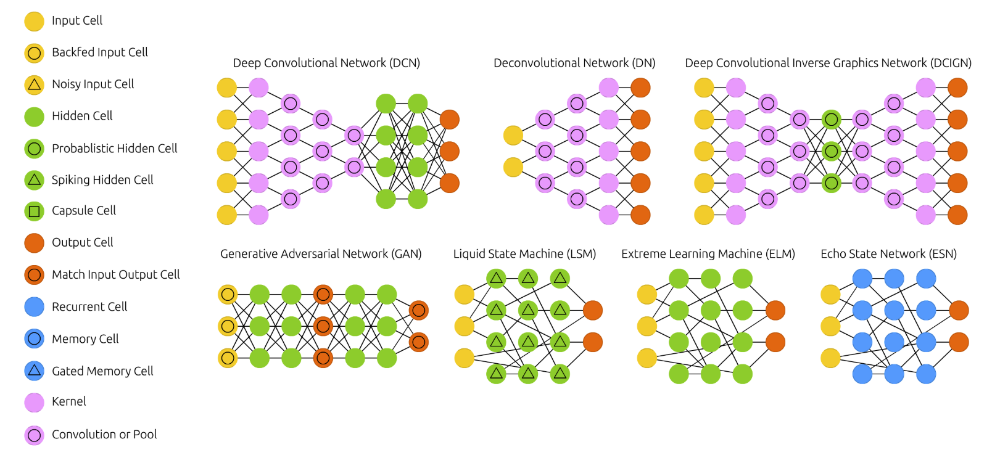{width="90%"}

[The Neural Network Zoo](https://www.asimovinstitute.org/neural-network-zoo/)

## Convolutional Neural Networks (CNN)

**Convolutional Neural Networks (CNN)** 
Aplicación Ideal: Procesamiento de imágenes y visión por computadora.
- Reconocimiento de objetos y rostros.
- Detección de anomalías en imágenes médicas.
- Aplicaciones en vehículos autónomos.

**Generative Adversarial Networks (GAN)** 
Aplicación Ideal: Generación de contenido realista.
- Creación de imágenes sintéticas.
- Restauración y mejora de imágenes.
- Generación de música y texto artificial.

## Zoológico de Redes neuronales

{width="90%"}

[The Neural Network Zoo](https://www.asimovinstitute.org/neural-network-zoo/)

## Attention Networks (AN)

**Aplicación Ideal:** Modelado de dependencias a largo plazo en datos secuenciales.
- Traducción automática con Transformers.
- Generación de resúmenes automáticos.
- Análisis de documentos extensos.
- Base de los Large Language Models (LLM)

# Perceptrón

## Neurona Artificial

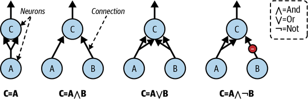{width="90%"}

Compuertas Lógicas con Neuronas Artificiales

## Neurona Artificial

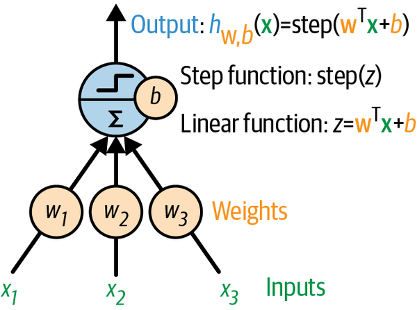{width="50%"}

Perceptron con tres entradas y una salida

## Neurona Artificial

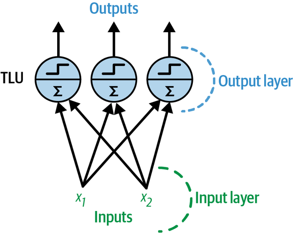{width="50%"}

Perceptron con dos entradas y tres salidas

## Neurona Artificial

{width="50%"}

Perceptron con dos entradas y tres salidas

## Modelo Matemático

La Unidad Lógica de Umbral (TLU por sus siglas en inglés *threshold logic unit*) primero calcula una función lineal de sus entradas:
\begin{equation}
z = \bm{w}^\top \bm{x} + b
\end{equation}
donde:
- $\bm{x}$ es el vector de características de entrada.
- $\bm{w}$ es el vector de pesos.
- $b$ es el término de sesgo.
Luego, se aplica una función escalón:
\begin{equation}
h_{\bm{w}}(\bm{x}) = \phi(z)
\end{equation}
donde:
- $\phi(z)$ es la función de activación (función escalón para TLU).

## Tipos de Umbrales

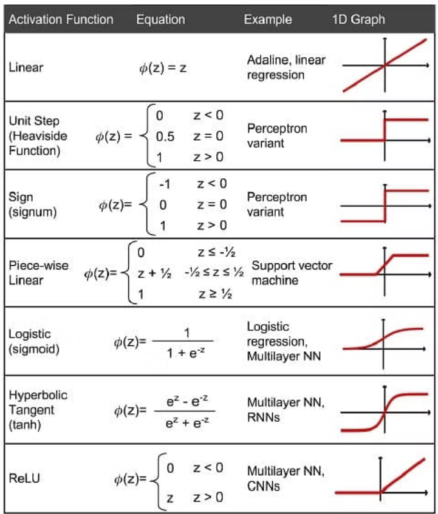{width="40%"}

## Regla de Aprendizaje del Perceptrón

La regla de actualización de pesos para el Perceptrón está dada por:
\begin{equation}
w_{i,j} \leftarrow w_{i,j} + \eta (y_j - \hat{y}_j) x_i
\end{equation}
donde:
- $w_{i,j}$ es el peso de conexión entre la $i$-ésima entrada y la $j$-ésima neurona.
- $x_i$ es el valor de la $i$-ésima entrada de la instancia de entrenamiento actual.
- $\hat{y}_j$ es la salida de la $j$-ésima neurona para la instancia de entrenamiento actual.
- $y_j$ es la salida objetivo de la $j$-ésima neurona.
- $\eta$ es la tasa de aprendizaje.

## Regla de Aprendizaje del Perceptrón

{width="40%"}

## Ejemplo de Código: Perceptrón

\begin{lstlisting}[language=Python, style=mystyle]
import numpy as np
from sklearn.datasets import load_iris
from sklearn.linear_model import Perceptron

iris = load_iris(as_frame=True)
X = iris.data[["petal length (cm)", "petal width (cm)"]].values
y = (iris.target == 0)

per_clf = Perceptron(random_state=42)
per_clf.fit(X, y)

X_new = [[2, 0.5], [3, 1]]
y_pred = per_clf.predict(X_new)
\end{lstlisting}

## Problema de optimización

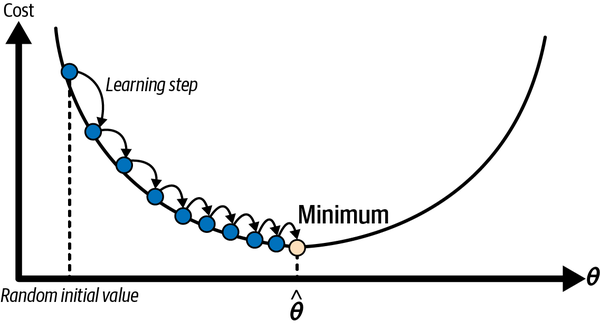{width="70%"}

Problema con un mínimo global único (Concavo)

## Problema de optimización

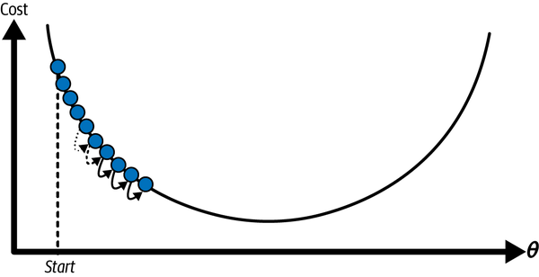{width="70%"}

Tasa de aprendizaje muy pequeña

## Problema de optimización

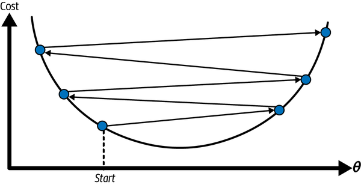{width="70%"}

Tasa de aprendizaje muy grande

## Problema de optimización

{width="70%"}

Problema con múltiples mínimos locales y con valles

## Problema de optimización

{width="70%"}

Problema con escalamiento de variables

## Limitaciones del Perceptrón

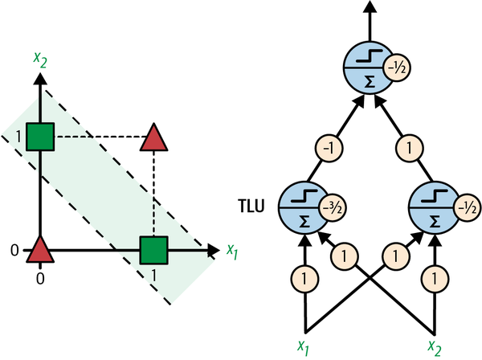{width="50%"}

Separación XOR

# Perceptrón Multicapa

## Regiones de decisión para Perceptrones Multicapa

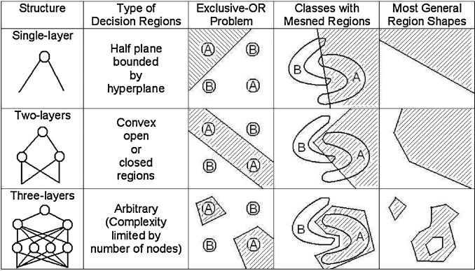{width="50%"}

Dependiendo de la arquitectura del perceptron, se pueden resolver problemas convexos

## Arquitectura de un MLP para regresión

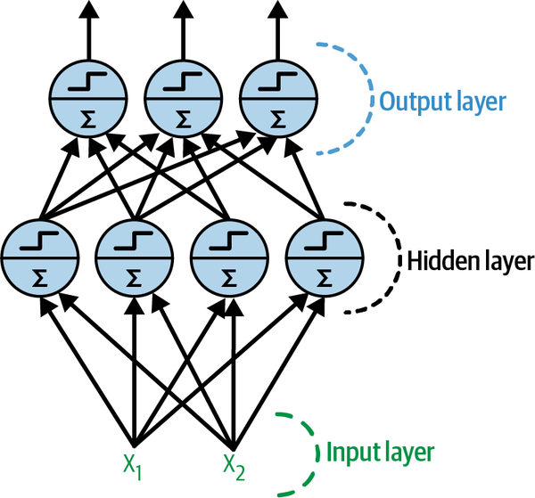{width="40%"}

- Capa de entrada: recibe los datos de entrada.
- Capas ocultas: transforman las entradas en representaciones más abstractas.
- Capa de salida: produce la predicción final.

## Arquitectura de un MLP para Clasificación

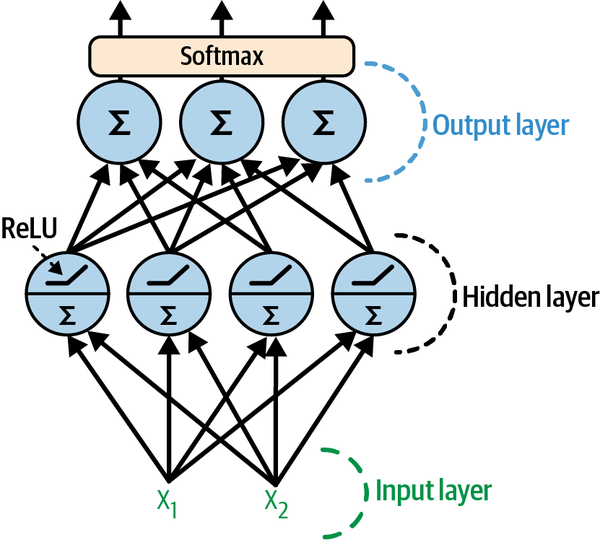{width="40%"}

- Capa de entrada: recibe los datos de entrada.
- Capas ocultas: transforman las entradas en representaciones más abstractas.
- Capa de salida: produce la predicción final.

## Funcionamiento de un MLP

1. **Propagación hacia adelante:** Las entradas se propagan a través de la red, capa por capa, hasta la capa de salida.
1. **Cálculo del error:** Se compara la salida de la red con la salida deseada para calcular el error.
1. **Retropropagación:** El error se propaga hacia atrás a través de la red para ajustar los pesos de las conexiones.
1. **Actualización de pesos:** Se utilizan algoritmos de optimización (como el descenso del gradiente) para actualizar los pesos y minimizar el error.

## Entrenamiento de un MLP

- Se utiliza un conjunto de datos de entrenamiento para ajustar los pesos de la red.
- El objetivo es minimizar una función de pérdida que mide la diferencia entre las predicciones de la red y las salidas reales.
- Se utilizan algoritmos de optimización como el descenso del gradiente para encontrar los pesos óptimos.

## Ilustración Retropropagación

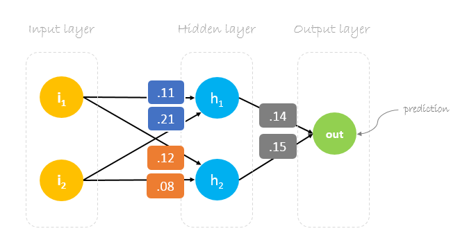{width="70%"}

Ejemplo con 1 capa oculta con dos neuronas, dos entradas y una salida

## Ilustración Retropropagación

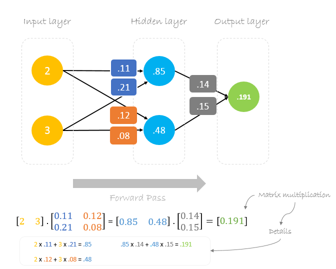{width="65%"}

## Ilustración Retropropagación

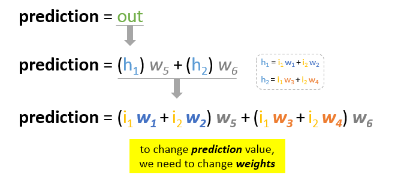{width="65%"}

## Ilustración Retropropagación

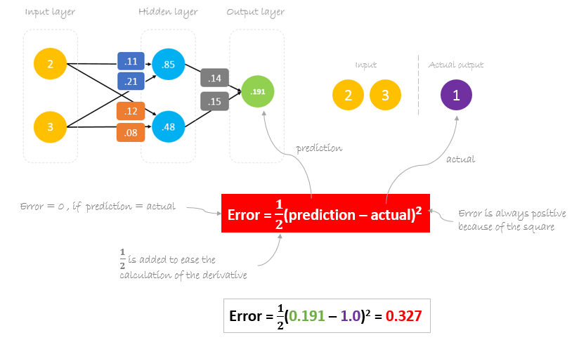{width="90%"}

## Ilustración Retropropagación

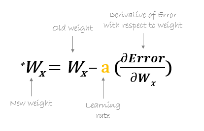{width="70%"}

## Ilustración Retropropagación

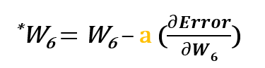{width="70%"}

## Ilustración Retropropagación

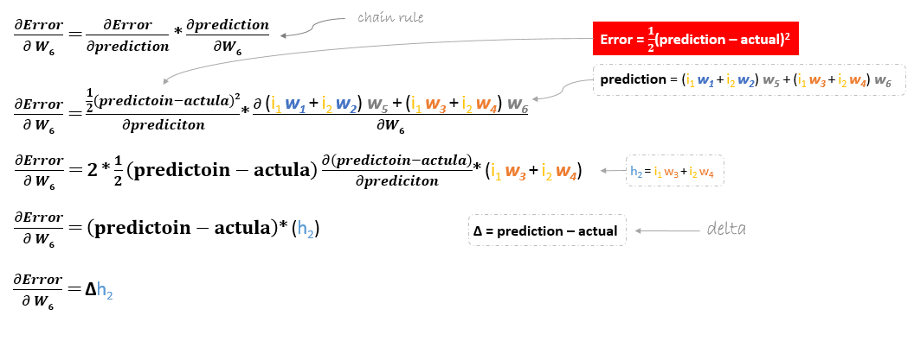{width="100%"}

## Ilustración Retropropagación

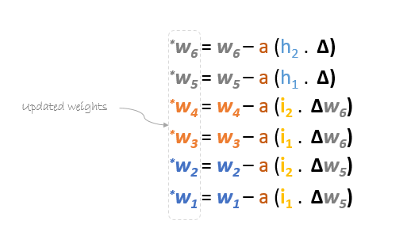{width="80%"}

# Librerías

## Seleccionando Algoritmos

¿Cómo elijo el algoritmo más adecuado para mis datos?
{width="80%"}

## Comparación de Algoritmos

Comparación de distintos algoritmos a la fecha

{width="100%"}

## Redes Neuronales en Python

- **Multilayer Perceptron (MLP) en Scikit-Learn:**
  - `sklearn.neural\_network.MLPClassifier`
  - `sklearn.neural\_network.MLPRegressor`

- **Redes Neuronales en Keras y TensorFlow:**
  - `tensorflow.keras.models.Sequential`
  - `tensorflow.keras.layers.Dense`

## Multilayer Perceptron (MLP): Hiperparámetros Clave

- `hidden\_layer\_sizes`: Tupla que define el número y tamaño de las capas ocultas (ej. `(100,)` para una capa de 100 neuronas).
- `activation`: Función de activación en las capas ocultas (`'relu'`, `'logistic'`, `'tanh'`).
- `solver`: Algoritmo de optimización (`'adam'`, `'sgd'`, `'lbfgs'`).
- `alpha`: Término de regularización L2 para evitar sobreajuste.
- `learning\_rate`: Controla la tasa de aprendizaje si se usa `sgd` como solver (`'constant'`, `'invscaling'`, `'adaptive'`).
- `max\_iter`: Número máximo de iteraciones para el entrenamiento.
- `random\_state`: Fija la semilla para reproducibilidad.

## Término de Regularización - Alpha

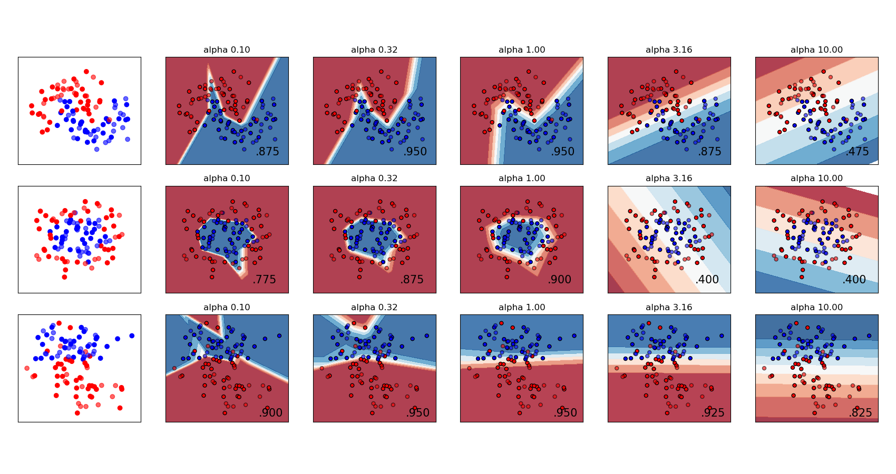{width="80%"}

Término de Regularización y su impacto en las predicciones

## Ejemplo de Código: Perceptrón Multicapa - Regresión

\begin{lstlisting}[language=Python, style=mystyle]
from sklearn.neural_network import MLPRegressor
from sklearn.datasets import make_regression
from sklearn.model_selection import train_test_split
X, y = make_regression(n_samples=200, n_features=20, random_state=1)
X_train, X_test, y_train, y_test = train_test_split(X, y,
random_state=1)
regr = MLPRegressor(random_state=1, max_iter=2000, tol=0.1)
regr.fit(X_train, y_train)
regr.predict(X_test[:2])
regr.score(X_test, y_test)
\end{lstlisting}

## Ejemplo de Código: Perceptrón Multicapa - Clasificación

\begin{lstlisting}[language=Python, style=mystyle]

from sklearn.neural_network import MLPClassifier
X = [[0., 0.], [1., 1.]]
y = [0, 1]
clf = MLPClassifier(solver='lbfgs', alpha=1e-5,
hidden_layer_sizes=(5, 2), random_state=1)
clf.fit(X, y)

\end{lstlisting}

## Ejemplo de Código: Perceptrón Multicapa - Clasificación en Keras

\begin{lstlisting}[language=Python, style=mystyle]
import tensorflow as tf
from tensorflow.keras.models import Sequential
from tensorflow.keras.layers import Dense
import numpy as np
X = np.array([[0., 0.], [1., 1.]])
y = np.array([0, 1])
model = Sequential([
Dense(5, activation='relu', input_shape=(2,)),
Dense(2, activation='relu'),
Dense(1, activation='sigmoid')  # Para clasificación binaria
])
model.compile(optimizer='lbfgs', loss='binary_crossentropy', metrics=['accuracy'])
model.fit(X, y, epochs=100, verbose=0)
\end{lstlisting}

\nocite{*}

## References

\AtNextBibliography{}
\printbibliography

