<style>
.reveal figcaption { text-align: center !important; }
.smaller-text { font-size: 0.75em !important; }
</style>

<!-- Introducción: 0–8 minutos -->

# Introducción

## Tarea: lecturas y exploración

**Antes o después de clase:**

1. **Obligatoria:** capítulo 10 de *Hands-On Machine Learning*, de Géron [@geron2022hands].
2. **Complementaria:** [notebook oficial del capítulo 10](https://github.com/ageron/handson-ml3/blob/main/10_neural_nets_with_keras.ipynb), especialmente Playground y Fashion MNIST [@geronNotebook].

**Durante la clase:** explicaremos las ideas con ejemplos propios y dos simuladores; no hace falta ejecutar TensorFlow en el computador.

## Tarea: NotebookLM

**Actividad complementaria:** abrir el [cuaderno de redes neuronales](https://notebook.google.com/notebook/7eb49a2f-ed6f-4ff8-9b5f-c1be83ddabd5){target="_blank"} [@notebookLMRedes].

- Pedir una explicación de XOR, backpropagation o Fashion MNIST.
- Contrastar la respuesta con el capítulo 10 de Géron.
- Traer a clase una duda o una discrepancia concreta.

## Ensambles dejaron una pregunta abierta

Bosques y boosting combinan decisiones de árboles. Ya vimos cómo pueden mejorar frente a un árbol aislado.

**Problema nuevo:** ante píxeles, señales o relaciones muy complejas, ¿qué representación útil puede aprender el modelo a partir de las entradas?

Hoy compararemos modelos y seguiremos cómo una red ajusta sus pesos para transformar esas entradas [@geron2022hands].

<!-- Acto 1: 8–20 minutos -->

# Acto 1: ¿Cuál modelo elegir?

## La frontera depende del problema

En las figuras siguientes, **todos** reciben la misma partición y el mismo escalamiento. Comparamos SVM lineal, SVM RBF, bosque aleatorio y MLP [@scikitClassifierComparison].

**Antes de verlas:** ¿esperas que el modelo más flexible gane siempre?

Los puntos opacos son de entrenamiento, los transparentes de prueba y el número es exactitud en prueba.

## En medias lunas no basta una recta

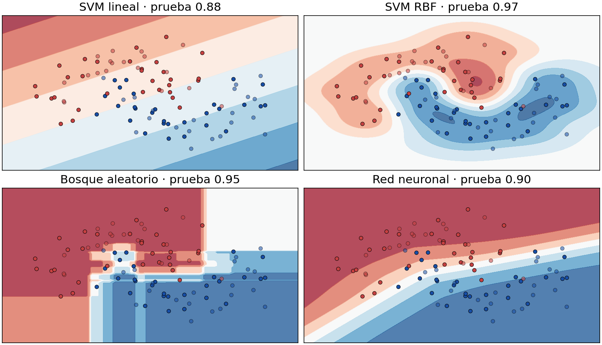{height="470px" fig-align="center"}

::: {style="text-align: center; font-size: 0.65em; margin-top: 10px;"}
Fronteras sobre *moons*; figura generada para la clase a partir de [@scikitClassifierComparison].
:::

## Con círculos cambia la evidencia

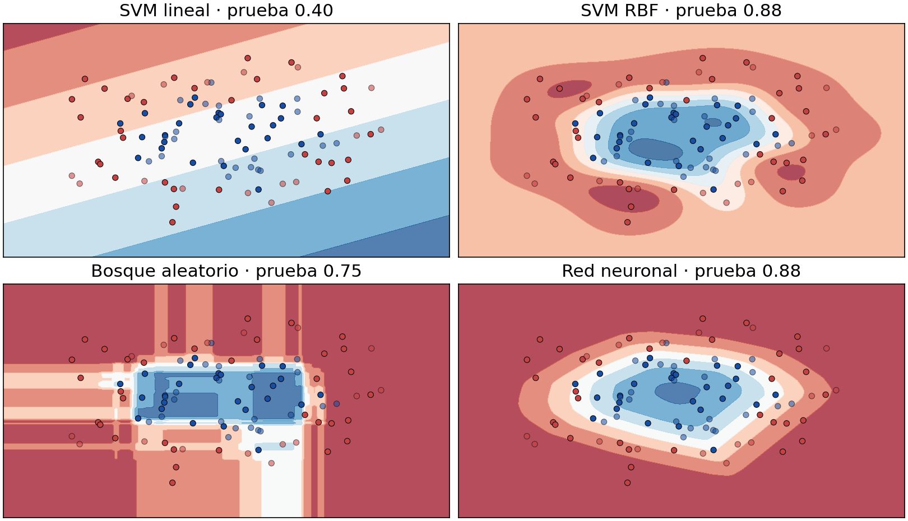{height="470px" fig-align="center"}

::: {style="text-align: center; font-size: 0.65em; margin-top: 10px;"}
Mismos cuatro métodos sobre *circles*; figura generada para la clase a partir de [@scikitClassifierComparison].
:::

## Ninguna frontera gana para siempre

- Son ejemplos sintéticos con solo dos variables.
- La exactitud cambia con los datos y la partición.
- Una frontera flexible puede captar patrón o ruido.

**Nueva pregunta:** si una red también puede trazar fronteras curvas, ¿qué hace cada una de sus unidades? [@scikitClassifierComparison; @geron2022hands]

<!-- Acto 2: 20–35 minutos -->

# Acto 2: ¿Qué puede hacer una neurona?

## La biología inspiró el nombre

:::: {.columns style="align-items: center;"}

::: {.column width="52%"}
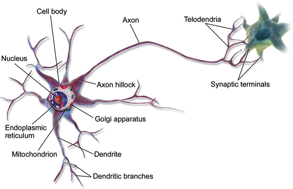{height="300px" fig-align="center"}

::: {style="text-align: center; font-size: 0.65em; margin-top: 8px;"}
Neurona biológica. Bruce Blaus, CC BY 3.0; reproducida en Géron, fig. 10-1 [@geron2022hands].
:::
:::

::: {.column width="48%"}
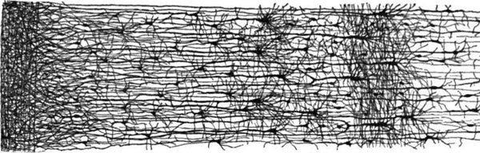{height="165px" fig-align="center"}

::: {style="text-align: center; font-size: 0.65em; margin-top: 8px;"}
Capas corticales. Ramón y Cajal, dominio público; reproducidas en Géron, fig. 10-2 [@geron2022hands].
:::
:::

::::

**Pregunta:** ¿qué conserva una unidad artificial de esta analogía y qué simplifica?

## Unidades simples calculan lógica

McCulloch y Pitts usaron unidades con entradas y salidas **binarias** para construir operaciones lógicas [@geron2022hands].

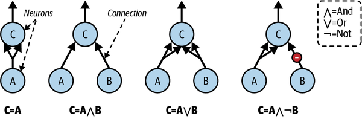{height="245px" fig-align="center"}

::: {style="text-align: center; font-size: 0.65em; margin-top: 8px;"}
Identidad, AND, OR y AND-NOT en el modelo de McCulloch y Pitts. Géron, fig. 10-3 [@geron2022hands].
:::

**Reto:** ¿cómo combinarías $A\land\neg B$ y $\neg A\land B$ para obtener XOR?

## El perceptrón aprende un corte recto

Rosenblatt añadió **pesos** que podían aprenderse. Una unidad suma entradas ponderadas, añade un sesgo y aplica un escalón [@geron2022hands].

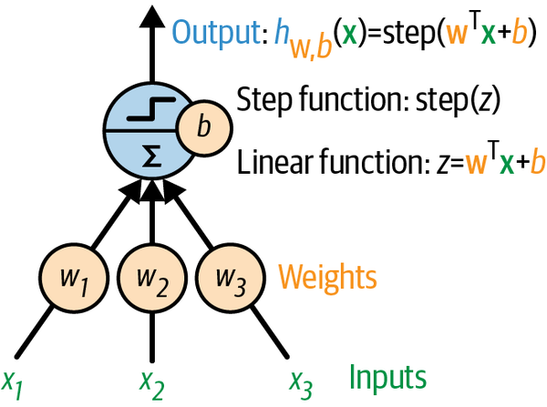{height="335px" fig-align="center"}

::: {style="text-align: center; font-size: 0.65em; margin-top: 8px;"}
Unidad de umbral: $z=\mathbf{w}^{\mathsf T}\mathbf{x}+b$. Géron, fig. 10-4 [@geron2022hands].
:::

**Pregunta:** ¿cuáles números cambian durante el entrenamiento? ¿Qué frontera produce el escalón?

## Una capa corrige varios pesos

:::: {.columns style="align-items: center;"}

::: {.column width="45%"}
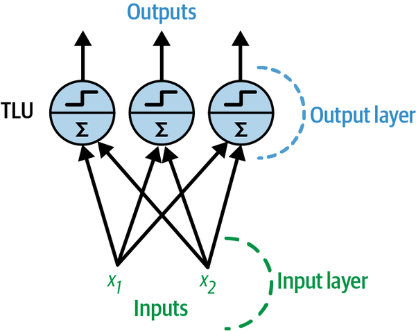{height="330px" fig-align="center"}

::: {style="text-align: center; font-size: 0.65em; margin-top: 8px;"}
Un perceptrón con tres salidas. Géron, fig. 10-5 [@geron2022hands].
:::
:::

::: {.column width="55%"}
Cada salida predice y corrige sus conexiones según el error:

$$w_i \leftarrow w_i+\eta(y-\hat y)x_i.$$

Si los datos son separables linealmente, el aprendizaje converge; cada salida conserva una frontera lineal [@geron2022hands].
:::

::::

## Perceptron aprende tres cortes en Iris

```python
from sklearn.datasets import load_iris
from sklearn.linear_model import Perceptron

X, y = load_iris(return_X_y=True)
X = X[:, 2:4]  # largo y ancho del pétalo
modelo = Perceptron(random_state=42)
modelo.fit(X, y)
print(modelo.coef_.shape, modelo.intercept_.shape)
# (3, 2) (3,)
```

Cada fila de `coef_` guarda dos pesos para una clase; `intercept_` guarda sus sesgos. scikit-learn ajusta tres clasificadores, uno por clase [@geron2022hands; @scikitPerceptron].

## Logística ofrece probabilidades

| Modelo | Salida | Frontera |
|:--|:--|:--|
| Perceptrón clásico | Escalón: clase | Lineal |
| Regresión logística | Sigmoide: probabilidad | Lineal |

La sigmoide permite una salida continua y derivable; el perceptrón clásico no da probabilidades ni regulariza por defecto [@geron2022hands].

**Problema pendiente:** ninguno separa XOR con las entradas originales.

## XOR expone el límite lineal

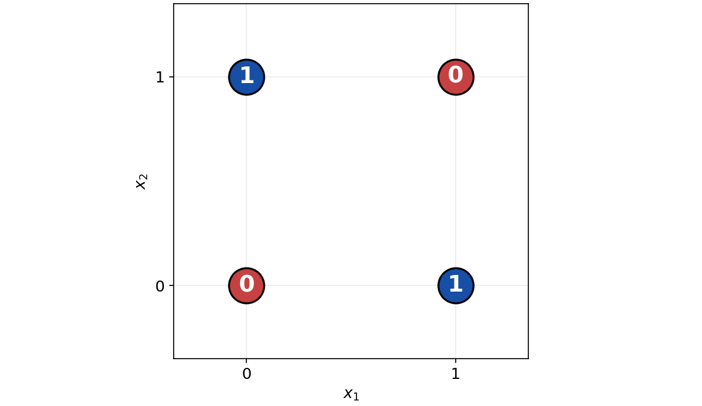{height="370px" fig-align="center"}

::: {style="text-align: center; font-size: 0.65em; margin-top: 8px;"}
Datos de XOR recreados para la clase: ninguna recta separa las dos etiquetas [@geron2022hands].
:::

**Predicción:** ¿ayudaría combinar dos cortes antes de decidir?

<!-- Acto 3: 35–63 minutos -->

# Acto 3: ¿Cómo aprende la capa oculta?

## Varias unidades resuelven XOR

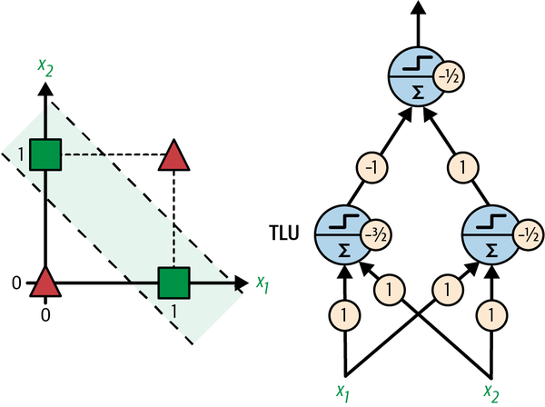{height="370px" fig-align="center"}

::: {style="text-align: center; font-size: 0.65em; margin-top: 8px;"}
Dos cortes se combinan en una red que representa XOR. Géron, fig. 10-6 [@geron2022hands].
:::

**Nueva pregunta:** ¿cómo aprenden los pesos de las unidades ocultas?

## La activación cambia la frontera

:::: {.columns style="align-items: center;"}

::: {.column width="45%"}
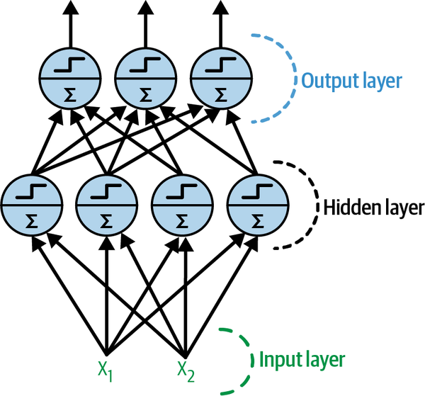{height="355px" fig-align="center"}

::: {style="text-align: center; font-size: 0.65em; margin-top: 8px;"}
Entradas, capa oculta y salida. Géron, fig. 10-7 [@geron2022hands].
:::
:::

::: {.column width="55%"}
- **Escalón:** ilustra la estructura, pero no da un gradiente útil.
- **Sigmoide / tanh:** son suaves y derivables.
- **ReLU:** conserva positivos y anula negativos.

Si todas las activaciones fueran lineales, apilar capas seguiría siendo lineal [@geron2022hands].
:::

::::


## Playground: prueba y predice

[Abrir TensorFlow Playground](https://playground.tensorflow.org/){target="_blank"} [@tensorflowPlayground; @geron2022hands]

1. Elige **clasificación** y el conjunto de **círculos**.
2. Compara una capa con **2** y con **8** unidades; reinicia entre corridas.
3. Cambia **tanh** por **ReLU**; observa frontera y pérdida de prueba.

**Antes de ejecutar:** ¿qué configuración esperas que subajuste? ¿Cuál podría sobreajustar?

## La capacidad también plantea un riesgo

Playground muestra que algunas unidades aprenden patrones simples y las siguientes los combinan [@geron2022hands; @tensorflowPlayground].

**Con pocas unidades:** puede faltar capacidad para representar el patrón.

**Con más unidades:** la pérdida de entrenamiento puede bajar sin que mejore la de prueba.

**Nueva pregunta:** ¿cómo se ajustan los pesos de las unidades ocultas?

## Primero avanza una predicción

Una pasada hacia adelante calcula salidas capa por capa:

$$x \longrightarrow h_1 \longrightarrow \hat y \longrightarrow L(y,\hat y).$$

La **pérdida** mide el desacuerdo entre predicción y etiqueta. Cambiar solo los pesos de salida dejaría sin aprender a la capa oculta [@geron2022hands].

## Después retroceden los gradientes

Backpropagation responde: **¿cuánto cambia la pérdida si cambia cada peso?**

Desde la salida, aplica la regla de la cadena a cada capa hasta obtener sus gradientes, incluidos los de las unidades ocultas [@geron2022hands; @rumelhart1986learning].

Luego el optimizador actualiza los pesos, por ejemplo $w\leftarrow w-\eta\,\partial L/\partial w$.

## El MLP ajusta pesos de ambas capas

```python
from sklearn.datasets import make_moons
from sklearn.neural_network import MLPClassifier
from sklearn.preprocessing import StandardScaler

X, y = make_moons(300, noise=0.2, random_state=42)
X = StandardScaler().fit_transform(X)
red = MLPClassifier(hidden_layer_sizes=(8,), activation="tanh",
                    solver="sgd", max_iter=500, random_state=42)
red.fit(X, y)
print([w.shape for w in red.coefs_])  # [(2, 8), (8, 1)]
```

`fit` calcula gradientes por backpropagation y SGD actualiza las dos matrices de pesos [@geron2022hands; @scikitMLPGuide].

## Simulador: sigue una época

[Abrir el simulador de backpropagation](https://oscar-bustos.github.io/javeriana-tallerml/redes_neuronales/backpropagation.html){target="_blank"} [@bustosBackpropSimulator]

1. Detente tras la **predicción** y anticipa el signo del error.
2. Sigue los **gradientes** desde la salida hacia atrás.
3. Observa la **actualización** y compara la nueva pérdida.

**Pregunta:** ¿por qué se calculan gradientes antes de modificar pesos?

## El ejemplo simplifica la activación

El simulador usa **activación identidad** y una observación para hacer visible cada cálculo [@bustosBackpropSimulator].

Para aprender XOR necesitamos activaciones no lineales. Sus derivadas entran en la misma cadena de gradientes [@geron2022hands].

**Una época** recorre los ejemplos de entrenamiento; suele contener muchos lotes y actualizaciones.

<!-- Acto 4: 63–93 minutos -->

# Acto 4: ¿Cómo entra una imagen?

## Una imagen es una matriz de datos

{height="390px" fig-align="center"}

::: {style="text-align: center; font-size: 0.65em; margin-top: 8px;"}
Primera imagen de entrenamiento de Fashion MNIST: etiqueta 9, botín. Píxeles de 0 a 255; Zalando Research, licencia MIT [@fashionMNIST].
:::

## 784 valores describen la imagen

Fashion MNIST contiene imágenes en escala de grises de **28 × 28** píxeles y **10 clases** [@fashionMNIST; @geron2022hands].

`Flatten` ordena los $28\times28=784$ valores para una capa densa. Dividir por **255** lleva las intensidades al intervalo **0–1**.

**Pregunta:** si la clase es «botín», ¿esa palabra está dentro de la imagen?

## Validación no es prueba final

| Partición del ejemplo del libro | Imágenes | Uso |
|:--|--:|:--|
| Entrenamiento | 55 000 | Ajustar pesos |
| Validación | 5 000 | Elegir configuración |
| Prueba | 10 000 | Evaluar una vez al final |

La etiqueta es un entero entre **0 y 9**; se mantiene separada de los píxeles [@geron2022hands; @fashionMNIST].

## Cargar y normalizar es el primer paso

```python
import tensorflow as tf

(X_full, y_full), (X_test, y_test) = tf.keras.datasets.fashion_mnist.load_data()
X_valid, X_train = X_full[:5000] / 255.0, X_full[5000:] / 255.0
y_valid, y_train = y_full[:5000], y_full[5000:]
X_test = X_test / 255.0
```

El aplanamiento ocurre **dentro del modelo**, no al cargar los datos [@geron2022hands; @tensorflowFashionTutorial].

## El mismo MLP tiene dos interfaces

::: {.smaller-text}
| Paso | scikit-learn: `MLPClassifier` | Keras: `Sequential` |
|:--|:--|:--|
| Entrada | `X_train.reshape(-1, 784)` | `X_train` y `Flatten()` |
| Capa oculta | `hidden_layer_sizes=(64,)` | `Dense(64, activation="relu")` |
| Salida multiclase | `softmax` implícita | `Dense(10, activation="softmax")` |
| Entrenamiento | `mlp.fit(X_2d, y_train)` | `model.compile(...); model.fit(X_train, y_train)` |
| Validación | `mlp.score(X_valid_2d, y_valid)` | `validation_data=(X_valid, y_valid)` |
:::

Ambos usan backpropagation; los hiperparámetros y el optimizador deben fijarse para compararlos experimentalmente [@geron2022hands; @scikitMLPGuide; @kerasTraining].

## Sequential expresa un flujo simple

```python
model = tf.keras.Sequential([
    tf.keras.layers.Input(shape=(28, 28)),
    tf.keras.layers.Flatten(),
    tf.keras.layers.Dense(64, activation="relu"),
    tf.keras.layers.Dense(10, activation="softmax"),
])
```

Diez salidas representan diez clases. Este MLP breve es una **adaptación didáctica** del ejemplo de Fashion MNIST [@geron2022hands].

## La pérdida debe corresponder a la tarea

```python
model.compile(optimizer="sgd",
              loss="sparse_categorical_crossentropy",
              metrics=["accuracy"])
history = model.fit(X_train, y_train, epochs=20,
                    validation_data=(X_valid, y_valid))
```

`softmax` produce diez probabilidades; la pérdida *sparse* acepta etiquetas enteras. `history` guarda métricas por época [@geron2022hands; @kerasTraining].

## Las curvas detectan sobreajuste

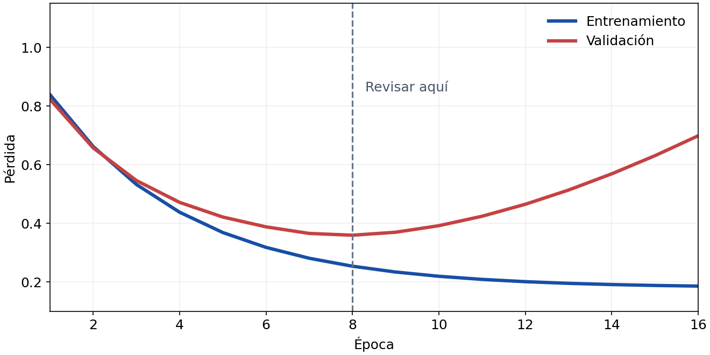{height="370px" fig-align="center"}

::: {style="text-align: center; font-size: 0.65em; margin-top: 8px;"}
Esquema didáctico, **no** resultado de entrenar Fashion MNIST. Basado en la lectura de curvas de [@geron2022hands].
:::

**Pregunta:** si validación deja de mejorar, ¿qué época conservarías?

## Evaluar y predecir cierran el ciclo

```python
test_loss, test_accuracy = model.evaluate(X_test, y_test)
probabilidades = model.predict(X_test[:1])
clase = probabilidades.argmax(axis=1)[0]
```

`evaluate` estima el desempeño final en prueba; `predict` devuelve probabilidades para nuevas imágenes. Aquí no suponemos un resultado numérico sin entrenar el modelo [@geron2022hands; @kerasTraining].

<!-- Acto 5: 93–116 minutos; cierre: 116–120 minutos -->

# Acto 5: ¿Qué falta para usarla bien?

## La salida depende de la pregunta

:::: {.columns style="align-items: center;"}

::: {.column width="43%"}
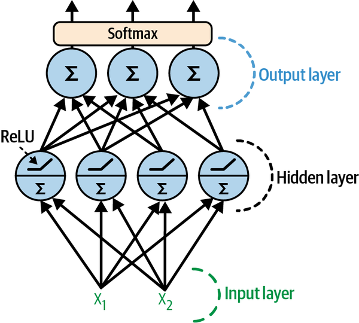{height="330px" fig-align="center"}

::: {style="text-align: center; font-size: 0.65em; margin-top: 8px;"}
ReLU y softmax para tres clases; Fashion usa diez. Géron, fig. 10-9 [@geron2022hands].
:::
:::

::: {.column width="57%"}
::: {.smaller-text}
| Tarea | Salida | Pérdida |
|:--|:--|:--|
| Regresión | Valor continuo | Cuadrática |
| Binaria | Sigmoide | Entropía binaria |
| Multiclase | Softmax | Entropía categórica |
| Multietiqueta | Una sigmoide por clase | Entropía binaria |
:::

Fashion usa etiquetas enteras y la pérdida **sparse** [@geron2022hands].
:::

::::

## Functional conecta varias entradas

`Sequential` basta para una cadena. Como en el ejemplo *Wide & Deep* del libro, la API funcional conecta ramas. Aquí añadimos **metadatos hipotéticos** a los píxeles [@geron2022hands; @kerasFunctional].

```python
imagen = tf.keras.Input(shape=(28, 28))
datos = tf.keras.Input(shape=(3,))
pixeles = tf.keras.layers.Flatten()(imagen)
juntos = tf.keras.layers.Concatenate()([pixeles, datos])
salida = tf.keras.layers.Dense(10, activation="softmax")(juntos)
modelo = tf.keras.Model([imagen, datos], salida)
```

## Subclasificar permite lógica dinámica

La API de subclases define capas en `__init__` y el cálculo en `call` [@geron2022hands; @kerasFunctional].

| API | Conviene cuando… |
|:--|:--|
| `Sequential` | Hay una cadena de capas |
| Funcional | Hay ramas o varias entradas/salidas |
| Subclases | El cálculo requiere condiciones o bucles |

**Costo:** el flujo dinámico es menos fácil de inspeccionar y serializar.

## Guardar y observar evita perder señales

- `model.save("modelo.keras")` conserva un modelo para recuperarlo.
- `ModelCheckpoint` guarda la mejor versión según validación.
- `EarlyStopping` detiene épocas sin mejora.
- `TensorBoard` permite examinar curvas y experimentos.

Son herramientas para **seguir el entrenamiento**; ninguna reemplaza un conjunto de prueba reservado [@geron2022hands; @kerasTraining].

## Regularizar cambia la frontera

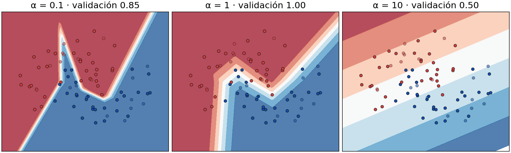{height="390px" fig-align="center"}

::: {style="text-align: center; font-size: 0.65em; margin-top: 8px;"}
En `MLPClassifier`, solo cambia $\alpha$, la penalización L2. Exactitud sobre validación; figura adaptada de [@scikitMLPAlpha].
:::

**Pregunta:** ¿qué extremo parece subajustar? ¿Cuál elegirías con estos datos?

## Ajustar exige comparar en validación

El capítulo propone considerar **tasa de aprendizaje**, tamaño de lote, unidades, capas y activación; `EarlyStopping` puede limitar el sobreajuste [@geron2022hands].

`KerasTuner` compara configuraciones con búsqueda aleatoria, Hyperband o búsqueda bayesiana. Elegimos con **validación** y usamos **prueba** al final [@kerasTuner].

El $\alpha$ anterior pertenece a scikit-learn: en Keras, L2 se especifica con `kernel_regularizer` [@kerasRegularizers].

## Tres respuestas para salir

1. ¿Qué números recibe el MLP cuando ve una imagen de Fashion MNIST?
2. ¿Qué obtiene backpropagation **antes** de actualizar los pesos?
3. ¿Qué evidencias usarías para elegir modelo y regularización?

**Cierre:** una red aprende representaciones al ajustar pesos, pero su utilidad se decide con datos no vistos [@geron2022hands].

## Referencias {.smaller .scrollable}

::: {#refs}
:::
