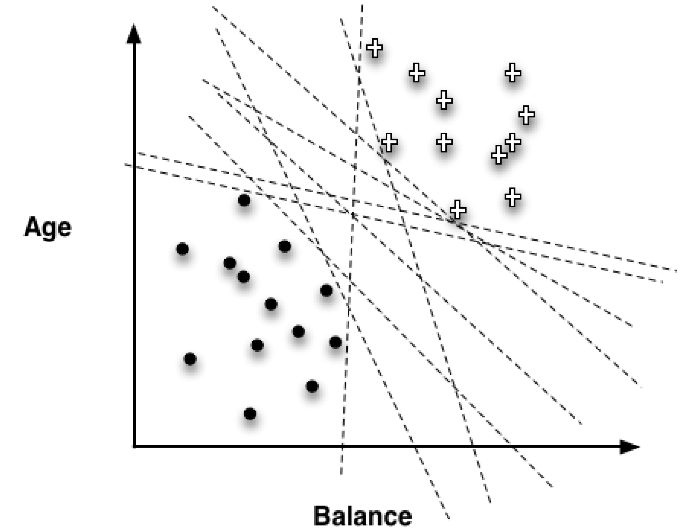
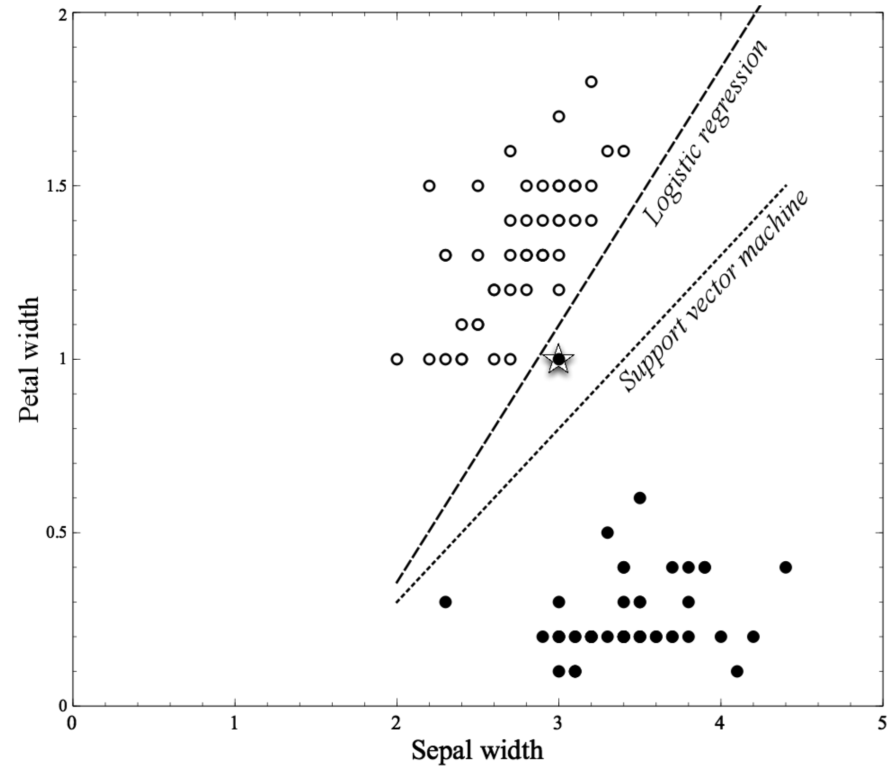
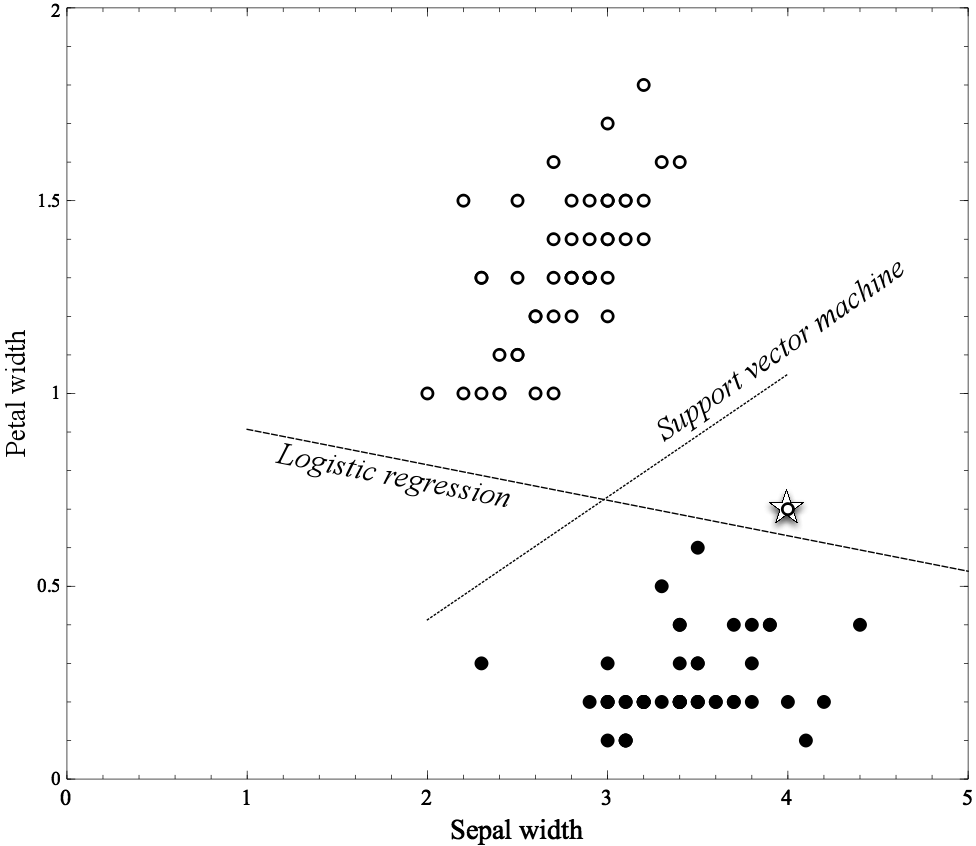
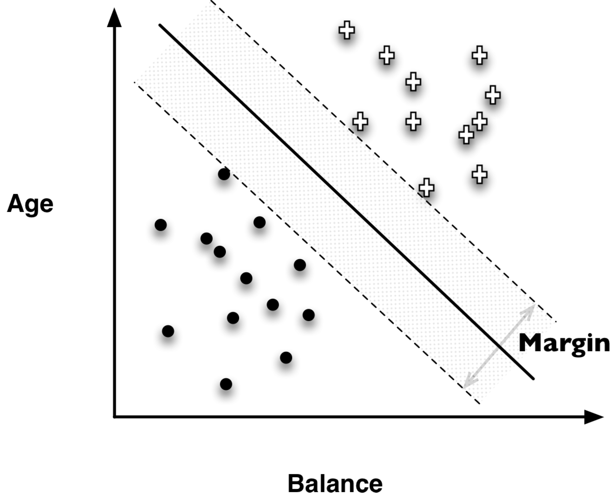
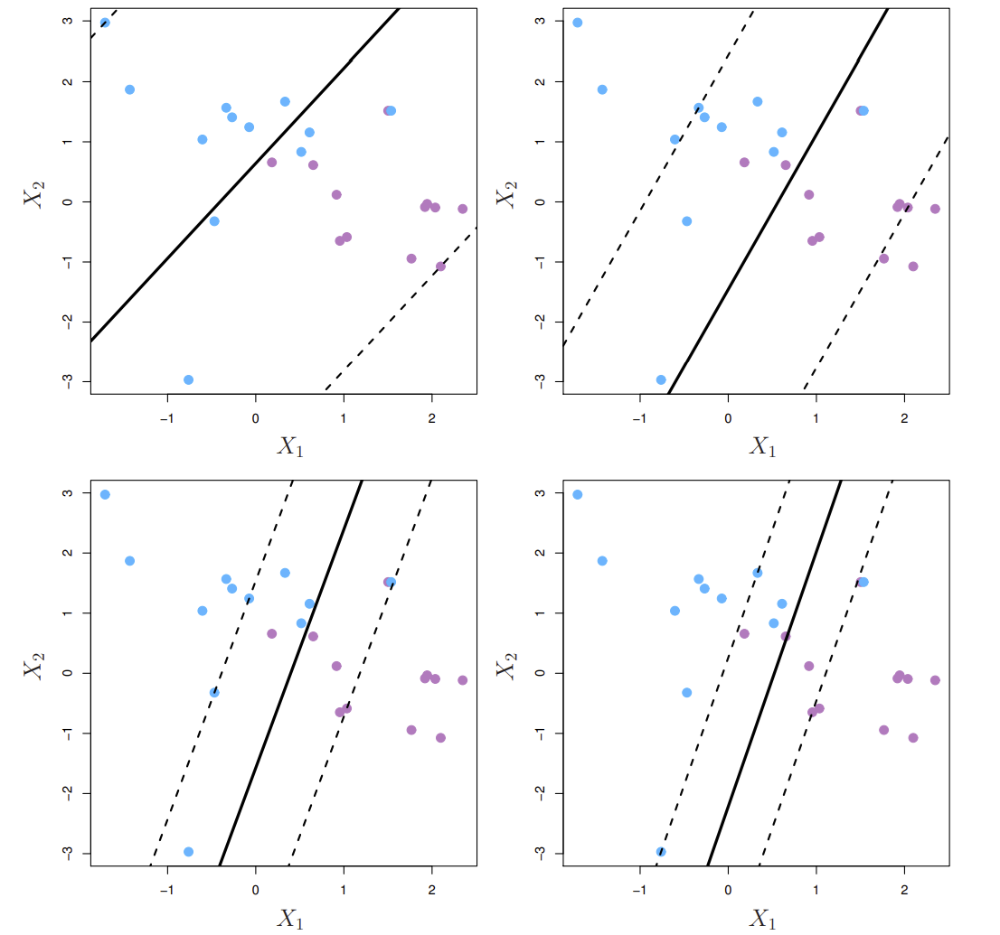
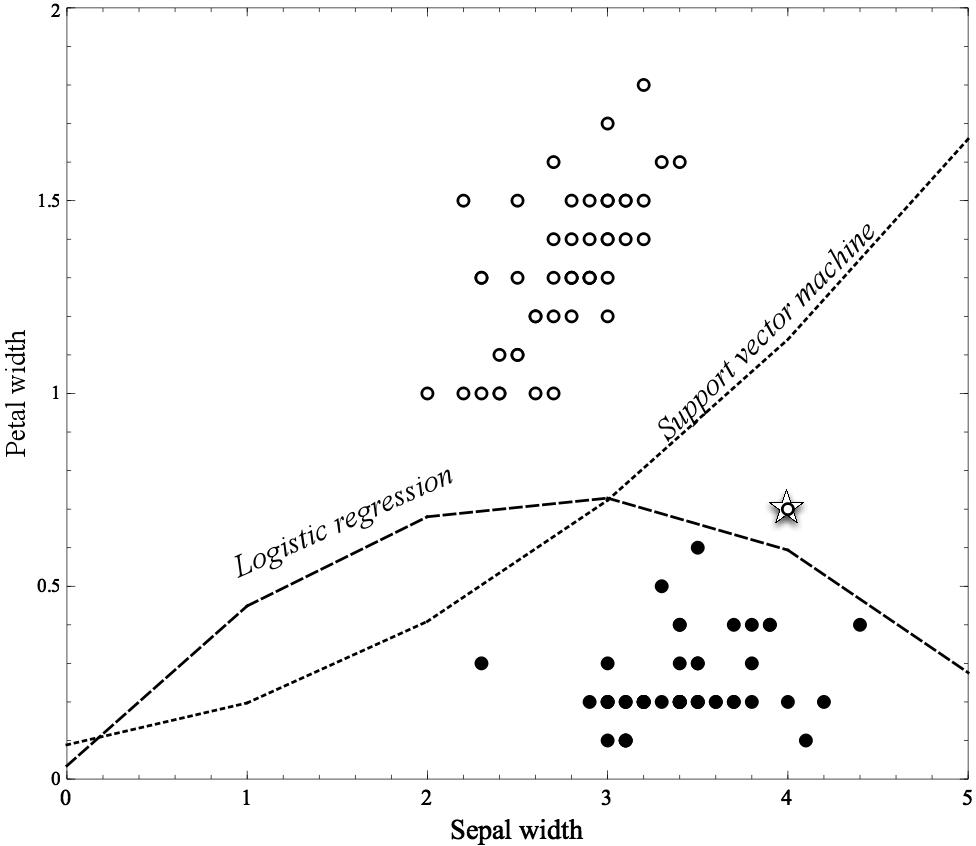
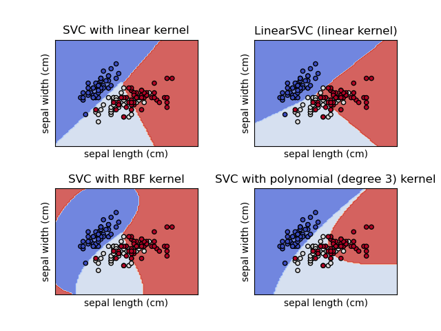
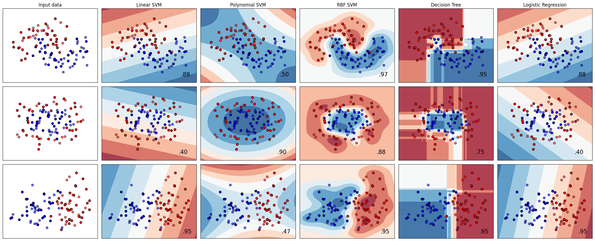
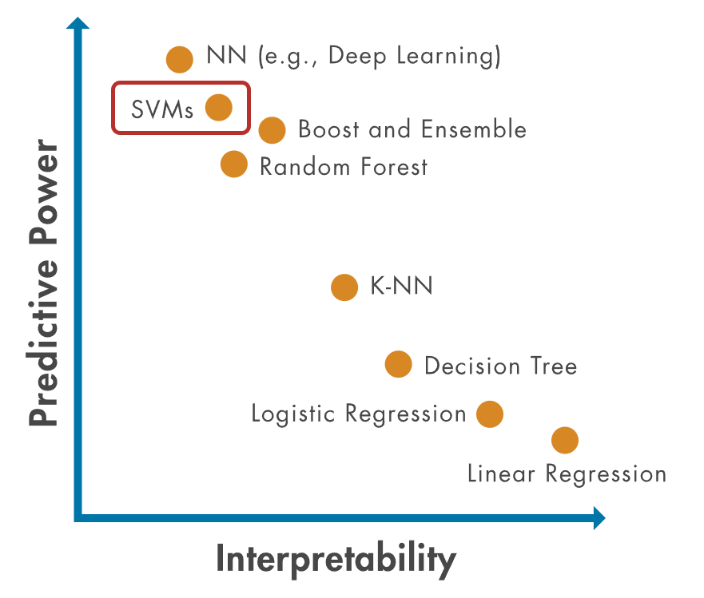

# Icebreaker

## Conversación entre Robots

{width="80%"} 
[https://www.gbrl.ai/](https://www.gbrl.ai/)

# Intuición Matemática

## Capítulos sobre SVM

:::: {.columns}

::: {.column width="50%"}

{width="60%"} 
Capítulo 5
:::
::::

## Capítulos sobre SVM

:::: {.columns}

::: {.column width="50%"}

{width="60%"} 
Capítulo 9

:::

::: {.column width="50%"}

{width="60%"} 
Capítulo 4
:::
::::

## Problema de Separación Lineal

¿Cómo construyo un modelo lineal que permita separar perfectamente los puntos de la siguiente gráfica?

 % Espacio opcional entre el texto y la imagen

{width="50%"}

## Problema de Separación Lineal

¿Cuál de los dos modelos es mejor?

 % Espacio opcional entre el texto y la imagen

{width="40%"}

## Problema de Separación Lineal

¿Qué pasa si entra un nuevo dato?

 % Espacio opcional entre el texto y la imagen

{width="40%"}

## Maximización del margen

Entre todos los hiperplanos separadores, encuentre el que genere la mayor brecha o margen entre las dos clases.

{width="60%"}

## Enfoque Máquinas de Vectores de Soporte

Enfoque principal
- Encontrar la línea (o hiperplano) que divide las clases de la mejor manera.
- Maximizar el margen entre las clases.

Características clave
- **Hiperplano:** La línea (o plano) que separa las clases.
- **Margen:** Distancia entre el hiperplano y los puntos más cercanos.
- **Vectores de Soporte:** Puntos más cercanos al hiperplano.

## Regresión Logística: Optimización

- **Modelo:** $\hat{p}(X_i) = \frac{1}{1 + \exp(-(X_i w + w_0))}$  (Prob. clase positiva)
- **Función de Pérdida (Log-Loss):**
  \[
  \min_w \sum_{i=1}^{n} \left[-y_i \log(\hat{p}(X_i)) - (1-y_i) \log(1-\hat{p}(X_i))\right]
  \]
- **Optimización:** Se minimiza la Log-Loss para encontrar los parámetros $w$ y $w_0$.
- **Ventajas:**
  - Bajo costo computacional (pocos parámetros).
  - Interpretabilidad (importancia de variables).
- **Desventaja:** Requiere separabilidad lineal.

## Máquinas de Vectores de Soporte (SVM): Optimización

- **Clasificación (Hiperplano):**
  \[
  \begin{cases}
  w^T X_i - b \geq 1, & \text{si } y_i = 1 
  w^T X_i - b \leq -1, & \text{si } y_i = -1  % Corrección: -1 en lugar de 1 para y=0
  \end{cases}
  \]
- **Función de Pérdida (Hinge-Loss):**
  \[
  \min_{w,b} \frac{1}{2} w^T w + C \sum_{i=1}^{n} \max(0, 1 - y_i(w^T \phi(X_i) + b))
  \]
- **Kernels:** $\phi(x_i, x_j)$
  - Lineal: $\phi(x_i, x_j) = x_i^T x_j$
  - Polinómico: $\phi(x_i, x_j) = (x_i^T x_j)^d$
  - RBF: $\phi(x_i, x_j) = \exp(-\gamma ||x_i - x_j||^2)$
- **Optimización:** Se minimiza la Hinge-Loss para encontrar $w$ y $b$.  $C$ es un hiperparámetro de regularización.

## El Parámetro de Regularización C en SVM

- **Control de la complejidad:** El parámetro $C$ controla el equilibrio entre dos objetivos:
  1. Maximizar el margen entre las clases.
  1. Minimizar el error de clasificación en los datos de entrenamiento.
- **Interpretación:**
  - **C grande:** Prioriza minimizar errores de clasificación, puede llevar a márgenes más pequeños y mayor complejidad del modelo (riesgo de sobreajuste).
  - **C pequeño:** Prioriza maximizar el margen, tolera algunos errores de clasificación y da como resultado modelos más simples (menor riesgo de sobreajuste).
- **Ajuste de C:** El valor óptimo de $C$ debe determinarse mediante validación cruzada u otras técnicas de evaluación del modelo.

## Parametro de Regularización C

{width="55%"}

# Separación no lineal

## Expansión de Características

Frontera cuadrática

 % Espacio opcional entre el texto y la imagen

{width="40%"}

## Expansión de Características (Feature Expansion)

- **Aumento de la dimensión:** Se amplía el espacio de características mediante transformaciones no lineales de las características originales.
- **Ejemplo:** De $(X_1, X_2)$ a $(X_1, X_2, X_1^2, X_2^2, X_1X_2)$.
- **Objetivo:**  Permitir fronteras de decisión no lineales en el espacio original.
- **Proceso:**
  1. Transformar las características originales a un espacio de mayor dimensión ($M > p$).
  1. Entrenar un clasificador de vectores de soporte (u otro modelo) en el espacio ampliado.
  1. La frontera de decisión resultante será no lineal en el espacio original.
- **Ejemplo de frontera no lineal (con expansión a características cuadráticas):**
  \[
  \beta_0 + \beta_1 X_1 + \beta_2 X_2 + \beta_3 X_1^2 + \beta_4 X_2^2 + \beta_5 X_1 X_2 = 0
  \]
  (Secciones cónicas cuadráticas en el espacio original $(X_1, X_2)$).

## Truco del Kernel

{width="70%"}

## Comparacion de Kernel

{width="70%"}

## Comparación de Kernels SVM

| **Kernel** | **Uso** | **Ventajas** |
| --- | --- | --- |
| Lineal | Datos linealmente separables | Simplicidad y rapidez |
| Polinómico | Relaciones polinómicas | Grado ajustable, captura interacciones |
| RBF | Datos no lineales | Universal y flexible |

# Librerías

## Seleccionando Algoritmos

¿Cómo elijo el algoritmo más adecuado para mis datos?
{width="80%"}

## Comparación de Algoritmos

Comparación de distintos algoritmos a la fecha

{width="100%"}

## SVC en scikit-learn: API

- **Clase principal:** `sklearn.svm.SVC`
- **Parámetros clave:**
  - `C`: Parámetro de regularización (penalización de errores).
  - `kernel`: Tipo de kernel ('linear', 'poly', 'rbf', 'sigmoid').
  - `gamma`: Coeficiente del kernel (aplicable a 'rbf', 'poly' y 'sigmoid').
- **Métodos importantes:**
  - `fit(X, y)`: Entrena el modelo con los datos y las etiquetas.
  - `predict(X)`: Predice las etiquetas de nuevos datos.
  - `score(X, y)`: Evalúa el rendimiento del modelo.

## Explicabilidad

:::: {.columns}

::: {.column width="50%"}

{width="80%"} 
[https://la.mathworks.com/discovery/support-vector-machine.html](https://la.mathworks.com/discovery/support-vector-machine.html)
:::
::::

## SVC en Scikit-learn (Código)

\begin{lstlisting}[language=Python, style=mystyle]
from sklearn.svm import SVC

# Clasificacion con Kernel RBF
# C: Regularizacion, gamma: Coeficiente
model_svc = SVC(kernel='rbf',
C=1.0,
gamma='scale')

model_svc.fit(X_train, y_train)
y_pred = model_svc.predict(X_test)
\end{lstlisting}

## SVR en scikit-learn: API

- **Clase principal:** `sklearn.svm.SVR`
- **Parámetros clave:**
  - `C`: Parámetro de regularización.
  - `kernel`: Tipo de kernel ('linear', 'poly', 'rbf', 'sigmoid').
  - `gamma`: Coeficiente del kernel.
  - `epsilon`: Tolerancia para errores en el margen.
- **Métodos importantes:**
  - `fit(X, y)`: Entrena el modelo con datos y valores objetivo.
  - `predict(X)`: Predice valores objetivo para nuevos datos.
  - `score(X, y)`: Evalúa el rendimiento del modelo.

## SVR en Scikit-learn (Código)

\begin{lstlisting}[language=Python, style=mystyle]
from sklearn.svm import SVR

# Regresion con Kernel Lineal
# epsilon: Margen de tolerancia sin penalizacion
model_svr = SVR(kernel='linear',
C=1.0,
epsilon=0.1)

model_svr.fit(X_train, y_train)
y_pred = model_svr.predict(X_test)
\end{lstlisting}

## GridSearchCV en scikit-learn: API

- **Clase principal:** `sklearn.model\_selection.GridSearchCV`
- **Propósito:** Búsqueda exhaustiva de hiperparámetros.
- **Parámetros clave:**
  - `estimator`: El modelo a optimizar (ej., SVC()).
  - `param\_grid`: Diccionario con los nombres de los parámetros y sus valores.
  - `cv`: Número de particiones para la validación cruzada.
  - `scoring`: Métrica de evaluación.
- **Atributos importantes:**
  - `best\_params\_`: Mejor combinación de parámetros encontrada.
  - `best\_score\_`: Mejor puntuación obtenida en validación.
  - `best\_estimator\_`: Estimador con los mejores parámetros.

## RandomizedSearchCV en scikit-learn: API

- **Clase principal:** `sklearn.model\_selection.RandomizedSearchCV`
- **Propósito:** Búsqueda aleatoria de hiperparámetros.
- **Parámetros clave:**
  - `estimator`: El modelo a optimizar.
  - `param\_distributions`: Diccionario con distribuciones de parámetros.
  - `n\_iter`: Número de configuraciones a probar.
  - `cv`: Número de pliegues para la validación cruzada.
- **Diferencia con GridSearch:**
  - Más eficiente en espacios de búsqueda grandes.
  - Controla el presupuesto computacional mediante `n\_iter`.

\nocite{*}

## References

\AtNextBibliography{}
\printbibliography

