<style>
.reveal figcaption {
  text-align: center !important;
}
.smaller-text {
  font-size: 0.75em !important;
}
</style>

# Icebreaker

## Diálogo autónomo entre agentes AI

{height="360px" fig-align="center"}

::: {style="text-align: center; font-size: 0.65em; margin-top: 10px;"}
[@gbrl2024]
:::


# Intuición Matemática

## Referencia: Géron (Capítulo 5)

:::: {.columns}

::: {.column width="60%"}
{height="360px" fig-align="center"}

::: {style="text-align: center; font-size: 0.65em; margin-top: 10px;"}
Capítulo 5 [@geron2022hands]
:::
:::

::::


## Referencias: James y Provost

:::: {.columns}

::: {.column width="50%"}
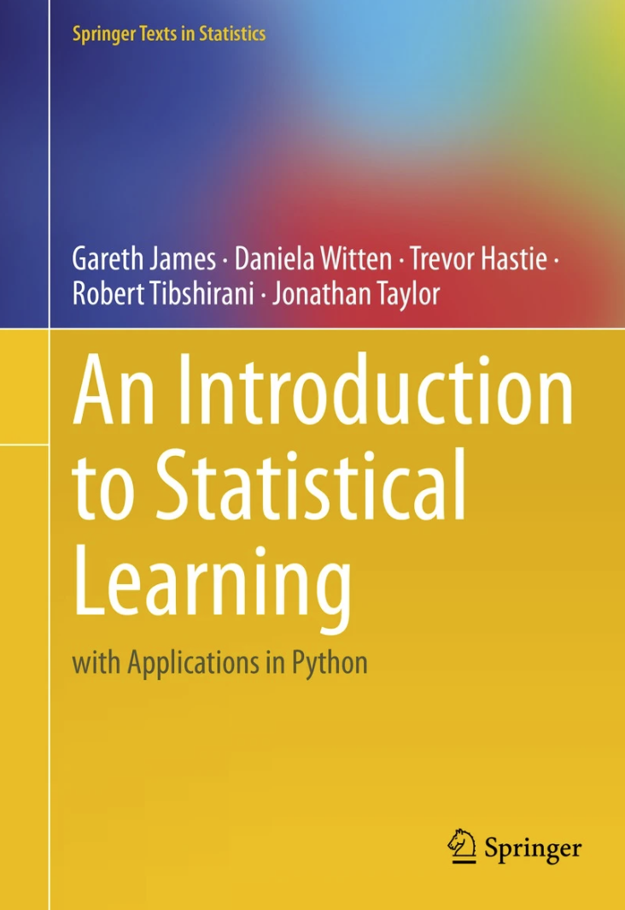{height="340px" fig-align="center"}

::: {style="text-align: center; font-size: 0.65em; margin-top: 10px;"}
Capítulo 9 [@james2023introduction]
:::
:::

::: {.column width="50%"}
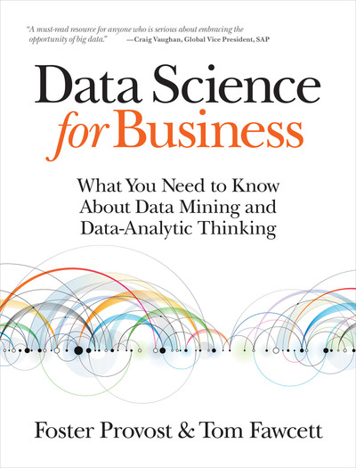{height="340px" fig-align="center"}

::: {style="text-align: center; font-size: 0.65em; margin-top: 10px;"}
Capítulo 4 [@provost2013data]
:::
:::

::::


## ¿Existe una frontera lineal óptima?

¿Cómo construyo un modelo lineal que permita separar perfectamente los puntos de la siguiente gráfica?

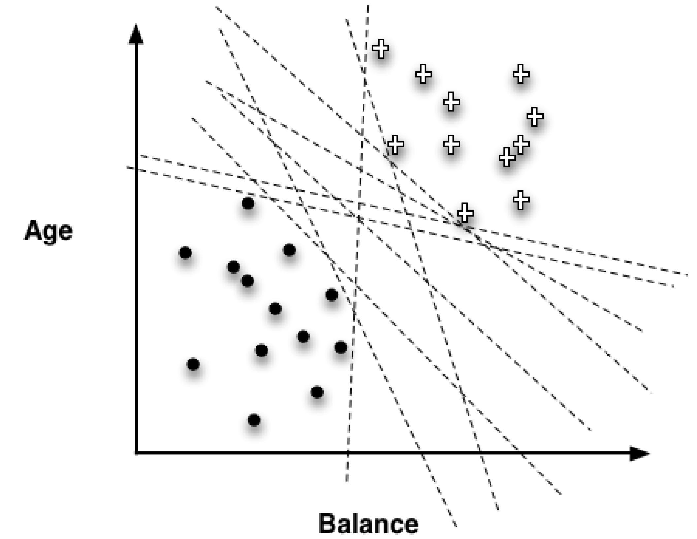{height="360px" fig-align="center"}

::: {style="text-align: center; font-size: 0.65em; margin-top: 10px;"}
[@provost2013data]
:::


## Múltiples hiperplanos separan los datos

¿Cuál de los dos modelos es mejor?

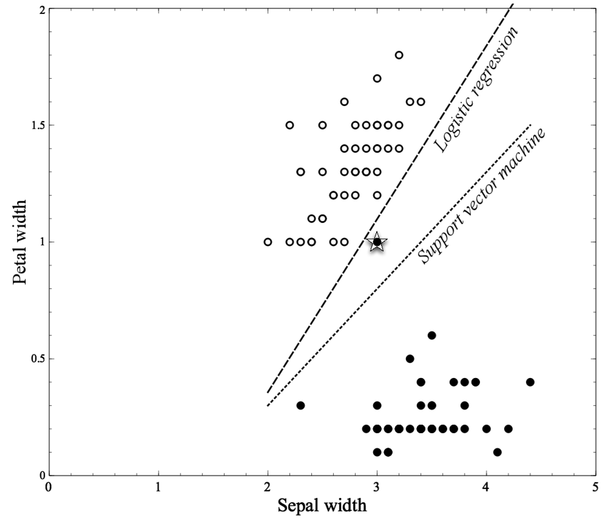{height="360px" fig-align="center"}

::: {style="text-align: center; font-size: 0.65em; margin-top: 10px;"}
[@provost2013data]
:::


## Nuevos datos exigen generalización

¿Qué pasa si entra un nuevo dato?

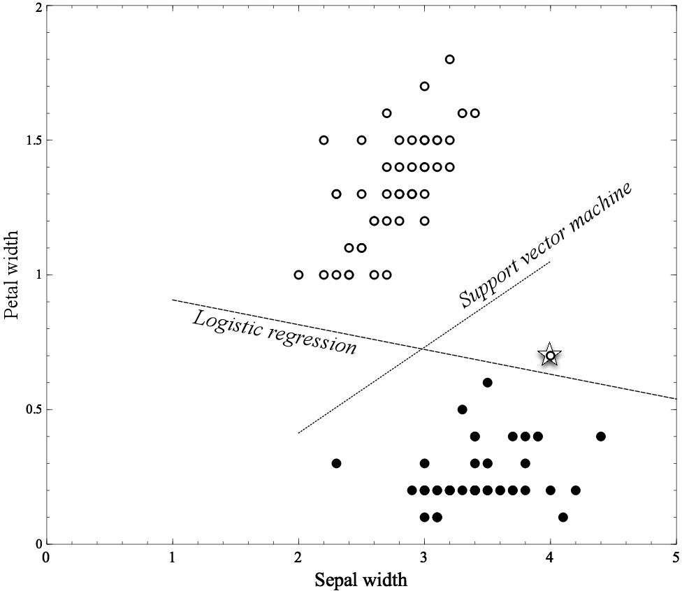{height="360px" fig-align="center"}

::: {style="text-align: center; font-size: 0.65em; margin-top: 10px;"}
[@provost2013data]
:::


## SVM maximiza la distancia a las clases

Entre todos los hiperplanos separadores, encuentre el que genere la mayor brecha o margen entre las dos clases.

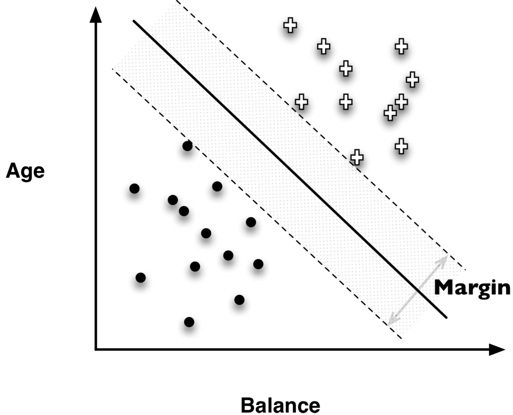{height="360px" fig-align="center"}

::: {style="text-align: center; font-size: 0.65em; margin-top: 10px;"}
[@geron2022hands]
:::


## Minijuego: Maximizar el margen

Ajusta los parámetros para encontrar la frontera óptima y maximizar la distancia a los vectores de soporte.

[{height="340px" fig-align="center"}](https://oscar-bustos.github.io/javeriana-tallerml/clasificacion/svm_margin.html)

::: {style="text-align: center; font-size: 0.7em; margin-top: 10px;"}
🔗 [Abrir minijuego interactivo](https://oscar-bustos.github.io/javeriana-tallerml/clasificacion/svm_margin.html){target="_blank"}
:::


## SVM maximiza la separación entre clases

:::: {.columns}

::: {.column width="50%"}
**Enfoque principal**

- Encontrar la línea o hiperplano óptimo.
- Maximizar la distancia entre clases.
:::

::: {.column width="50%"}
**Características clave**

- **Hiperplano:** Frontera separadora.
- **Margen:** Distancia a los puntos cercanos.
- **Vectores de Soporte:** Puntos límite.
:::

::::

::: {style="text-align: right; font-size: 0.65em; margin-top: 40px;"}
[@james2023introduction; @geron2022hands]
:::


## ¿Qué pasa con datos ruidosos?

Si un dato está mal etiquetado y cae en medio del margen...

- ¿Debería el modelo fallar por un solo punto?
- ¿Prefieren un margen perfecto o uno flexible?

::: {.callout-note title="Discusión"}
💬 Analicemos cuándo conviene sacrificar precisión por robustez.
:::


## Hard margin falla ante outliers

:::: {.columns}

::: {.column width="50%"}
**Hard Margin**

- Exige que TODOS los puntos estén fuera del margen.
- Un solo outlier destruye la frontera.
- Solo funciona con datos linealmente separables.
:::

::: {.column width="50%"}
**Problema**

- Imposible encontrar margen si hay ruido.
- Extremadamente sensible a datos atípicos.
:::

::::

::: {style="text-align: right; font-size: 0.65em; margin-top: 10px;"}
[@geron2022hands]
:::


## Soft margin tolera algunos errores

El objetivo: balance entre margen amplio y violaciones toleradas.

- **Variable de holgura (ζ):** Mide cuánto un punto viola el margen.
- **C controla el balance:**
  - C grande → pocos errores, margen estrecho.
  - C pequeño → margen amplio, tolera errores.

::: {style="text-align: right; font-size: 0.65em; margin-top: 10px;"}
[@geron2022hands]
:::


## El hiperparámetro C controla el margen

- **Control de complejidad:** Balanza el tamaño del margen y los errores de entrenamiento.
- **Interpretación del parámetro:**
  - **C grande:** Prioriza pocos errores, genera márgenes estrechos.
  - **C pequeño:** Prioriza un margen amplio, tolera algunos errores.
- **Selección:** Se determina mediante validación cruzada.

::: {style="text-align: right; font-size: 0.65em; margin-top: 10px;"}
[@geron2022hands]
:::


## Un C mayor reduce el margen de tolerancia

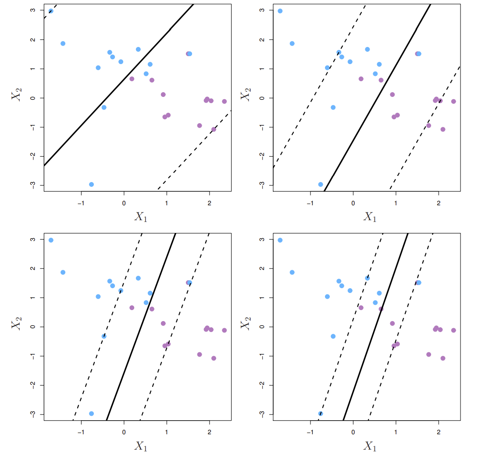{height="380px" fig-align="center"}

::: {style="text-align: center; font-size: 0.65em; margin-top: 10px;"}
[@geron2022hands]
:::


## ¿Importa la escala de los datos?

Si sus features tienen rangos muy distintos (edad: 0–100, salario: 0–10M)...

- ¿Cómo afecta eso a la distancia que calcula SVM?
- ¿Qué preprocesamiento aplicarían?


## SVM es sensible a la escala

Sin escalado, el eje con mayor rango domina la distancia y el margen se distorsiona.

- **Solución:** Usar `StandardScaler` antes de SVM.
- **Pipeline:** `make_pipeline(StandardScaler(), SVC())`
- **Regla práctica:** Escalar features es obligatorio para SVM.

::: {style="text-align: right; font-size: 0.65em; margin-top: 10px;"}
[@geron2022hands]
:::


## ¿Por qué no basta con R. Logística?

Ya conocemos Regresión Logística para clasificar.

- ¿Qué limitación tiene que SVM podría resolver?
- ¿En qué casos querríamos maximizar el margen?


## La Regresión Logística minimiza Log-Loss

- **Modelo:** $\hat{p}(X_i) = \frac{1}{1 + \exp(-(X_i w + w_0))}$
- **Función de Pérdida (Log-Loss):**
  $$\min_w \sum_{i=1}^{n} \left[-y_i \log(\hat{p}(X_i)) - (1-y_i) \log(1-\hat{p}(X_i))\right]$$
- **Características:**
  - Bajo costo computacional e interpretable.
  - Sensible a problemas no linealmente separables.

::: {style="text-align: right; font-size: 0.65em; margin-top: 10px;"}
[@james2023introduction]
:::


## SVM minimiza la pérdida Hinge con margen

- **Condición de Clasificación:**
  $$
  \begin{cases}
  w^T X_i - b \geq 1, & \text{si } y_i = 1 \\
  w^T X_i - b \leq -1, & \text{si } y_i = -1
  \end{cases}
  $$

- **Optimización de Pérdida Hinge:**
  $$\min_{w,b} \frac{1}{2} w^T w + C \sum_{i=1}^{n} \max(0, 1 - y_i(w^T \phi(X_i) + b))$$

::: {style="text-align: right; font-size: 0.65em; margin-top: 10px;"}
[@james2023introduction; @geron2022hands]
:::


# Separación no lineal

## Proyección no lineal permite corte plano

Frontera cuadrática

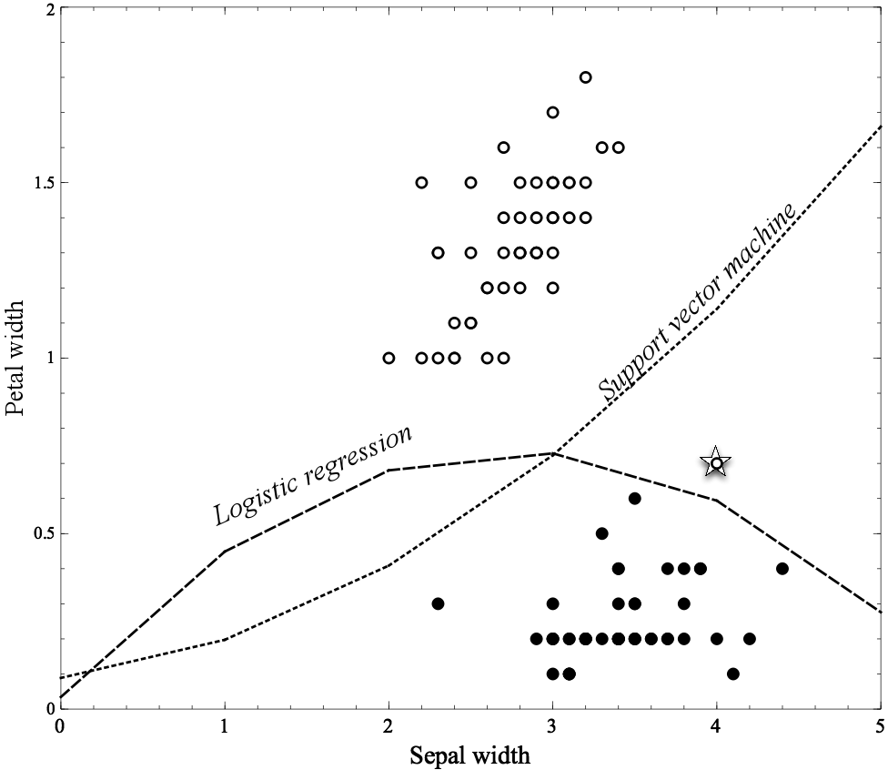{height="360px" fig-align="center"}

::: {style="text-align: center; font-size: 0.65em; margin-top: 10px;"}
[@provost2013data]
:::


## Mapeo de características genera curvas

- **Aumento dimensional:** Transforma características a un espacio $M > p$.
- **Ejemplo:** Mapeo de $(X_1, X_2)$ a $(X_1, X_2, X_1^2, X_2^2, X_1X_2)$.
- **Proceso:**
  1. Transformar datos a dimensión superior.
  2. Aplicar hiperplano separador lineal.
- **Frontera cuadrática resultante:**
  $$\beta_0 + \beta_1 X_1 + \beta_2 X_2 + \beta_3 X_1^2 + \beta_4 X_2^2 + \beta_5 X_1 X_2 = 0$$

::: {style="text-align: right; font-size: 0.65em; margin-top: 10px;"}
[@james2023introduction]
:::


## ¿Es práctico mapear a dimensión alta?

Si tenemos 100 features y mapeamos a grado 5...

- ¿Cuántas features nuevas tendríamos?
- ¿Es computacionalmente viable entrenar así?


## El Kernel Trick evita la explosión

- **Idea clave:** Calcular el dot product en dimensión alta sin transformar los datos.
- **Resultado:** Eficiencia sin explosión dimensional.
- **Kernels comunes:**
  - **Lineal:** $K(x_i, x_j) = x_i^T x_j$
  - **Polinómico:** $K(x_i, x_j) = (x_i^T x_j + r)^d$
  - **RBF:** $K(x_i, x_j) = \exp(-\gamma ||x_i - x_j||^2)$

::: {style="text-align: right; font-size: 0.65em; margin-top: 10px;"}
[@james2023introduction; @geron2022hands]
:::


## El Kernel evita el costo dimensional

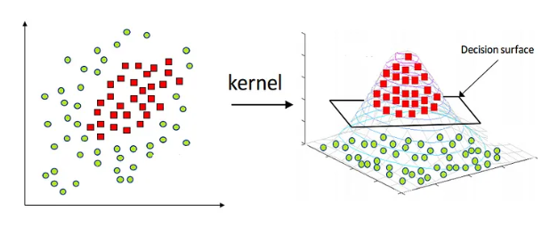{height="380px" fig-align="center"}

::: {style="text-align: center; font-size: 0.65em; margin-top: 10px;"}
[@james2023introduction]
:::


## Minijuego: Kernel Polinómico

Visualiza cómo proyectar los datos a un espacio 3D permite separarlos con un hiperplano.

[{height="340px" fig-align="center"}](https://oscar-bustos.github.io/javeriana-tallerml/clasificacion/svm_kernel_poly.html)

::: {style="text-align: center; font-size: 0.7em; margin-top: 10px;"}
🔗 [Abrir minijuego: Kernel Polinómico](https://oscar-bustos.github.io/javeriana-tallerml/clasificacion/svm_kernel_poly.html){target="_blank"}
:::


## γ controla el radio de influencia

- **γ grande:** Cada punto influye poco → frontera irregular (overfitting).
- **γ pequeño:** Cada punto influye mucho → frontera suave (underfitting).
- **Ajuste:** Se calibra junto con C mediante validación cruzada.

::: {style="text-align: right; font-size: 0.65em; margin-top: 10px;"}
[@geron2022hands]
:::


## Minijuego: Kernel Gaussiano (RBF)

Explora cómo la interacción entre $\gamma$ y $C$ moldea la complejidad de la frontera de decisión.

[{height="340px" fig-align="center"}](https://oscar-bustos.github.io/javeriana-tallerml/clasificacion/svm_kernel_rbf.html)

::: {style="text-align: center; font-size: 0.7em; margin-top: 10px;"}
🔗 [Abrir minijuego: Kernel RBF](https://oscar-bustos.github.io/javeriana-tallerml/clasificacion/svm_kernel_rbf.html){target="_blank"}
:::


## Diferentes Kernels adaptan la frontera

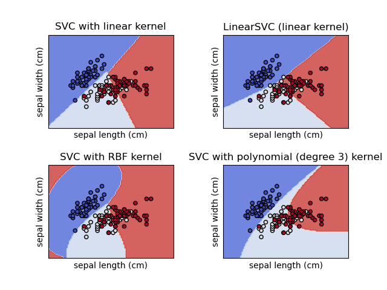{height="380px" fig-align="center"}

::: {style="text-align: center; font-size: 0.65em; margin-top: 10px;"}
[@james2023introduction]
:::


## ¿Kernel simple o complejo primero?

Tienen múltiples kernels disponibles (Lineal, Polinómico, RBF).

- ¿Empezarían con el más complejo o el más simple?
- ¿Qué riesgo tiene empezar con RBF directamente?


## Selección del Kernel según complejidad

::: {style="font-size: 0.75em;"}

| **Kernel** | **Uso** | **Ventajas** |
| --- | --- | --- |
| Lineal | Datos linealmente separables | Simplicidad y rapidez |
| Polinómico | Relaciones polinómicas | Grado ajustable, captura interacciones |
| RBF | Datos no lineales | Universal y flexible |

:::

::: {style="text-align: center; font-size: 0.65em; margin-top: 15px;"}
[@james2023introduction]
:::


# Librerías

## Complejidad: ¿qué clase SVM usar?

::: {style="font-size: 0.75em;"}

| **Clase** | **Complejidad** | **Out-of-core** | **Kernel Trick** |
| --- | --- | --- | --- |
| `LinearSVC` | O(m × n) | No | No |
| `SVC` | O(m² × n) a O(m³ × n) | No | Sí |
| `SGDClassifier` | O(m × n) | Sí | No |

:::

- **Regla:** Empezar con `LinearSVC`; si m es grande, usar `SGDClassifier`.

::: {style="text-align: right; font-size: 0.65em; margin-top: 10px;"}
[@geron2022hands]
:::


## Scikit-Learn ofrece guía de selección

¿Cómo elijo el algoritmo más adecuado para mis datos?

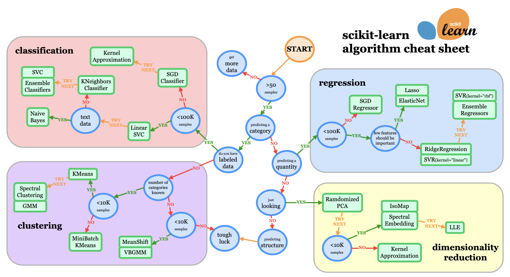{height="380px" fig-align="center"}

::: {style="text-align: center; font-size: 0.65em; margin-top: 10px;"}
[@scikit_learn_map]
:::


## Rendimiento comparativo entre modelos

Comparación de distintos algoritmos a la fecha

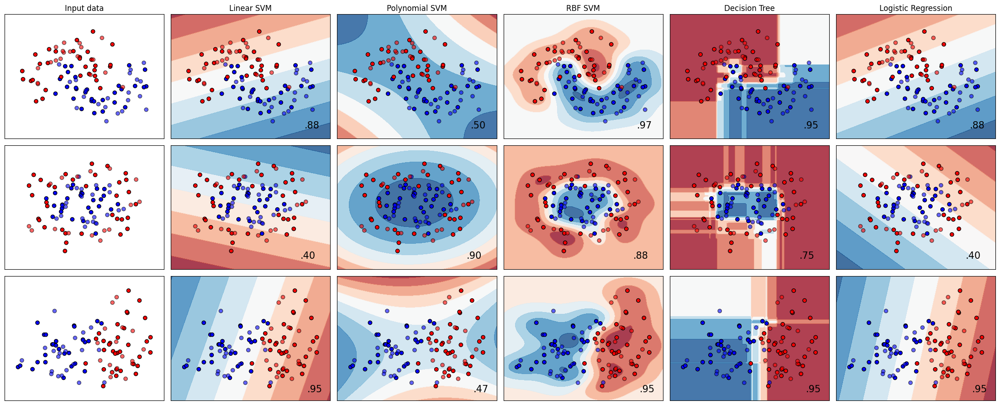{height="380px" fig-align="center"}

::: {style="text-align: center; font-size: 0.65em; margin-top: 10px;"}
[@scikit_learn_comparison]
:::


## SVC configura clasificación en Scikit-Learn

- **Clase principal:** `sklearn.svm.SVC`
- **Parámetros clave:**
  - `C`: Regularización (penalización de error).
  - `kernel`: Tipo ('linear', 'poly', 'rbf', 'sigmoid').
  - `gamma`: Coeficiente de kernel ('rbf', 'poly', 'sigmoid').
- **Métodos principales:**
  - `fit(X, y)`: Entrena el modelo.
  - `predict(X)`: Infiere nuevas etiquetas.
  - `score(X, y)`: Evalúa el desempeño.

::: {style="text-align: right; font-size: 0.65em; margin-top: 10px;"}
[@scikit_learn_api]
:::


## Vectores de soporte sustentan la decisión

:::: {.columns}

::: {.column width="70%"}
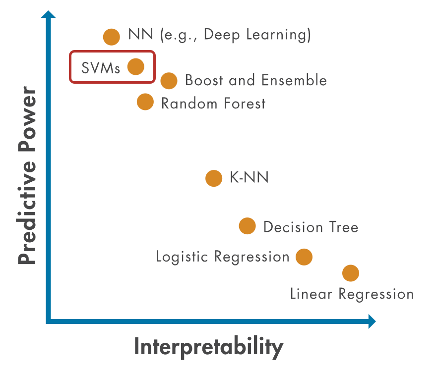{height="350px" fig-align="center"}

::: {style="text-align: center; font-size: 0.65em; margin-top: 10px;"}
[@mathworks_svm]
:::
:::

::::


## Implementación práctica de SVC

```python
from sklearn.pipeline import make_pipeline
from sklearn.preprocessing import StandardScaler
from sklearn.svm import SVC

# Pipeline con escalado + Kernel RBF
model_svc = make_pipeline(
    StandardScaler(),
    SVC(kernel='rbf', C=1.0, gamma='scale')
)
model_svc.fit(X_train, y_train)
y_pred = model_svc.predict(X_test)
```

::: {style="text-align: right; font-size: 0.65em; margin-top: 10px;"}
[@scikit_learn_api]
:::


## ¿Y si el objetivo no es clasificar?

SVM maximiza el margen para separar clases.

- Si quisiéramos predecir un valor numérico, ¿cómo adaptarían esta idea?
- ¿El margen tendría el mismo significado?


## SVR invierte el objetivo de SVM

- **Clasificación:** Puntos *fuera* de la calle; margen separa clases.
- **Regresión:** Puntos *dentro* de la calle; margen define tolerancia.
- **ε-insensible:** Errores dentro del margen ε no se penalizan.
- **Parámetros clave:**
  - `C`: Regularización, `epsilon`: Ancho de calle.
  - `kernel`, `gamma`: Igual que en clasificación.

::: {style="text-align: right; font-size: 0.65em; margin-top: 10px;"}
[@scikit_learn_api; @geron2022hands]
:::


## Implementación práctica de SVR

```python
from sklearn.pipeline import make_pipeline
from sklearn.preprocessing import StandardScaler
from sklearn.svm import SVR

# Pipeline con escalado + Kernel Lineal
model_svr = make_pipeline(
    StandardScaler(),
    SVR(kernel='linear', C=1.0, epsilon=0.1)
)
model_svr.fit(X_train, y_train)
y_pred = model_svr.predict(X_test)
```

::: {style="text-align: right; font-size: 0.65em; margin-top: 10px;"}
[@scikit_learn_api]
:::


## ¿Cómo encontrar los mejores parámetros?

Tienen C, kernel, gamma, degree...

- ¿Cómo encontrarían la mejor combinación?
- ¿Probar manualmente? ¿Grid? ¿Aleatorio?


## GridSearchCV realiza búsqueda exhaustiva

- **Clase:** `sklearn.model_selection.GridSearchCV`
- **Propósito:** Búsqueda exhaustiva sobre una grilla de parámetros.
- **Parámetros:** `estimator`, `param_grid`, `cv`, `scoring`.
- **Atributos:** `best_params_`, `best_score_`, `best_estimator_`.

::: {style="text-align: right; font-size: 0.65em; margin-top: 10px;"}
[@scikit_learn_api]
:::


## Código: GridSearchCV en Scikit-Learn

```python
from sklearn.model_selection import GridSearchCV
from sklearn.pipeline import make_pipeline
from sklearn.preprocessing import StandardScaler
from sklearn.svm import SVC

pipe = make_pipeline(StandardScaler(), SVC())
param_grid = {
    'svc__C': [0.1, 1, 10],
    'svc__gamma': [0.01, 0.1, 1],
    'svc__kernel': ['rbf', 'linear']
}
grid = GridSearchCV(pipe, param_grid, cv=5)
grid.fit(X_train, y_train)
```

::: {style="text-align: right; font-size: 0.65em; margin-top: 10px;"}
[@scikit_learn_api]
:::


## ¿Qué ocurre si la grilla es muy grande?

Evaluando 5 valores de $C$, 5 de $\gamma$, 3 kernels y 5 pliegues de CV:

$$5 \times 5 \times 3 \times 5 = 375 \text{ modelos a entrenar}$$

- ¿Cuánto tiempo computacional tomaría si el dataset es grande?
- ¿Valdrá la pena evaluar cada punto exacto de la grilla?
- ¿Existe una alternativa más rápida que explore mejor el espacio?


## RandomizedSearchCV optimiza el tiempo

- **Clase:** `sklearn.model_selection.RandomizedSearchCV`
- **Muestreo aleatorio:** Evalúa solo $N$ combinaciones fijas (`n_iter`).
- **Eficiencia:** Explora rangos continuos sin costo desmedido.
- **Recomendación:** Usar `RandomizedSearchCV` en espacios grandes.

::: {style="text-align: right; font-size: 0.65em; margin-top: 10px;"}
[@scikit_learn_api]
:::


## Código: RandomizedSearchCV en Scikit-Learn

```python
from scipy.stats import loguniform
from sklearn.model_selection import RandomizedSearchCV

param_dist = {
    'svc__C': loguniform(1e-2, 1e2),
    'svc__gamma': loguniform(1e-3, 1e1),
    'svc__kernel': ['rbf', 'linear']
}
rand_search = RandomizedSearchCV(
    pipe, param_distributions=param_dist, n_iter=20, cv=5, random_state=42
)
rand_search.fit(X_train, y_train)
```

::: {style="text-align: right; font-size: 0.65em; margin-top: 10px;"}
[@scikit_learn_api]
:::


## Referencias

::: {#refs}
:::
